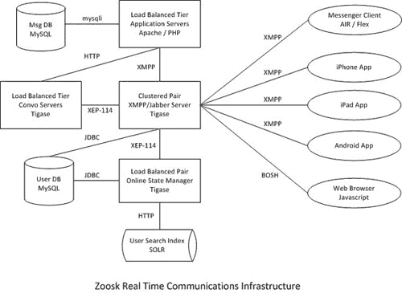
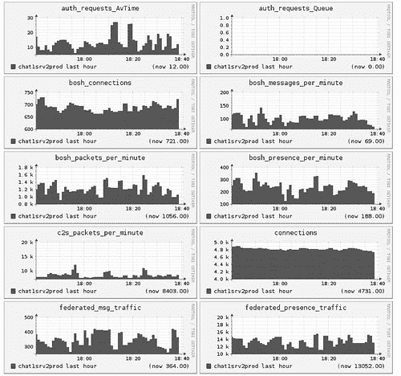

# Zoosk-实时通信背后的工程

> 原文： [http://highscalability.com/blog/2012/8/27/zoosk-the-engineering-behind-real-time-communications.html](http://highscalability.com/blog/2012/8/27/zoosk-the-engineering-behind-real-time-communications.html)

*这是 [Peter Offringa 的来宾帖子，](http://www.linkedin.com/in/peteroffringa) [Zoosk](https://www.zoosk.com/) 的工程副总裁。 Zoosk 是一个拥有 5000 万会员的浪漫社交网络。*

当我们的会员可以实时互动时，他们会从 Zoosk 中获得最大的收获。 毕竟，用户建立的每个连接的另一端可能是将来的关系。 这种情况的刺激性和丰富性只能实时实现。 实时通信（RTC）的一般说明引用了促进这些交互的 Zoosk 服务套件。 这些通信使用 XMPP 协议进行传递，该协议还为其他流行的即时消息传递产品提供了支持。 Zoosk 成员在三种不同的交互中体验实时通信：

*   **存在**。 当成员主动连接到 Zoosk RTC 基础结构时，其公开身份显示为“可用”。 如果它们闲置了一段时间，它们的状态将转换为“离开”。 当他们关闭或断开客户端应用程序的连接时，其状态会自动变为“离线”。 成员还可以选择对其他用户“不可见”。 此选项允许他们保留在 Zoosk 服务上并查看其他在线成员，但不会在其他用户的花名册中出现。
*   **通知**。 重要的交互在视觉上被打包为“敬酒”，并附带短消息。 敬酒向用户表示事件，例如收到调情，查看其个人资料或与其他用户匹配。 Zoosk 服务利用这些通知包来通知客户端应用程序更新与 UI 相关的徽章的值，例如来自另一个用户的未读消息的数量。
*   **消息传递**。 如果两个用户同时在线，则他们可以以熟悉的“即时消息”聊天格式相互发送消息。 这些消息通过 RTC 基础结构实时传输。 如果用户将来使用其他客户端应用程序重新连接，则消息内容也将保留到数据库中，以供将来检索消息历史记录。

目前，这些通信已通过网络浏览器，iPhone 应用程序，iPad，Android 和可下载的桌面应用程序传递给 Zoosk 所有主要产品上的用户-Zoosk.com 网站和 Facebook 应用程序。

### RTC 基础结构

这些 RTC 服务是通过高性能和可扩展的基于 XMPP 的基础结构提供的。 由开源 Jabber 服务器 [Tigase](http://www.tigase.org) 支持的聊天服务是此服务的核心。 Tigase 用 Java 编写，我们的平台团队创建了许多自定义扩展来处理 Zoosk 特定的业务逻辑。

Tigase 部署在基于 Linux 的标准 8 CPU 应用服务器类计算机上。 Tigase 服务器配置在成对的群集中，主要和次要节点通过负载平衡器进行管理。 所有连接一次都定向到主节点。 如果对主服务器的服务检查失败，则负载平衡器将立即开始将用户流量重定向到辅助服务器。

这些成对的群集中有 18 个，每个群集可随时处理 4,000 至 8,000 个连接。 除了用于传输 XMPP 流量的套接字连接之外，Tigase 还包括一项用于支持 HTTP 上的 BOSH 连接的服务。

BOSH 是我们允许网络浏览器浏览 Zoosk.com 和我们的 Facebook 应用程序以保持与 Tigase 的持久连接的协议。 我们的桌面应用程序和移动应用程序使用标准的 TCP-IP 套接字连接。

  全尺寸 

Tigase 服务器通过 Tigase 和客户端应用程序（Web 浏览器，移动设备，桌面应用程序）之间的持久连接实时进行实时传输。 Zoosk 的许多核心产品功能，包括搜索结果，配置文件视图和消息传递，都需要确保在所有客户端应用程序上几乎实时地反映这种状态。 为使此状态在 Zoosk 基础结构的其余部分中保持一致，用户数据库中的用户记录将更新以反映其当前的在线状态，包括其最新在线转换的时间戳。

用户的在线状态也存储在我们搜索基础架构的缓存中，以便搜索结果可以考虑在线状态。 Zoosk 搜索功能由一层 SOLR 服务器提供支持。 我们已经扩展了每个 SOLR 服务器，以包括一个 ehcache 实例来存储当前在线的那些用户。 通过称为在线状态管理器（OSM）的专用 Tigase 实例实时更新此在线状态缓存。

OSM 从主要的 Tigase 聊天服务器接收指示用户在线状态的自定义 XMPP 数据包，然后进行网络调用以更新每个 SOLR 服务器上的 ehcache 实例。 在高峰流量期间，每分钟大约有 8,000 个这些在线状态转换。 通过在 SOLR 索引之外维护此缓存，可以实时更新用户的状态，而与从主节点到从节点的定期索引复制快照分开。 然后，在查询时将用户的状态与搜索结果结合起来，以根据用户当前是否在线对结果进行过滤或排名。 搜索算法更喜欢在线用户，因为这会鼓励实时通信并为其他用户提供更丰富的体验。
[

核心 RTC 功能之外的用户与 Zoosk 服务的交互也可以触发业务逻辑，该逻辑会向连接的用户生成实时通知。 例如，如果另一个用户查看了我们的用户个人资料，或者接受了该用户的好友请求，我们希望立即将该操作通知我们的用户。 基于 PHP 的 Web 应用程序将触发异步作业，该异步作业将打开与 Tigase 服务器的网络连接，并将 XMPP 数据包传递到服务器，而自定义消息有效负载将为通知提供数据。 此数据包由 Tigase 处理，并路由到当前连接用户的客户端应用程序。

然后，用户的客户端应用程序将处理此自定义数据包，并向用户显示适当的“祝酒”，或更新“徽章”，以反映特定功能指标的当前值（配置文件视图数，未读消息等）。 如果用户当时处于脱机状态，则 Tigase 将存储数据包，直到用户重新连接为止。 届时，它将自定义数据包传递给用户的客户端应用程序。

### 监视和测试

Zoosk 技术运营团队已经建立了多种方法来测试和监视 RTC 基础结构的运行状况，以确保响应能力和可用性。 这些测试主要涉及各种机制来从 Tigase 服务器收集性能数据，或模拟实际的用户交互。 如果特定的运行状况检查失败或性能数据超出既定阈值，则我们的 Nagios 安装将生成警报。

*   **Tigase Monitor** -这是一个每 10 分钟在 cron 上运行的脚本。 它登录到所有主要的聊天服务器，并测试连接和状态传输。 它记录这些测试的结果，并将更新发送给 Nagios，以确定是否生成警报。
*   **Tigase 的性能指标**-这些内容涵盖了各种内部 Tigase 指标，包括执行关键功能的时间，消息计数，队列大小，内存消耗等。这些值每 2 分钟由临时统计收集一次 通过 XMPP 管理界面命令。 然后将这些度量传递到 Ganglia 进行绘图。
*   **商业智能报告**-脚本每小时检查一次与每个主 Tigase 服务器的活动连接数，以及它在前一个小时内传递的消息数。 该数据被加载到数据库中。 定制的 Excel 报告可以连接到该数据源，并提供具有易于比较的历史趋势的数据摘要视图。
*   **Tigase 测试套件**-这是一个无头 XMPP 客户端，它登录到每个 Tigase 服务器并模拟真实的交互。 然后，TTS 将记录其功能测试的结果，以供团队审核。

###   全尺寸 
下一步

展望未来，我们将继续积极探索为 Zoosk 会员提供实时体验的新方法。 我们将在下个月向我们的移动 Web 应用程序（Touch）推出 RTC 支持。 交付 Zoosk 应用程序的其他设备或介质将类似地进行实时连接。 随着我们的成员增加主动连接到 Zoosk 应用程序的时间，我们计划增强基于 RTC 的功能，以促进成员之间的发现和通信。

这里的图形（可能是无意间）泄漏了 Zoosk.com 上的活动用户数。

实际上，它泄漏的是任何一次活动用户的数量。 马特假设同一个人整天都保持登录状态。 但是当涉及到[扩展其实时平台](http://zooskdev.wordpress.com/2011/09/13/4-tricks-to-going-real-time-for-tech-ops/)时，Zoosk 并不太紧。

18 个服务器之间仅 150k 并发用户的负载平衡又如何呢？ 仅一个 tigase 实例就够这么低的容量吗？ 也许这只是出于过现实的冗余因素？

我可以为这样的公司工作！