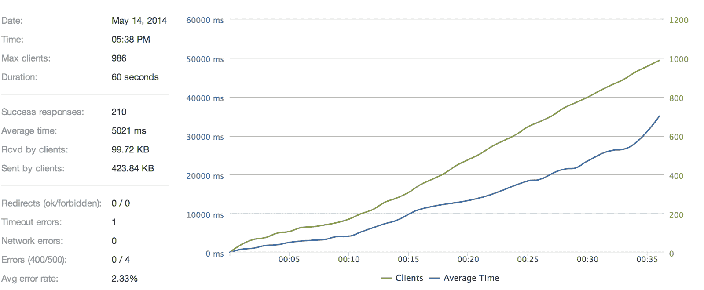
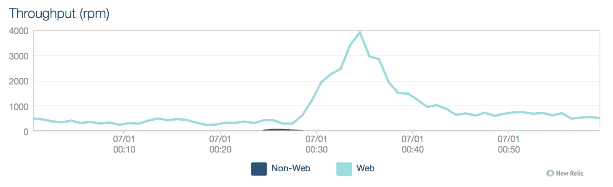

# 扩展世界杯-Gambify 如何与 2 人组成的团队一起运行大型移动投注应用程序

> 原文： [http://highscalability.com/blog/2014/7/7/scaling-the-world-cup-how-gambify-runs-a-massive-mobile-bett.html](http://highscalability.com/blog/2014/7/7/scaling-the-world-cup-how-gambify-runs-a-massive-mobile-bett.html)

*这是 [cloudControl](https://www.cloudcontrol.com) 的 Elizabeth Osterloh 和 Tobias Wilke 的来宾帖子。*

初创企业在构建软件时所面临的问题与大公司完全不同。 较大的公司在更长的时间范围内开发项目，并且通常拥有整个 IT 部门来支持它们创建定制的体系结构。 当初创公司有一个好主意，它广受欢迎并且需要快速扩展时，情况就完全不同了。

Gambify 就是这种情况，Gambify 是一种组织投注游戏的应用程序，适时发布了世界杯足球赛。 该公司成立于德国，仅由两个人经营。 当他们设法获得一些主要认可（包括阿迪达斯和德国队明星托马斯·穆勒）时，他们不得不为突然涌现的用户以及非常特定的高峰时间做好准备。

## Gambify 应用：基本架构

Gambify 的核心是基于 Symfony2 的 PHP 后端，该后端通过 Rest API 将数据提供给前端。 前端是用于桌面浏览器的 Ember.js 应用程序，其中的 PhoneGap 包装用于移动应用程序。

Gambify 代码库分为多个包，可用于不同的场景，例如 随后是世界杯的比赛场景，然后是德国国家联赛或其他欧洲联赛的联赛场景。 为了存储数据，Gambify 除了使用结果表之外，还使用常规的 MySQL 数据库。 在这里，他们将赌注汇总到 Redis 中。

## 主要挑战

*   **在没有专门团队的情况下实现可用于生产的基础架构**。 最初，团队从托管在专用服务器上的较小，较不高级的应用程序版本开始。 他们面临配置和维护它的困难，因此决定专注于开发应用程序本身。 他们需要一个易于维护和扩展的解决方案。

*   **规划基于需求的资源使用，尤其是在比赛**之后的高峰时段。 用户倾向于在游戏后立即登录以查看比赛结果及其排名-此时，负载可能会增加到每分钟 10.000 个请求。

*   **最大化应用速度，** **，尤其是在更新匹配结果和排名**时。 用户期望在使用该应用程序时将延迟降到最低，并在访问当前结果和排名时获得快速响应。

## 与云基础架构集成

Gambify 决定在如此小的团队中配置和维护专用服务器很困难，因此决定搜索平台即服务提供商。 他们决定使用 cloudControl PaaS。

**Buildpacks** ：Gambify 是用 PHP 编写的，最初在 Apache 服务器上运行以进行测试。 cloudControl 平台使用 Buildpack 系统，这是一种用于准备要部署的映像的开放标准，它已成为事实上的云平台之间互操作性的行业标准。 cloudControl PHP buildpack 提供了与原始设置相同的开源组件，因此 Gambify 能够将其现有应用程序“插入”到 cloudControl 平台，而无需进行任何重大更改。

**容器**：cloudControl 平台基于容器。 容器基于 LXC 技术，并且包含堆栈映像，部署映像和配置。 堆栈映像提供了底层操作系统和通用库。 部署映像包含现成的应用程序。 这些配置可以包括数据库和其他第三方服务的访问凭据。

可以垂直缩放容器（跨多个实例）或水平缩放容器（通过增加内存和处理能力）。 Gambify 能够在单个容器上测试其应用程序，然后使用 cloudControl 的粒度扩展功能根据需要进行扩展。

**路由&请求分发**：cloudControl 路由层使用反向代理负载平衡器集群来管理用户请求的接受和转发到平台上运行的应用程序。 智能 DNS 以循环方式提供快速可靠的域名解析服务。 所有节点均等地分配到三个不同的可用区域，但可以将请求路由到任何其他可用区域中的任何容器。 为了保持较低的延迟，除非没有可用的路由层，否则路由层将尝试将请求路由到相同可用性区域中的容器。 这是自动处理的，因此 Gambify 可以将此方面外包给 cloudControl 作为服务提供商。

## 优化基于需求的资源使用

Gambify 使用 New Relic 监视其性能。 这有助于他们确定游戏之前，之中和之后的用户高峰模式。 他们还实时使用 Google Analytics（分析）来查看用户负载何时增加，而请求负载却没有增加。

Gambify 优化的主要部分已预先完成，并通过使用 Loader.io 的负载测试进行了说明。 这样一来，Gambify 就可以在客户群过大而无法处理工作负载之前发现瓶颈。

**Gambify 应用：原始状态**

-10 个容器@ 512 mb

-数据库：MySQLd“微型”附加组件

（Loader.io：60 秒内有 2000 个客户端）

从优化角度来看，Gambify 主要通过使用索引字段查询来优化数据库访问，将对时间不敏感的部分移动到异步处理中，并在某些请求中跳过一些抽象层（ORM）。 这些优化有助于缩短单个请求的加载时间。

为了处理高峰时间，他们使用 cloudControl 的粒度扩展功能来进行扩展，尤其是在人们登录游戏后立即查看结果和得分时。 然后，负载可以增加到每分钟 10.000 个请求。

白天，Gambify 只能由一名工人在六个（128mb）容器上运行。 在比赛中，比赛后八名工人将它们最多扩展到 18（1024mb）个容器。 MySQL 数据库在扩展方面面临挑战，因此他们决定使用一种大型 RDS 设置。 对于未来，他们正在考虑迁移到可伸缩数据库。

**Gambify 应用：当前状态**

-18 个容器（512 mb）

-MySQLd“中”加载项

(Loader.io: 2000 clients in 60 seconds)

## 最大化应用速度

Gambify 的许多应用程序速度优化都是通过异步作业处理来完成的，以便保持主要请求的快速。 为此，Gambify 使用了几个与 cloudControl 平台集成的第三方附加服务。 作业队列通过 Redis 处理。

**用户搜索**：异步处理的部分之一是外部 Web 服务，例如用户搜索功能。 用户与搜索索引（Searchly）同步，该索引使人们可以找到他们的朋友。

**用户内容**：Amazon S3 用于存储用户内容，例如。 个人资料图片。 图片上传被异步处理并调整大小，以防止移动客户端在仅需要显示缩略图时加载更大的原始图片。

**下注包装**：Gambify 能够非常快速地处理赌注并发布结果，因为所有赌注都分组为 1000 个赌注的包装。 然后从 Redis 的作业队列中处理这些。 因为他们知道最大的工作量是在每次比赛之后发生的，所以他们启动了多个工作人员来尽快处理结果。 这些作业将加载所有赌注，并为每个单独的赌注计算分数，然后重新计算表格中的相应分数。

## 解决方案摘要

*   **在没有专门团队的情况下实现可用于生产的基础架构**。 Gambify 团队决定专注于开发应用程序本身，并将基础架构外包给 cloudControl。 通过 cloudControl，资源分配，路由和请求分配得以自动化。

*   **规划基于需求的资源使用，尤其是在比赛**之后的高峰时段。 通过使用 New Relic 监控性能，Gambify 能够确定比赛之前，之中和之后的高峰时间。 他们使用 cloudControl 的细化缩放功能在比赛后的高峰时段直接放大，然后在一天的其余时间进行缩减。

*   **最大化应用速度，** **，尤其是在更新匹配结果和排名**时。 Gambify 使用了几种集成的第三方服务来最大化其应用程序中的响应时间，特别是通过使用 Redis 进行异步作业处理。

## 在比赛结束时

这就是在德国比赛之后，对于 Gambify 来说，真正的请求高峰看起来是什么样的-特别是 6 月 30 日对阿尔及利亚的比赛。 有趣的事实：根据 Gambify 的说法，这场比赛的顶峰略低，因为当德国获胜时，人们会庆祝而不是检查结果。

## 目标！

垂直扩展不是要向同一台机器增加更多功率，水平扩展不是要添加新机器吗？ 您在 cloudControl 容器部分中说了另一种方法。

非常有趣的文章，因为我目前在相同情况下（仅一名开发人员）开发服务。

只是一个错误：“容器可以垂直缩放（跨多个实例）或水平缩放（通过增加内存和处理能力）”

垂直扩展：增加内存和 CPU
水平扩展：添加更多服务器实例

我很好奇这种设置的成本，以及它们在高峰时段如何变化？ 与类似的专用服务器解决方案（具有如此规模）的成本有何比较？

实际上，缩放是错误的方法。 非常不幸的混搭...我们将联系 HS 进行修复。

通常，云服务提供更大的灵活性，而 PaaS 通常专注于在整个应用程序生命周期中提供自动化和编排，以帮助开发人员提高其日常工作效率。

成本收益通常不在于购买的每台原始计算能力的价格比，而在于效率的提高，更多的是效率的提高，即通过使用该服务节省的时间，您可以专注于重要的事情。

可以这样想：使用专用服务器，为服务器支付的费用较低，但是会附加大量的运营成本。 对于 PaaS，部分运营成本包含在使用服务的成本中。 但是总体而言，PaaS 的成本应该更便宜，因为运营商由于规模经济而降低了运营成本。

小型项目通常可以很便宜地启动并利用收益。 当您成长时，它通常会保持很长一段时间的经济性。 最终可能会有一点，DIY 再次变得更加高效。 但这是一个问题，一旦您足够大就可以轻松解决。