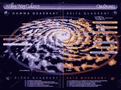

# 关于 Wayback 机器如何在银河系中存储比明星更多的页面的简短说明

> 原文： [http://highscalability.com/blog/2014/5/19/a-short-on-how-the-wayback-machine-stores-more-pages-than-st.html](http://highscalability.com/blog/2014/5/19/a-short-on-how-the-wayback-machine-stores-more-pages-than-st.html)

[Wayback Machine](https://archive.org/web/web.php) 如何工作？ 现在，有超过[个索引](http://blog.archive.org/2014/05/09/wayback-machine-hits-400000000000/)的网页达 4000 亿个，可以一直浏览到 1996 年的互联网，这是一个更加引人注目的问题。 我看了好几次，但是我从来没有找到一个很好的答案。

这是来自 Hacker News 上一个线程的一些信息。 它以 [mmagin](https://news.ycombinator.com/item?id=7723291) 开头，前存档员工：

> 我不能说说他们目前的基础架构（尽管现在更多的是开源的-http://archive-access.sourceforge.net/projects/wayback/），但是就回溯机器而言， 任何地方都没有 SQL 数据库。为了使 Wayback 机器运行：
> 
> *   存档数据为 ARC 文件格式（http：// en 的前身）。 wikipedia.org/wiki/Web_ARChive），实质上是单独压缩的记录的串联。 也就是说，您可以寻求特定的偏移量并开始对记录进行解压缩。 因此，您可以使用三元组（服务器，文件名，文件偏移量）访问任何已归档的网页，从而将其散布在许多商品级机器上。
> *   构建了所有内容的排序索引，该索引使您可以查找（url）并提供时间列表或（url，time）到（文件名，文件偏移）。 它是通过构建一个排序的文本文件（首先在 url 上排序，第二次在时间上排序）并通过简单地将其拆分为 N 个大致相等的大小在多台计算机上分片来实现的。 在排序后的文本文件中进行二进制搜索的速度之快令人惊讶，部分原因是您在文件中查看的前几点仍然被缓存在 RAM 中，因为您经常点击它们。
> *   （这是我有点生锈的地方），Web 前端会收到一个请求，查询适当的索引机。 然后，它将使用一种小机制（可能是网络广播？）来查找（唯一）文件名所在的服务器，然后从该服务器请求特定记录。
> *   （编辑：仅供参考，我的知识已有 5 年了。我知道他们做了一些事情，以使该指数比当时更先进。）
> 
> 至少，我会考虑将 blob 移出 MySQL 并将其放入文件系统中。 文件系统擅长于此。 您当然可以做一些像文件名一样的内容的 SHA-1 哈希这样简单的事情，然后根据文件系统的性能特征，在存储它们的树中可以有几个级别。 da39a3ee5e6b4b0d3255bfef95601890afd80709 进入目录 da / 39 /，然后将 da39a3ee5e6b4b0d3255bfef95601890afd80709 插入表的“指针”字段中，以替换实际数据。 显然，此设计假定 _that_ 文件的内容不变。 如果要更改表中该行的数据，则必须在文件系统中写入一个新文件并更新“指针”。

互联网档案[的 sam 和 raj 回复了](https://news.ycombinator.com/item?id=7723726)：

> Thanks! We were writing up a response at the same time:The Wayback Machine data is stored in WARC or ARC files[0] which are written at web crawl time by the Heritrix crawler[1] (or other crawlers) and stored as regular files in the archive.org storage cluster.
> 
> 播放是通过对 WARC 数据中的指针的 2 级索引进行二进制搜索来完成的。 该索引的第二层是一个 20TB 压缩的（URL，日期，指针）元组的排序列表，称为 CDX 记录[2]。 第一级适合核心，它是 CDX 索引中每 3000 个条目的 13GB 排序列表，并带有指向较大 CDX 块的指针。
> 
> 索引查找的工作方式是二进制搜索存储在核心中的第一级列表，然后 HTTP 范围请求从 CDX 索引加载适当的第二级块。 最后，通过 CDX 记录指向的范围请求 WARC 数据加载网页数据。 在最终输出之前，将应用链接重写和其他转换以使回放在浏览器中正常工作。
> 
> 服务器堆栈：
> 
> *   前端：Tengine + HAProxy 到 Wayback Tomcat 应用程序服务器池[3]
> *   后端：Redis 支持的 archive.org 元数据 API [4]用于对象定位，而 nginx 在 linux 上（通过 ext4）用于数据服务
> 
> *   [0] http://en.wikipedia.org/wiki/Web_ARChive
> *   [1] https://github.com/internetarchive/heritrix3
> *   [2] https://github.com/internetarchive/CDX-Writer
> *   [3] https://github.com/internetarchive/wayback
> *   [4] http://blog.archive.org/2013/07/04/metadata-api/

sytelus [问](https://news.ycombinator.com/item?id=7724051)：为什么不使用哈希表而不是二进制搜索？

gojomo [回复了](https://news.ycombinator.com/item?id=7724347)：

> 这里是前存档员工（&还是偶尔的合同贡献者）。 这是我在 2003 年加入时的第一个问题！
> 
> 某些 Wayback Machine 查询需要经过排序的键遍历：列出可以捕获 URL 的所有日期，发现 URL 的最近日期，并列出所有以某个 URL 前缀开头的可用 URL。
> 
> 维护（URL，日期，指针）的规范排序主索引（20TB 二级索引 rajbot 提到）可以满足两种查询。 一旦有了该工件，就可以相当高效地满足各个捕获查找的需求。 （然后，分布式哈希表将需要额外维护。）
> 
> 同样，查询也不是随机的：存在热范围，甚至单个用户的会话都从范围查询（URL 的所有日期）开始，然后访问相同范围的一个 URL。 然后，加载页面内联资源的最近日期捕获开始达到相似的范围，后续点击链接或附近日期也是如此。 因此，即使主索引仍在旋转的磁盘上（除非最近发生了一次重大的 SSD 升级，以免引起了我的注意），但浏览范围却经常出现在主内存缓存中。
> 
> 毫无疑问，有许多地方可以改进，但是这种基本的排序索引模型已经很适合该应用程序很长时间了，避免了过多的特定于领域的复杂性，并且适用于许多代索引/分片/复制/内部- API 调整。
> 
> 顺便说一句，Archive 正在招聘多个技术职位，其中包括负责开发下一代 Wayback Machine 的高级职位：https：//archive.org/about/jobs.php

[Vecrios](https://news.ycombinator.com/item?id=7723794) 中的一个有趣的问题：我仍然无法理解它们如何存储大量数据并且不会用完空间？

dwhly [回答](https://news.ycombinator.com/item?id=7724035)：

> 几年前与 Brewster 的一次对话中：磁盘驱动器的密度加倍使它们在 Wayback 机器的空间方面保持相对中性。 它仍然占据着与过去 10 年大致相同的尺寸，我认为这实际上是一组大约 15-20 英尺长的机架。
> 
> 但是，新的电视新闻和搜索功能所需的空间甚至远远超过 IIRC 档案库，或者肯定正在朝这个方向发展。

并感谢 [rietta](https://news.ycombinator.com/item?id=7724313) 所说的 Wayback Machine 如何在银河系中存储比星星更多的页面。 神话般的图像。

据我了解，大约在 2000 年开始出现 GMR（巨磁阻比）读取磁头，从而使硬盘容量每年翻一番（甚至更多）。 我记得在 2000 年，典型的硬盘驱动器为 2 到 4 GB。 当然，现在是 5 到 10 TB，而它们增加到约 20 TB。 因此，我完全不难理解 Wayback 机器如何在硬盘大小相同的情况下保存“足够”的数据。