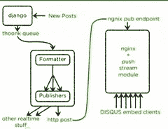

# Disqus 如何以每秒 165K 的消息和小于 0.2 秒的延迟进行实时处理

> 原文： [http://highscalability.com/blog/2014/4/28/how-disqus-went-realtime-with-165k-messages-per-second-and-l.html](http://highscalability.com/blog/2014/4/28/how-disqus-went-realtime-with-165k-messages-per-second-and-l.html)

*这是关于[的 Disqus 更新：它仍然是实时的，但是 Go 拆除了 Python](http://highscalability.com/blog/2014/5/7/update-on-disqus-its-still-about-realtime-but-go-demolishes.html) 。*

您如何向 Web 规模应用程序添加实时功能？ 这就是 [Adam Hitchcock](https://www.linkedin.com/in/adamhitchcock) ，在 Disqus 上，Disqus 的一名软件工程师在精彩的演讲中谈到：[使 DISQUS Realtime](https://www.youtube.com/watch?v=5A5Iw9z6z2s) （[幻灯片](https://speakerdeck.com/pyconslides/scaling-realtime-at-disqus-by-adam-hitchcock)）。

Disqus 必须采用他们的评论系统并为其添加实时功能。 在谈话之时（2013 年），他们每月只有 10 亿的唯一身份访问者，这并非易事。

Disqus 开发的是一种称为“实时”的实时评论系统，该系统经过测试可处理 150 万个并发连接的用户，每秒 45,000 个新连接，每秒 165,000 条消息，并且端到端的延迟少于 0.2 秒。

评论系统的本质是它受 IO 约束并且具有很高的扇出度，这是评论的传入，必须将其发送给许多读者。 这个问题与 Twitter 必须解决的[非常相似。](http://highscalability.com/blog/2013/7/8/the-architecture-twitter-uses-to-deal-with-150m-active-users.html)

Disqus 的解决方案及其解决之道非常有趣。 他们尝试了不同的体系结构，但选择了基于 Python，Django，Nginx Push Stream Module 和 Thoonk 构建的解决方案，这些解决方案均通过灵活的管道体系结构进行了统一。 在此过程中，我们能够大幅减少其服务器数量并轻松处理高流量负载。

在演讲的某一时刻，亚当问管道式架构是否是一个好的架构？ 对于 Disqus 消息，通过一系列转换进行过滤是完美的选择。 这是一个非常古老的想法。 Unix 系统 5 长期以来具有 [Streams 功能](http://infohost.nmt.edu/~eweiss/222_book/222_book/0201433079/ch14lev1sec4.html)用于创建灵活的管道体系结构。 这是组织代码的一种非常灵活而强大的方式。

因此，让我们看看 Disqus 如何发展其实时评论架构并在此过程中创建新旧事物。

## 统计资料

*   当前：

    *   300 万个网站使用 Disqus 作为其评论系统

    *   每月有十亿人参与对话

    *   每月有 2000 万条评论

*   截至 2013 年 3 月：

    *   每月有十亿独立访客。

    *   18 位工程师

## 平台

*   Python（Disqus 是一项服务，用 Python 和其他语言编写）

*   Django

*   [Thoonk Redis 队列](http://blog.thoonk.com/) -Redis 之上的队列库。

*   Nginx [推流模块](http://wiki.nginx.org/HttpPushStreamModule) -用于 Nginx 设置的纯流 http 推技术。 Comet 变得简单且真正可扩展。

*   [Gevent](http://www.gevent.org/) -基于协程的 Python 网络库，该库使用 greenlet 在 libev 事件循环的顶部提供高级同步 API。

*   使用 EventSource 的长轮询（在浏览器中）

*   [Sentry](https://github.com/getsentry/sentry) -一个与平台无关的实时错误记录和聚合平台。

*   [缩放比例](https://github.com/Cue/scales) -跟踪服务器状态和统计信息，使您可以查看服务器的运行状况。

*   在原始金属（而非 EC2）上运行。

## 架构

*   实时动机：

    *   **参与度** 。 评论的实时分发鼓励用户在页面上停留更长的时间。 实时评论后的人比以前多。

    *   **买卖数据** 。 从全局评论流中创建消防软管产品。

*   旧的实时系统：

    *   用 Django 编写的 Disqus 应用程序将通过许多键发布到内存缓存：Forum：id，thread：id，user：id，post：id。 也许将来有人会觉得有趣。 由于 pub / sub 的价格便宜，因此可以进行以后的创新。

    *   前端客户端每隔几秒钟会轮询一次内存缓存密钥。

    *   客户端将显示任何新评论。

    *   问题：根本没有缩放。 一次只有 10％的网络可以使用该产品。

*   第一种解决方法：

    *   新帖-> Disqus-Redis [发布/订阅](http://redis.io/topics/pubsub) -> [烧瓶](http://en.wikipedia.org/wiki/Flask_(web_framework)) （一个 Web 框架）前端集群<-HAProxy <-客户端。

    *   客户端将连接到 HAProxy。 HAProxy 用于处理数百万个连接。

    *   问题：由于烧瓶计算机正在执行冗余工作，因此它们很快耗尽了 CPU。 如果两个订户正在侦听同一线程，则该消息将被格式化两次。

*   第二种方法：

    *   已创建后端服务器以执行重复数据删除格式化工作。

    *   新流程：新帖子-> Disqus-> redis 队列->“ python 胶” Gevent 格式服务器（2 个服务器用于冗余）-> redis 发布/订阅（6 个服务器） -> Flask FE（前端）群集（14 个大服务器）<-HA 代理（5 个服务器）<-客户端

    *   效果很好。 除了扩展外，它使用的服务器越来越多，尤其是 Flask 集群。 Redis 发布/订阅集群也迅速增长。

## 第三种制胜法则：

*   使用 [流水线架构](http://www.cs.sjsu.edu/~pearce/modules/patterns/distArch/pipeline.htm) ，其中消息在过滤器作用下从一个队列传递到另一个队列。

*   切换到 Nginx +推送流模块。 这取代了 redis pub / sub，flask 服务器和 HAProxy 集群。

*   新流程如下所示：新帖子-> Disqus-> redis 队列->“ python 胶” Gevent 格式服务器（2 个服务器）-> http 帖子-> nginx pub 端点- > nginx +推送流模块（5 个服务器）<-客户端

*   仅使用了 redis 的 pub / sub，并且 nginx 推送流模块支持相同的功能。

*   由于内核中的网络内存限制，需要 5 个推送流服务器。 这是一个套接字分配问题，即有很多套接字打开。 否则可以在 3 台服务器上运行，包括冗余。

*   流程中的 Disqus 部分是 Django Web 应用程序，它使用 post_save 和 post_delete 挂钩将内容放入 thunkk 队列中。 这些挂钩对于生成实时数据通知非常有用。

*   Thoonk 是 Redis 之上的队列库。

    *   他们已经有了 thunkk，因此可以使用它来代替分解 RabbitMQ 计算机的 HA 集群。 最终真的很喜欢它。

    *   Thoonk 被实现为状态机，因此很容易查看已声明或未声明哪些作业，等等。使故障后的清除变得容易。

    *   由于使用 zset 将队列存储在 Redis 中，因此可以在队列上执行范围查询。 例如，您可以询问哪些消息已被处理，并采取适当的措施，因此对实施端到端的确认很有用。

*   python 胶水程序。

    *   收听 thoonk 队列。

    *   为客户端执行所有格式化和计算。 包括清洁和格式化数据。

    *   最初是在 Flask 群集中进行格式化的，但是这占用了太多 CPU。

    *   发现用 gzip 压缩单个邮件并不成功，因为邮件中没有足够的冗余来从压缩中节省足够的钱。

    *   对于这样的 IO 绑定系统，Gevent 的运行速度非常快。

    *   看门狗确保 [绿色](https://pypi.python.org/pypi/greenlet) 始终在运行，也就是说，始终在执行工作。 Greenlet 是没有隐式调度的微线程： [协程](http://en.wikipedia.org/wiki/Coroutine) 。

    *   监视器监视许多故障，然后在观察到时发出警报。

*   流水线架构。

    *   python 胶水程序的结构是一个数据管道，数据必须经过几个阶段：解析，计算，发布到另一个地方。 这些在 greenlet 中运行。

    *   [Mixins](http://stackoverflow.com/questions/533631/what-is-a-mixin-and-why-are-they-useful) 用于实现阶段功能：JSONParserMixin，AnnomizeDataMixin，SuperSecureEncryptDataMixin，HTTPPublisher，FilePublisher。

    *   这个想法是组成管道。 一条消息将从 thunkk 中传出并通过以下管道运行：JSONAnnonHTTPPipeline，JSONSecureHTTPPipeline，JSONAnnonFilePipeline。

    *   管道可以共享它们的大多数功能，但是仍然是专门的。 启用新功能时很棒，您可以创建一个新的管线阶段，创建一个新的管线，并使旧管线与新管线并排运行。 新旧功能愉快地共存。

    *   测试也可以在管道中进行。 要运行测试，只需在管道中插入 filter / module / mixin 即可运行测试。

    *   容易推断。 每个 mixin 都很容易理解。 它做一件事。 项目中的新工程师使用这种方法设计的系统要容易得多。

*   Nginx 推送流

    *   处理系统的发布/订阅方面和 Web 服务方面。 并且都很好。

    *   最近通过 5 台服务器吸引了 200 万并发用户。 CPU 使用率低于 15％时，每台计算机的用户数量达到约 950K 的峰值，每台计算机达到 40 MB /秒。

    *   持续将数据写入套接字以测试套接字是否仍然打开。 如果不是，则将其清理以为下一次连接腾出空间。

    *   配置是发布端点和订阅端点，以及如何在它们之间映射数据。

    *   内置良好的监视功能，可通过推送流状态端点进行访问。

    *   模块中的内存泄漏需要全天滚动重启，尤其是当每个进程有数十万个并发连接时。 浏览器将在断开连接时迅速知道，因此它将重新启动并重新连接。

*   较长的轮询

    *   这是在浏览器/ JavaScript 客户端上。

    *   当前使用 WebSocket 的原因是它们速度很快，但由于它内置在浏览器中并且可以处理所有内容，因此正在迁移到 EventSource。 只需注册消息类型并为其提供回调处理程序即可。

## 测试

*   黑暗时间测试。 Disqus 已安装在数百万个网站上，因此需要对数百万个并发连接进行测试。 使用现有网络进行负载测试，而不是在 EC2 中创建伪设置。

*   例如，有条理的客户说只有 10％的用户或恰好这个网站应该流经新系统。

*   最暗时间。 世界上发生了一些重要的事情，而且两个网站的流量也很大。 因此，他们接受了所有流量，并通过系统中的单个 pub / sub 密钥发送了流量。 这有助于识别代码中的许多热点。

## 度量

*   测量所有东西。 在流水线系统中，您只需测量每个阶段的输入和输出，即可与 HAProxy 等其他系统协调数据。 没有测量数据，就无法向下钻取并找出谁是错的。

*   尽可能将指标表示为+1 和-1。 （我不太了解这一点）

*   Sentry 帮助查找代码中的问题。

*   通过测量，可以轻松创建漂亮的图形。

*   当选择教皇并看到白色烟雾时，流量峰值达到每秒 245 MB，当天传输了 6 TB 数据，峰值 CPU 为 12％。

## 获得的经验教训

*   **一次工作**。 在大型扇出架构中，在一个地方进行工作，然后将其发送给所有消费者。 不要为每个消费者重复工作。

*   **最有可能失败的代码是您的代码**。 您很聪明，但是很聪明的人写了 redis 和其他产品，所以要比系统的其他部分更关心您的代码。

*   **端到端的支架不错，但价格昂贵**。 想要 100％交付的客户所必需。 无法为每个前端用户做到这一点。

*   **Greenlets 是免费的**。 使用它们。 它们使代码更易于阅读。

*   **发布是免费的**。 发布到所有频道。 由于消息已通过所有渠道发布，因此他们无需事先进行计划就可以制作出实时的流量大图。

*   **有时候会有个大胜利。** 发现 Nginx 推送流模块简化了其系统的巨大块并减少了服务器数量。

*   **了解负载测试时的用例，以便您可以真正测试系统**。

*   **使用实际流量进行测试**。 当您的系统变大并且生成合成负载本身就是一个巨大的项目时，这是一种容易得多的方法。

*   **使用 Python** 。 他们确实喜欢 Python 和 Django，尽管其中一些后端内容现在是用 Go 编写的。

*   **响应规模而增加的服务器数量是您的体系结构可能需要进行一些调整的标志。 看一看，您可以更改架构并更有效地使用资源。**

*   **使用现成的技术**。 不必觉得您必须从头开始构建所有内容。 利用代码，使您的团队规模变小。

## 相关文章

*   [将 DISQUS 扩展到 7500 万评论和 17,000 RPS](http://highscalability.com/blog/2010/10/26/scaling-disqus-to-75-million-comments-and-17000-rps.html) （2010）

*   Disqus [nginx-push-stream-module 配置](https://gist.github.com/dctrwatson/0b3b52050254e273ff11) 适用于> 1MM 并发用户。

*   [通过](https://www.youtube.com/watch?v=5A5Iw9z6z2s) [Adam 制作 DISQUS 实时](https://www.linkedin.com/in/adamhitchcock) （ [幻灯片](https://speakerdeck.com/pyconslides/scaling-realtime-at-disqus-by-adam-hitchcock) ） 希区柯克 ，软件工程师，〜2013 年 3 月

*   [将 Django 扩展到 80 亿页面浏览量](http://blog.disqus.com/post/62187806135/scaling-django-to-8-billion-page-views) [Matt Robenolt](https://www.linkedin.com/in/mattrobenolt) ，运筹领先，2013 年 9 月

*   [HTTP for Great Good](https://www.youtube.com/watch?v=HAjOQ09I1UY) （[幻灯片](https://speakerdeck.com/mattrobenolt/http-for-great-good)），作者：Matt Robenolt，2013 年 10 月

*   [Google On Latency Tolerant Systems：由不可预测的部分组成可预测的整体](http://highscalability.com/blog/2012/6/18/google-on-latency-tolerant-systems-making-a-predictable-whol.html)

*   [Twitter 用来处理 1.5 亿活跃用户，300K QPS，22 MB / S Firehose 的架构，并在 5 秒内发送推文](http://highscalability.com/blog/2013/7/8/the-architecture-twitter-uses-to-deal-with-150m-active-users.html)

*   John Watson 的 [C1MM 和 NGINX](https://www.youtube.com/watch?v=yL4Q7D4ynxU) （[[幻灯片](https://speakerdeck.com/dctrwatson/c1m-and-nginx)）-Disqus 结构的更新。

*   [试试这个 Go 事情…](http://blog.disqus.com/post/51155103801/trying-out-this-go-thing)

引用“如果可以的话，将指标表示为+1 和-1。（我不太了解这一点）”

这不仅仅是计数指标吗？也就是说，因为您正在使用链接的消息队列，因为消息到达您对计数器+1 的每个点，而消息离开您-1 的另一个计数器。 您可以在每个节点/队列的输入和输出处执行此操作。
每个点+1 的变化，每个点-1 的变化告诉您每个时间间隔（传入和传出）的消息吞吐量，总+1 和总-1 的差告诉您消息' 在队列中”。

好读！

好东西。

现在，他们需要解决垃圾邮件问题。

这看起来像一团糟。 在这家公司工作会很害怕。 这就是为什么您需要良好的系统架构师的原因。 如果您不能用 c / c ++自己编写（暗示理解）这些工具的一半，则需要重新考虑领导该项目。 现在您有了一个巨大的泥球，上帝知道有多少种不同类型的“粘土”。
http://en.wikipedia.org/wiki/Big_ball_of_mud

我很好奇他们是否会考虑为此使用 elixir 以及 phoenix 框架。 流水线方法，大规模，并发性和容错性固有地内置于长生不老药中，并且不需要像这样做的一整套分散的组件。 话虽如此。 做到这一点仍然是一个了不起的壮举，我敢肯定，出于很多原因，研究长生不老药可能不是他们追求的解决方案。

这看起来很混乱。 会害怕在这个组织工作。 这就是为什么您需要好的程序设计师。 如果您不能在 c / c ++中自己创建（暗示理解）这些资源的 50％，则需要重新评估获得的资源。 现在您有了一个伟大的泥泞足球，上帝知道有多少种“粘土”。

我很好奇你们在 django 中存储持久连接的位置，这是我们的主要问题，我们的队列（我们使用 Rabbitmq）连接快要死了并且无法恢复。

现在他们需要解决垃圾邮件问题。这就是为什么您需要优秀的程序设计师。 如果您不能在 c / c ++中自己创建（暗示理解）这些资源的 50％，则需要重新评估获得的资源。
好东西。

从它的声音来看，它听起来像是一个混乱的机构，但是，从它提供的服务的种类来看，我相信他们可能已经将其微调到可以接受的水平。

我喜欢这篇文章，但有一个问题。
Disqus 使用的数据库是什么？

该帖子解释了如何保存新帖子，但是当我打开网站并打开 Disqus 评论时。 获取所有评论并显示在网站上的过程是什么？

谢谢这个