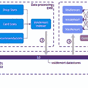
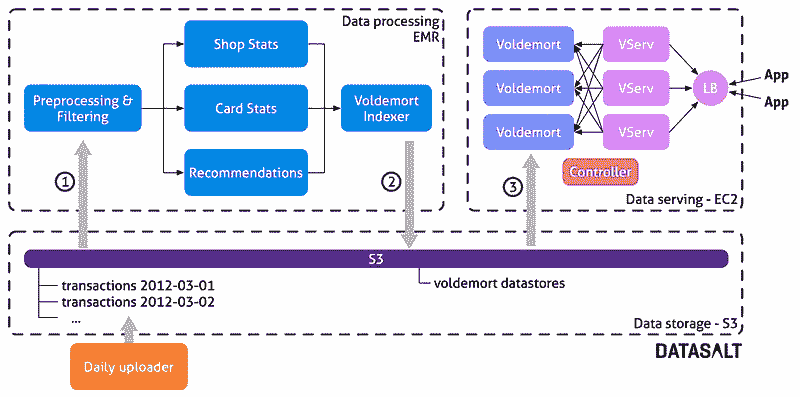
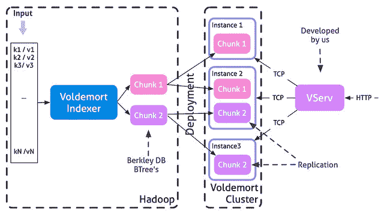
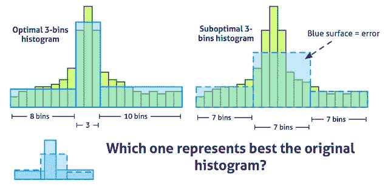
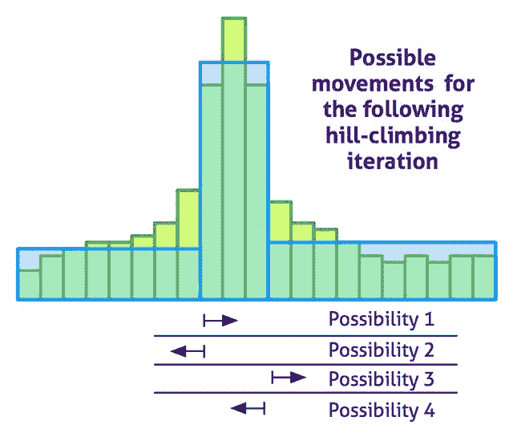

# 分析数十亿笔信用卡交易并在云中提供低延迟的见解

> 原文： [http://highscalability.com/blog/2013/1/7/analyzing-billions-of-credit-card-transactions-and-serving-l.html](http://highscalability.com/blog/2013/1/7/analyzing-billions-of-credit-card-transactions-and-serving-l.html)

*这是 [Ivan de Prado](http://www.linkedin.com/in/ivanprado) 和 [Pere Ferrera](http://www.linkedin.com/in/pedroferrera) 的来宾帖子， [Datasalt](http://www.datasalt.com) 的创始人， [Pangool](http://pangool.net) 和 [Splout SQL](http://sploutsql.com) 大数据开源项目。*

使用信用卡支付的金额巨大。 显然，可以通过分析所有交易得出数据中的内在价值。 客户忠诚度，人口统计，活动热点图，商店推荐以及许多其他统计数据对于改善客户与商店之间的关系都非常有用。 在 [Datasalt](http://www.datasalt.com) ，我们与 [BBVA 库](http://www.bbva.com)合作开发了一个系统，该系统能够分析多年的数据并为不同的低延迟 Web 和移动应用程序提供见解和统计信息。

除了处理大数据输入外，我们面临的主要挑战是**的输出也是大数据，甚至比输入**还大。 并且此输出需要在高负载下快速提供服务。

由于使用了[云（AWS）](http://aws.amazon.com)， [Hadoop](http://hadoop.apache.org/) 和 [Voldemort](http://www.project-voldemort.com/voldemort/) ，我们开发的解决方案每月的基础设施成本仅为数千美元。 在下面的几行中，我们将解释所提出的体系结构的主要特征。

## 数据，目标和首要决策

该系统使用 BBVA 在世界各地的商店中进行的信用卡交易作为分析的输入源。 显然，数据是匿名的，非个人的，并且可以进行隔离以防止任何隐私问题。 信用卡号被散列。 任何产生的见解始终是汇总，因此无法从中获得任何个人信息。

我们为每个商店和不同时间段计算许多统计数据和数据。 这些是其中一些：

*   每个商店的付款金额直方图
*   客户保真
*   客户人口统计
*   店铺推荐（在这里购买的客户也可以在...购买）。 按位置，商店类别等过滤。

该项目的主要目标是通过低延迟的 Web 和移动应用程序向所有代理（商店，客户）提供所有这些信息。 因此，一项苛刻的要求是能够在高负载下以亚秒级的延迟提供结果。 由于这是一个研究项目，因此需要处理代码和要求方面的高度灵活性。

因为一天仅更新数据不是问题，所以我们选择了面向批处理的架构（Hadoop）。 我们选择 Voldemort 作为只读存储来提供 Hadoop 生成的见解，这是一个简单但超快速的键/值存储，可以与 Hadoop 很好地集成。

## 该平台

该系统基于 [Amazon Web Services](http://aws.amazon.com/) 构建。 具体来说，我们使用 S3 存储原始输入数据，使用 Elastic Map Reduce（亚马逊提供的 Hadoop）进行分析，并使用 EC2 提供结果。 使用云技术使我们能够快速迭代并快速交付功能原型，这正是我们这类项目所需的。

## 架构

该体系结构包含三个主要部分：

*   **数据存储**：用于维护原始数据（信用卡交易）和生成的 Voldemort 存储。
*   **数据处理**：在 EMR 上运行的 Hadoop 工作流，执行所有计算并创建 Voldemort 所需的数据存储。
*   **数据服务**：Voldemort 群集，用于服务来自数据处理层的预先计算的数据。

银行每天都将当天发生的所有交易上载到 S3 中的文件夹中。 这使我们能够保留所有历史数据-每天执行的所有信用卡交易。 所有这些数据都是处理层的输入，因此我们**每天都重新计算所有内容**。 重新处理所有数据可以使我们变得非常敏捷。 如果需求发生变化或发现一个愚蠢的错误，我们只需更新项目代码，并在下一批之后修复所有数据。 这是一项发展决定，为我们带来了：

*   简化的代码库&架构，
*   灵活性&适应变化，
*   轻松处理人为错误（只需修复错误并重新启动过程）。

每天一次，控制器在 EMR 上启动新的 Hadoop 集群并启动处理流程。 此流程由大约 16 个[元组 MapReduce 作业](http://www.datasalt.com/2012/02/tuple-mapreduce-beyond-the-classic-mapreduce/)组成，这些作业计算各种洞察力。 流的最后一部分（Voldemort 索引器）负责构建数据存储文件，该文件随后将部署到 Voldemort。 流程完成后，结果数据存储文件将上传到 S3。 控制器关闭 Hadoop 集群，然后将部署请求发送到 Voldemort。 然后，Voldemort 从 S3 下载新的数据存储并执行热交换，完全替换旧的数据。

## 技术

### Hadoop 和 Pangool

整个分析和处理流程是使用 Hadoop 之上的 [Pangool Jobs](http://pangool.net) 实现的。 这使我们在性能，灵活性和敏捷性之间取得了良好的平衡。 元组的使用使我们能够使用简单的数据类型（int，字符串）在流之间传递信息，同时我们还可以将其他复杂的对象（如直方图）包含在其自己的自定义序列化中。

另外，由于 Pangool 仍然是低级 API，因此我们可以在需要时对每个 Job 进行很多微调。

### 伏地魔

 [Voldemort](http://www.project-voldemort.com/voldemort/) 是 LinkedIn 基于 [Amazon Dynamo](http://www.allthingsdistributed.com/2007/10/amazons_dynamo.html) 概念开发的键/值 NoSql 数据库。

Voldemort 背后的主要思想是将数据分成多个块。 每个块都被复制并在 Voldemort 群集的节点中提供服务。 每个 Voldemort 守护程序都可以将查询路由到保留特定键值的节点。 Voldemort 支持快速读取和随机写入，但是对于此项目，我们将 Voldemort 用作只读数据存储区，在每次批处理之后替换所有数据块。 因为数据存储是由 Hadoop 预先生成的，所以查询服务不受部署过程的影响。 这是使用这种只读批处理方法的优点之一。 我们还具有灵活性，可以在需要时更改集群拓扑并重新平衡数据。

Voldemort 提供了一个 Hadoop MapReduce 作业，该作业在分布式集群中创建数据存储。 每个数据块只是一个 [Berkeley DB](http://www.oracle.com/technetwork/products/berkeleydb/overview/index-093405.html) [B 树](http://en.wikipedia.org/wiki/B-tree)。

Voldemort 的接口是 TCP，但我们想使用 HTTP 服务数据。 VServ 是一个简单的 HTTP 服务器，它将传入的 HTTP 请求转换为 Voldemort TCP 请求。 负载平衡器负责在所有 VServ 之间共享查询。

## 计算数据

### 统计

分析的一部分在于计算简单的统计信息：平均值，最大值，最小值，标准偏差，唯一计数等。它们是使用众所周知的 MapReduce 方法实现的。 但是我们也计算一些直方图。 为了在 Hadoop 中有效地实现它们，我们创建了一个自定义直方图，该直方图只能通过一次计算。 而且，我们可以在一个 MapReduce 步骤中，在任意数量的时间段内，为每个商务计算所有简单的统计数据以及相关的直方图。

为了减少直方图使用的存储量并改善其可视化效果，将由许多分箱组成的原始计算出的直方图转换为可变宽度的分箱直方图。 下图显示了特定直方图的 3 槽最佳直方图：

使用[随机重启爬山](http://en.wikipedia.org/wiki/Hill_climbing)近似算法计算出最佳直方图。 下图显示了每次爬山迭代中可能的移动：

该算法已被证明非常快速和准确：与精确的动态算法（由[本文](http://cosco.hiit.fi/Articles/aistat07.pdf)实现）相比，我们达到了 99％的精度，速度提高了一个因子。

### 商业建议

推荐使用共现进行计算。 也就是说，**如果有人在商店 A 和 B 中都购买了商品，则存在 A 和 B 之间的同现**。 即使购买者在 A 和 B 都购买了几次，也仅考虑一次共现。给定商店的顶级共同商店是该商店的推荐。

但是需要对共现这一简单概念进行一些改进。 首先，因为几乎每个人都在其中购物，所以通过简单的降频来过滤掉最受欢迎的商店。 因此，推荐它们没有任何价值。 按位置（商店彼此靠近），商店类别或两者过滤推荐也可以改善推荐。 与“总是真实的”建议相比，基于时间的同现产生了更热烈的建议。 限制共现的时间会导致人们建议在第一次购买后立即购买的商店。

Hadoop 和 Pangool 是计算共现并生成建议的理想工具，尽管有些挑战并不容易克服。 特别是，如果一个买家在许多商店付款，则此信用通知的同现次数将显示二次增长，从而使分析不能线性扩展。 因为这种情况很少见，所以我们只考虑每张卡的并发数量，只考虑购买者购买最多的那些卡。

## 成本&一些数字

BBVA 在西班牙进行的一年信用卡交易在 Voldemort 上提供的信息量为 270 GB。 整个处理流程将在 24 个“ m1.large”实例的群集上运行 11 小时。 整个基础设施，包括为生成的数据提供服务所需的 EC2 实例，每月费用约为 3500 美元。

仍有优化的空间。 但是考虑到该解决方案敏捷，灵活且可在云中运行，价格相当合理。 在内部基础架构中运行的系统的成本将便宜得多。

## 结论&的未来

由于使用了 Hadoop，Amazon Web Services 和 NoSQL 数据库等技术，因此可以快速开发可扩展，灵活的解决方案，并准备以合理的成本承受人为的失败。

未来的工作将涉及用 [Splout SQL](http://sploutsql.com) 代替 Voldemort，它允许部署 Hadoop 生成的数据集，并将低延迟键/值扩展到低延迟 SQL。 由于可以“即时”执行许多聚合，因此可以减少分析时间并减少数据量。 例如，它将允许在任意时间段内汇总统计信息，而这是无法预先计算的。

在“ LinkedIn 开发的键/值 NoSql 数据库”之后，我停止阅读

对那些什至不知道如何添加用户密码哈希的白痴都不感兴趣。

这是一个令人困惑的描述，并且体系结构似乎布局/解释不当。 另外，如何处理节点故障？

回答“ dev”的评论：EMR 下的节点故障由 Amazon 透明处理，而 Voldemort 群集中的节点故障由 Voldemort 的故障转移功能处理。 我们只需要指定所需的复制因子，就可以相应地部署数据块。

随意问您可能感兴趣的其他问题，并且您认为这些解释不够充分。

感谢 Ivan 和 Pere，这非常有趣！ 我有一个快速的问题。 270 GB 的数据集并不是很大，并且由于您最终要使用 HTTP，所以我想知道是什么导致您选择 Voldermort 而不是像 Sofadb 这样的东西？ 我也对 Splout（您似乎是内部开发的）感到好奇。 在给定数据量的情况下，这似乎代表了相当大的工程努力-您能解释一下 Splout 在此特定用例与（敢于说）分片 RDBMS 的优势吗？ 非常感谢！

嗨斯蒂芬，谢谢你的评论和问题。 我们选择 Voldemort 的原因有三个：速度，简单性以及与 Hadoop 的良好集成。 我们认为很少有数据库可以有效地从 Hadoop 提取数据。 我们对那些其数据结构可以由 Hadoop 预先生成并且可以以全有或全无的方式部署 Hadoop 文件且不影响查询服务的数据库感兴趣。 这为系统增加了安全层，并使后端与前端完全脱开。 反过来，这使体系结构更简单，从而消除了在处理和服务之间逐渐增加流状态的需要。

ElephantDB 是另一个可以满足这些要求并且可以选择的数据库，但是我们以前在 Voldemort 方面已有过积极的经验。

我不确定您的问题是否更像我们是否可以使用以 CouchDB 为中心的系统来替代 Hadoop + Voldemort。 如果真是这样，我们目前没有足够的 CouchDB 经验来判断这是否是一个有趣的选择。

关于 Splout SQL，实际上您实际上可以将其视为分片的 RDBMS，但它是只读的，并且与 Hadoop 紧密集成，这正是我们所需要的。 通过成为只读文件，它实际上比传统的 RDBMS 变得更易于管理，并且通过将其与 Hadoop 集成，我们使应用程序能够轻松，安全地将数据从处理过程转移到服务过程中，而这正是我上面提到的所有好处。

关于数据大小，请考虑到 270 GB 仅是西班牙的一年数据，但是该应用程序可能会服务数年和多个国家/地区的数据。 此外，由于需求变化很快，因此输出幅度仍然未知，因为每次添加新功能时输出幅度可能都会增加。

希望这能回答您的问题，否则请随时提出。

谢谢 Pere，这很有道理-我现在意识到 Splout 或 ElephantDB 的优点是不必通过 MR 对初始数据存储进行处理，然后再将 ETL 转换为需要自己维护和明显的性能优势的单独存储 是只读+（我想）要维护的代码库较小（显然 Elephant 是 2k LoC！）。 干杯!

这是一个有趣的问题，但我只是希望对它进行更多的解释。

使用这种类型的数据时（除规模之外），您遇到的最困难的事情是什么？

我自己花了 10 多年的时间分析信贷/借记数据，我很好奇:)

谢谢
Jon Wren