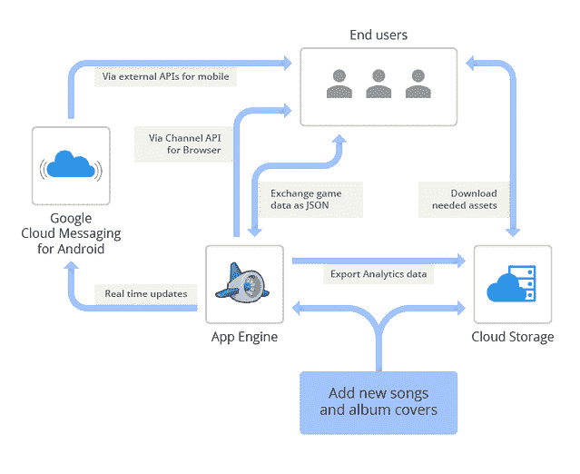

# SongPop 在 GAE 上可扩展至 100 万活跃用户，表明 PaaS 未通过

> 原文： [http://highscalability.com/blog/2013/2/25/songpop-scales-to-1-million-active-users-on-gae-showing-paas.html](http://highscalability.com/blog/2013/2/25/songpop-scales-to-1-million-active-users-on-gae-showing-paas.html)

您应该在下一个项目中使用 PaaS 吗？ 通常，答案是“否”，因为您想要控制，但这是 [SongPop](http://www.songpop.fm/) 中的一个示例，显示了为什么 PaaS 的承诺没有通过。 SongPop 能够自动扩展到 6000 万用户，100 万每日活跃用户，每天在全球范围内提供 17 TB 的歌曲和图像，每秒处理 10k +次查询，所有这些都由 6 人的工程团队组成，并且只有一名工程师全职工作 后端。

不幸的是，这里并没有很多细节，但是可以在[通过 App Engine 和 Google Cloud Storage](http://googleappengine.blogspot.com/2013/02/scaling-songpop-to-60-million-users.html) 将 SongPop 扩展到 6000 万用户中找到。 大纲遵循脚本。 你从小开始。 让 PaaS 做繁重的工作。 而当您需要扩展时，您只需购买更多资源并进行一些调整（也许很多）。 收获是，您可以专注于功能开发，并且可以与一个小型团队合作。

这是他们的体系结构图：

一些经验教训：

*   **首要支持。** 这听起来有点像销售推销，但是一旦他们的每日活跃用户达到 10 万，他们就开设了“高级支持”帐户，从而使他们可以与现实生活中的人交谈并快速解决停机问题。
*   **使**归一化。 为了减少就绪延迟，他们将跨多个模型散布的数据收集到一个实体中。 老歌，但仍然是一个巨大的胜利。
*   **缓存**。 为了减少查询，将用户的反对者列表缓存到 memcache 中，这是 GAE 的功能。 这个和非规范化更改花费了一名工程师 4 天的时间。
*   **截止日期**。 一旦操作的性能超过阈值，就该回落到另一个更可预测的策略了。
*   **综合索引**。 查询速度很慢，其原因可追溯到正在使用的许多索引属性。 解决方案是使用复合索引或将数据合并到单个实体中。 借助 Premier Support 的帮助可以追溯到此问题，Premier Support 也显示了 PaaS 的弱点，程序员不应该找到这些问题吗？ 也许查询日志很慢？
*   **易于与其他服务**集成。 亚马逊和谷歌等公司的一个优势是，他们可以创建功能强大的协作服务套件。 由于 SongPop 需要每天在世界范围内消费和分发 17 TB 的歌曲和图像，因此他们发现 Google Cloud Storage 价格合理，并且可以从 GAE 轻松使用。 而且，当您想做一些 BigData 时，已经内置了 Google BigQuery。 设计要点。
*   **位置标头**。 GAE 请求会自动包含标头，这些标头包含基于客户端请求的 IP 地址的位置信息。 SongPop 使用此信息选择对手并建立个人资料。
*   **同步模拟游戏。** Song Pop 使用的一种有意义的策略是[同步模拟游戏](http://uncrunched.com/2012/06/22/980/)。 可扩展的，一致的，低延迟的游戏很难，那么为什么要那么做呢？ SongPop 所做的是录制游戏，然后在您玩游戏时与您对战。 您似乎是在和一个真实的人比赛，但是没有一个讨厌的工程挑战。 您只需要存储声音片段和游戏结果，将玩家匹配到游戏，然后答复游戏即可。 相当聪明。

显然，这是您的标准 Facebook 风格游戏，因此它不是复杂的应用程序，但将其包含在体系结构决策矩阵中是一个很好的存在证明。

## 相关架构

*   [通过 App Engine 和 Google Cloud Storage 将 SongPop 扩展到 6000 万用户](http://googleappengine.blogspot.com/2013/02/scaling-songpop-to-60-million-users.html)
*   [Song Pop 每天吸引 200 万活跃用户，其中许多人可能在调情](http://techcrunch.com/2012/07/03/song-pop/)