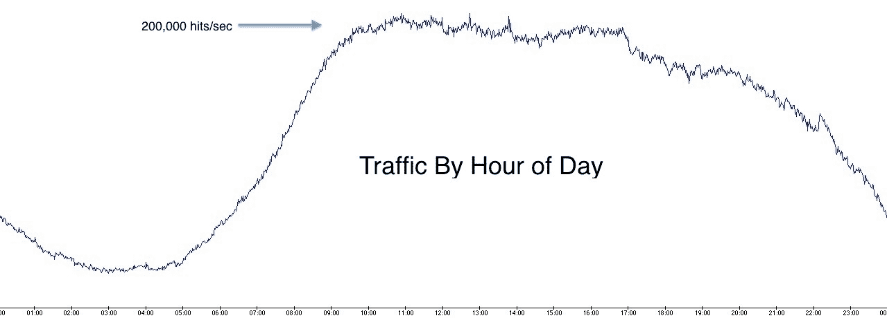
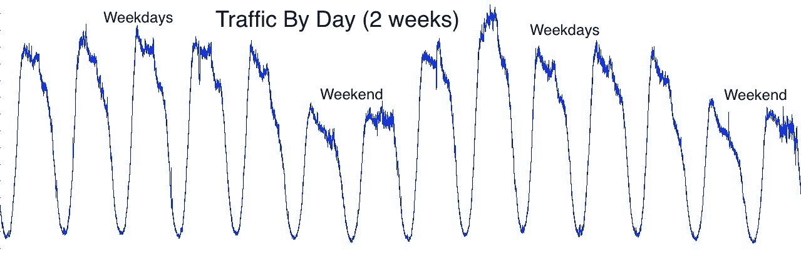
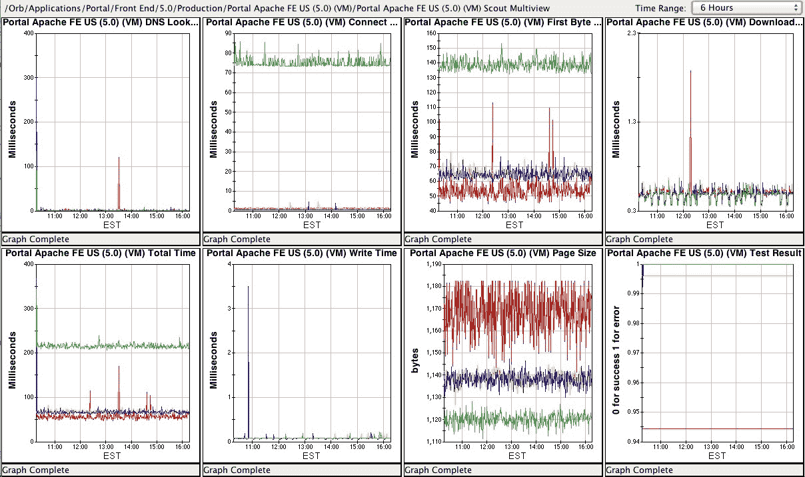
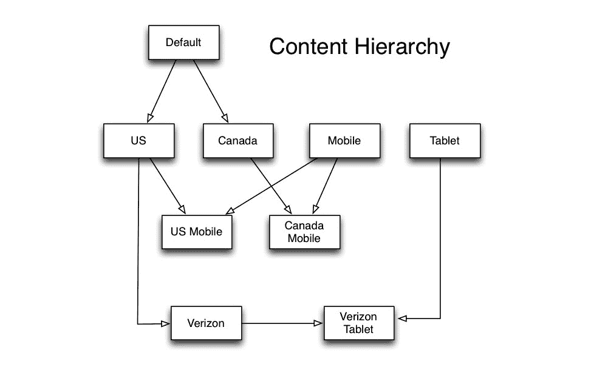
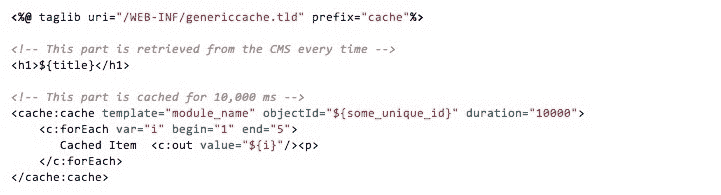

# AOL.com 体系结构如何发展到 99.999％的可用性，每天 800 万的访问者和每秒 200,000 个请求

> 原文： [http://highscalability.com/blog/2014/2/17/how-the-aolcom-architecture-evolved-to-99999-availability-8.html](http://highscalability.com/blog/2014/2/17/how-the-aolcom-architecture-evolved-to-99999-availability-8.html)

*这是 AOL 的 [Dave Hagler](http://www.linkedin.com/in/hagler) 系统架构师的特邀帖子。*

AOL 主页每天收到超过 **800 万名访客**。 与《美国早安》或电视上的《今日秀》相比，每天的观看者更多。 每月提供的网页浏览量超过十亿。 自 1996 年以来，AOL.com 一直是主要的互联网目的地，并且仍然拥有大量忠实用户。

**AOL.com 的架构是第 5 代**。 在过去的 20 年中，它已经从头开始进行了 5 次重建。 当前的体系结构是 6 年前设计的。 零件已升级，并在此过程中添加了新组件，但总体设计仍保持完整。 经过 6 年的持续改进，对代码，工具，开发和部署过程进行了高度调整，使 AOL.com 体系结构经过了测试，并且非常稳定。

工程团队由开发人员，测试人员和运营人员组成，**总共约有 25 人**。 大多数人在弗吉尼亚州的杜勒斯，在爱尔兰的都柏林有一个较小的团队。

通常，使用的技术是 **Java，JavaServer Pages，Tomcat，Apache，CentOS，Git，Jenkins，Selenium 和 jQuery** 。 在该堆栈之外还使用了其他一些技术，但是这些是主要组件。

## 设计原则

有一些重要的总体原则可以驱动体系结构。 首先，所有都有**冗余。 即使出现故障或需要维修时，仍然存在冗余。 要求有 5 个 9 的可用性，每年大约需要 5 分钟的停机时间。**

第二个原则是 AOL.com **不应依赖任何共享基础结构**来传递其页面。 如果其他 AOL 属性或系统出现故障，则 AOL.com 需要保持正常运行。 一段历史：在开发此体系结构时，大多数 AOL Web 属性只有一个共享的基础架构，称为 Big Bowl，这是一个反复出现的问题，其中一个属性会影响其他属性。 结果，当前的 AOL.com 专门设计为通过隔离自身来解决此问题。 对 AOL.com 的任何依赖都以保护服务为前提，该保护服务将对下游系统的调用集中在较小的服务器上。 下游系统没有从数千个服务器接收请求，而是从大约 20 个不同的服务器获得呼叫。 并且响应被缓存以进一步防止不堪重负。 此外，外部数据库被复制以提供给 AOL.com 自己的副本，并由其自己的运营团队进行管理。 关于唯一共享的组件是网络和身份验证服务。

另一个原理是**缓存用于优化性能，但不是系统以**规模运行的要求。 该基础结构的大小可在不进行缓存的情况下承受全部流量，同时仍可确保足够的冗余度以容忍中断。 缓存是一种奖励，但不是必需的。

## 物理基础架构

在 3 个数据中心中为 AOL.com 服务。 其中两个位于北弗吉尼亚州，一个位于加利福尼亚州，均由 AOL 拥有和运营。 所有 3 个数据中心都在积极地为流量提供服务，但是每个数据中心的大小都使其能够自行处理全部流量。 这样可以使一个数据中心脱机以进行维护，并且在发生故障的情况下仍具有冗余数据中心。

收到请求后， **Akamai GSLB 处理整个数据中心**的负载平衡，并将用户定向到最近的一个。 Akamai CDN 用于静态内容。 一旦进入数据中心，对服务或数据库的任何进一步请求将保留在该数据中心内。 用户会话信息保存在 cookie 中，并在请求中传递，因此任何服务器都可以为任何请求提供服务而不会保留任何状态。

在每个数据中心内，Netscaler 设备接收**请求并将其负载均衡到许多前端应用程序服务器**之一。 所有数据中心大约有 **700 个前端服务器。 前端是虚拟服务器，操作员可以根据需要通过扩展其他服务器来快速增加容量。 前端的虚拟主机分别配置有 2 个虚拟 CPU，4GB RAM 和 80GB 磁盘空间。 每个前端服务器都运行 Apache 和 Tomcat 的单个实例。 Apache 将请求传递给在本地主机上运行的 Tomcat。 **Tomcat 处理大量请求**，调用数据库和服务，并执行所有应用程序逻辑。**

## 流量

AOL.com 的访问量出人意料地可预测，遵循与互联网使用情况类似的模式。 重大世界事件将导致峰值，但否则模式将非常一致。

每天的流量从凌晨 3 点到 6 点是最低的，直到上午 10 点才急剧增加，**大约以 200,000 次点击/秒的速度徘徊 7 小时**，然后在下午 5 点之后开始下降。 每天重复相同的周期。

在工作日中，到 AOL.com 的流量比周末高。 每周中没有一个特定的工作日始终高于其他工作日。 换句话说，星期一与星期二或星期五没有什么不同。 但是周末总是比工作日低。

流量分布在 3 个数据中心的 2,000 台前端服务器中。 东海岸的两个数据中心分别接收约 40％的流量**，而 20％的流量到达西海岸**。 分布不均是因为 Akamai 将用户路由到最近的数据中心，并且在美国东部地区有更多的最终用户。 此外，流向国际站点 aol.ca，aol.co.uk，aol.fr，aol.de 的流量都流向美国的东海岸数据中心。

## 监控

AOL 数据中心（包括 AOL.com）中运行的所有应用程序均由自主开发的工具监视**，该工具已开发了多年，其功能类似于 Amazon 的 CloudWatch。 硬件和软件指标可以实时收集和汇总。 客户端应用程序提供报告，图形和仪表板。 提供了主机，CPU，接口，网络设备，文件系统，Web 流量，响应代码，响应时间，应用程序度量标准和其他信息。 每分钟检查一次服务器端点，并在未达到可用性和响应时间的某些阈值时发出警报。**

## 内容管理系统

AOL.com 的大部分内容以及很多业务逻辑都来自**内容管理系统**。 CMS 是基于相同的 **Java / JSP 技术堆栈**构建的本地应用程序。 它具有除典型 CMS 之外的许多功能。 编辑者使用它来创建您在 AOL.com 上看到的内容。 开发人员使用它来配置应用程序。 它还是一个指标仪表板，供编辑人员提供有关页面上每个内容的性能如何的实时数据。

AOL 主页不仅仅是一个页面，而且位于单个域 www.aol.com。 它实际上由相同内容的数十个不同版本组成，它们在不同的域上，可能有许多可见或细微的差异。 CMS 允许在一个地方对主页的这些不同版本进行编程，并从层次结构中的多个父级继承特定版本的内容。 版本之间的差异可以很简单，例如页面上的不同品牌徽标，不同的跟踪 ID，或者某些或全部内容可以完全不同。 例如，用作美国主页（www.aol.com）的 AOL.com 版本可能与加拿大版本（aol.ca）不同，而加拿大版本可能与移动版本（m.aol。）不同。 com）。 还有供合作伙伴使用的品牌版本，例如 Verizon 的移动门户。

这样，**内容会滴入**，从而消除了对大量手动复制内容的需要。 以仅与美国站点相关的突发新闻事件为例。 编辑人员将在“美国”部分对突发新闻进行编程，并将其编入所有从美国继承的网站。 如果由于某种原因突发新闻仅针对 Verizon 门户，则编辑者可以在该级别进行编程，并将其下放到各个 Verizon 站点。

在将 **推广给更广泛的受众**之前，我们**测试每个功能以查看其性能。 为了方便测试，CMS 中内置了一个多变量测试工具，该工具允许任意数量的测试单元并行运行。 我们会不断测试不同的内容和设计元素，以优化体验。 定义为访问量百分比的测试受众将获得该网站的其他版本。 将用户随机放入测试单元中，并使用浏览器 cookie 进行跟踪。 测试可能是按钮颜色的微小外观变化，可能是内容的不同布局，也可能是完全不同的体验。 在应用结果之前，测试通常会运行数周。**

## 数据库

AOL.com 上的内容是高度动态的，并且需要访问数据库并为每个页面视图应用规则。 除了您在页面上看到的标记外，CMS 还包含许多规则和条件内容。 例如，如果您使用的是较旧的浏览器，则可能在页面顶部看到“浏览器升级”标语。 因此，CMS 数据库需要快速，能够处理极端流量突发并且始终可用。 我们正在运行 **MySQL 5** ，并且与虚拟化的前端服务器不同，**数据库服务器更大，具有 16 个 CPU 和额外磁盘空间的物理主机**。

CMS 数据库有 **30 个从属副本，每个数据中心**中有 10 个。 单个主服务器位于其中一个数据中心，而备用主服务器位于同一数据中心中，以防发生故障。 除了主服务器和从属服务器之外，每个数据中心中都有一个与主服务器进行复制的中继器，并且该中继器在其数据中心中充当从属服务器的主服务器。 中继器的目的是减少跨数据中心的复制流量。 发生故障时，每个数据中心中都有一个备用转发器。 如果主主机及其备份发生故障，则将其中一个转发器指定为新主机。

应用程序**通过 HTTP 接口**访问数据库。 AOL 开发了一个 apache 模块，用作 MySQL 的接口。 每个数据库主机上都有一个安装有模块的 Web 服务器。 管理员管理与其数据库的连接池，将 sql 查询作为 GET 请求，然后以 XML 格式返回结果。 对于 AOL.com 之类的 Java 应用程序，有一个 Java 客户端库可将 HTTP 调用和 XML 解析抽象为类型化的对象。

HTTP 数据库接口有多个原因。 首先，它使客户端的数据库访问更加简单。 任何使用任何编程语言的应用程序都可以进行 HTTP 调用，而无需担心 MySQL 客户端驱动程序或连接池。 其次，扩展应用程序也很容易。 应用程序通过单个 URL（指向负载均衡器虚拟 IP 地址的 URL）访问数据库。 添加新的从属服务器后，客户端应用程序无需将其添加到其配置中。 HTTP 接口的另一个好处是用于监视。 标准的 Web 服务器访问日志和监视工具可以提供数据库事务量，查询响应时间和错误。 整个 SQL 查询都作为参数包含在 URL 中，因此可以轻松地在日志中使用。 apache 模块中还内置了一个管理界面，可以从任何 Web 浏览器获取数据库诊断信息。

## 缓存

在体系结构中，有几个区域使用了缓存。 CMS 中有**个二级缓存。 首先，访问数据的 CMS Java 代码利用内存缓存。 由于**的内容在 CMS 中的每个内容都是**版本，并且从未更新过，而是一个新版本，因此可以轻松地缓存数据以减少对数据库的查找。 这种类型的缓存位于 Tomcat 实例级别，每个 700 个实例均保留其自己的缓存。**

但是仍然需要为每个页面加载检查数据库，以查看是否有新的内容修订版。 这会转化为许多数据库查询，通常结果相同。 由于我们的数据库查询全部由 HTTP 接口通过前面描述的 apache mod 代理，因此我们可以使用 Varnish Cache 轻松地**缓存请求。 数据库查询是简单的 HTTP GET 请求，URL 中带有完整的 SQL 查询，因此 Varnish 可以很好地工作，从而大大减少了到数据库服务器的流量。**

**Akamai CDN 用于缓存所有静态资产**。 除了静态资产缓存之外，Akamai 还每隔几分钟就会缓存一个精简的 AOL.com 静态版本。 当所有数据中心均无法访问时，这是灾难情况下很少使用的后备。 用户将直接从 Akamai 获取缓存的页面，直到实际页面重新联机。

缓存的最终区域在 AOL.com **前端 JSP 代码**中。 前端的工作是从 CMS 收集大量的小片段内容，并将它们组装成 HTML 页面。 我们开发了一个 JSP 标记库，使开发人员可以在页面上缓存任何组合的 HTML 块。 例如，要指定要缓存的页面部分，请用< cache：cache > < / cache：cache >包围它。

## 开发流程

对于需要更改编码的主要功能，开发团队会松懈地遵循 **Scrum 流程**。 冲刺通常需要 3 到 4 周，具体取决于业务承诺。 有时，可能同时处理多个 Sprint，例如某个功能需要花费 4 个多星期的开发时间。

仅通过 CMS 发布即可完成许多**网站更改，而无需构建或代码部署过程。 这些是经常发生的事件，它们作为非周期过程处理，请求通过电子邮件列表发送给团队。 这些更改全天部署，每天变化范围从几到十几个或更多。 这些更改的周转时间为几分钟到几天。**

开发**小组每周轮换一个 iPhone，以作为应用程序随时待命**。 触发应用程序级别监视时，应用程序呼叫会收到警报。 例如，来自下游系统的数据可能已停止流动。 对于最终用户而言，这不会造成明显的问题，因为在这种情况下会有冗余和适度的后备，但是它会在问题变得严重之前主动发出警告。 除了应用程序待命之外，运营团队还可以待命以解决网络，主机和数据库问题。 有明确定义的上报途径和团队来处理任何情况。

开发人员**在其本地环境**中工作。 大多数使用 Macbook Pro 笔记本电脑和 Netbeans 或 Eclipse。 在开发过程中使用了 6 种非生产环境。 所有环境都与生产环境匹配相同的配置，但规模较小。 有 2 个 Dev Integration，4 个 QA 和 1 个 Staging 环境。 多个 QA 环境对于同时支持 2 个 sprint 以及必要时的生产修复都必不可少。 通常，在任何给定时间仅使用 1 或 2 个 QA 环境。 国际版本也有单独的 Dev，QA 和 Staging，它们分别运行同一代码库的单独实例来服务 aol.co.uk，aol.fr 和 aol.de。

在安装新代码之前， **QA 流程相当严格**。 这些年来，已经建立了许多回归测试，不仅有大量的自动化测试，而且还有许多手动测试。 硒用于自动化测试。 有一个自定义的屏幕截图工具，可以快速捕获各种浏览器/操作系统组合中的页面外观。 与典型的网站相比，AOL 使用较旧系统的用户更多，而我们的回归测试套件则包括 IE7，AOL 桌面浏览器以及模拟缓慢的 Internet 连接。 我们还测试了浏览器/操作系统/设备组合的广泛矩阵。 在装有 Windows 7 的 IE9 上看起来有些不错，但在装有 Windows XP 的 IE9 上却坏了。 它增加了很多额外的时间来对浏览器和操作系统的所有排列进行站点回归测试，但是事实证明，多年来，它是必要的。 Windows XP 和旧版 IE 构成了最大的问题。 AOL.com 倾向于在这些较旧的系统上吸引更多用户，因此我们会更加注意它。

完整的安装过程从开始到结束大约需要 2 个小时，整个开发团队都在听电话会议。 当流量最低时，安装通常在美国东部时间上午 6 点完成。 在安装过程中，站点或 CMS 不会停机。 即使大多数安装步骤都是脚本化的，但每个步骤都由操作员单独运行并在执行过程中进行验证。 在生产安装的前一天，在登台环境中练习了整个安装过程和脚本。 备份数据库后，将部署并验证各种组件。

更新网站的一个挑战是 CDN 交付的 CSS，图像和 Javascript 会缓存在浏览器中。 这样，用户可能会遇到糟糕的体验，直到缓存的元素过期为止。 我们遵循消除此问题的过程。 首先，将新的**静态内容推送到新版本路径**下的 CDN，从而使旧资产和新资产均可用。 接下来，将生产环境中运行的旧代码配置为指向新资产。 为了使它起作用，我们确保所有静态内容都向后兼容。 一旦有新资产可用，就将新代码部署到前端 Tomcat 服务器。 对于每台服务器安装，Apache 都会停止运行，这会告诉负载平衡器停止旋转并停止发送流量。 然后停止 Tomcat，安装新代码，重新启动 Tomcat，最后重新启动 Apache，这触发负载均衡器开始发送流量。 **使用 AOL 基于 RPM 软件包**定制开发的部署系统，通常需要 20 到 30 分钟才能在所有数据中心（总共超过 2000 台服务器）中部署新代码。

## 来回回顾

AOL.com 的技术堆栈已经成熟并且运行良好。 就像任何使用 6 年以上的系统一样，如果我们今天才开始，我们可能不会做出相同的选择。 Java / Tomcat / JSP 已被 Web 应用程序的 Python 和 PHP 取代。 Nginx 的性能可能优于 Apache，并且出现了 NoSQL 数据库。 许多这些技术已在 AOL 的其他领域中使用。 这是成功软件系统的经典难题。 相同的健壮功能使当今的体系结构如此灵活和可靠，这使得利用新技术变得困难。

但是我们在此过程中做出了一些有影响力的更改。 仅举几个例子，包括从物理主机到虚拟主机的转换。 添加清漆缓存； 并将 Jenkins 引入构建过程。 我们正在对前端 HTML 和 CSS 进行完全重写，以清理大量旧代码并促进响应性设计，而这几年前还没有考虑过。 我们的道路仍然是发展体系结构，在合理的时候重建零件并适应行业不断变化的需求。

感谢您提供非常有趣的信息:-)

我感觉合理。 简单，无聊且有效。 同样，虽然有人将 Java 称为新的 COBOL，但这并不总是一件坏事-许多语言设计使其能够很好地处理 5 年未修改的代码的维护工作，这对于像这样的大型项目来说是一个重大问题。

即使它是免费的，在系统重写后，任何问题所涉及的风险似乎也超过了任何财务收益。

像将其作为寻呼机一样旋转物理 iPhone 似乎有些愚蠢。 也许你们可能想研究一下 PagerDuty 这样的更好的解决方案。

做得好！

确实很有趣，有很多好处。 我真的很喜欢这篇文章。 谢谢戴夫。

鉴于该站点全天仅执行 8 毫米操作，因此每秒 200k 次的命中率似乎太高了。 在这段时间内，按照 200k /秒的文章进行 8 个小时的数学运算，将获得 84MM 的点击。 所以有些事了。

@EJ-200,000 次命中/秒是对前端服务器的所有请求。 对该页面的访问会产生许多服务器调用，因为在后台还会发生其他 ajax 调用。 另外，其他 AOL 属性正在使用 api，这些 api 会导致访问前端服务器的流量，但不会注册用户访问。

@ EJ 每天有 800 万访客，相对于每秒 20 万页面请求。 它没有详细介绍每个用户获得多少页面请求。

戴夫，感谢您花费时间和精力来教育我们所有人。 您参与设计的过程令人印象深刻，您的雇主也允许您提高人们的数字敏感性，这也说明了他们的数量。

嗨，戴夫，

我希望您能透露更多有关您如何授权用户的信息。 您正在使用 cookie，并且有一些身份验证服务。 是否在每个请求（如果适用）上调用这些服务？ 解决方案是自家生产的吗？

我知道这个主题有点...嗯...很敏感，所以我会尽我所能。

谢谢

数据库设计更引人入胜。 有人知道我们是否也可以采用类似的设计进行交易处理吗？

很棒的文章，非常感谢。
一件特别的事引起了我的注意，因为我们一直都在努力解决它：
“对于每台服务器安装，Apache 都停止了，这告诉负载均衡器使其停止旋转并停止发送流量。”

为了将其从负载均衡器池中删除，Apache 实际上是否已停止运行？ 还是为了在停止 Apache 之前将其删除而做些什么？
显然，仅停止 Apache，将导致所有活动用户断开连接。
除非使用“平稳停止”？

Thanks