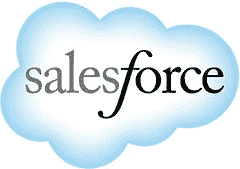

# Salesforce Architecture-他们每天如何处理 13 亿笔交易

> 原文： [http://highscalability.com/blog/2013/9/23/salesforce-architecture-how-they-handle-13-billion-transacti.html](http://highscalability.com/blog/2013/9/23/salesforce-architecture-how-they-handle-13-billion-transacti.html)

*这是由 [salesforce.com](http://www.linkedin.com/profile/view?id=3158913) 的首席站点可靠性工程师 [Claude Johnson](http://www.linkedin.com/profile/view?id=3158913) 撰写的来宾帖子。*

以下是 salesforce.com 的核心平台和应用程序的体系结构概述。 其他材料（例如，Heroku 的 Dyno 架构）或其他产品的子系统（例如，work.com 和 do.com）不在本材料中，尽管 database.com 不在其中。 想法是与技术社区分享有关 salesforce.com 如何执行工作的一些见解。 任何错误或遗漏是我的。

这绝不是全面的，但是如果有兴趣，作者将很乐意解决 salesforce.com 运作的其他领域。 Salesforce.com 希望与以前未与之互动的技术社区更加开放。 这是关于“如何打开和服”的开始。

自 1999 年以来，salesforce.com 一直专注于构建通过 Internet 交付的业务技术，以取代传统的企业软件。 我们的客户通过按月订阅付费，以通过网络浏览器随时随地访问我们的服务。 我们希望这种对 salesforce.com 核心体系结构的探索将是对该社区做出的许多贡献的第一步。

## 定义

让我们从一些基本的 salesforce.com 术语开始：

*   **实例**-共享和非共享的完整的系统，网络和存储基础结构集，可为部分客户提供 salesforce.com 服务。 例如，na14.salesforce.com 是一个实例。
*   **Superpod** -一组系统，网络和存储基础结构，包括出站代理服务器，负载平衡器，邮件服务器，SAN 结构和支持多个实例的其他基础结构。 Superpods 在数据中心内提供服务隔离，因此共享或复杂组件的问题不会影响该数据中心中的每个实例。
*   **机构**（又称组织）-Salesforce 应用程序的单个客户。 从 www.salesforce.com 或 developer.force.com 开始的每次试用都会产生一个新的组织。 组织是高度可定制的，并且可以具有不同的安全设置，记录可见性和共享设置，UI 外观，工作流，触发器，自定义对象，标准 salesforce.com CRM 对象上的自定义字段，甚至是自定义 REST API。 组织可以支持从一百万到数百万个许可的个人用户帐户，门户网站用户帐户和 Force.com 网站用户帐户。
*   **沙箱**-salesforce.com 服务的一个实例，该实例托管用于客户应用程序开发目的的生产组织的完整副本。 使用我们平台的客户可以拥有完整的应用程序开发生命周期。 这些是供客户在将更改部署到其生产组织中之前对其应用程序进行用户验收测试的测试环境。

## 统计信息（截至 2013 年 8 月）

*   17 个北美实例，4 个 EMEA 实例和 2 个 APAC 实例
*   20 个沙箱实例
*   1,300,000,000 笔以上的每日交易
*   高峰时每秒 24,000 个数据库事务（相当于其他站点上的页面浏览）
*   15,000 多个硬件系统
*   > 22 PB 的原始 SAN 存储容量
*   > 5K SAN 端口

## 使用的软件技术

*   用于开发和初级生产系统的 Linux
*   带 ZFS 的 Solaris 10
*   码头
*   索尔
*   记忆快取
*   Apache QPID
*   质量体系
*   剃刀木偶
*   Perl，Python
*   纳吉奥斯
*   Perforce，Git，Subversion

## 硬件/软件架构

### 登录到 salesforce.com 服务

我们维护一个服务器池来处理所有实例的登录流量。 来自许多（但不是全部）实例的少数服务器接受登录请求，并将会话重定向到用户的家庭实例。 当您通过 login.salesforce.com 登录时，会发生这种情况。

客户流量始于我们的外部 DNS。 查找成功返回实例的 IP 地址后，标准 Internet 路由会将其定向到适当的数据中心。

一旦流量进入该数据中心中的网络，它将被定向到该 IP 所在的负载平衡器对。 我们所有面向 Internet 的 IP 都是在一对主用/备用负载均衡器上配置的 VIP。

### 在实例内部

负载平衡器将流量定向到给定实例的应用程序层。 在这一层，我们既提供标准网页流量，也提供我们的 API 流量。 API 流量占我们应用程序层总体服务的流量的 60％以上。 根据客户请求的需求，它将被定向到用于各种类型的后端处理的其他服务器层。

### 核心应用

核心应用程序层包含十到 40 个应用程序服务器，具体取决于实例。 每个服务器运行一个配置有多达 14 GiB 堆的 Hotspot JVM，具体取决于服务器硬件配置。

批处理服务器负责在数据库层上运行计划的自动化过程。 例如，每周导出过程，该过程用于以单一存档文件格式导出客户数据作为备份形式。

Salesforce.com 提供许多服务，包括基本和高级内容管理。 我们有一个内容搜索服务器和一个内容批处理服务器，用于管理内容应用程序层上的异步过程。 内容批处理服务器计划内容类型的处理，包括诸如某些文件类型的渲染预览和文件类型转换之类的功能。

### 数据库

主要数据流发生在核心应用服务器层和数据库层之间。 从软件的角度来看，所有内容都通过数据库，因此数据库性能至关重要。 每个主要实例（例如 NA，AP 或 EU 实例）都使用 8 节点集群数据库层。 客户沙箱（例如 CS 实例）具有 4 节点集群数据库层。

由于 salesforce.com 是一个非常受数据库驱动的系统，因此减少数据库负载至关重要。 为了减少数据库层的负载，我们开发了 ACS-API Cursor Server。 这是对两个问题的解决方案，使我们能够显着提高核心数据库性能。 首先，我们曾经将游标存储在数据库中，但是删除操作会影响性能。 其次，在使用数据库表保存游标之后，DDL 开销变成了负面影响。 因此诞生了 ACS。 ACS 是在一对服务器上运行的游标缓存，提供了一种从数据库层卸载游标处理的方法。

### 搜索

我们的搜索层运行在商用 Linux 主机上，每台主机上都配备了 640 GiB PCI-E 闪存驱动器，该驱动器充当搜索请求的缓存层。 这些主机通过 NFS 文件系统从共享的 SAN 阵列中获取数据。 搜索索引存储在闪存驱动器上，以提高搜索吞吐量的性能。

搜索索引当前在转换服务器上进行，转换服务器通过光纤通道 SAN 从存储阵列安装 LUN。 这些 LUN 组成一个 QFS 文件系统，该文件系统允许单写程序但多读程序访问。 像大多数其他关键系统一样，我们以主动/被动方式运行它们，而被动节点则执行一些低优先级的搜索索引工作。 然后将其结果发送给活动伙伴以写入 QFS 文件系统。

当这些相同的 LUN 从一组在 SPARC 上运行 Solaris 10 的四个 NFS 服务器以只读方式装入时，就会发生转换。 然后，这些通过 SAN 安装的文件系统通过 NFS 共享到先前描述的搜索层。

### Fileforce

我们维护一层提供对象存储的服务器，其概念与亚马逊的 S3 或 OpenStacks 的 Swift 项目相似。 Fileforce 这个系统是内部开发的，目的是减少数据库层的负载。 在引入 Fileforce 之前，所有二进制大对象（BLOB）都直接存储在数据库中。 Fileforce 联机后，所有大于 32 KiB 的 BLOB 都已迁移到其中。 小于 32 KiB 的 BLOB 继续存在于数据库中。 Fileforce 中的所有 BLOB 在数据库中都有一个引用，因此为了从备份中还原 Fileforce 数据，我们必须基于来自同一还原点的数据库备份来启动数据库实例。

Fileforce 包括捆绑程序功能，旨在减少 Fileforce 服务器上的磁盘查找负载。 如果数据库中存储了 100 个以上小于 32 KB 的对象，则将在应用服务器上运行一个进程，以将这些对象捆绑到一个文件中。 对捆绑文件的引用与捆绑中的查找偏移量一起保留在数据库中。 这类似于 Facebook 的 Haystack 图像存储系统，但内置于对象存储系统中。

### 支持

每个实例包含其他各种支持角色的服务器，例如调试应用程序服务器和应用程序层中的“ Hammer 测试”应用程序服务器，监视每个实例运行状况的中心服务器以及监视运行 Nagios 的服务器。 实例本身之外还包含支持服务器，例如存储管理，数据库管理，日志聚合，生产访问身份验证和其他功能。

## 未来发展方向

在数据库层，我们正在仔细检查数据存储系统的几种选项。 我们还在评估更高速度，更低延迟的互连，例如与现有数据库解决方案的集群互连的 Infiniband。

将来，我们希望使搜索主机能够进行所有读写操作。 我们正在为搜索索引推出 Apache Solr。 Solr 在我们现有的搜索主机上本地运行。 SAN，NFS 服务器和基于 SPARC 的索引器主机将全部消失，这将大大降低整个搜索层的复杂性。

我们的应用程序容器以前是 Resin，但在过去的一年中，我们一直在迁移到 Jetty。 我们还在对应用层硬件进行硬件更新，这将使 RAM 大小增加 30％-266％，并将 Sandy Bridge 处理器引入我们的堆栈。

我希望对 salesforce.com 技术架构和堆栈的概述能使您有趣且有益。 如果您对其他访客帖子感兴趣，请深入评论我们广泛的技术基础架构的其他部分。 谢谢阅读！

## 相关文章

*   [Force.com 多租户架构的内部设计](http://www.infoq.com/presentations/SalesForce-Multi-Tenant-Architecture-Craig-Weissman)
*   [Salesforce.com 架构](http://www.scribd.com/doc/145879736/Salesforce-com-Architecture)
*   [单元架构](http://highscalability.com/blog/2012/5/9/cell-architectures.html)

克劳德

感谢您抽出宝贵时间发布此信息。 我想对您如何使用 Solaris 和 ZFS 的更多信息非常感兴趣。 另外，如果必须全部这样做，是否会再次使用 QFS？

谢谢！

你们正在使用什么数据库？

此外，您提到了 Resin 和 Jetty，但在语言列表中没有提及 Java。 如果使用 Java，则正在使用 Java EE 的哪些部分？

他们没有提到它，但我可以想象它是神谕！

@MiddleAgedGeek

他们使用 Oracle 或曾经使用 Oracle：http://www.dbms2.com/2012/06/26/is-salesforce-com-going-to-stick-with-oracle/

?？ 每秒有 24,000 个数据库事务（24k TPS）由多少台数据库机处理？ 还是每个数据库服务器处理多少 TPS？
另外，我们是否在这里谈论纯 OLTP，OLAP 和混合液？

韦斯

FIleforce 在 Solaris 10 上运行，并且 Fileforce 数据存储在从镜像 VDEV 创建的 ZFS 池中。 （镜像 VDEV 的数量取决于服务器的型号。）

我开始之前就选择了 QFS。 由于 salesforce.com 是 Sun 商店，并且搜索索引是在具有 SAN 存储的 SPARC 服务器上运行的，因此 QFS 是操作人员轻松实现高吞吐量，可靠的搜索索引文件系统的方式。 NFS 将其安装到搜索层的唯一原因是字节顺序问题。 如前所述，我们正在转向一种更易于推理，故障排除和支持的体系结构。

MiddleAgedGeek 和 ymo，

请参阅 http://www.salesforce.com/company/news-press/press-releases/2013/06/130625.jsp，但我们确实使用 Oracle 数据库。 我们确实将其他数据存储用于不同的应用程序，但是上述核心数据库是 Oracle。

至于 Java，我们将 Jetty 用作容器，但是我们并未使用大多数核心 Java EE 功能。 Java 是我们内部构建的核心应用服务器的选择语言。

普热梅克

24000 个事务/秒是我们所有实例中高峰事务速率的平均值。 工作量主要是 OLTP，但是由于客户使用我们服务的方式，肯定有 OLAP 组件。

Claude,

很棒的文章，感谢您在幕后进行的深入探寻，我期待更深入的潜水。 社区绝对可以从 SF 经验中学习。

1.3B 事务...是否还可以将其定义为单个客户端请求（网页浏览，ajax 请求）以及服务器的相应响应？

以后的文章建议对实例进行检测和监视。 数据量，脱机处理，什么类型的数据（http 日志，代码跟踪语句，度量标准等）。

嗨，克劳德，
感谢您分享此信息。 它真的很有帮助:-)

彼得

是的，交易是对实例的应用层的请求/响应。

我也一定会通过这个建议。 我希望我的团队和其他人能看到更多类似的帖子。 我很高兴得到如此积极的回应。 谢谢你们！

惊人的帖子比我以前看到的要详细得多。 谢谢！

您今年要参加 Dreamforce 吗？

我使用该平台已有几年了，我一直想知道它是如何在后台运行的。 处理的数据量以及所有响应的响应速度简直太疯狂了。

很棒的帖子！ 感谢分享！

惊人的帖子，

在注释部分提到的是 Oracle DB。 我猜一个实例中的群集。 您如何处理 HA 和 DR？
例如，如何将 Appexchange 部署添加到不同的位置，例如在同一地点？
是否存在共享实例，还是仅在所有实例中都复制了？

感谢您的评论。

有趣的文章-感谢分享。 您如何监视系统-性能和中断。 除了 Nagios 之外，您还使用其他监视工具吗？ Splunk，仙人掌等？

感谢您分享知识。

有许多服务器可为来自不同大陆的客户提供应用程序层服务。

您是否为每个新的注册客户端创建单独的数据库？ 或每个服务器的数据库有一定限制。 在数据库层部分找不到太多有关如何进行负载平衡的信息？

引人入胜的文章，并保持他们的到来。 我经常推测出幕后的魔力，这绝对是一本好书。 我希望类似的帖子将继续围绕这样的主题-它们不仅通过透明性建立信任-它们还有助于增进我们的集体工程知识。 谢谢！

嗨
非常有启发性的文章！
我想深入了解 Force.com 网站如何与整个事情联系在一起。 它托管在 DMZ 区域中吗？
谢谢！

是否考虑过像事务服务器集群这样的单独层来减少会话负载？ 当然，我假设在数据库层而不是在应用程序服务器层运行存储过程。

您可以在以下位置找到 Salesforce.com 架构幻灯片：http://www.slideshare.net/gueste35dd2/salesforcecom-corporate-presentation-july-2009?next_slideshow=1-上面的划线链接要求我注册&，但要付费 。

很棒的架构概述！ 要求：这是 2 岁。 请分享过去两年中的体系结构和基础架构升级。 谢谢 ！

现在的堆栈是什么样的？ 它是如何成长的？ 什么是新的，什么掉了？ 软件堆栈必须已大修几次。
从接收的客户数量来看，SFDC 的技术足迹必须每年增长 10-20％？