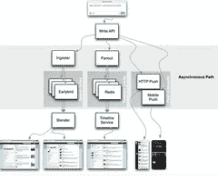

# Twitter 的架构用于在 5 秒内处理 1.5 亿活跃用户，300K QPS，22 MB / S Firehose 以及发送推文

> 原文： [http://highscalability.com/blog/2013/7/8/the-architecture-twitter-uses-to-deal-with-150m-active-users.html](http://highscalability.com/blog/2013/7/8/the-architecture-twitter-uses-to-deal-with-150m-active-users.html)

解决 Twitter“问题”的玩具解决方案是最受欢迎的可伸缩性。 每个人都认为 Twitter 很容易。 挥舞着一点建筑手，我们就拥有了一个可扩展的 Twitter，就这么简单。 好吧，这不是那么简单，就像 Twitter 的工程副总裁 [Raffi Krikorian](https://twitter.com/raffi) 在他对 [时间轴的出色且详尽的介绍中所描述的那样 规模](http://www.infoq.com/presentations/Twitter-Timeline-Scalability) 。 如果您想了解 Twitter 的工作原理，请从这里开始。

它是逐渐发生的，所以您可能会错过它，但是 Twitter 已经成长。 它最初是一个苦苦挣扎的 [三层 Ruby on Rails](http://highscalability.com/scaling-twitter-making-twitter-10000-percent-faster) 网站，现在已经成为一个精美的服务驱动核心，我们现在实际去看看其他服务是否已关闭。 很大的变化。

Twitter 现在拥有 1.5 亿全球活跃用户，处理 300K QPS 来生成时间线，以及每秒输出 22 MB 速度的流水线。 每天有 4 亿条推文通过该系统，从 Lady Gaga 的手指到 3100 万追随者的推文最多可能需要 5 分钟。

有几点值得注意：

*   Twitter 不再希望成为网络应用程序。 Twitter 希望成为为全球移动客户端提供动力的一组 API，充当地球上最大的实时事件总线之一。
*   Twitter 主要是一种消费机制，而不是生产机制。 300K QPS 用于读取时间轴，而每秒仅 6000 个请求用于写入。
*   具有大量关注者名单的离群值正在成为一种常见情况。 从具有大量关注者的用户发送推文（即扇出大）可能会很慢。 Twitter 尝试在 5 秒内做到这一点，但它并不总是有效，特别是当名人互相推 t 时，这种情况越来越多。 结果之一是，回复可能会在收到原始推文之前到达。 Twitter 正在从对写入的所有工作转变为对高价值用户进行更多的读取工作。
*   您的家庭时间轴位于 Redis 集群中，最多包含 800 个条目。
*   Twitter 从您关注的人以及单击的链接上对您了解很多。 当双向遵循不存在时，隐式社会契约可以暗示很多。
*   用户关心推文，但是推文的文本与 Twitter 的大多数基础结构几乎无关。
*   它需要一个非常复杂的监视和调试系统来跟踪复杂堆栈中的性能问题。 过去遗留决策的幽灵总是困扰着系统。

Twitter 如何运作？ 阅读 Raffi 精彩演讲的内容，并发现...

## 挑战

*   1.5 亿用户的时间轴（首页和搜索）的 300K QPS 可能会很慢。
*   幼稚的物化是整个 Twitter 上大量的精选声明。 它被审判并死亡。
*   解决方案是基于写的扇出方法。 推文到达时要进行大量处理，以找出推文应该去哪里。 这样可以快速轻松地读取时间。 不要对读取进行任何计算。 在写路径上执行所有工作后，摄取速率比读路径慢，约为 4000 QPS。

## 团体

*   平台服务小组负责 Twitter 的核心可扩展基础架构。
    *   他们运行称为“时间轴服务”，“推文服务”，“用户服务”，“社交图谱服务”的东西，这些工具为 Twitter 平台提供了强大的支持。
    *   内部客户端使用与外部客户端大致相同的 API。
    *   已针对第三方 API 注册了超过 1 百万个应用
    *   与产品团队签订合同是他们不必担心规模。
    *   进行容量规划，设计可扩展的后端系统，随着站点以意想不到的方式不断增长而不断替换基础架构。
*   Twitter 有一个架构小组。 有关 Twitter 的整体整体架构。 维护技术债务清单（他们希望摆脱的清单）。

## 推我拉我

*   人们一直在 Twitter 上创建内容。 Twitter 的工作是弄清楚如何将内容联合起来。 如何将其发送给您的关注者。
*   真正的挑战是实时约束。 目标是在不超过 5 秒的时间内将消息流传递给用户。
    *   交付意味着收集内容并在 Internet 上施加压力，以使其尽快恢复。
    *   传递到内存中的时间轴群集，推式通知，已触发的电子邮件，所有 iOS 通知以及 Blackberry 和 Android，SMS。
    *   Twitter 是按世界上任何活跃用户的最大 SMS 生成器。
    *   选举可能是内容进入和内容散播的最大驱动力之一。
*   时间线的两种主要类型：用户时间线和主时间线。
    *   用户时间轴是特定用户已发送的所有推文。
    *   主时间轴是您正在关注的人的所有用户时间轴的时间合并。
    *   业务规则被应用。 @您不认识的人的回复被删除。 可以过滤掉来自用户的转发。
    *   在 Twitter 规模上做到这一点具有挑战性。
*   拉式
    *   目标时间表。 诸如 twitter.com 和 home_timeline API 之类的东西。 发推文是因为您要求查看而发给您的。 基于拉式的传递：您正在通过 REST API 调用从 Twitter 请求此数据。
    *   查询时间轴。 搜索 API。 针对语料库的查询。 尽快返回与特定查询匹配的所有推文。
*   基于推送
    *   Twitter 运行着最大的实时事件系统之一，通过 Firehose 以 22 MB /秒的速度推送推文。
        *   打开一个 Twitter 套接字，他们将在 150 毫秒内将所有公开推文推送给您。
        *   在任何给定时间，推集群都可以打开约一百万个套接字。
        *   面向搜索引擎之类的客户。 所有公开推文都来自这些插座。
        *   不，你不能拥有它。 （您无法处理/承担事实。）
    *   用户流连接。 Powers TweetDeck 和适用于 Mac 的 Twitter 也经历了这里。 当您登录时，他们会查看您的社交图，仅从您所关注的人那里发送消息，从而重新创建家庭时间轴体验。 通过持久连接，无需轮询即可获得相同的时间轴体验。
    *   查询 API。 发出关于推文的常规查询。 创建推文并找到与查询匹配的推文后，会将它们路由到查询的注册套接字中。

## 高水平的基于拉的时间轴

*   通过写 API 发出推文。 它通过负载平衡器和 TFE（Twitter 前端）以及其他无法解决的问题。
*   这是一条非常有方向的道路。 完全预先计算的家庭时间表。 随着推文的出现，所有业务规则都将执行。
*   立即发生扇出过程。 传入的推文放置在庞大的 Redis 集群中。 每个推文在 3 台不同的计算机上复制 3 次。 在 Twitter 规模上，许多机器每天都会发生故障。
*   扇出查询基于[群](https://github.com/twitter/flockdb)的社交图服务。 Flock 维护关注者和关注者列表。
    *   Flock 返回收件人的社交图，并开始遍历 Redis 集群中存储的所有时间轴。
    *   Redis 群集具有几个 TB 的 RAM。
    *   一次流水线式 4k 目的地
    *   Redis 内部使用本机列表结构。
    *   假设您发了推文，并且有 2 万名关注者。 扇出守护程序将执行的操作是查找 Redis 集群中所有 20K 用户的位置。 然后，它将开始在整个 Redis 集群的所有这些列表中插入 tweet 的 Tweet ID。 因此，在 Redis 集群中，每条推文写入操作都会产生多达 20K 次插入。
    *   存储的内容是生成的推文的推文 ID，该推文发起人的用户 ID，以及用于标记是转推，回复还是其他内容的 4 个字节的位。
    *   您的家庭时间轴位于 Redis 集群中，长度为 800 个条目。 如果翻页时间足够长，您将达到限制。 RAM 是确定当前 tweet 集可以持续多长时间的限制资源。
    *   每个活动用户都存储在 RAM 中，以降低延迟。
    *   活动用户是指在 30 天内登录 Twitter 的用户，该用户可能会根据缓存容量或 Twitter 的使用情况而变化。
    *   如果您不是活跃用户，则该推文不会进入缓存。
    *   只有您的家庭时间轴命中磁盘。
    *   如果您从 Redis 集群中掉出来，那么您将经历一个称为重建的过程。
        *   针对社交图服务查询。 找出您关注的人。 为它们中的每一个命中磁盘，然后将它们推回 Redis。
        *   它是 MySQL 通过 [Gizzard](https://github.com/twitter/gizzard) 处理磁盘存储的功能，该存储区提取了 SQL 事务并提供了全局复制。
    *   如果一台机器有问题，则通过复制 3 次，则他们不必为每个数据中心重新创建该机器上所有时间线的时间线。
    *   如果推文实际上是转发，则将指针存储到原始推文。
*   当您查询家庭时间轴时，将查询时间轴服务。 然后，“时间线服务”只需要查找一台带有您自己的家庭时间线的机器。
    *   有效地运行 3 个不同的哈希环，因为您的时间轴位于 3 个不同的位置。
    *   他们找到第一个可以最快到达的人，并尽快返回。
    *   权衡是扇出需要更长的时间，但是读取过程很快。 从冷缓存到浏览器大约 2 秒钟。 对于 API 调用，大约需要 400 毫秒。
*   由于时间轴仅包含推文 ID，因此它们必须“水合”那些推文，即找到这些推文的文本。 给定一个 ID 数组，他们可以执行一次 multiget 并从 T-bird 并行获取这些推文。
*   Gizmoduck 是用户服务，而 Tweetypie 是推特对象服务。 每个服务都有自己的缓存。 用户缓存是具有整个用户库的内存缓存群集。 Tweetypie 大约有一个月的推文和一半的推文存储在其 Memcache 集群中。 这些暴露给内部客户。
*   一些读取时间过滤发生在边缘。 例如，在法国过滤掉纳粹的内容，因此在内容被发送出去之前会进行读取。

## 高级搜索

*   与拉力相反。 所有这些都在读取路径上计算得出，这使写入路径变得简单。
*   当出现一条推文时，Ingester 会标记化并找出他们想要索引的所有内容，并将其填充到一台 Early Bird 机器中。 Early Bird 是 Lucene 的修改版本。 索引存储在 RAM 中。
*   在扇出状态中，一条推文可能会存储在 N 个关注您的家庭时间轴中，在 Early Bird 中，一条推文仅存储在一台 Early Bird 计算机中（复制除外）。
*   Blender 创建搜索时间线。 它必须在数据中心内分散聚集。 它会查询每个 Early Bird 碎片，并询问您是否有与此查询匹配的内容？ 如果您要求“纽约时报”，则查询所有分片，然后将结果返回，排序，合并和重新排序。 重新排名是通过社交方式证明的，这意味着要查看转发，收藏和回复的数量。
*   活动信息是在写入的基础上计算的，其中有一个活动时间表。 当您偏爱和回复推文时，将维持活动时间线，类似于家庭时间线，它是一系列活动的 ID，因此有收藏夹 ID，回复 ID 等。
*   所有这些都送入搅拌机。 在读取路径上，它会重新计算，合并和排序。 返回您所看到的搜索时间轴。
*   发现是根据他们对您的了解进行的定制搜索。 他们之所以知道很多，是因为您关注了很多人，单击链接，这些信息将用于发现搜索。 它会根据收集到的有关您的信息进行排名。

## 搜索和拉是反函数

*   搜索和拉动看起来非常相似，但是它们具有彼此相反的属性。
*   在主时间轴上：
    *   写。 当有一条推文出现时，会有一个 O（n）进程写入 Redis 集群，其中 n 是跟随您的人数。 令 Lady Gaga 和 Barack Obama 感到痛苦的是，他们在整个集群中进行了数以千万计的插入操作。 所有 Redis 群集都在备份磁盘，Flock 群集将用户时间线存储到磁盘，但是通常在 Redis 群集的 RAM 中找到时间线。
    *   读。 通过 API 或网络查找合适的 Redis 机器为 0（1）。 Twitter 经过优化，可以在家庭时间轴上的读取路径上高度可用。 读取路径以 10 毫秒为单位。 Twitter 主要是一种消费机制，而不是生产机制。 每秒读取 300K 请求，写入每秒 6000 RPS。
*   在搜索时间轴上：
    *   写。 当一条推文进入并击中 Ingester 时，仅击中一台 Early Bird 机器。 写入时间路径为 O（1）。 在排队和处理之间的 5 秒钟内，将提取一条推文，以找到要写入的一条“早起的鸟儿”。
    *   读。 当读取进来时，它必须在整个群集中读取 0（n）。 大多数人不使用搜索，因此他们可以有效地存储推文以进行搜索。 但是他们及时付款。 读数约为 100 毫秒。 搜索从不打磁盘。 整个 Lucene 索引都位于 RAM 中，因此散点式聚集读取非常有效，因为它们从未命中磁盘。
*   推文几乎与大多数基础架构无关。 [T 鸟存储](http://highscalability.com/blog/2011/12/19/how-twitter-stores-250-million-tweets-a-day-using-mysql.html) 整个推文集。 一条推文的大部分内容都在 RAM 中。 如果没有，请打 T-bird 并执行选择查询以再次将它们退回。 文字几乎无关紧要，除了搜索，趋势或正在发生的事情之外。 家庭时间表几乎根本不在乎。

## 未来

*   如何使该管道更快，更高效？
*   扇出动作可能很慢。 尝试在 5 秒内完成操作，但有时不起作用。 非常辛苦，尤其是在名人鸣叫时，这种情况越来越多。
*   Twitter 关注图是不对称关注。 仅在给定时间关注的人上呈现推文。 Twitter 对您了解很多，因为您可能关注 Lance Armstrong，但他没有关注您。 当双向遵循不存在时，隐式社会契约可以暗示很多。
*   问题在于大型基数图。 @ladygaga 有 3100 万粉丝。 @katyperry 有 2800 万关注者。 @justinbieber 有 2800 万关注者。 @barackobama 有 2300 万关注者。
*   这些人之一发推文时，要在数据中心中写很多推文。 当他们开始互相交谈时，这尤其具有挑战性，这种情况一直存在。
*   这些高扇出用户是 Twitter 面临的最大挑战。 在名人的原始推文发布之前，一直都有回复。 他们介绍了整个站点的比赛条件。 如果从 Lady Gaga 发推文到宣告发散花几分钟的时间，那么人们会在不同的时间点看到她的推文。 最近关注 Lady Gaga 的人可能比过去关注她的人早 5 分钟看到她的推文。 假设某人在早期接收列表中进行了回复，然后在仍在进行扇出操作的同时对该回复的扇出进行了处理，因此该回复会在接收到其推文的人的原始推文之前注入。 引起很多用户混乱。 由于推文主要是单调增加的，因此在发布前按 ID 对其进行排序，但这并不能解决该范围的问题。 高价值扇出始终排队备份。
*   试图弄清楚如何合并读写路径。 不再分散高价值用户。 对于像泰勒·斯威夫特（Taylor Swift）这样的人，不再烦恼扇出，而在阅读时将其合并到时间表中。 平衡读写路径。 节省百分之十的计算资源。

## 去耦

*   推文以许多不同的方式分叉，主要是使团队彼此分离。 搜索，推送，关注电子邮件和家庭时间轴团队可以彼此独立工作。
*   由于性能原因，系统已被解耦。 Twitter 以前是完全同步的。 由于性能原因，这种情况在 2 年前就停止了。 将推文吸收到推文 API 中最多需要 145 毫秒，然后所有客户端都将断开连接。 这是出于遗留原因。 Ruby 通过 MRI（单线程服务器）为写入路径提供动力，每次分配 Unicorn 工作者时，处理能力就被消耗 eat 尽。 他们希望能够尽快释放客户端连接。 出现一条推文。Ruby 将其吸收。 将其放入队列并断开连接。 他们每个盒子只运行大约 45-48 个进程，因此每个盒子只能同时摄取那么多推文，因此他们希望尽快断开连接。
*   这些推文将传递到异步途径，我们一直在讨论的所有内容都将在其中传递。

## 监控方式

*   办公室周围的仪表板显示了系统在任何给定时间的运行情况。
*   如果您有 100 万关注者，则需要花费几秒钟来散布所有推文。
*   推文输入统计：每天 4 亿条推文； 日均 5K /秒； 每日峰值 7K /秒； >在大型活动中为 12K / sec。
*   时间轴交付统计：每天 30b 次交付（〜21m / min）； 3.5 秒@ p50（第 50 个百分位数），传送到 1m； 30 万次/秒； @ p99，最多可能需要 5 分钟
*   名为 VIZ 的系统监视每个群集。 向时间线服务请求以从 Scala 群集中获取数据的平均时间为 5 毫秒。 @ p99 是 100 毫秒。 @ p99.9 是它们命中磁盘的位置，因此需要花费几百毫秒的时间。
*   [Zipkin](https://twitter.com/zipkinproject) 基于 Google 的 Dapper 系统。 有了它，他们可以对请求进行污染并查看其命中的每个服务以及请求时间，因此他们可以对每个请求的性能有非常详细的了解。 然后，您可以深入查看并查看每个单个请求，并了解所有不同的时间。 通过查看在请求上花费的时间来花费大量时间来调试系统。 他们还可以按阶段显示汇总统计信息，以查看扇出或交付所需的时间。 这是一个为期 2 年的项目，目的是使活动用户的时间线降低到 2 毫秒。 花了很多时间来解决 GC 暂停问题，解决内存缓存查找问题，了解数据中心的拓扑结构以及为这种成功设置集群。

## 相关文章

*   [为什么 Facebook，Digg 和 Twitter 很难扩展？](http://highscalability.com/blog/2009/10/13/why-are-facebook-digg-and-twitter-so-hard-to-scale.html)
*   [在 Reddit 上](http://www.reddit.com/r/programming/comments/1hve87/the_architecture_twitter_uses_to_deal_with_150m/)
*   [关于黑客新闻](https://news.ycombinator.com/item?id=6007650)
*   [Twitter 上的实时交付体系结构](http://www.infoq.com/presentations/Real-Time-Delivery-Twitter)
*   [论文：疯狂的饲料：有选择地实现用户的事件 Feed](http://highscalability.com/blog/2012/1/17/paper-feeding-frenzy-selectively-materializing-users-event-f.html)
*   [Google：驯服长时延的尾巴-当更多的机器等于更差的结果时](http://highscalability.com/blog/2012/3/12/google-taming-the-long-latency-tail-when-more-machines-equal.html)
*   [Facebook 是否开发了自定义的内存数据库来管理其新闻提要？](http://www.quora.com/Facebook-Engineering/Did-Facebook-develop-a-custom-in-memory-database-to-manage-its-News-Feeds) （阅读时扇出）

我不会将 22MB / s 称为“ firehose”，这确实占用很少的带宽……您确定您有权利吗？

我虽然说“不会再有类似的东西了”

然后我虽然是 NSA Prism 的一员。

@吉姆·柯林斯（Jim Collins）：假设每条推文都是最大长度，即每秒约 144,179 条推文。 显然，并非所有的推文都具有最大长度，因此可能要大得多。

回复：Firehose

吉姆（Jim），推特（Twitter）从一开始就一直将其称为“火柴”。 要记住的是，它是每条公共推文（每天删除）中大约每天 1-2kb 大小的连续推文流，每条每天 10-20k /秒。 没有休息，没有暂停。 典型的消费者将实时（或接近）实时处理该卷，因为从历史上看，您不应该保存推文内容。

以 22 兆/秒的速度，这对客户端来说是 57 TB /月的入口。 但是，Twitter 需要将相同的数据发送给多个客户（此计数尚未公开），这就是他们向该服务收费的原因之一（如果我没记错的话，每月收费约 2 万美元）。

嗯是的。 你笑了，但这不是一个小问题。

Scala 规则

不是“公共汽车”-不仅仅是一个吻。 是“公共汽车”。

如果您认为 22MB /秒是小带宽，那么您是新手。 一年的 31,536,000 秒中的每个秒为 22MB /秒。 是的，这是 3150 万 x 22MB。

关键确实在于它是不间断的。 您的 USB 密钥以 22MB /秒的速度持续一分钟，与发送数万条消息的 22MB /秒的流无关。
这是疯狂的并发，它的工作原理令人惊讶。

亲爱的 Pedantic，公车是公车的正确复数形式。 在幸灾乐祸之前先查一下。

在 Fashiolista，我们已经建立了一个类似的解决方案，我们正在开源中。 对于早期预览，请查看：
https://github.com/tschellenbach/Feedly

经过数百万用户的考验。 （不是成千上万的推特：））
我们仍在与 Fashiolista 完全分离的过程中，第一个用户友好的 Beta 版将于 7 月底完成。 目前，您可以将其用作灵感来源。

QPS ==每秒查询吗？

> >一条推文最多可能需要 5 分钟才能从 Lady Gaga 的手指流到她的 3100 万关注者。

你的意思是 5 秒，不是吗？

“应用了业务规则。删除了您不关注的人的回复。可以过滤掉来自用户的转发。在 Twitter 范围内做到这一点具有挑战性。”

嗯...当他们做出这个改变，杀死了我的“新人”之后，发现率就死了，他们说这是因为它没有扩展？ 现在他们说进行这种过滤具有挑战性吗？

此外，所有帐户的 firehose 客户最多不超过 20 个，但有趣的是（请看他们的招聘模式和客户列表）是 dataminr

处理 Ruby 的单线程需要相当多的技巧。

Matz 在 2009 年中旬访问了 Moffett Field 的 SV RoR 聚会时说，并行化是 Ruby 的第一要务。 但是已经四年了...

不要使用独角兽，使用彪马。 MRI 会尖叫。

看起来像是该课程的所有数据 http://blogs.ischool.berkeley.edu/i290-abdt-s12/

公交车与公交车
在 21 世纪的英语中，公交车是名词公交车的首选复数形式。 总线偶尔出现，并且字典将其列为辅助拼写，但是一个多世纪以来一直不受青睐。 在所有主要英语版本中都是如此。

在 19 世纪以公车的缩写出现公共汽车之后，公共汽车和公共汽车（逻辑上是公共汽车的复数形式，是公共汽车的早期替代拼写）争夺了几十年的统治地位。 但是，到 20 世纪初，公共汽车已成为明显的赢家，并且它已经逐渐流行。 如今，对于每种实例，公交车都会在网络上出现 15 次。

“扇出”，“扇出”到底是什么意思？？？？

Gizzard 已退休： [https://github.com/twitter/gizzard](Gizzard on GitHub)

似乎需要更新。 但是，Twitter 的体系结构可能正在不断发展。

如果您正在阅读此文章，则 Stream-Framework 和 Stream 可能会派上用场：
https://getstream.io/
https://github.com/tschellenbach/stream-framework

基于拉取的时间轴的高级错误：

这是不正确的：

只有您的家庭时间轴命中磁盘。

正确的是：

只有您的用户时间轴命中磁盘。 您的主时间轴都不会命中磁盘，而只会在 Redis 集群中。

“由于您的时间轴位于 3 个不同的位置，因此有效地运行 3 个不同的哈希环。” -为什么三声响？ 每个副本集都有一个不同的哈希表环吗？
缓存如何分片？ 通过 userId？