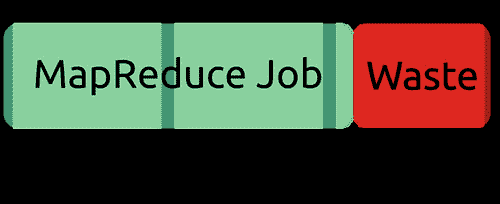
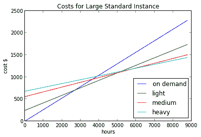
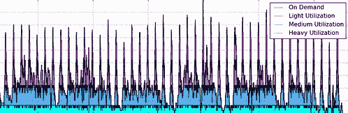

# 在 Yelp 上利用云计算-每月访问量为 1.02 亿，评论量为 3900 万

> 原文： [http://highscalability.com/blog/2013/6/26/leveraging-cloud-computing-at-yelp-102-million-monthly-visto.html](http://highscalability.com/blog/2013/6/26/leveraging-cloud-computing-at-yelp-102-million-monthly-visto.html)

*这是 Yelp 的， [Jim Blomo](https://twitter.com/jimblomo) 的来宾帖子。 Jim 管理着一个不断发展的数据挖掘团队，该团队使用 Hadoop ， mrjob 和奇数作业处理 TB 数据。 在 Yelp 之前，他为初创公司和亚马逊建立了基础架构。* *在即将举行的 [OSCON 2013 上发表演讲，内容涉及在 Yelp](http://www.oscon.com/oscon2013/public/schedule/detail/29387) 建立云文化。*

在 2013 年第一季度，Yelp 的**唯一身份访问者为[1.05 亿]** （来源：Google Analytics（分析）），其中每月平均有大约 1000 万使用 Yelp 应用程序的独特移动设备。 Yelpers 甚至 ve 撰写的内容超过 **3,900 万篇丰富的本地评论**，这使 Yelp 成为了从精品店，技工到餐厅和牙医等各个领域的领先本地指南 。 关于数据，关于 Yelp 的最独特的事情之一就是数据的多样性：评论，用户个人资料，业务描述，菜单，签到，食物照片……清单还在继续。 我们有很多处理数据的方法，但是今天我将重点介绍如何处理离线数据处理和分析。

在 2009 年底，Yelp 使用亚马逊的 Elastic MapReduce （ EMR ）作为备用计算机构建的内部集群的替代和进行了调查。 到 2010 年中，我们已经将生产处理完全转移到 EMR ，并关闭了 Hadoop 集群。 今天，我们从集成测试到广告指标，每天要处理 **500 个工作** 。 ve 在此过程中吸取了一些教训，希望对您有所帮助，因为我们 ll 。

## 工作流池

EMR 的最大优势之一是即时可伸缩性：每个作业流可以配置有任务所需的多个实例。 但是可伸缩性并不是免费的。 主要缺点是 1）分解群集可能需要 5 至 20 分钟，2）每小时需要支付**或不足一小时**的费用。 这意味着，如果您的工作在 2 小时 10 分钟内完成，则将向您收取整整三个小时的费用。

 

在您开始运行数百个作业并且作业流程结束时所浪费的时间开始累积之前，这似乎并不重要。 为了减少浪费的计费时间， mrjob 实现了“作业流池”。 mrjob 而不是在工作结束时关闭工作流，以防其他工作想要使用它，而保持工作流 ve 的状态。 如果随之而来的另一个作业具有相似的群集要求，则 mrjob wi ll 将重用作业流程。

 

实施此操作有一些微妙之处：1）具有“相似的集群要求”是什么意思，2）如何避免多个作业之间的竞争状况，以及 3）集群何时最终关闭？

定义了满足以下条件的类似工作流程：

*   相同的 Amazon Machine Image（AMI）版本
*   相同的 Hadoop 版本
*   相同的 mrjob 版本
*   相同的引导步骤（引导步骤可以设置 Hadoop 或群集选项）
*   每种节点类型具有相同或更大的 RAM 和计算单元（例如。 Hadoop 主服务器与工人）
*   接受新作业（作业流程最多可处理 256 个步骤）

通过使用锁定避免了竞争情况。 默认情况下，在支持一致性的区域（美国西部）中使用 S3 **实施锁定。 作业使用有关作业名称和群集类型的信息写入特定的 S3 密钥。 如果发生故障，锁定可能会超时，从而使其他作业或作业终止者可以收回作业流。**

作业流终止由 cron 作业处理，该作业每 5 分钟运行一次，检查是否有闲置的作业流即将达到 **每小时的费用，并终止它们** 。 这样可以确保从不共享工作流的最坏情况不会比默认情况下代价高。

为了进一步提高作业流的利用率，作业可以等待预定时间，以找到可以重用的作业流。 例如，对于开发作业， mrjobs wi ll 尝试在开始新作业之前先寻找 30 秒钟的空闲作业流。 在生产中，没有到严格期限的工作可能会将等待时间设置为几个小时。

我们估计通过使用工作流池 可以节省大约 **10％的成本。 从开发人员的角度来看到，这种节省成本几乎是免费的：通过设置一些配置设置，这些更改无需开发人员的任何操作即可生效。 实际上，我们看到了一个附带好处：迭代 ve 作业的开发速度大大加快，因为修改后的 MapReduce 作业的后续运行可以重用集群，并且消除了集群启动时间。**

## 预留实例

默认情况下， AWS 每机器小时收费，但它提供了其他一些可以降低成本的购买选项。 [预留实例](http://aws.amazon.com/ec2/reserved-instances/) 是更直接的选择之一：先付钱，再收取每小时较低的每小时费用。 在将 AWS 价格与购买服务器进行比较时，我鼓励人们研究此选项：与购买服务器的资本成本和承诺相比，这是一个更为公平的比较。

 

什么时候比保留实例便宜一些 ll ？ 这取决于实例在一年中使用多少小时。 ve 上的图显示了使用不同的 reser ve 实例定价选项运行大型标准实例的成本：轻，中或重度使用。 您可以按需支付价格，即$ 0.26 /小时，但在大约 3000 小时（4 个月）后，支付$ 243 的 Reser ve 价格会变得更加便宜，仅需为预留的临时使用量支付$ 0.17 / hour 实例。 每年使用 3000 多个小时？ 然后是时候研究增加的使用计划了，“重载”是最大的前期，但每小时计划最低。

您的公司应购买多少个预留实例？ 这取决于您的用法。 与其试图预测我们将要使用的 **wi ll** 多少，我们而是编写了一个工具来分析**过去的**使用情况并建议购买计划 **会 ve** 为我们节省最多的钱。 假设我们的未来使用率 ll 看起来与我们过去的使用情况相似，并且额外的工作和预测风险不值得相对多的支出。 ve 。 该工具的名称为 ll [EMRio](https://github.com/Yelp/EMRio) ，我们去年开放了来源。 它分析 EMR 的用法，并建议购买多少个预留实例，因为我们 ll 会生成一些漂亮的图形。

 

请务必注意，预留实例定价是一种计费方式。 也就是说，您并不是在物理上预订机器。 在月底，Amazon 仅查看您使用了多少实例小时，并将保留的实例费率应用于正在运行的任何实例，直到购买的实例数量为止。

## 得到教训

**了解迁移到云解决方案** 时的权衡。 对于 Yelp，使用 AWS 的主要好处是通过降低协调成本和功能延迟来提高开发人员的生产力。 协调成本来自要求产品团队预测和请求系统团队的资源。 购买资源（无论是服务器机架还是网络容量）可能要花费数周的时间，并增加了功能启动的延迟。 延迟有其自身的相关成本，这些成本降低了道德水平（伟大的开发商（HTG5）至运输产品）以及项目之间的上下文切换。 AWS 的美元成本可能高于完全利用的，定制的内部解决方案的成本，但是您的想法是 ve 购买了更多的生产力。

**专注于大赢家** ：可以逐步采用云技术-我们正在这样做！ Yelp 从 EMR 开始，因为这是我们最大的胜利。 离线处理具有尖峰的负载特性，通常不需要团队之间的协调，并且通过为开发人员提供实验的杠杆作用，可以使开发人员获得更高的生产率和。 为了更好地使用云，请集中精力一次解决最严重的瓶颈。

**建立在抽象** 之上：不要在 ll 上让所有人都了解云服务的细节，就像您不要在[数据中心。 记住您的权衡：目标是使开发人员的工作效率更高，而不是与流行语兼容。 如果开发人员不能像本地脚本那样轻松地使用它，那么拥有可扩展的，适应性强的或基础架构并不重要。 我们最喜欢的抽象是 [mrjob](https://github.com/Yelp/mrjob) ，它使我们可以在 Python 中编写和运行 MapReduce 作业。 在与 EMR 群集的本地计算机上运行作业是更改两个命令行参数的问题。

**建立策略和集成计划** ：旋转单个实例很容易，但是什么时候旋转机器？ 每天处理的日志很简单，但是如何可靠地将日志传输到 S3？ 已对 ll 的支持工程计划，使系统正常工作：数据集成，测试，备份，监视和警报。 Yelp 围绕 PII 制定了政策，将生产环境与开发区分开来，并使用 mrjob 软件包中的工具来监视失控的集群。

**稳定后优化** 。 有许多削减成本的方法，但是大多数方法都需要一定的复杂性和未来的灵活性。 在执行之前，请确保已使用了有效的抽象解决方案，以便评估的投资回报率。 Yelp 写了 EMRio 的数据，这是我们有 EMR 与 mrjob 结合使用的几个月的数据。 在看到我们实际使用 EMR 之前先进行优化，可能会甚至在黑暗中拍摄。

**评估 ROI** ：通过一些优化，成本评估非常简单：如果两个月前我们都保留实例，我们将节省多少？ 有些更困难：开发过程中的瓶颈是什么？云解决方案能否消除它们？ 容易或困难，但是在执行之前对其进行评估很重要。 优化之前的配置文件代码我想你是说什么？ 如果不是的话，我不希望您使用此分析器:)

## 未来发展方向

随着 Yelp 面向服务架构的发展，我们在脱机批处理中遇到了类似的瓶颈：资源协调，测试思路，在启动新功能之前预测使用情况。 因此，我们再次将目光投向了云，以为广告选择，搜索和数据提取等服务带来巨大的成功。 [期待 Yelp 工程博客上有关](http://engineeringblog.yelp.com/) [Asgard](http://netflix.github.io/asgard/) 未来的帖子用于构建和部署服务，评估 Python 框架 服务器到 RESTful API ，并构建抽象使其易于使用 ll 。 当然，如果您想帮助建立这个未来，请 [告诉我们！](http://www.yelp.com/careers)