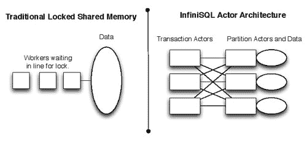

# 如何制作无限可扩展的关系数据库管理系统（RDBMS）

> 原文： [http://highscalability.com/blog/2013/11/25/how-to-make-an-infinitely-scalable-relational-database-manag.html](http://highscalability.com/blog/2013/11/25/how-to-make-an-infinitely-scalable-relational-database-manag.html)

*这是 [InfiniSQL](@infinisq) 的创始人 [Mark Travis](@infinisq) 的来宾帖子。*

InfiniSQL 是标题所指的特定“无限扩展 RDBMS”。 它是免费软件，有关其获取，构建，运行和测试的说明，请参见[指南](http://www.infinisql.org/docs/guide/)。 [基准测试](http://www.infinisql.org/blog/2013/1112/benchmarking-infinisql)显示，一个 InfiniSQL 群集每秒可以处理 500,000 个复杂事务，并具有 100,000 多个并发连接，所有这些都位于十二台小型服务器上。 测试的方法已记录在案，并且所有代码都可用，因此任何从业人员都可以取得类似的结果。 InfiniSQL 具有两个主要特征：

1.  它比任何集群/分布式 RDBMS 更好地执行在多个节点上具有记录的事务
2.  它是免费的开放源代码。 不仅仅是具有专有技术的预告片“社区”版本。 准备就绪时，InfiniSQL 的社区版本也将是企业版本。

InfiniSQL 仍处于开发的早期阶段-它已经具有许多功能，但是要使其在生产环境中有用，还需要更多的功能。

## 谁会做这种事情？

我的职业背景可以在 [LinkedIn](http://www.linkedin.com/pub/mark-travis/1/a3a/1a2) 上找到。 我已经为一些相当大的事务处理环境进行了容量规划，系统工程，性能工程等工作，其中几秒钟的停机时间使成千上万的客户损失了成本。 保姆式的环境告诉我，传统的企业数据库基础结构非常适合需要 24x7 全天候运行，持续增长并快速响应新业务需求的现代环境。 这确实是一个典型的故事-我们都知道 70 年代设计的系统无法满足当今的需求。 因此，我决定构建适合现代事务处理环境的东西。

## 目标用户/用例

我敢肯定，大多数[高可扩展性](http://highscalability.com/)的读者都会理解为什么新的数据库体系结构如此必要的原因，而且我们当中许多人也认为更快，更大的规模是自我调整的价值。 我们就像赛车手。 但是重要的是要知道用例，以帮助其他人学习如何利用我们正在构建的强大功能。 就 InfiniSQL 而言，有几种主要客户类型，每种类型都有各种特定的用例。 我将简要介绍一下客户类型，以及我如何看待 InfiniSQL 为他们解决业务问题。

*   Look no further than the example application cited in [Design Decisions For Scaling Your High Traffic Feeds](http://highscalability.com/blog/2013/10/28/design-decisions-for-scaling-your-high-traffic-feeds.html), which is a very recent entry on this site. Imagine there's no *Part Two* and *Part Three*, meaning that their original RDBMS of choice was able to perform "`select * from love where user_id in (...)`" well beyond 100M rows and 1M users. There'd be no need to design a new framework from scratch, or to rip and replace two back ends before settling on one that seems fine for the time being. InfiniSQL is capable of performing that kind of query. I haven't benchmarked that specific workload--but it's the type of thing that I designed InfiniSQL for: transactions with records distributed across multiple nodes.

    成功的 Internet 应用程序几乎不可避免地从它们启动时所使用的基础结构中发展而来。 RDBMS 通常是首选的初始数据库-但实现了变通方法，并且实现了完全不同的体系结构-所有这些都是因为原始数据库无法处理成功。 那是一个非常破坏性的过程。 InfiniSQL 适用于具有 RDBMS 工作负载但由于其原始 RDBMS 不能随业务增长而被迫实施变通方法的任何公司。 这些解决方法包括分拆 SQL 数据库以及将一些工作负载迁移到各种 NoSQL Point 解决方案。 实际上，InfiniSQL 应该成为公司开始使用的数据库，以避免将来的迁移成本。

*   InfiniSQL 的另一类目标用户包括那些在单片平台上负责每秒处理数以万计的复杂事务的应用程序的用户。 这种工作负载很难脱离大型系统架构。 这类公司包括信用卡协会，旅行预订系统和交易所。 这些不是新的业务模型。 数十年来，他们的基础设施一直在挣扎。 他们执行的每项操作都代表着（至少）两方之间的资金转移-他们转移了人们的资金。 稳定性和数据完整性是最重要的价值。 InfiniSQL 能够以预期的数量和更高的容量执行此类工作负载，但可以在运行 Linux 而不是大型的超昂贵平台的 x86_64 服务器上执行。 实际上，InfiniSQL 会进一步扩展-因为这些大型的整体平台在其扩展插槽用完的情况下会用光。

## 问题及其原因（以及几个相关问题）

（如果我能找到其他在我之前说过的夸夸其谈的声明，我会编成信誉，否则，我会接受-每个人都需要报价，对吗？我会接受。）

*问题*使多个节点全部组成一个数据库。 通过将静态 Web 服务器与数据库进行比较，可以轻松说明此问题。 通过简单地将 Web 服务器的内容镜像到不同的盒子上，然后以循环方式或其他方式向它们喷射流量，来扩展 Web 服务器很简单。 简单。 但是对于数据库而言，并不是那么简单。 取两个盒子，然后将您喜欢的数据库放在上面。 给每个相同的模式。 然后，连接到框 A 并插入一条记录-任何旧记录。 然后连接到方框 B 并查找该记录。 当然不存在！ 这就是水平扩展数据库的问题：逻辑和数据都在同一个盒子中！

### 锁定主要是坏的

传统数据库设计在性能方面的另一个问题是锁定。 为了数据完整性，每个工作程序（线程或进程）都锁定与其操作的记录关联的内存或存储区域。 这些不是高级数据锁，例如行或表锁（尽管它们也可能有问题）。 不，它们被实现为互斥或信号量。 互斥体和信号量是多线程/进程应用程序阻止其他线程/进程踩踏共享数据的方式。 随着共享内存区域的锁争用增加，性能下降。 锁定争用的一个很可能的指标是数据库速度很慢，但是有大量可用的 CPU，并且没有 I / O 瓶颈。

### I / O 慢，没有问题，它有多快

传统数据库的另一个大性能问题是事务日志瓶颈。 为了[持久性](http://en.wikipedia.org/wiki/Durability_(database_systems))，传统数据库在完成事务之前，会将包含书面记录的所有事务实时实时写入等效于日志文件的日志。 当电源关闭时，当指示灯重新点亮时，数据仍将存在。 问题在于这会减慢写入速度。 在最快的固态存储和海量 I / O 总线上使用任何经过调整的数据库。 它将成为写入事务日志的瓶颈。

## InfiniSQL 解决这些问题的方法

InfiniSQL 并不是解决某些或所有这些问题并成功实现集群 RDBMS 的唯一项目。 我敢肯定，此博客的大多数读者都知道这样的各种系统，即使它们还不是用户。 我正在描述如何解决这些问题，以及它们如何有助于 InfiniSQL 的独特优势。 其他人则以自己的方式解决了这些问题。

### 演员们

InfiniSQL 在并发编程的[参与者模型](http://en.wikipedia.org/wiki/Actor_model)上实现了一种变体。 C ++是用于创建 InfiniSQL 的主要语言，该语言本身不支持 actor 模型。 实现 InfiniSQL 的许多工作涉及使角色在 C ++中工作。 actor 模型通过将事务处理逻辑与存储断开耦合并且不锁定内存区域来解决上述前两个问题。 有关详细信息，请阅读[概述](http://www.infinisql.org/docs/overview/)。 这与传统的 RDBMS 体系结构完全不同。

角色模型解决了[问题](#0.1_theproblem)，因为处理逻辑由一组角色处理，而数据存储由另一组角色处理。 它们的功能在 InfiniSQL 中松散耦合。 无论参与者位于哪个节点，消息传递都是在参与者之间进行的：管理特定事务的参与者不知道或不在乎数据是驻留在本地还是远程。 并且管理特定数据分区的参与者响应消息，而不管其来源。 从理论上讲，参与者模型允许 InfiniSQL 无限扩展。 基于其第一字段的哈希值将每个记录分配给特定的数据区域，并且基于索引值的哈希将每个索引记录分配给一个区域。

actor 模型的另一个有益效果是它解决了低级别锁定的问题。 由于每个数据区域仅具有一个关联的参与者，因此不需要互斥或信号量来限制访问。 分区的参与者根据来自交易参与者的消息来处理对数据操作的请求。 发送方参与者无需等待（阻止）等待响应，而是可以自由地处理其他任务。 当分区的 actor 用数据响应时，发出请求的事务 actor 从中断的地方继续。 它要么完成交易并向客户端发送回复，要么与其他参与者保持互动。

下面的示例试图以图形方式说明数据库设计的传统共享内存模型与 InfiniSQL 的参与者模型之间的区别：
 
对于参与者，没有 锁定。 当需要更多处理时，将添加更多的参与者，每个参与者*大致*最佳对应于单个 CPU 线程或内核。 随着内核的添加，基于角色的体系结构可以保持很好的状态。 但是，传统的锁定共享内存模型在添加内核方面会遭受更多的痛苦-因为锁争用只会增加。 大型整体数据库具有非常复杂的锁管理方法，可以最大程度地减少此问题。

actor 模型的另一个好处是它支持大量并发。 InfiniSQL 实现角色的方式与传统角色模型略有不同，但是在保持高吞吐量的同时，它仍然可以实现很高的连接速率。 大多数传统数据库都有一个连接阈值，超过此阈值，聚合系统的性能将大大降低。 这主要与已经描述的争用有关，并且还因为每个连接的成本都很高-如果每个客户端在服务器端都需要专用的进程（或线程），则会消耗大量内存。 此外，高度多线程的应用程序会遭受过多的上下文切换。 内核调度程序始终必须使线程进入睡眠状态，复制它们的状态，然后复制并激活另一个线程。 使用 InfiniSQL，维护每个连接的成本相对较低-内核必须管理一个开放的套接字。 另外，将创建一个用于管理连接的对象。 添加了两个地图条目，以允许相关角色识别连接。 与必须启动一个新线程（更不用说进程）相比，每个连接的开销要低得多。 为了最大程度地减少上下文切换，每个参与者大致对应一个 CPU 线程，因此等待 CPU 的线程更少。

为了解决 I / O 缓慢的问题，InfiniSQL 目前已成为内存数据库，从而避免了这种情况。 与块支持的存储相比，在内存中实现起来更简单，尤其是使用 actor。 但这显然带来了一些问题。 即，耐久性和成本。 如果断电，则内存中数据库的单个副本将消失。 并且 RAM 的成本高于磁盘的成本。 [概述](http://www.infinisql.org/docs/overview/)描述了计划在开发工作中花时间解决这些问题的计划。

InfiniSQL 计划的内存持久性的关键在于强调-它是从高端存储领域借来的。 高端存储系统之所以表现出色，是因为它们将更改写入内存中，并且仅在以后将这些更改写入磁盘中。 他们可以避免这种情况，因为它们具有冗余的备用电池系统，并且每次写入都分布在多个缓存区域中。 断电或单点故障都不会导致高端存储系统中的数据丢失，这才是真正重要的。 世界上最大的交易处理平台依赖于这种存储阵列。 除了冗余和电源管理将保护数据库服务器节点本身以外，InfiniSQL 打算实现相同的模型。 这尚未完全实现，但是如果可用，将意味着 InfiniSQL 将提供持久的内存性能。

## 事务处理

事务处理的详细信息在[概述](http://www.infinisql.org/docs/overview/)中进行了描述。 我发现使用参与者实现 ACID 功能的原因是还需要实现其他技术。 即，参与者间远程过程调用（RPC）是一种在 OSI 模型和后续版本上受到宽松启发的本地协议栈。 这引入了一定程度的实现复杂性-我正在寻找重构和降低复杂性的方法。 但是所有的 ACID 特性（如上所述的耐用性除外）都可以发挥作用。

## 基于行的表，索引和类似的东西

基于参与者的核心和事务处理功能*可以与任何数量的不同类型的数据库一起使用。 基于列的简单密钥库，xml 文档库，graphdb。 任何需要扩展并从并行性中受益的事物。 但是我选择实现基于行的 RDBMS 作为 InfiniSQL 的第一个底层存储方案。 尽管有其他类型，该模型仍支持多种应用程序。 大多数备用数据组织类型都针对特定类型的工作负载进行了优化，而其他类型的组织则非常糟糕。 例如，列数据存储不适合事务处理。 除了获取/设置简单对象之外，密钥库实际上不能做任何其他事情。 关于 InfiniSQL 组织和操作数据的方式，没有什么破天荒的创新，但是底层体系结构克服了许多限制，这些限制促使采用许多备用数据库类型。*

PostgreSQL 客户端用于执行 SQL 查询，因此实际上任何平台和语言都应该能够使用 InfiniSQL。 他们已经很好地记录了[前端/后端协议](http://www.postgresql.org/docs/7.4/static/protocol.html)，因此为 InfiniSQL 实施它非常简单。 （InfiniSQL 和 PostgreSQL 是完全独立的项目。）

## 摘要

就 InfiniSQL 的介绍以及如何将其设计为无限可扩展的 RDBMS 而言，这几乎就是如此。 到目前为止，从字面上看，这是一个人在他的客厅里全天候敲出代码的工作。 请喜欢 InfiniSQL，并从中学习，如果您想谈论它，请在上述链接中找到我！ 另外，请考虑参与-它仍处于早期状态，并且正在积极寻求贡献。 它是免费的开放源代码，并且有很大的发展空间。 愿意进行此项目的 Alpha 测试的人们也很受欢迎-如果您认为 InfiniSQL 可以解决您的某些问题，请与我谈谈！

[关于黑客新闻](https://news.ycombinator.com/item?id=6795263)

*主页： [http://www.infinisql.org](http://www.infinisql.org/)
博客： [http://www.infinisql.org/blog/](http://www.infinisql.org/blog/)
IRC： [irc.freenode.net](http://irc.freenode.net/) #infinisql
Twitter：@infinisql
论坛： [https://groups.google.com/forum/#!forum/infinisql](https://groups.google.com/forum/#!forum/infinisql)*

虽然这是一个有趣的开始，但我最想知道 InfiniSQL 如何计划处理聚合功能和大表的联接。 尤其是联接是使关系数据库吸引人的原因，但是当您扩展规模时，尤其是对于复杂数据，它们也是最难的事情之一。

我很好奇，想知道 InfiniSQL 是否计划提供某种东西来比在外部进行连接（例如在 map reduce 中）或购买带有硬件的数据库设备来使更大的连接成为可能。

您的徽标与 VoltDB 有点类似：http://i.imgur.com/93x1CWJ.jpg

嗨，戈登。 对于聚合，我认为它应该相对简单：
向每个分区发送一条消息，以使其返回其自身数据集的聚合结果。 然后让交易代理收集结果，并简化为正确的答案。 地图/缩小效果如何？ ;-)我还在考虑为每个表（甚至字段）提供一个选项，以便在每个插入/更新/删除操作中更新其聚合值，以节省聚合查询的时间。

对于联接，我正在考虑让每个分区创建一个临时表，该表代表相关表中的联接值，并将这些值返回给事务代理。

在 InfiniSQL 上，某些大规模的多方联接很可能无法很好地完成工作-这很可能是只有整体数据库（或 MPP 数据仓库）才能很好地工作的领域。 我认为 InfiniSQL 至少对于现有的基于行的存储而言，并不是真正繁重，长时间运行的分析的最佳选择。 现在，对于柱状存储，可能会有不同的故事。

我还编写了大多数代码来支持子查询，但尚未对其进行完整的测试。 因此，几乎*支持子查询。

您想帮忙吗？ :-)

我真的不认为可以基于“ 12 台小型服务器”来“证明”“无限可扩展性”。 在那 12 之后再加上两个零； 如果每个服务器的数量看起来仍然相同，那将更有说服力。

如果我没记错的话，VoltDB 说了类似的话，第三方稍后显示当您达到 50 到 100 台服务器（不确定精确限制）时，数字下降了。

I don't really think that "infinite scalability" can be "proved" based on "12 small servers." Add another two zeros after that 12; if the numbers per server *still looked the same*, that would be a lot more convincing.

If I remember well, VoltDB said something similar, with third party showing later that the numbers went down when you reached 50 to 100 servers (not sure about precise limit).

------

嗨，塞巴斯蒂安。 我认为演员模型很适合扩展规模。 本质上，限制因素将是节点间通信。 我不确定随着节点的增加，效率会降低多少。 另外，诸如高性能节点间联网之类的技术将改善这一状况。 有一次，我正在研究 Infiniband 动词作为集群间通信协议，但是 TCP / IP 更容易并且无处不在。 但是我想为 InfiniSQL 实现一个选项，以使其本机使用 Infiniband 进行群集通信-我认为这对于扩展可伸缩性将大有帮助。

我不认为我们不同意-至少，到目前为止，我已经很清楚自己已经能够走多远了，我希望有机会进一步走好。 如果像 SGI 这样的人能像为 VoltDB 一样借给我无数的服务器，那就太好了。 ;-)

我也不认为我们不同意。 我只是指出“ 12 台小型服务器”。 不是那么...令人印象深刻。

我也是 Actor 模型的忠实拥护者，因为我是新的（仍然是 1.0 之前的版本）Actor API 的提交者。 但是对于许多 DB 而言，节点间的通信很快成为瓶颈，因此需要 12 个以上的节点来说明是否（或以何种大小）这种情况。

> 如果像 SGI 这样的人能像为 VoltDB 一样借给我无数的服务器，那就太好了。 ;-)

：D

>我还在考虑为每个表（甚至字段）
>提供一个选项，以便在每次插入/更新/删除时将其汇总值更新为
>，从而节省汇总时间 查询。

您是说要维护每个表的每个字段的*每个*汇总值？ 我认为这没有太大意义。 例如，您将使用以下查询做什么：
从员工那里选择 AVG（薪水）WHERE employee_name LIKE'H％';
？

或者您将如何处理用户创建的聚合函数？ 当将记录插入表中时，这些功能甚至不存在。 只要考虑一下 postgresql 的 CREATE AGGREGATE 语句。

我有一个问题，这个帖子没有答案
-根据文档，每个写入都可以同步复制。 但是，即使在内存中，同步复制也很难扩展（CAP 定理？）。 尽管该功能尚未完成，但我认为这可能是对无限可扩展性的很大限制。

你同意吗 ？

Csongor 说：

“您是说要维护每个表的每个字段的*每个*聚合值？我认为这样做没有太大意义。”

--------------

仅作为选择。 该用例适用于希望为每个插页上的列收集 AVG 的人员。 保存每个分区的滚动总条目数和条目数量会节省计算时间。 但是对于您提到的情况，不，这不是一个好主意。

主要是想表达我在 InfiniSQL 中进行聚合没有问题。

slefebvr 说：

我有一个问题，这个帖子没有答案
-根据文档，每个写入都可以同步复制。 但是，即使在内存中，同步复制也很难扩展（CAP 定理？）。 尽管该功能尚未完成，但我认为这可能是对无限可扩展性的很大限制。

Do you agree ?

---------------

不，我不同意。 我几乎完成了同步复制。 扩展并不难-尽管它会消耗一定数量的系统资源才能完成。 但是随着节点的增加，每个节点的系统资源有望保持稳定。

我看到的关于可伸缩性的唯一硬性限制是打开的可用 TCP / IP 套接字的数量-副本中的每个节点都连接到网格中的每个其他节点。 类似 UNIX 的系统不能同时处理无限数量的 TCP / IP 连接。 我认为极限是无限 10。 ;-)

塞巴斯蒂安写道：

I'm a believer in the Actor model too, as I'm a commiter to a new (still pre-1.0) Actor API. But for many DB, inter-node communication quickly becomes a bottleneck, and a lot more then 12 nodes are needed to show if (or at which size) this is the case.

---------------------

InfiniSQL 批处理节点间消息并使用 LZ4 压缩。 它牺牲了一些延迟，但是在我看来，吞吐量的增加是值得的。 同样，10GB 以太网比 1GB 更好，多个 NIC RX 队列比单个更好。 我想使用 Infiniband Verbs API（https://www.openfabrics.org/index.php）来实现 RDBMA，但是 TCP / IP 较容易编码，并且用户基础更加广泛。 但是我认为 Infiniband 可以大大减少集群内部的通信开销。

有趣的项目。

在许多情况下，您可以将聚合推送到参与者。 AVG 怎么了？ 您从每个演员返回计数和平均值，然后根据计数加权最终平均值。 感觉就像一个很简单的地图/缩小模型。

正如其他人所提到的，问题可能是节点间通信，尤其是在某些联接情况下。 我喜欢您已经认识到这一点，但是您可以将 10GB 扩展到某种上限。 我不知道我会称其为无穷大，但“高”似乎是可能的。

期待看到这片土地，尤其是当您获得 ACID 中的 D 以后，您会发现更多。

干杯!

- 八月

>如果像 SGI 这样的人像为 VoltDB 一样借给我无数的服务器，那就太好了。 ;-)

EC2 FTW :-)

FWIW，我认为正确处理节点故障和分区，最终获得一个可靠且性能良好的系统至关重要。 没有人愿意为后者牺牲前者。

第一部分是所有群集节点必须在配置上达成一致。 如果您以前从未接触过它，则可能想看看[木筏](https://ramcloud.stanford.edu/wiki/download/attachments/11370504/raft.pdf)算法作为 Multi-Paxos 的替代方法。

但是，为了确定哪些写入已传播到副本节点，还需要在某种程度上进行类似的操作。 您可以确定，每种可能的故障模式-节点消失并在事务处理周期的不同点返回-*或早或晚都会发生。