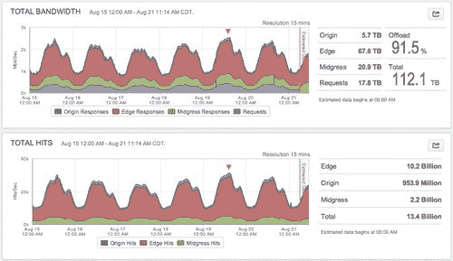
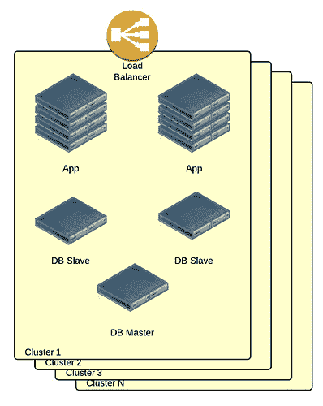
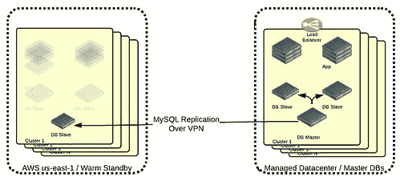
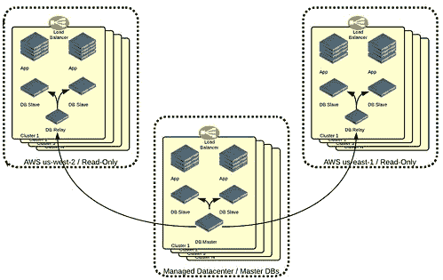
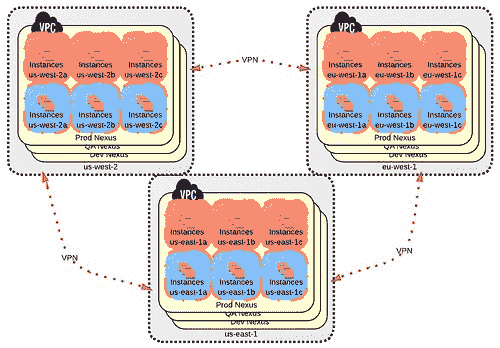
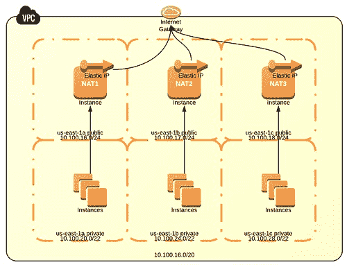
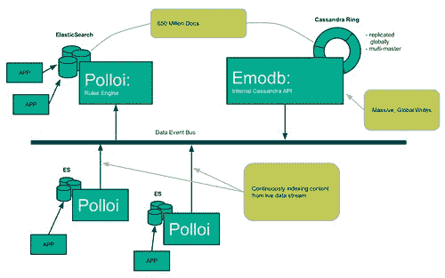
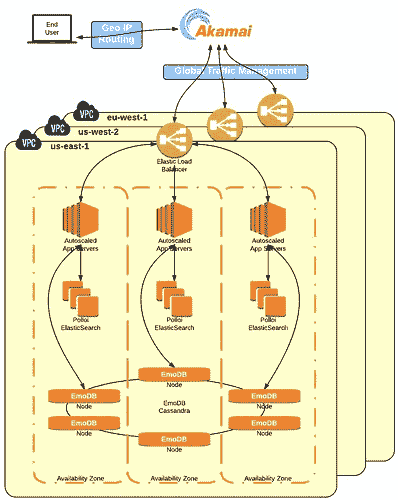

# Bazaarvoice 的架构每月发展到 500M 唯一用户

> 原文： [http://highscalability.com/blog/2013/12/2/evolution-of-bazaarvoices-architecture-to-500m-unique-users.html](http://highscalability.com/blog/2013/12/2/evolution-of-bazaarvoices-architecture-to-500m-unique-users.html)

*这是由 [Victor Trac](http://victortrac.com) ，的云架构师 [Bazaarvoice](http://www.bazaarvoice.com) 撰写的客座 。*

Bazaarvoice 是一家与人们定期进行互动但从未听说过的公司。 如果您在 bestbuy.com，nike.com 或 walmart.com 等网站上阅读了客户评论，则说明您正在使用 Bazaarvoice 服务。 这些站点以及其他数千个站点都依赖 Bazaarvoice 提供软件和技术，以收集和显示有关产品和服务的用户对话。 所有这些意味着 Bazaarvoice 会处理我们每天使用的大多数产品的很多情绪数据。

Bazaarvoice helps our clients make better products by using a combination of machine learning and natural language processing to extract useful information and user sentiments from the millions of free-text reviews that go through our platform. This data gets boiled down into reports that clients can use to improve their products and services. We are also starting to look at how to show personalized sortings of reviews that speak to what we think customers care about the most. A mother browsing for cars, for example, may prefer to read reviews about safety features as compared to a 20-something male, who might want to know about the car’s performance. As more companies use Bazaarvoice technology, consumers become more informed and make better buying decisions.

 

*红色的框由 Bazaarvoice 提供*

Bazaarvoice 已集成到全球数千个网站中。 在任何给定的月份，我们将为超过 4.75 亿的唯一身份访问者提供流量。 这些访问者将浏览，阅读和贡献我们的内容，包括从产品评论到问题&答案，甚至是我们客户产品和服务的视频等内容。 这五亿人口将在我们的平台上花费大量时间，每个月的浏览量达到数百亿。 而且由于我们在众多人流量众多的商业站点上，因此我们的可靠性和正常运行时间至关重要。 如果 Bazaarvoice 平台发生故障，我们将影响成千上万依赖我们的网站。 为了快速，可靠地完成所有这些工作，我们设计了一个高度冗余的堆栈，该堆栈主要建立在 Amazon Web Services 之上。

假期购物旺季是我们基础设施最繁忙的时间。 在“黑色星期五”和“网络星期一”，我们会看到流量非常高，从今年年底到 1 月，我们的负荷一直很高。 这就提出了一个独特的扩展挑战，因为我们必须在一年中的 3-4 个月内处理几乎两倍于正常（并且一直在增长）的流量。 今年，我们预计在假日购物旺季每秒将收到 6 万至 6.5 万次请求。

 

*假期前到我们平台的带宽和 HTTP 请求的一周视图*

## 卑微的开端

与大多数大型软件堆栈一样，我们从一个非常简单的体系结构开始。 我们最初的应用程序是使用 MySQL 作为数据存储的单个整体 Java 应用程序，所有这些程序都在托管主机环境中运行。 随着我们这些年来的成长，我们在相同的代码库上构建了其他应用程序，并增加了新功能。 我们是 Solr 的早期用户，它使我们能够将 MySQL 主要转变为键值存储。 除了 Solr，我们通过仅给 JVM 更多的 RAM 或将 MySQL 服务器放在更快的盒子上来垂直扩展。

然而，正如一位经验丰富的工程师所知道的那样，垂直缩放所带来的容易的早期收益很快变得难以实现。 因此，我们通过简单地复制整个堆栈开始水平扩展。 我们称这些为“集群”，它们使我们无需进行较大的应用程序更改即可实现水平扩展。

 

*每个群集都是具有不同数据的整个堆栈的副本。*

在 2008 年，Bazaarvoice 大约 3 岁时，我们在托管数据中心经历了一些停机时间，这使我们面临着更多冗余的挑战。 一种选择是简单地在另一个地理区域中找到另一个托管服务提供商，然后复制我们所有的服务器。 但是，由于我们使用的是 MySQL，因此我们无法轻松地跨地区使用多主机。 因此，我们最初的计划只是从主托管数据中心运行 MySQL 复制，并保持足够的容量以热备份方式在备份区域中为生产流量提供服务。 如果我们的主数据中心发生故障，我们将更新 DNS 以指向备份数据中心。 但是，这将意味着很难进行单向故障转移，因为 MySQL 从属服务器将被提升为主服务器。

为使从属数据中心在灾难中真正发挥作用，我们需要保留足够的备用容量来服务我们 100％的生产流量，从而在不增加生产能力的情况下有效地使托管成本增加一倍。

### 输入 AWS

作为当时的年轻创业公司，我们无法简单地将托管成本提高一倍。 Amazon Web Services 在一个月前（即 2008 年 10 月）刚刚从 EC2 删除了“测试版”标签，因此我们认为这可能是一个绝佳的机会，可以利用这种新型云技术在我们的备用站点上节省资金。

在 EC2 上构建冗余备份站点时，我们的策略与使用备份数据中心基本相同，除了不必为机架中准备就绪的服务器付费，我们只需要运行 MySQL 从属即可。 。 当我们需要故障转移到 EC2 时，我们可以按需启动实例。 这样做的成本只是在另一个数据中心复制整个生产堆栈的成本的一小部分。

 

*我们最初尝试使用 MySQL 从站进入 Amazon Web Services。*

幸运的是，我们无需执行故障转移计划。 但是，当我们决定要在托管数据中心和 Amazon us-east-1 地区之外提供实时流量时，我们使用 EC2 的经验使我们有足够的信心继续使用它。 我们的数据已经被复制到 us-east-1 中，因此我们只需要启动应用程序实例并在应用程序堆栈上进行一些小的工程设计即可使其适合实时请求。

AWS us-east-1 设计为只读，可与 MySQL 复制完美配合。 当最终用户向 AWS 提交新的内容时，这变得更加复杂，因为 AWS 中的 MySQL 是只读的。 我们通过编写一个基于 MQ 的提交队列解决了这个问题，该队列将写操作复制回我们的主数据中心，在此我们在 MySQL Master 上执行写操作。 在几秒钟内，更改将被复制回 AWS。 此设置运行良好，使我们能够将生产能力提高一倍，同时仍然使我们能够在必要时完全故障转移到 AWS。 不久之后，我们决定将 us-east-1 集群复制到 us-west-2，从而为我们提供了三个实时生产区域。

[  

*MySQL 从我们的托管数据中心复制到两个 AWS 区域。*

为了在两个 AWS 区域与我们的托管 DC 之间路由请求，我们采用了基于 DNS 的健康检查系统。 在 EC2，我们使用在具有 EIP 的实例上运行的 HAProxy 作为负载均衡器。 这使我们在 EC2 的每个区域的每个群集获得一个公共 IP，在我们的托管数据中心的每个群集获得一个公共 IP。 我们将这些原始 IP 添加到了我们的 DNS 服务的基于 DNS 的运行状况检查池中，该池定期向每个原始 IP 发出 HTTP 请求。 DNS 服务器会拉出所有在运行状况检查中失败的原始 IP，同时平衡到其他区域的流量。 这样做的一个附带好处是，我们可以轻松地拆除一个区域并一次滚动部署（一个区域一次），让 DNS 处理流量的转移。

多年来，随着我们获得成千上万的客户并将流量扩展到每月数十亿的页面浏览量，我们最终获得了运行在 3 个 AWS 区域和受管理数据中心的 7 个集群中的数百个应用程序服务器。 每个集群都有一个主数据库，在三个区域中都有大量的从属链。 如果沿链上的中继从机死亡，我们将必须重建所有下游从机以重置主机位置。 从操作的角度来看，这变得非常难以管理。 我们还有两个重要的写流量瓶颈：在托管数据中心运行的 MySQL 主服务器和在所有从服务器上的 MySQL 单线程复制。 当我们不得不摄取大量新数据时，奴隶通常会落后一些，有时甚至要花 10 个小时或更长时间。 我们需要重新考虑整个堆栈。

## 从干净的板岩开始

在 2011 年底，我们的堆栈正在工作，但我们希望将其提升到更高的灵活性，性能和可靠性水平。 我们想解决我们的多区域复制问题。 我们希望摆脱单个集群，以便我们可以做更多有趣的跨集群数据关系。 我们想更快地发布。 我们希望成为更多的云原生用户，以便能够利用自动扩展等 AWS 功能。 这是很大的变化，但是我们从 Amazon Web Services 获得了一个新的 CTO，他非常支持这些计划。

### 组织和技术变更

我们的整体 Java 应用程序分为一组小型服务，每个小型服务均由分散的工程团队提供支持。 这些团队负责从开发到质量检查再到运营的整个服务生命周期。 此外，工程学采用敏捷作为开发方法，以前我们是在瀑布驱动下进行的。 这些更改使我们能够从高度协调的 8-12 周发布周期转变为允许任何团队随时发布。 一些团队继续进行完整的持续集成。

在技术方面，我们决定在新堆栈中全力支持 AWS。 对于我们的记录系统，我们选择 Cassandra 是因为它具有多区域复制功能（DynamoDB 在这里失败）和云原生操作质量。 出于类似原因，ElasticSearch 取代了 Solr。

### 云工程师

我们成立了一个名为 Platform Infrastructure 的团队，负责构建 AWS 基础设施和云工具。 平台基础架构团队选择使用 CloudFormation 在 Amazon 的虚拟私有云环境中的三个区域（us-west-2，us-east-1 和 eu-west-1）中构建 AWS。 然后，平台基础架构团队构建了有用的微服务，例如内部 VPC DNS，内部监控，集中式日志记录，成本分析，甚至是受 Netflix 启发的“猴子”，以执行标签一致性实施。 由于所有内容都使用 CloudFormation，因此我们能够在几个小时内迅速为三个区域的 Dev，QA 和 Prod 环境启动相同的 VPC。 这个内部称为 Nexus 的新平台负责“繁重”的基础架构，并为应用程序团队构建服务奠定了坚实的基础。

 

*Nexus：三个 AWS 区域中跨九个 VPC 的三个环境。 来自类似环境的 VPN。*

### VPC 基础架构

除了环境标签，IP 范围（当然还有数据集）之外，每个 VPC 看起来都相同。 每个 VPC 使用一个/ 20 子网，分为三个/ 24 公共子网和三个/ 22 私有子网，每个 VPC 使用三个可用区。 我们的 CloudFormation 模板还使用自动缩放组 1 来为每个可用区配置 1 台 NAT 服务器，并设置路由，以便每个专用子网使用其自己的 NAT 服务器进行出站连接。 这允许 AZ 级别的隔离，并使 NAT 带宽增加三倍，而不是每个 VPC 使用单个 NAT 服务器。

 

*每个 VPC 使用三个可用区，每个可用区都有自己的 NAT 实例。*

我们为每个工程师提供了一个完整的 AWS IAM 帐户，使他们可以不受限制地访问 Amazon 的各种更高级别的服务，例如简单工作流程服务，Elastic MapReduce 和 Redshift。 我们选择优化工程师敏捷性而不是效率。 但是为了确保我们的成本不会完全失控，平台基础架构团队会强制执行标签一致性。 为了保持一致，每个团队必须在其所有资源中使用两个标签：team 和 VPC。 没有适当标签的任何 AWS 资源都会自动终止。 拥有一致且强制的标记的一个巨大好处是，我们能够确定每个团队的确切成本。

### 数据层

我们的数据团队提供了三项服务来处理我们的海量数据集，所有这些服务均针对开发人员的生产力和易于管理进行了优化。 为了存储通用的内容类型而不需要进行模式迁移，并且能够表达性地查询我们的数据，EmoDB 和 Polloi 诞生了。 在 Cassandra 的支持下，EmoDB 设计为使用最终一致性（AP）和多主机冲突解决方案来跨越多个数据中心。 它公开了一个非常简单的 RESTful API，允许用户创建“表”（不需要模式-仅表名和表放置），并将文档存储在这些表中。

EmoDB 仍然缺少 SQL 语义，例如 where，join，group by-基本上是除主键查找和表扫描之外的任何其他语义。 这就是 Polloi 的来历。

Polloi 将实体流索引到 ElasticSearch 集群中。 每个表的索引是根据用非常简单的域特定语言（DSL）指定给 Polloi 的规则完成的。 一旦 Polloi 根据这些用户指定的规则为数据建立了索引，我们最终将获得一个功能强大的 ElasticSearch 集群，该集群不仅可以处理主键查找。 而且由于每个 Polloi 集群都有一个自定义的规则集，所以我们有多个 Elasticsearch 集群，每个集群都针对使用它们的应用程序的需求进行了调整。 应用程序可以利用 ElasticSearch 的强大功能来对 PB 级数据进行超快速的查询响应。

ElasticSearch 仍需要与 EmoDB 保持同步，因此我们创建了数据总线以将 EmoDB 和 Polloi 结合在一起。 Databus 允许应用程序监视 EmoDB 表和文档上的更新事件，而 Polloi 侦听 Databus 上的实时更新并适当地索引数据。

 

*EmoDB，Polloi 和数据总线*

简而言之，EmoDB 提供了一种简单的方法来存储 JSON 对象，对特定应用程序很重要的 Polloi 索引字段，并且 Databus 会将数据的更改通知 Polloi 以及其他任何人。

### 应用层

随着转向面向服务的体系结构，我们的工程师不再受限于特定的技术堆栈。 服务团队可以选择最适合他们的语言和组件。 尽管大多数团队仍然选择使用 Java 来实现其服务，但 Python 和 node.js 是另外两个受欢迎的选择。

此外，团队可以自由选择 Amazon 的更高级别的服务，例如简单队列服务（SQS），简单通知服务（SNS）甚至简单工作流服务（SWF）。 现在，我们最成功的服务之一就是很大程度上基于 SWF，使 Bazaarvoice 成为亚马逊最大的 SWF 用户之一。 使用这些 AWS 服务使团队能够比以前更快地构建其服务。

### CDN & DNS

我们遗留在堆栈中的两个组件是 CDN 和基于 DNS 的全局流量管理层。 他们俩都运作良好，因此我们不认为需要为改变而做出改变。

 

*Bazaarvoice 的新堆栈的高级概述。*

## 未来

随着我们在新堆栈上增加生产工作量，我们一直在寻找改进的地方。 我们计划在应用程序部署，基于代理的异常检测方面实现更多自动化，并提高我们的运营效率。 我们还构建了一些有用的 AWS 工具，希望在不久的将来开源。

如果您对我们架构的任何方面都感兴趣，请发表评论或 [直接与我联系](http://twitter.com/victortrac) 。

很好的文章。 我很喜欢阅读您如何将可搜索性与可伸缩键值存储合并。

解释得很好，路径清楚地显示了简单应用程序如何转换为大型企业应用程序。

喜欢该架构的详细视图，并且通过视觉插图更容易理解。 写得很好

做得好！ 我希望这会不断发展！ 这非常有帮助。 很棒的博客！