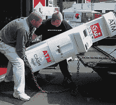

# 神话：埃里克·布鲁尔（Eric Brewer）谈银行为什么不是碱-可用性就是收入

> 原文： [http://highscalability.com/blog/2013/5/1/myth-eric-brewer-on-why-banks-are-base-not-acid-availability.html](http://highscalability.com/blog/2013/5/1/myth-eric-brewer-on-why-banks-are-base-not-acid-availability.html)

在 [NoSQL：过去，现在，未来](http://www.infoq.com/presentations/NoSQL-History) [Eric Brewer](https://twitter.com/eric_brewer) 中，关于解释 [BASE 的观念通常很难理解的部分特别细腻](http://queue.acm.org/detail.cfm?id=1394128) （基本可用，软状态，最终一致）， [酸](http://en.wikipedia.org/wiki/ACID) （原子性，一致性，隔离性，耐久性）， [CAP  （一致性可用性，分区容限），这是关于银行业一致性的神圣性的长期存在的神话。

**神话** ：金钱很重要，因此银行 必须 使用交易来保持金钱安全和一致，对吗？

**现实** ：银行交易不一致，尤其是对于 ATM 而言。 ATM 被设计为具有正常情况下的行为和分区模式的行为。 在分区模式下，可用性是通过一致性来选择的。

**为什么？** **1）**可用性与收入相关，而一致性通常不相关。 **2）**历史上从来没有完美交流的想法，所以一切都被分割了。

您的 ATM 交易必须经过，因此可用性比一致性更重要。 如果自动柜员机（ATM）处于关闭状态，那么您就无法赚钱。 如果您可以保持一致性，坚持不懈，并弥补其他错误（这种情况很少发生），那么您将获得更多的收入。 这是大多数企业发现的空间，因此 BASE 比以前更受欢迎。

对于金融业来说，这不是一个新问题。 他们从来没有保持过一致，因为历史上他们从来没有过完美的沟通。 相反，金融业依赖审计。 导致银行数据一致性的原因不是其数据库的一致性，而是所有事实都被 [写下两次，然后稍后使用](https://en.wikipedia.org/wiki/Double-entry_bookkeeping_system) 进行整理。 不可更改的记录，以后再进行核对。 对错误进行财务补偿的想法是深深植根于金融系统的想法。

在文艺复兴时期，当[现代银行系统](http://en.wikipedia.org/wiki/Luca_Pacioli)初具规模时，一切都被分割了。 如果信件（您的数据）是通过马或轮船运输的，那么您的数据可能会保持非常低的一致性，但是它们仍然拥有令人惊讶的丰富而成功的银行系统。 交易是不必要的。

例如， ATM 选择了 [交换操作](http://en.wikipedia.org/wiki/Serializability) 之类的递增和递减操作，因此操作顺序无关紧要。 它们是可重新排序的，以后可以使其保持一致。 如果 ATM 与网络断开连接，并且当分区最终恢复正常时，ATM 发送将操作列表发送到银行，并且期末余额仍然正确。 问题很明显，您可能会提取比您更多的钱，因此最终结果可能是一致的，但为负数，无法通过要求退款来弥补，因此，银行将向您奖励透支罚款。

隐藏的哲学是您试图 **约束并管理风险，** 仍然可以进行所有操作。 在 ATM 机中，这将限制您一次可以提取的最大金额。 风险不大。 自动取款机是有利可图的，因此偶尔的损失仅仅是开展业务的风险。

事实证明，这不是圣杯。 胜过一致性的是：

*   审核
*   风险管理
*   可用性

在以写可用性为关键的后互联网世界中，现实世界看起来更像*弱一致性+延迟异常+补偿*，而不是完美的沟通和交易的无错误世界。 就像过去一样，但现在您在 ACID <-> CAP 频谱上有更多选择。

## 相关文章

*   [关于 HackerNews 2](https://t.co/VMC2IA1K0I)
*   [讨论黑客新闻](https://news.ycombinator.com/item?id=5642010)
*   [Google Spanner 最令人惊讶的启示：NoSQL 出炉了，而 NewSQL 出现了](http://highscalability.com/blog/2012/9/24/google-spanners-most-surprising-revelation-nosql-is-out-and.html)

真的很有趣。 当然，课程必须实施广泛的审核功能，以弥补潜在的不一致问题，并在发现问题时尝试和纠正流程

这带来了银行认为可以接受的复杂程度，因为收益非常可观。 但是并不是每个组织或其应用程序都可以忍受这一点-因此仍然有很多地方需要保持一致性

嗨，托德，

我不确定您的所在地，但该示例在英国似乎并不成立。 我不知道实际的实现方式，但是在免费的 ATM 交易环境中，可用性似乎并不是主要问题。 自动柜员机停运并不罕见，而且，超出您的限额将导致机器拒绝为您提供所要求的现金。

尽管如此，有关换向运算的有趣观点。

干杯，
蒂姆

我不知道这是否可行，因为钱是可替代的-银行从我那里获得的 1 美元报酬与自动柜员机应支付的 1 美元没有明显的不同。

如果我使用了错误的约会资料并承诺“以后再补”，则效果不一样。 :)

蒂姆

我也在英国，并且同意 ATM 系统乍看之下在英国似乎并不那么清楚，但我相信它仍然是正确的。

我相信，使 ATM 脱机的原因是 ATM 与它用于验证卡号并快速检查卡是否被举报为欺诈性的服务之间的断开连接。 每个 ATM 提供商（实际上是银行组）似乎确实要分别运行其系统，然后再将它们一起应用。

我当然已经看过自动取款机说不能显示我的余额，但是可以提款。

如果这样的分区是为什么在周末/银行假日不进行任何交易，而您仍然可以使用您的卡，我不会感到惊讶。

另一个蒂姆

A 罐（应该）仍代表原子。 谁想要一半的交易伪装成整个交易？

我在 atm 网络上工作了多年，是的，它们都像这样工作。 今天，大多数网络都以在线模式工作。 但是协议支持脱机交易。 请记住，这些网络也支持信用卡交易（可以在授权交易后应用提示）。 脱机模式可用于支持断开连接的情况或启用可伸缩性，验证是联机的，但金融交易是分批的。 完全断开连接的可能性较小，因为必须在线检查引脚（至少直到芯片和引脚为止）。

从 atm 到后台，事务不是原子的，如果发生通信错误，则可以撤消事务。 一些自动取款机交易被标记为强制过帐，以表明已经发放了款项，即使它们违反了办公室规定（如不透支）也已得到处理。

这些细节中的一些是西方过去的遗迹，但是在非洲，南美和印度，长距离通信可能非常繁琐，因此中断的操作仍然非常重要。

尽管 Atm 交易是免费的，但信用卡交易涉及银行收费和商人收入。 当服务不可用时，也会损害声誉。 在金融危机爆发的第一年左右，有很多关于不同机构的传言。 这些机构非常担心服务中断会触发其银行挤兑。

干得好，保持下去

好的文章，内容翔实，有趣，重点突出。

Tim,

>可用性似乎并不是主要问题。 自动柜员机停运并不罕见

高不可用性率并不能证明可用性不是 OP 中规定的最高优先级。 它只是表明所讨论的网络在实现该优先级方面很差。

>超出您的限制将导致机器拒绝为您提供所要求的现金。
同样，这并不是可用性优先于一致性的禁忌。 本文的风险管理部分对此进行了介绍。

本文缺少的是认识到，在银行发布的实际财务更新包含的内容远不止简单的余额更新。 可能会有几十个表被更新，甚至更多。 所有这些工作必须是原子的。 ATM 网络具有备用功能，可以在多个级别上进行不可靠的通信或主机丢失，但是当消息到达银行时，它最终是一个很好的老式 ACID 更新。 ATM 和在线信用卡交易系统及其支持的登录，强制发布，预授权，部分和增量授权等功能，使网络变得非常可用，这仅仅是因为各机构已选择达成一项协议 彼此都很好。 银行系统不太愿意让提款部分过帐。

谢谢，不错的帖子

有趣的文章，感谢您提供信息。

真正不幸的是，信息开发人员必须受到来自 Web 开发社区的此类论点的轰炸。

经典的 ATM 示例不应该从字面上理解，而是重要交易的象征。 最容易理解的一种。

现代银行机构已经实施了风险管理以促进可用性的事实，并没有改变任何与 ACID 兼容的交易的重要性！

在我的银行存款，我每 24 小时只能提取 500 美元（风险）（保持一致的时间）。 让我们想象一下一项新法律，银行将不再采取此类措施？ 哪里有人可以拿出大笔现金？ 银行将很快从 BASE 变为 ACID！

今天的最终一致性如何？

这是关于分发帐单，以及在有人关心的情况下移动零碎的东西。

考虑到关于 ACID 的评论中的论点，我真的很想读这本书的续集。