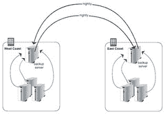
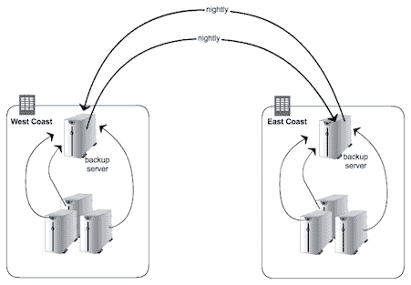
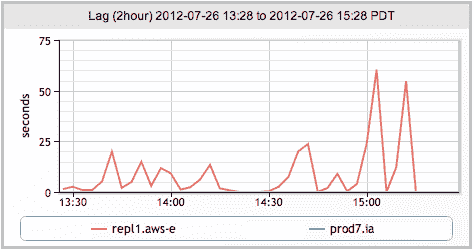
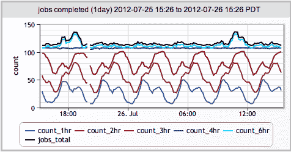

# MongoDB 和 GridFS 用于内部和内部数据中心数据复制

> 原文： [http://highscalability.com/blog/2013/1/14/mongodb-and-gridfs-for-inter-and-intra-datacenter-data-repli.html](http://highscalability.com/blog/2013/1/14/mongodb-and-gridfs-for-inter-and-intra-datacenter-data-repli.html)

 *这是 LogicMonitor 副总裁 [Jeff Behl](jbehl@logicmonitor.com) 的来宾帖子。 [在过去 20 年中，Jeff](@jeffbehl) 有点过时，他为许多基于 SaaS 的公司设计和监督基础架构。*

## 用于灾难恢复的数据复制

灾难恢复计划的必然部分是确保客户数据存在于多个位置。 对于 LogicMonitor，这是一个基于 SaaS 的物理，虚拟和云环境的监视解决方案，我们希望在数据中心内外都可以复制客户数据文件。 前者用于防止设施中的单个服务器丢失，而后者用于在数据中心完全丢失的情况下进行恢复。

## 我们在哪里：Rsync

像大多数在 Linux 环境下工作的人一样，我们使用了可信赖的朋友 rsync 来复制数据。

 

Rsync is tried, true and tested, and works well when the number of servers, the amount of data, and the number of files is not horrendous.  When any of these are no longer the case, situations arise, and when the number of rsync jobs needed increases to more than a handful, one is inevitably faced with a number of issues:

*   备份作业重叠
*   备份作业时间增加
*   过多的同时作业使服务器或网络超载
*   完成 rsync 作业后，没有简单的方法来协调所需的其他步骤
*   没有简便的方法来监视作业计数，作业统计信息并在发生故障时得到警报

Here at LogicMonitor [our philosophy](http://blog.logicmonitor.com/2012/07/17/our-philosophy-of-monitoring/) and reason for being is rooted in the belief that everything in your infrastructure needs to be monitored, so the inability to easily monitor the status of rsync jobs was particularly vexing (and no, we do not believe that emailing job status is monitoring!).  We needed to get better statistics and alerting, both in order to keep track of backup jobs, but also to be able to put some logic into the jobs themselves to prevent issues like too many running simultaneously.The obvious solution was to store this information into a database. A database repository for backup job metadata, where jobs themselves can report their status, and where other backup components can get information in order to coordinate tasks such as removing old jobs, was clearly needed.  It would also enable us to monitor backup job status via simple queries for information such as the number of jobs running (total, and on a per-server basis), the time since the last backup, the size of the backup jobs, etc., etc.   

## MongoDB 作为备份作业元数据存储

The type of backup job statistics was more than likely going to evolve over time, so MongoDB came to light with its “[schemaless](http://blog.mongodb.org/post/119945109/why-schemaless)” document store design.  It seemed the perfect fit: easy to setup, easy to query, schemaless, and a simple JSON style structure for storing job information.  As an added bonus, MongoDB replication is excellent:  it is robust and extremely easy to  implement and maintain.  Compared to MySQL, adding members to a MongoDB replica set is auto-magic.So the first idea was to keep using rsync, but track the status of jobs in MongoDB. But it was a kludge to have to wrap all sorts of reporting and querying logic in scripts surrounding rsync.  The backup job metainfo and the actual backed up files were still separate and decoupled, with the metadata in MongoDB and the backed up files residing on a disk on some system (not necessarily the same).  How nice it would be if the the data and the database were combined.  If I could query for a specific backup job, then use the same query language again for an actual backed up file and get it.  If restoring data files was just a simple query away...  [Enter GridFS](http://docs.mongodb.org/manual/applications/gridfs/).

## 为什么选择 GridFS

You can read up on the details GridFS on the MongoDB site, but suffice it to say it is a simple file system overlay on top of MongoDB (files are simply chunked up and stored in the same manner that all documents are).  Instead of having scripts surround rsync, our backup scripts store the data and the metadata at the same time and into the same place, so everything is easily queried.

当然，MongoDB 复制可与 GridFS 一起使用，这意味着备份的文件可立即在数据中心内和异地复制。 通过 Amazon EC2 内部的副本，可以拍摄快照以保留所需的尽可能多的历史备份。 现在，我们的设置如下所示：

 

优点

*   作业状态信息可通过简单查询获得
*   备份作业本身（包括文件）可以通过查询检索和删除
*   复制到异地位置实际上是立即的
*   分片可能
*   借助 EBS 卷，通过快照进行 MongoDB 备份（元数据和实际备份数据）既简单又无限
*   自动化状态监控很容易

## 通过 LogicMonitor 进行监控

LogicMonitor 认为，从物理级别到应用程序级别的基础架构的所有方面都应位于同一监视系统中：UPS，机箱温度，OS 统计信息，数据库统计信息，负载平衡器，缓存层，JMX 统计信息，磁盘 写入延迟等）。所有都应该存在，其中包括备份。 为此，LogicMonitor 不仅可以监视 MongoDB 的常规统计信息和运行状况，还可以对 MongoDB 执行任意查询。 这些查询可以查询任何内容，从登录静态信息到页面视图，再到最后一个小时内完成的（猜测是什么？）备份作业。

Now that our backups are all done via MongoDB, I  can keep track of (and more importantly, be alerted on):

*   每台服务器运行的备份作业数
*   所有服务器之间同时执行的备份数
*   任何未备份超过 6 个小时的客户门户
*   MongoDB 复制滞后

### 复制滞后

### 工作完成

您是否正在使用保险丝访问 GridFS，或者是否正在根据 API 编写所有代码？