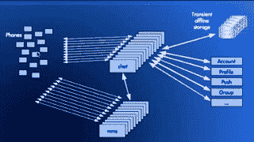

# WhatsApp 如何每秒吸引近 5 亿用户，11,000 内核和 7,000 万条消息

> 原文： [http://highscalability.com/blog/2014/3/31/how-whatsapp-grew-to-nearly-500-million-users-11000-cores-an.html](http://highscalability.com/blog/2014/3/31/how-whatsapp-grew-to-nearly-500-million-users-11000-cores-an.html)

上次[访问 WhatsApp](http://highscalability.com/blog/2014/2/26/the-whatsapp-architecture-facebook-bought-for-19-billion.html) 时，他们刚刚被 Facebook 以 190 亿美元的价格收购。 我们了解了他们的早期体系结构，该体系结构主要集中于优化 Erlang，以处理服务器上的 200 万个连接，使用 All The Phones 并通过简单性使用户满意。

两年后，流量增长了 10 倍。 WhatsApp 如何使它跃升到新的可扩展性水平？

[Rick Reed](http://www.linkedin.com/pub/rick-reed/2/186/427) 在 Erlang 工厂的一次演讲中告诉我们： [这是“十亿”，带有“ B”： WhatsApp 的下一个级别](https://www.youtube.com/watch?v=c12cYAUTXXs) （ [幻灯片](https://github.com/reedr/reedr/blob/master/slides/efsf2014-whatsapp-scaling.pdf) ），这显示了 WhatsApp 的统计数据：

> 拥有数百个节点，数千个内核，数百 TB 的 RAM 的东西，并希望为不久将在全球范围内成为现实的数十亿智能手机提供服务？ WhatsApp 上基于 Erlang / FreeBSD 的服务器基础结构。 在满足对消息传递服务不断增长的需求方面，我们面临着许多挑战，但是随着我们不断扩大服务范围（> 8000 核）和速度（>每秒 70M Erlang 消息）， 系统。

与两年前相比，最显着的变化是什么？

*   显然，除了工程师数量之外，每个维度都更大。 更多的盒子，更多的数据中心，更多的内存，更多的用户以及更多的扩展问题。 Rick 最引以为傲的是，用很少的工程师来处理这种增长水平：每个工程师 4000 万用户。 这是云计算胜利的一部分。 他们的工程师在他们的软件上工作。 网络，硬件和数据中心由其他人处理。

*   由于需要有足够的头部空间来处理每个盒子上增加的总体负载，因此他们放弃了尝试为每个盒子尽可能多地支持连接。 尽管他们通过增加大型机箱并在 SMP 机器上高效运行来降低管理开销的一般策略仍然保持不变。

*   瞬态很好。 如今，多媒体，图片，文本，语音，视频已成为其体系结构的一部分，而不必长期存储所有这些资产，极大地简化了系统。 该体系结构可以围绕吞吐量，缓存和分区展开。

*   Erlang 是它自己的世界。 听了这个谈话，很清楚您在 Erlang 的世界观中所做的一切都多少，这可能会令人迷惑。 尽管最终是一个分布式系统，所有问题都与其他任何分布式系统相同。

*   Erlang 数据库 Mnesia 似乎是造成大规模问题的重要原因。 这让我想知道是否还有其他一些数据库可能更合适，是否需要留在 Erlang 解决方案系列中是否会有点盲目呢？

*   您可能会想到很多与规模有关的问题。 不稳定的连接问题，队列太长以至于它们会延迟高优先级的操作，定时器的抖动，在一种流量级别上正常工作的代码在较高流量级别上严重中断，高负载下的高优先级消息无法得到服务，阻塞其他操作的问题 意外的方式，导致资源问题的故障等等。 无论您使用什么系统，这些事情都会发生，并且必须通过它们来解决。

*   我对 Rick 跟踪并修复问题的能力感到震惊和惊讶。 非常令人印象深刻。

瑞克总是讲好话。 他非常慷慨地提供具体细节，这些细节显然直接来自生产中遇到的问题。 这是我对他的讲话的掩饰…

## 统计信息

*   每月有 4.65 亿用户。

*   每天& 40B 中有 19B 条消息

*   600M 图片，2 亿语音，1 亿视频

*   147M 高峰并发连接-手机已连接到系统

*   230K 高峰登录/秒-电话连接和断开连接

*   342K 峰值 msgs in / sec，712K 峰值

*   大约有 10 位团队成员在 Erlang 上工作，他们既处理开发工作，又处理操作。

*   假期多媒体使用率最高。

    *   输出 146Gb / s（圣诞节前夕），电话的带宽相当大

    *   已下载 360M 视频（圣诞节偶数）

    *   已下载 2B 张图片（46k / s）（除夕）

    *   1 张图片已下载 3200 万次（除夕）

## 堆栈

*   Erlang R16B01（加上自己的补丁）

*   FreeBSD 9.2

*   Mnesia（数据库）

*   偏航

*   SoftLayer 是他们的云提供商，裸机，网络内相当隔离的双数据中心配置

## 硬件

*   〜550 个服务器+备用设备

    *   约 150 个聊天服务器（每个约 100 万个电话，1.5 亿个高峰连接）

    *   〜250 毫米（多媒体）服务器

    *   2x2690v2 Ivy Bridge 10 核（超线程总共 40 个线程）

    *   数据库节点具有 512GB 的 RAM

    *   标准计算节点具有 64GB RAM

    *   SSD 主要用于可靠性，但由于需要更多存储空间而存储视频时除外

    *   双链路 GigE x2（面向用户的公共&面向后端系统的私有）

*   > 11,000 个内核运行 Erlang 系统

## 系统概述

*   二郎的爱。

    *   很棒的语言，只用很少的工程师就能支持这么多的用户。

    *   强大的 SMP 可扩展性。 可以运行非常大的盒子并保持较低的节点数。 操作复杂性随节点数（而不是核心数）而定。

    *   可以即时更新代码。

*   可扩展性就像清除雷区。 他们通常能够在爆炸之前发现并清除问题。 测试系统的事件是世界性事件，尤其是足球，这会产生较大的垂直负载峰值。 服务器故障，通常是 RAM。 网络故障。 和不良的软件推动。

*   传统外观架构：

    *   电话（客户端）连接到聊天和 MMS（多媒体）。

    *   聊天连接到瞬时离线存储。 后端系统在用户之间传递消息时会保留它们。

    *   聊天连接到数据库，例如帐户，个人资料，推送，群组等。

*   发给手机的消息：

    *   实际短信

    *   通知：小组主题，个人资料照片更改等

    *   存在消息：键入，空闲，已连接/未连接等

*   多媒体数据库：

    *   内存中 [Mnesia 数据库](http://www.erlang.org/doc/man/mnesia.html) 使用大约 2TB 的 RAM 在 16 个分区上分片，以存储约 180 亿条记录。

    *   消息和多媒体仅在传递时存储，而在传递媒体时，有关媒体的信息存储在数据库中。

*   每台服务器的连接数为 100 万，而不是两年前的每台服务器 200 万的连接数，通常是因为服务器繁忙得多：

    *   随着更多的用户，他们希望在每台服务器上以更多的净空运行，以吸收峰值负载。

    *   用户比两年前更加活跃。 他们正在发送更多消息，因此服务器正在执行更多操作。

    *   这些服务器之外的功能已移至它们上运行，因此它们可以做更多的事情。

## 去耦

*   隔离瓶颈，使它们不会在系统中传播

    *   紧密耦合会导致级联故障。

    *   堆栈中较深的后端系统不应冒充前端。

    *   所有内容均已分区，因此，如果一个分区出现问题，其他分区将不会受到影响。

    *   解决问题时，请保持尽可能多的吞吐量。

*   异步性可最大程度地减少延迟对吞吐量的影响

    *   即使在系统中的各个点存在等待时间或等待时间无法预测时，也可以保持尽可能高的吞吐量。

    *   减少耦合，并使系统尽可能快地工作。

*   避免 [行头阻塞](http://en.wikipedia.org/wiki/Head-of-line_blocking)

    *   行头块是在队列中对第一个数据包进行处理而使在其后排队的所有那些项目饿死的地方。

    *   分离的读写队列。 特别是在表上执行事务的地方，因此，如果在写侧存在任何延迟，则不会阻塞读侧。 通常，读取端的运行速度要快得多，因此任何阻塞都会堆积读取器。

    *   单独的节点间队列。 如果某个节点或连接节点的网络出现故障，则可能会阻止应用程序中的工作。 因此，当将消息发送到不同的节点时，会将消息传递给不同的 [进程](http://www.erlang.org/doc/reference_manual/processes.html) （Erlang 中的轻量级并发），因此仅备份发往问题节点的消息。 这允许发送到健康节点的消息自由流动。 问题被隔离到问题所在。 修补的 mnesia 在 async_dirty 复制时可以很好地做到这一点。 发送消息的应用程序与发送程序是分离的，并且如果节点出现问题，则不会感到任何背压。

    *   当使用不确定的延迟时，使用“队列” FIFO 工作程序分配模型。

*   元集群

    *   请注意，本节仅在演讲开始约 29 分钟时进行，非常简短，很不幸。

    *   需要一种方法来包含单个群集的大小，并允许其跨越很长的距离。

    *   构建了 wandist，这是 gen_tcp 上类似 dist 的传输，它由需要相互通信的节点的网格组成。

    *   pg2 之上的透明路由层创建了一个单跳路由调度系统。

    *   示例：两个数据中心中的两个主要群集，两个不同数据中心中的两个多媒体群集，以及两个数据中心之间的共享全局群集。 它们之间都有广电连接。

*   示例：

    *   通过使用 async_dirty 避免进行 Mnesia 事务耦合。 大多数交易未使用。

    *   仅在从数据库取回时使用调用，否则将强制转换所有内容以保留异步操作模式。 在 Erlang 中，handle_call 会阻止响应，并且消息已排队，而 handle_cast 不会阻止，因为操作结果无关紧要。

    *   呼叫使用超时，而不是监控器。 减少远端 proc 上的竞争，并减少分发渠道上的流量。

    *   当只需要尽力而为时，请在演员表上使用 nosuspend。 如果一个节点有问题或网络有问题，这会将一个节点与下游问题隔离开，在这种情况下，分发缓冲区会在发送节点上备份，并且尝试发送的 proc 会被调度程序挂起，从而导致级联失败，每个人 正在等待，但尚未完成任何工作。

    *   使用大型分配缓冲区来吸收网络和下游节点中的问题。

## 并行化

*   工作分配：

    *   需要分配超过 11,000 个核心的工作。

    *   从单线程 [gen_server](http://www.erlang.org/doc/man/gen_server.html) 开始。 然后创建一个 gen_factory 以将工作分散到多个工作人员。

    *   在一定的负载下，调度过程本身成为了瓶颈，而不仅仅是执行时间。 繁琐的操作使许多节点进入了盒子的调度过程，过程的锁定成为分配端口和过程本身进入的瓶颈。

    *   如此创建了 gen_industry，位于 gen_factory 之上的一层，因此有多个调度过程，允许对进入包装盒的所有输入以及对工人本身的调度进行并行化。

    *   通过一个键选择工作程序进行数据库操作。 对于 IO 等不确定的延迟情况，使用 FIFO 模型分配工作量以防止行首阻塞问题。

*   分区服务：

    *   在 2 到 32 种方式之间进行分区。 大多数服务是按 32 种方式分区的。

    *   [pg2 寻址](http://erlang.org/doc/man/pg2.html) ，它们是分布式进程组，用于寻址整个群集中的分区。

    *   节点成对运行。 一个是小学，另一个是中学。 如果一个或另一个发生故障，它们将处理主要和次要流量。

    *   通常尝试将访问单个 [集合](http://www.erlang.org/doc/man/ets.html) （内置术语存储）或单个记忆缺失片段的进程数限制为 8。 锁争用在控制之下。

*   Mnesia：

    *   因为他们不使用事务来获得尽可能高的一致性，所以他们通过哈希将对单个节点上单个进程的记录的访问序列化。 哈希到一个分区，该分区映射到 [记忆缺失片段](http://www.erlang.org/doc/apps/mnesia/Mnesia_chap5.html) ，最终被分派到一个工厂，一个工人中。 因此，对单个记录的所有访问都将进入单个 erlang 进程。

    *   每个记忆缺失片段仅在一个节点上的应用程序级别被写入或读取，这使得复制流只能在一个方向上进行。

    *   当同级之间存在复制流时，片段更新的速度会遇到瓶颈。 他们修补 OTP，以使多个事务管理器仅针对 async_dirty 运行，因此记录更新并行发生，从而提供了更多的复制吞吐量。

    *   修补程序，用于将 mnesia 库目录拆分为多个库，这意味着可以将其写入多个驱动器，从而增加了磁盘的吞吐量。 真正的问题是何时从对等方加载了失忆症。 将 IO 分散在多个驱动器（甚至是 SSD）上，就数据库加载速度而言，提供了更大的可伸缩性。

    *   将记忆缺失的岛屿缩小到每个岛屿的两个节点。 岛屿是记忆障碍的群集。 即使有 32 个分区，也将有 16 个支持一个表的岛。 由于只有两个节点需要完成架构操作，因此有更好的机会在负载下支持架构操作。 如果尝试同时启动一个或两个节点，则减少了加载时间协调。

    *   通过快速警报来处理 Mnesia 中的网络分区。 他们继续运行。 然后进行手动对帐，以将它们合并在一起。

## 优化

*   离线存储系统曾经是负载高峰期间的一个大瓶颈。 只是无法将内容快速推入文件系统。

    *   用户可以快速读取大多数邮件，例如 60 秒内可以读取 50％。

    *   添加了回写缓存​​，因此可以在必须将消息写入文件系统之前将其传递。 98％的缓存命中率。

    *   如果由于负载而备份了 IO 系统，则在 IO 系统追赶时，缓存会提供额外的缓冲以全速传输消息。

*   通过将 BEAM（Erlang VM）打补丁到所有异步工作线程中的循环文件端口请求，从而解决了异步文件 IO 中的行头阻塞问题，该问题在出现大邮箱或慢速磁盘的情况下可简化写操作 。

*   将大型邮箱保留在缓存之外。 有些人处于大量群组中，每小时收到数千封邮件。 他们污染了缓存并放慢了速度。 从缓存中逐出它们。 请注意，处理不成比例的大型用户是每个系统（包括 Twitter ）的问题。

*   缓慢访问带有很多碎片的失忆表

    *   帐户表分为 512 个片段，这些片段被划分为多个孤岛，这意味着用户到这 512 个片段的稀疏映射。 大多数片段将是空的和空闲的。

    *   主机数量加倍导致吞吐量下降。 事实证明，记录访问的速度确实很慢，因为当目标为 7 时，哈希链的大小超过了 2K。

    *   发生的是散列方案导致创建了大量的空存储桶，而很少的存储桶非常长。 两行更改将性能提高了 4 比 1。

## 修补

*   争夺计时器轮。 在一台主机中有几百万个连接，并且每当特定电话发生任何事情时，每个连接都在设置和重置计时器，因此，结果是每秒成千上万个计时器设置和重置。 一个计时器轮和一个锁，这是一个重要的竞争来源。 解决方案是创建多个计时器轮以消除竞争。

*   mnesia_tm 是一个很大的选择循环，在尝试加载表时，由于选择接收，积压可能会导致无法返回的点。 修补程序将物料从传入的事务流中拉出并保存以供以后处理。

*   添加多个 mnesia_tm async_dirty 发件人。

*   为 prim_file 命令添加标记/设置。

*   有些星团横跨整个大陆，因此，健忘症应该从附近的节点而不是整个国家/地区加载。

*   为异步文件 IO 添加循环调度。

*   种子和哈希散列以破坏与 phash2 的重合。

*   优化主要/名称表的比例。

*   如果已经遗失，请不要将其遗忘在队列中。 无法完成具有待处理的转储的架构操作，因此如果排队了很多转储，则无法进行架构操作。

## 2/22 中断

*   即使所有这些工作都发生了。 它发生在最坏的时间，在 Facebook 收购之后，发生了 210 分钟的中断[。](http://techcrunch.com/2014/02/22/whatsapp-is-down-facebooks-new-acquisition-confirms/)

*   由于负载未发生。 它始于后端路由器问题。

*   路由器丢弃了 VLAN，该 VLAN 导致整个集群中大量节点断开/重新连接。 当一切重新连接时，它处于不稳定状态，他们从未见过。

*   最终决定，他们必须停止所有操作并将其恢复，这是他们多年来没有做过的事情。 花了一段时间才将所有内容放回原处并重新保存。

*   在此过程中，他们发现了一个过度耦合的子系统。 通过断开连接和重新连接，pg2 可以进入 n ^ 3 消息传递状态。 他们看到 pg2 消息队列在几秒钟内从零增加到 400 万。 推出补丁。

## 版本

*   无法模拟这种规模的流量，尤其是在高峰时段，例如午夜的新闻除夕。 如果他们尝试的是极具破坏性的措施，则推出的速度将非常缓慢。 只需要一小部分流量。 然后快速迭代，直到效果良好为止，然后部署到集群的其余部分。

*   推出是滚动升级。 一切都是多余的。 如果他们要进行 BEAM 升级，则会先安装 BEAM，然后逐步在集群中执行重新启动以获取新更改。 有时，它只是一个热补丁，无需全面重启就可以推出。 这是罕见的。 通常升级整个事情。

## 尚待解决的挑战

*   由于升级，数据库会定期刷新。 数据量太大的问题需要花费很长时间才能加载，并且由于各种原因，加载会在较大规模下失败。

*   实时集群状态&大规模控制。 旧的 shell 窗口方法不再起作用。

*   2 次幂分割。 现在有 32 个分区。 下一步是 64，这将起作用，但是 128 分区将是不切实际的。 关于这一点没有太多讨论。

对 whatapp 与其他聊天应用说微信/行比较的兴趣，是否有关于此的博客/文章/文档？

Softlayer 的路由器只是“丢弃” VLAN。

他们可以通过廉价找到的 LCD（最低公分母）人员联网的另一朵云。

检查我们。 我们可以做的更好：)

是的，乔，让我们使用您的小公司。 这并不是说 Softlayer 并不是一个存在时间更长的大型企业集团。 他们并不便宜。 他们很容易成为更高端的提供商之一。 他们知道自己在做什么。 一个问题并不大。 AWS 遇到了一些问题。

您的帖子只是展示您的天真，给您的公司起了坏名声。 我建议不要发布有关其他提供商的负面评论，以使自己看起来不错。