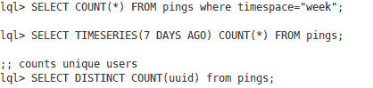
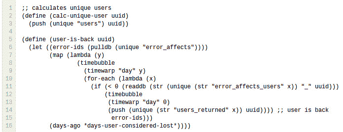
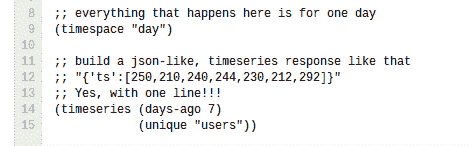

# BigData 使用 Erlang，C 和 Lisp 对抗移动数据海啸

> 原文： [http://highscalability.com/blog/2012/11/26/bigdata-using-erlang-c-and-lisp-to-fight-the-tsunami-of-mobi.html](http://highscalability.com/blog/2012/11/26/bigdata-using-erlang-c-and-lisp-to-fight-the-tsunami-of-mobi.html)

*这是 [Jon Vlachogiannis](http://www.linkedin.com/in/johnvlachoyiannis) 的来宾帖子。 Jon 是 [BugSense](http://www.bugsense.com/) 的创始人和首席技术官。*

BugSense，是一个错误报告和质量指标服务，每天跟踪数千个应用程序。 当移动应用崩溃时，BugSense 可帮助开发人员查明并解决问题。 该初创公司向其客户提供一流的服务，其中包括 VMWare，三星，Skype 和数以千计的独立应用程序开发人员。 跟踪超过 200M 的设备需要快速，容错和廉价的基础架构。

最近六个月，我们决定使用我们的 BigData 基础架构，向用户提供有关其应用性能和稳定性的指标，并让他们知道错误如何影响他们的用户群 和收入。

我们知道我们的解决方案应该从第一天开始就可以扩展，因为超过 4％的智能手机将开始使用 DDOS 向我们提供数据。

我们希望能够：

*   提取应用程序逻辑并使用 JSON 填充浏览器
*   快速运行复杂算法
*   无需专用 Hadoop 集群即可进行数据实验
*   预处理数据，然后将其存储（减少存储）
*   能够在每个节点上处理超过 1000 个并发请求
*   每个应用程序“加入”超过 1.25 亿行
*   做到这一点，而无需花费大量的服务器时间

该解决方案使用：

*   在 Azure 上运行的大型实例不到 20 个
*   内存数据库
*   一种用 C 语言编写的功能齐全的自定义 LISP 语言，用于实现查询，这比始终使 VM（带有垃圾收集器）联机的速度快很多倍
*   Erlang 用于节点之间的通信
*   修改后的 TCP_TIMEWAIT_LEN 可以惊人地减少 40K 连接，节省了 CPU，内存和 TCP 缓冲区

## 内存数据库万岁

我们知道，处理所有这些流量的唯一方法是使用内存数据库。

不仅要处理巨大的数据集上的即席问题（例如，“有多少个使用三星设备的唯一用户在一个星期内有此特定错误”）， 内存限制还与数据处理前后的数据序列化和反序列化有关。 因此，我们启动了 LDB 项目。

## LDB 项目

您是否相信可以将来自各种来源（成千上万种不同资源，如移动设备）的数据馈送到系统中，在几行代码中描述要提取的信息，然后将所有这些信息掌握在您的指尖中 ？ 实时。 系统持续运行时？
LDB 不仅是数据库，更是一个应用程序服务器。 即使是内存中数据，实际上也将数据存储在硬盘驱动器中并在其他节点之间复制。

对于 LDB，我们不会运行查询。 **我们之所以运行算法，是因为我们拥有用 C 语言编写的完整的自定义 LISP 语言，该语言可以访问与数据库**相同的地址空间。 这意味着您可以非常快速地搜索数据，增加计数器，获取/放置等。

拥有 LISP 的优点是，您可以轻松地像 Hive 这样创建类似于 SQL 的语言并实时查询数据，如下所示：

 

LDB 的工作方式如下：

每个应用都有自己的 LDB。 这意味着它自己的内存空间。 这样，我们可以轻松地将较大的应用程序（在流量方面）移动到不同的计算机上。

［HTG1］ ［HTG2］ ［HTG3］ ［HTG4］ ［HTG5］ ［HTG6］ ［HTG7］ ［HTG8］ ［HTG9］当请求来自移动设备时，主 LDB 节点接受连接（使用 erlang 线程池）并将数据转发到特定的数据库。 此请求处理机制用少于 20 行的 Erlang 代码实现。 我们选择 Erlang 进行节点间通信的另一个原因。

当请求“流式传输”到 LDB 时，名为“ process.lql”的文件负责分析，标记数据并创建任何计数器。 所有这些都是即时完成的，并可满足每个请求。

 

我们能够做到这一点，因为启动 LISP-VM 并针对每个请求执行所有这些过程仍然很多次 始终使 VM（带有垃圾回收器）联机的速度更快。

使用 LDB，我们可以使用不超过 3 行代码来创建时间序列和汇总数据。
例如。 这样会为唯一用户创建 7 天的时间序列：

 

## 备择方案

在我们的测试中，我们发现 SQL 数据库不太适合，因为我们的数据是非结构化的，并且我们需要很多复杂的“联接”（和许多索引）。 另一方面，对于 NoSQL 数据库，我们无法在数据上运行算法（在系统运行时），而使用映射器/约简器会使整个过程变得复杂而缓慢。 我们需要一个没有大锁或 DB 锁的高并发系统，该系统可以在仅几个 KB 的时间内跟踪数百万个唯一事件，并且非常容易扩展。

一个很好的替代方法是使用 Stream 数据库（例如 [Storm](http://storm-project.net/) ）。 我们的主要问题是有很多活动部件和单个节点的性能。 使用 LDB，我们的优势是能够非常快速地处理数据（它们驻留在相同的内存空间中），将它们存储为聚合计数器或符号（因此，千兆字节的数据以 KB 为单位），然后让 DSL 执行任何关联 我们要在飞行中。 没有序列化/反序列化，没有网络调用，也没有垃圾收集器。 就像将汇编代码映射到您的数据上一样。

在 LDB 之上，我们还有可以缩放和处理传入数据的接收器，一个流组件，其中的所有内容都在几行代码中定义，一个存储引擎和一个复制 发动机。

## 优化内核-TCP 的 UDP 行为

与每秒处理大量请求的其他服务相比，进行分析时的独特之处在于，移动设备与服务器之间的对话非常小（3 个 TCP 握手数据包，1 个有效负载数据包和 3 个 TCP 终止数据包 ）。

但是，TCP 在设计时并未考虑到类似问题（即设备之间的小对话框），并实现了称为 TIME_WAIT 的状态（持续时间约为 1） 分钟 （在 2.6 Linux 内核中），在该时间之后，最后一个 FIN 数据包发送之后，该特定连接元组的 TCP 状态保持打开状态一段时间，以便接收可能已延迟的任何杂散数据包（即 连接关闭）。 在我们的例子中，这有点没用（我们想要类似于 UDP 行为但具有 TCP 保证的东西），因为有效负载只有 1 个数据包（对于查看请求，最多 4 或 5 个数据包），因此我们决定修改内核源并减少 常量，此常量降至 20 英寸。结果是惊人地减少了 40K 连接，节省了 CPU，内存和 TCP 缓冲区。

我们应用的补丁在文件中：
linux-kernel-source / include / net / tcp.h

#define TCP_TIMEWAIT_LEN（[ 60 * HZ ）
至
#define TCP_TIMEWAIT_LEN（ 20 * HZ ）

使用此架构，我们可以为所有付费客户（运行少于 20 个大型实例）提供有关移动应用程序的实时分析和见解。 在 Azure 上，包括后备和备份服务器。

## 相关文章

*   [关于 HackerNews](http://news.ycombinator.com/item?id=4833052)

既然没有垃圾收集器，如何在 LISP 实现中回收内存？ 谢谢。

好贴！ 我特别喜欢 TCP 技巧。 您能否分享每天有多少事件和多少数据进入？ 另外，您要从中提供查询的内存数据集大小是多少？ 我对您正在执行的联接大小特别感兴趣。

噢亲爱的。 `tcp_tw_reuse`或`tcp_tw_recycle`有什么问题？

何俊！

我非常喜欢阅读！ 我是一位经验丰富的 Erlang 程序员，我很想阅读有关 Lisp 实际使用的更多信息。 如果您有任何有关 List 的良好介绍性文章的链接，那就太好了！

非常感谢您的精彩文章！

本文充满了不寻常的陈述和设计决策，我怀疑 BugSense 是由外星人控制的：）

有什么问题：echo“ 20” > / proc / sys / net / ipv4 / tcp_fin_timeout？ 不工作？

在每个请求上启动 LISP VM 的速度要比一直保持 VM 联机的速度快？ 好的，我明白了，Lisp VM 不能很好地完成 GC。 但是有一个 JVM 和 Clojure（Lisp 方言顺便说一句）

LISP + Erlang 的组合？ 有人非常了解 Lisp 和 Erlang :)。

嗯-而不是在服务器上浪费 TCP 时间，您难道不就让客户端在服务器之前关闭 TCP 连接吗？ 这将给客户端增加“等待时间”的负担。

我猜您的协议目前已经广泛部署，因此更改它为时已晚？

我愿意在这方面寻找另一面，但是我仍然看不到在提出了如此精美高效的体系结构之后，您选择使用 Windows Azure，这是最糟糕的此类产品（IaaS / PaaS）
。 ..我一直在烦我..这似乎引入了各种性能和财务瓶颈。 除非您对支持 Windows Phone 设备有何需求（极不可能）。 因此，我得出的结论是，您获得了免费优惠或其他优惠。请帮助我理解。

对于建议使用 tcp_tw_reuse 的人：

http://serverfault.com/questions/303652/time-wait-connections-not-being-cleaned-up-after-timeout-period-expires

tcp_fin_timeout 设置套接字在 FIN-WAIT-2 状态下花费的时间。 此参数不会影响在 TIME_WAIT 状态下花费的时间。 尝试 netstat -o 并观察处于 TIME_WAIT 状态的套接字的计时器值（选择 tcp_fin_timeout 值）。

@Sumit R：你的意思是...？ 您是否阅读了整个 serverfault 线程，特别是有关`tcp_tw_reuse`问题的答案？ 您实际上曾经使用过`tcp_tw_reuse=1`吗？

Lisp 解释器的内存处理由我们完成。 我们使用世代容器，并在每个“简短”脚本完成时回收分配的内存（对于“年轻”条目。由于系统体系结构/设计，无需收集“顽固”条目。通常，我们分为三代） 有自己的收集策略）。 因此，无需拥有成熟的垃圾收集器。

我们不使用 JVM 或任何其他托管 VM 解决方案（Clojure，F＃等），因为我们只希望每个 VM（以及特定 VM 上的语言）提供的功能的子集，并且有大量空间可以优化 满足我们自己的“特殊”需求。 此外，Scheme（Lisp）还提供了构建具有表达力的程序所需的一切，这些程序通常具有功能范式的抽象和形式/模式。

你好

真的很想知道有关 Lisp（方案）实现以及它们如何与 Erlang 一起工作的更多信息。 您是否有可能开源示例或框架的一部分？

无论如何，感谢您的文章。

此致
尼古拉斯