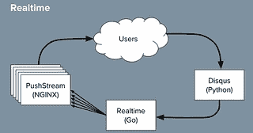

# 关于 Disqus 的更新：它仍然是实时的，但是 Go 摧毁了 Python

> 原文： [http://highscalability.com/blog/2014/5/7/update-on-disqus-its-still-about-realtime-but-go-demolishes.html](http://highscalability.com/blog/2014/5/7/update-on-disqus-its-still-about-realtime-but-go-demolishes.html)

 我们上次在 Disqus 上发表的文章： [Disqus 如何以每秒 165K 消息且小于.2 秒的延迟](http://highscalability.com/blog/2014/4/28/how-disqus-went-realtime-with-165k-messages-per-second-and-l.html)进行实时处理，虽然有些过时了，但是 Disqus 上的人们 一直在忙于实现，而不是在谈论，所以我们对他们现在在做什么并不了解，但是我们确实对 John Watson 的 [C1MM 和 NGINX](https://www.youtube.com/watch?v=yL4Q7D4ynxU) 作了简短的更新，并撰写了一篇文章 [出这个 Go 东西](http://blog.disqus.com/post/51155103801/trying-out-this-go-thing)。

因此，Disqus 增长了一些：

*   13 亿独立访客
*   100 亿页面浏览量
*   5 亿用户参与讨论
*   300 万个社区
*   2500 万条评论

他们仍然都是关于实时的，但是 Go 在其 Realtime 系统中取代了 Python：

*   原始的实时后端是用非常轻量级的 Python + gevent 编写的。
*   实时服务是 CPU 密集型任务与大量网络 IO 的混合体。 Gevent 可以毫无问题地处理网络 IO，但是在更高的竞争中，CPU 阻塞了一切。 切换到 Go 消除了该争用，这是所看到的主要问题。
*   仍可在 5 台 Nginx 机器上运行。
    *   使用 NginxPushStream，它支持 EventSource，WebSocket，Long Polling 和 Forever Iframe。
    *   所有用户都已连接到这些计算机。
    *   在正常的一天中，每台计算机看到 3200 个连接/秒，100 万个连接，150K 包/秒的 TX 和 130K 包/秒的 RX，150 mbit / s 的 TX 和 80 mbit / s 的 RC，从头到尾的< 15ms 延迟 结束（比 Javascript 渲染评论要快）
    *   一开始有很多资源枯竭的问题。 给出了 Nginx 和 OS 的配置，可帮助缓解问题，对其进行调整以应对许多连接移动少量数据的情况。
*   优先使用网络带宽。
    *   使用 10 千兆位网络接口卡很有帮助。
    *   启用 gzip 很有帮助，但是 Nginx 为 gzip 的每个连接预先分配了很多内存，但是由于注释很小，所以这太过分了。 降低 Nginx 缓冲区大小可以减少内存不足的问题。
*   随着消息速率的提高，在每秒处理 10k +消息的高峰时，计算机达到了极限，在最坏的情况下，端到端延迟达到了数秒和数分钟。
*   切换到 Go。
    *   节点未选择，因为它不能很好地处理 CPU 密集型任务。
    *   Go 不能直接访问数据库。 它消耗 RabbitMQ 的队列并发布到 Nginx 前端。
    *   没有使用 Go 框架。 这是一个很小的组件，Disqus 的其余部分仍然是 Django。
    *   之所以喜欢 Go，是因为它的性能，本机并发性以及对 Python 程序员的熟悉程度。
    *   在短短一周内就建立了替换系统，并取得了令人瞩目的成果：
        *   端到端延迟平均不到 10 毫秒。
        *   当前消耗大约 10-20％的可用 CPU。 大幅减少。
*   他们想更好地利用资源，而不是增加更多机器：
    *   对于已经完成的工作量，我们不想横向扩展更多。 向问题扔出越来越多的硬件并不总是最好的解决方案。 最后，拥有更快的产品也会产生自己的利益。

## 相关文章

*   [在黑客新闻](https://news.ycombinator.com/item?id=7711110)上/ [在 Reddit](http://www.reddit.com/r/Python/comments/2504ni/update_on_disqus_its_still_about_realtime_but_go/) 上

对评论感兴趣的是，“ Go 不能直接访问数据库。它会占用 RabbitMQ 的队列并发布到 Nginx 前端”，但是我很难想象那里到底发生了什么。 可以再充实一点吗？

理查德：链接的谈话可能是您获得更多细节的最佳选择，但我认为想法是，Disqus 的实时系统通过 RabbitMQ 获得新评论并通过 nginx 发送通知-它不具有长期状态 数据库。 因为我们实质上是在这里讨论通知系统，所以这很有意义。

我和理查德在一起。 对发生故障时会发生什么感到好奇。

因此，您用流队列替换了 Django（ORM），您的结论是 Go 的性能优于 Python？ 它甚至与编程语言有什么关系？

通常，当人们更改语言时，他们也会更改应用程序的架构

但是很难看出提速的百分比来自于语言

@Velko，不，不是这样。 通过阅读有关其先前设置的文章，了解有关哪些部分发生了变化的更多信息。

我想知道他们是否尝试过使用 pypy。 以我的经验，使用 pypy 的 Python 和 Go 一样快。

[PyPy](http://pypy.org/)

PyPy 是 Python 语言（2.7.9 和 3.2.5）的一种快速，兼容的替代实现。 它具有几个优点和独特的功能

通过阅读有关其先前设置的文章，了解有关哪些部分发生了变化的更多信息。