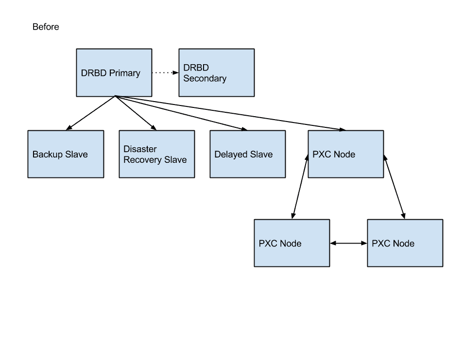
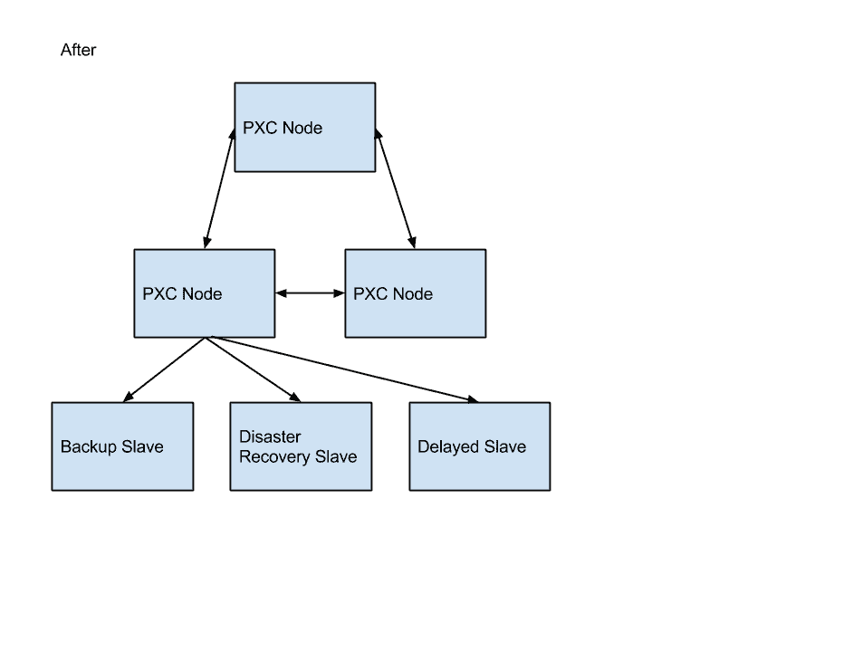

# 在 PagerDuty 迁移到 EC2 中的 XtraDB 群集

> 原文： [http://highscalability.com/blog/2014/6/16/migrating-to-xtradb-cluster-in-ec2-at-pagerduty.html](http://highscalability.com/blog/2014/6/16/migrating-to-xtradb-cluster-in-ec2-at-pagerduty.html)

*这是软件通才 [Doug Barth](https://twitter.com/dougbarth) 的来宾帖子，他目前发现自己在 [PagerDuty](https://www.pagerduty.com/) 从事运营工作。 在加入 PagerDuty 之前，他曾在芝加哥的 Signal 和在线旅游公司 Orbitz 任职。*

大约六个月前，PagerDuty 将其生产 MySQL 数据库切换为在 EC2 内部运行的 [XtraDB 群集](http://www.percona.com/software/percona-xtradb-cluster) 。 这是我们为什么以及如何进行更改的故事。

## 在之前的数据库外观

PagerDuty 的 MySQL 数据库是相当典型的部署。 我们有：

*   一对 Percona 服务器将数据写入支持 [DRBD](http://www.drbd.org/) 的卷。

*   支持 DRBD 卷的主服务器和辅助服务器的 EBS 磁盘。

*   生产数据库的两个同步副本。 （如果主服务器发生故障，我们希望能够快速切换到辅助服务器而不丢失任何数据。）

*   许多异步复制从属服务器，用于灾难恢复，备份和意外修改恢复。

## 旧设置出现问题

我们的数据库设置已经为我们服务了好几年，但是它提供的故障转移架构没有达到我们的可靠性目标。 另外，更改主机很麻烦：要从一台 DRBD 主机切换到另一台主机，我们必须在主服务器上停止 MySQL，卸载 DRBD 卷，将辅助服务器更改为主服务器状态，在该辅助服务器上安装该卷并启动 MySQL。 该设置需要停机-并且一旦 MySQL 在新服务器上启动并运行，我们就有了一个冷缓冲池，需要在应用程序性能恢复正常之前进行预热。

我们尝试使用 Percona 的 buffer-pool-restore 功能来缩短停机时间，但是我们的缓冲池太大了。 我们发现，恢复保存的缓冲池页面使用的系统资源要比缓慢处理传入请求的流量要多。

另一个问题：如果发生计划外的翻转，我们的异步奴隶将无法恢复。 我们将 binlog 存储在单独的，非 DRBD 支持的磁盘上，并禁用了 sync_binlog（由于引入了性能上的损失）。 这种设置意味着我们需要在计划外翻转之后从备份中还原异步从属服务器。

## 我们喜欢 XtraDB 群集

关于 XtraDB Cluster 的一些事情很突出。

*   不用拥有主动和被动服务器对，我们可以让 三个 实时服务器在彼此之间同步复制更改。 这将使我们能够更快地移动连接。

*   由于 XtraDB 群集是多主服务器，因此它使我们可以将流量发送到多台服务器，从而确保每台服务器始终具有暖缓冲区。 在 XtraDB 群集中，异步从属服务器可以将任何节点用作主服务器，并且可以在节点之间移动而不会破坏复制流。

*   群集的自动节点配置非常适合我们现有的自动化。 配置新节点后，我们要做的就是提供另一个节点的地址-新节点将自动接收数据集的副本（并在同步后加入集群）。

## 我们准备了什么

为 XtraDB Cluster 准备我们的应用程序确实涉及一些新的约束。 其中一些是简单的 MySQL 调整，大部分对应用程序逻辑是隐藏的，而另一些则是更基本的更改。

在 MySQL 方面：

*   我们需要确保仅使用具有主键的 InnoDB 表。

*   我们必须确保我们的应用程序不依赖于启用的查询缓存（因为集群不支持它）。

*   我们必须从基于语句的复制切换到基于行的复制。

除了这些 MySQL 配置更改（我们能够在 DRBD 服务器端隔离测试）之外，还需要更改应用程序逻辑：

*   我们需要使用分布式锁定机制，因为 MySQL 锁定（例如 SELECT FOR UPDATE 语句）对于群集节点而言是本地的。

*   因此，我们用 [Zookeeper](http://zookeeper.apache.org/) 锁替换了我们的 MySQL 锁（Zookeeper 已在该系统的其他部分中用于该目的）。

*   考虑到需要将写入集同步发送到所有节点这一事实，我们更改了进行较大更改的作业（通常是存档作业）的逻辑，以使用许多较小的事务而不是一个较大的事务。

## 我们如何处理架构变更

模式更改在 XtraDB 群集中尤其重要。 有两个选项可用于控制如何在集群中应用架构更改：总订单隔离（TOI）和滚动架构升级（RSU）。

RSU 允许您单独升级每个节点，在 DDL 语句运行时从群集中取消该节点的同步，然后重新加入群集。 但是这种方法可能会带来不稳定性-RSU 无法避免大型表上的架构更改带来的操作问题（因为它会在 DDL 语句完成之前将写集缓冲在内存中）。

相比之下， TOI 在所有 集群节点上同时对 应用模式升级，阻塞集群直到更改完成。 我们决定将 TOI 与 Percona 的在线模式更改工具（pt-online-schema-change）一起使用。 它确保任何阻塞操作都很快，因此不会阻塞群集。

## 迁移过程

建立了 XtraDB Cluster 引入的约束后，我们开始了推广过程。

首先，我们在生产中建立了一个集群，作为现有 DRBD 数据库的从属。 通过使该群集在生产环境中运行并接收所有写入流量，我们可以开始了解它在实际生产负载下的行为。 我们还设置了指标收集和仪表板来关注集群。

与此同时，我们花了一些时间对测试集群进行负载测试，以量化其相对于现有 DRBD 设置的性能。

运行这些基准测试使我们发现，必须对一些 MySQL 配置进行调整才能获得我们一直喜欢的性能水平：

*   将 innodb_flush_log_at_trx_commit 设置为 0 或 2 可获得最佳写入性能（相反，将其设置为 1，则将测试可扩展性限制为只能在我们的测试 VM 上使用 4 个线程）。 由于所有更改都被复制到 3 个节点，因此即使出现单个节点的磁盘一致性宽松的情况，我们也不会丢失任何数据。

*   需要一个大的 innodb_log_file_size 值。 我们最终为生产服务器提供了 1GB 的文件。

在让我们感到满意的是 XtraDB Cluster 能够处理我们的生产负荷之后，我们开始了将其移入生产用途的过程。

首先将所有测试环境切换到群集设置（并针对它们运行负载和故障测试）。 如果集群挂起，我们需要一种方法来快速将我们的系统重新配置为回退到单节点集群。 我们编写了该过程的脚本，并在负载下对其进行了测试。

实际上，将生产服务器移动到集群是一个多步骤的过程。 我们已经将生产集群设置为现有 DRBD 服务器的从属服务器，因此我们站起来并从属另一对 DRBD。 （这台 DRBD 服务器在那里，以防万一切换出现严重错误，我们需要退回到基于 DRBD 的解决方案，幸好我们最终不必这样做。）

然后，我们将其余的异步从属设备（灾难恢复，备份等）移到了 XtraDB 集群后面。 那些奴隶坐在 XtraDB 集群后面，我们执行了正常的奴隶升级过程，将生产流量转移到新系统。

## 实际效果：收益

经过六个多月的生产使用，我们发现在 XtraDB 群集上运行有很多好处：

*   我们已经成功执行了生产集群的滚动重启和升级，而没有停止生产流量。

*   我们已经使用 pt-online-schema-change 在生产系统上执行了模式修改。

*   我们已经优化了如何处理写冲突。 XtraDB Cluster 在遇到冲突时会返回死锁错误-即使使用 pt-online-schema-change 执行快速 DDL 语句时也是如此。 冲突导致我们的应用服务器返回 503 响应，负载平衡层将捕获该响应。 负载平衡器随后将在另一台服务器上重试该请求。

## 现实世界的表现：烦恼

在此过程中，我们还发现了一些令人沮丧的问题：

*   某些集群的关键状态计数器是有状态的，这意味着它们在运行“ SHOW GLOBAL STATUS”后重置为零。 这使得很难监视系统中的关键计数器（例如流量控制），这些计数器很少增加，但对于了解系统的行为至关重要。 （但是，此问题已在 XtraDB Cluster 5.6 使用的 Galera 3.x 中修复。）

*   ActiveRecord 的 MySQL 适配器隐藏了事务语句引发的异常，这些异常在发生写入集冲突时发生。 （此错误已在 Rails 4.1 中修复了 [。）](https://github.com/rails/rails/pull/12779)

*   我们还有很多工作要做，以解决服务器不正常的问题。 当前，我们的应用程序服务器连接到本地 HAproxy 实例，该实例将其连接转发到单个群集节点。 为了进行计划内的维护，我们在将流量完全分配给另一个群集节点之前，先将其缓慢释放到另一个群集节点以对其缓冲池进行预热。 将来，我们计划切换到完全多主机设置，以确保所有节点都具有热缓冲池。

很棒的帖子！

出于好奇，您是否发现具有 RBR 的集群提高了总体交易吞吐量？ 您有可衡量的性能提升吗？

在查看 pt-online-schema-change 时，看来基于行的复制格式可能存在一些问题，尤其是在涉及触发器时（pt-osc 用于确保将更改写入新的临时表） 。 这是您必须处理的事情吗？

http://dev.mysql.com/doc/refman/5.5/en/replication-features-triggers.html

＃1221372 如果服务器是基于行的复制中的从服务器
，则 pt-online-schema-change 应该会出错
https://bugs.launchpad.net/percona-toolkit/+bug/1221372

＃1225577 pt-online-schema-change 可以静默删除行
https://bugs.launchpad.net/percona-toolkit/+bug/1225577

对于使用 pxc 的人来说，架构更新过程是什么样的？

问候。

集群中有多少数据（大致数字）？ 我正在尝试将数据迁移到具有非常大的表的类似设置（大约 60 GB）中，并始终使用临时空间来打不同类型的障碍，并且在使用 mysqldumps 时集群不响应。 旧设置包含一个相当旧的 MySQL 版本。

香港专业教育学院

在为群集提供生产写入流量之前，我们仅对群集运行人为基准。 这些基准测试表明群集的性能与独立服务器一样，但应注意，sysbench 不会强调 RBR 与 SBR 的局限性。 （在单个事务中修改的行数很大）

因为我们的表都没有使用触发器，所以我们不需要处理任何触发器问题。 如果您在表上定义了触发器，则 pt-osc 将不起作用。 错误＃1221372 不会影响我们，因为我们总是在主服务器上运行 pt-osc。

根据操作类型的不同，我们的架构升级会有所不同。 使用 Rails 迁移运行创建/删除表。 Alter 表是使用 pt-osc 运行的，我们手动插入 Rails 迁移行以将该迁移标记为完成。

什么，

我们的数据库有几百个 GB，表的大小各不相同（几兆最大> 100 GB）。 我还没有遇到任何有关临时空间的问题。 对于 mysqldump，也许您遇到流控制问题？ 如果让 mysqldump 针对群集节点运行并且执行 FTWRL，则由于该节点无法提交挂起的写集，因此将迅速启动流控制。

如果要从群集节点提取备份，则需要处理该问题。 您可以在备份期间将节点从群集中取消同步，切换到另一个备份系统（如 xtrabackup），或使用事务进行一致的备份（仅需要 InnoDB 表）。 对于我们来说，我们有一个专用于备份的主机，它是集群的异步从机。 这样，备份过程带来的任何额外负担都不会影响我们的生产集群。

希望有帮助！

Mika,

我们正在运行一个非常相似的系统。 从 Doug 的描述中，听起来就像他们遵循了 PXC“参考体系结构”一样。 对我们来说，无论数据集大小如何，它都可以完美地工作。 一些现成的 Web 应用程序不能很好地与 PXC 配合使用，并且其中的大多数约束已在 OP 中列出。 我想在几点上进行扩展：
1-最新版本支持“更多”查询缓存，并且可以在启动配置中对其进行配置。 我们通过在 MySQL 进程启动后让操作员将 QC 大小设置为非零来解决早期的限制。
2-临时 MyISAM 表不复制。 当 DDL 指向其他表时，这将导致在其他节点上记录错误。 它还可以防止依赖临时表的应用程序扩展到单个节点之外。
3-编码不正确的应用程序可能会在群集上遇到认证错误（冲突），并且不会重试该语句。 可以将自动提交配置为对依赖它的应用程序自动重试。
InnoDB 上的 4- FULLTEXT 索引仅在 5.6 上受支持。 但是 5.6 对我来说似乎还不完全成熟-从 PXC 版本中已修复的错误数量来看。 但是至少 Percona 似乎在努力工作。

有一个仅在 5.6 中修复的 bug 击中了我们，但它本身表现为在群集的滚动更新期间 mysql 进程崩溃，因此该更新仅在零停机时间内回滚。 Percona 很快就解决了这个问题，即使我们不是付费客户，我也非常满意他们的沟通（可以为从事 PXC 工作的人员找到联系信息）。

要回答您的问题（部分是这样）：Percona 创建了一个出色的工具“ XtraBackup”，可以进行在线备份。 在体验了 XtraBackup 之后，真的没有回过 mysqldump 了。 看看，确实没有与该工具进行备份的比较。

道格，

如果使用 PHP，是否尝试在客户端主机上使用 mysqlnd_ms 而不是 HAProxy？ 关于 mysqlnd_ms 的任何评论？ 看起来很有趣，但是我不确定我是否愿意放弃客户端主机上 HAProxy 提供的稳定性，控制性和可见性。

-V

我们在一个国家/地区中确实有一个 percona Xtra 数据库集群（Master-Master -Master）设置，而我们希望在其他国家/地区中设置灾难恢复设置。请提出一种最佳的实现方法吗？ 提前致谢！