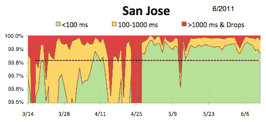
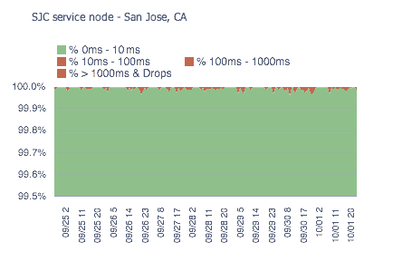

# UltraDNS 如何处理数十万个区域和数千万条记录

> 原文： [http://highscalability.com/blog/2012/10/8/how-ultradns-handles-hundreds-of-thousands-of-zones-and-tens.html](http://highscalability.com/blog/2012/10/8/how-ultradns-handles-hundreds-of-thousands-of-zones-and-tens.html)

*这是 [Neustar](http://twitter.com/jeffreydamick) 的首席软件工程师 [Jeffrey Damick](http://twitter.com/jeffreydamick) 的来宾帖子。 Jeffrey 在过去两年半的时间里，对 [UltraDNS](http://www.ultradns.com) 的软件体系结构进行了全面的复兴。*

UltraDNS 是顶级 DNS 提供商之一，为许多[顶级域（TLD）](http://en.wikipedia.org/wiki/Top-level_domain)以及[二级域（SLD）](http://en.wikipedia.org/wiki/Second-level_domain)提供服务。 这需要处理数十万个区域，每个区域包含数百万个记录。 尽管 UltraDNS 取得了全部成功，但几年前它却陷入了一片混乱，其发布计划充其量只是一个杂乱无章的事情，并且该团队仍在努力以瀑布式开发风格满足功能要求。

## 发展历程

意识到必须要做的事情，团队聚在一起，确定了首先要进攻的最重要区域。 我们从代码库入手，稳定了我们的旗舰专有 C ++ DNS 服务器，建立了通用的最佳实践和自动化。 测试是非常手工的，并且不容易重现，因此我们将质量检查工程师和开发人员紧密联系在一起，以创建和审查设计，代码和自动化测试。 他们的目标是消除交付物的可变性。 我们介绍了以下工具：

*   单元测试：gtest
*   性能测试：dnsperf（已修改）&定制 pcap 工具
*   静态分析：cppcheck
*   测试&构建自动化：Jenkins
*   任务跟踪：吉拉
*   代码评论：鱼眼和坩埚
*   通用框架：基于 Boost 的选定部分

## 环境

我们的各种部署环境（包括生产环境）是另一个需要立即关注的领域。 这些环境缺乏任何同质性。 数十种口味和版本的 Linux 被积极使用。 由于目标数量众多，没有统一性的开发非常复杂且容易出错，因此我们对 1 个发行版的 1 个版本进行了标准化。 为了获得更好的安装和相关软件包的可复制性，我们选择 puppet 来管理此任务。 我们采用了以下内容：

*   发行：RHEL（移至 Ubuntu）
*   配置管理：人偶
*   指标制图：石墨
*   监控：Nagios

## 建筑

为了保持市场竞争力，需要 DNSSEC，增强的定向答案和增强的流量服务等功能。 当前的体系结构很大程度上基于 Oracle，以至于它直接影响了我们 DNS 服务器的每秒查询（QPS）速率。

UltraDNS DNS 服务器需要有效地支持具有独特使用模式的 TLD 和 SLD。 TLD 通常包含数百万条记录，并且不经常（通常每天）更改，但是更改可能占记录的很大一部分。 SLD 是较小的区域，记录在数万至数十万之间，但变化率较高，占记录的百分比较小。

所有类型都要求尽快在全局范围内传播更改。 DNSSEC 带来了额外的麻烦，因为签名记录集以及对它们进行签名的密钥必须一起在边缘可用。 因此，我们构建了 DNSSEC 区域签名服务来满足我们对速度和扩展功能的要求。

但是我们仍然需要确保将区域的正确状态呈现给我们的 DNS 服务器并以有效的方式进行传输，因此我们用 Java 创建了专门的数据馈送服务。 我们利用 Thrift 及其基于 HTTP 的紧凑编码，使我们能够轻松地使用标准 Web 缓存进行扩展。

### 数据馈送服务：

*   数据存储：嵌入式 OrientDB
*   传输：使用码头& apache-cxf 通过类似 HTTP REST 的接口进行节俭
*   测试：Cucumber-jvm
*   静态分析：pmd，checkstyle
*   代码覆盖率：JaCoCo
*   依赖管理：常春藤

结果，我们的 DNS 服务器能够迁移到一个模型，该模型将几乎每个区域都保留在内存中，同时通过无锁管道提供数据。 这带来了显着的性能改进，从而使每个 DNS 服务器的> QPS 处理能力提高了 7 倍。

现在，我们不再依赖数据库复制，因为我们只将所需的数据传输到边缘，因此我们的数据传播更加可预测和稳定。

这两项增强功能使我们的节点数几乎增加了一倍，并改善了 DDoS 缓解措施，因为我们必须不断处理每秒每秒数十吉比特的攻击流量。

## 人

技术只是被攻击的一个方面，我们也转向使用瀑布模型中的 scrum。 这种变化花费了相当长的时间，并且在今天仍在发展，但是它已经带来了可观的收益。 另一个重要的变化是收紧我们的招聘流程，以确保我们雇用的人员符合我们的流程和技术目标。 我们从其他大公司吸取了一些教训，并完善了招聘流程，以解决候选人的技术和非技术方面的问题。 结果，我们建立了一支强大的团队，能够复兴该产品。

## 结论

路上遇到了许多坎 bump，但现在我们处于一个更好的地方，可以快速适应和调整。 现在，我们的发布时间表大约是在 sprint 快要结束时每两周发布一次，但是通常会有临时更改始终在所有时间推出。 为了跟踪自己，我们现在旨在收集所有方面的指标，包括我们的软件，硬件，网络，支持问题以及交付情况，以便我们不断改进。

## 服务可用性

*为说明我们的改进，以下是来自加利福尼亚圣何塞的单个节点内的图表*

### 稳定度：

### 最新版本（2012）：

*如果听起来有意思，我们正在[招聘](http://www.neustarlife.biz/job-openings/)！*

嗨，谢谢你的这篇非常有趣的文章！

您能否提供一些详细信息，说明为什么从 RHEL 迁移到 Ubuntu？

谢谢！！
卡尔

我们已经评估了 ubuntu 12.x 和 rhel 上较新的工具，库和内核所带来的任何性能优势，但更重要的是，这对于已经在本地计算机上运行 ubuntu 的开发人员来说更容易了。

啊，好吧，:-)

谢谢！

好的，我花了一秒钟的时间阅读了更改颜色（或颜色）编码的 b / c 图形。

非常令人印象深刻。

-XC

我想知道您还在使用 orient db 吗？

你好。
请您详细说明 OrientDB 的使用方式和性能如何？
我们目前正在研究 OrientDB。

感谢您分享。