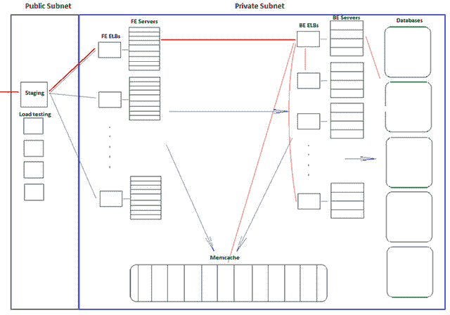
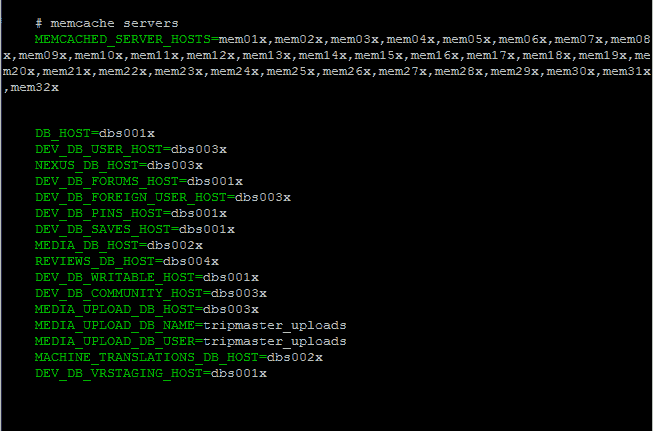
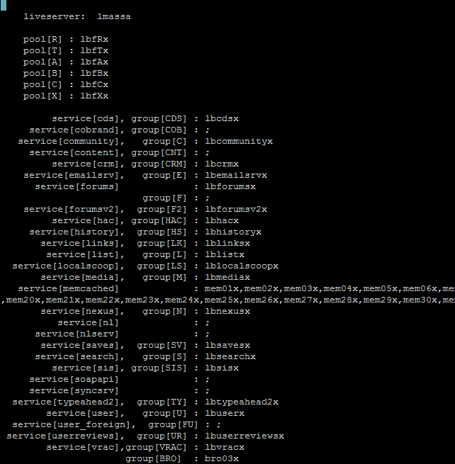
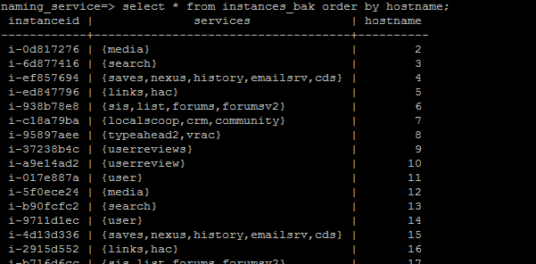
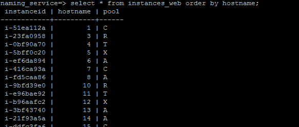
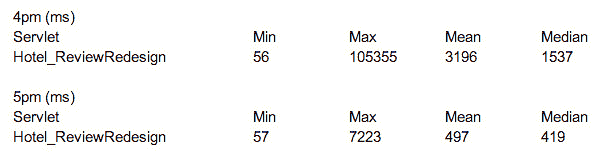
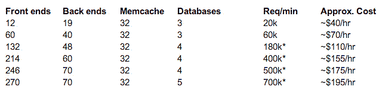
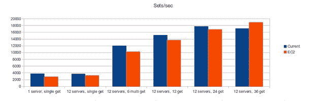
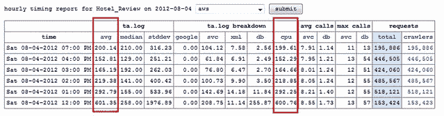
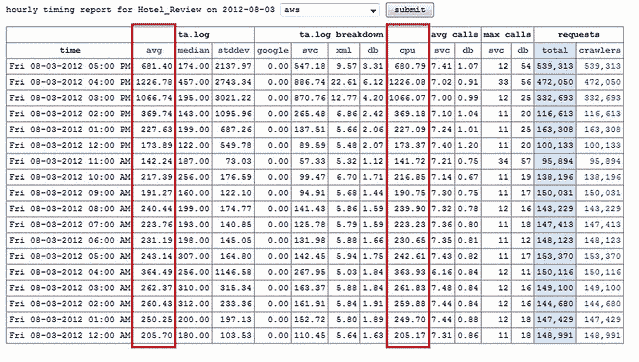

# 史诗般的 TripAdvisor 更新：为什么不在云上运行？ 盛大的实验

> 原文： [http://highscalability.com/blog/2012/10/2/an-epic-tripadvisor-update-why-not-run-on-the-cloud-the-gran.html](http://highscalability.com/blog/2012/10/2/an-epic-tripadvisor-update-why-not-run-on-the-cloud-the-gran.html)

*这是 [Shawn Hsiao](http://www.linkedin.com/in/phsiao) ， [Luke Massa](http://www.princeton.edu/rocky/people/residential-college-advis/luke-massa/) 和 [Victor Luu](http://www.linkedin.com/pub/victor-luu/57/243/91a) 的来宾帖子。 肖恩负责运行[，TripAdvisor](http://www.tripadvisor.com/) 的技术运营团队，卢克和维克托在去年夏天加入了他的团队。 该帖子由 TripAdvisor 的工程负责人 [Andy Gelfond](http://www.linkedin.com/in/andrewgelfond) 介绍。*

距离我们上一篇关于 [TripAdvisor 建筑](http://highscalability.com/blog/2011/6/27/tripadvisor-architecture-40m-visitors-200m-dynamic-page-view.html)的帖子已经过去了一年多。 这是令人兴奋的一年。 我们的业务和团队不断增长，我们现在是一家独立的上市公司，随着我们的发展，我们继续保持/扩展我们的开发流程和文化-我们仍然经营着数十个独立团队，每个团队继续在整个 整个堆栈。 唯一改变的是数字：

*   每月 5600 万访客
*   每天有 350M +页的请求
*   120TB +的仓库数据在大型 Hadoop 集群上运行，并且迅速增长

我们还有一个非常成功的大学实习计划，该计划于去年夏天招募了 60 多名实习生，所有这些人很快就入职，并且与我们的全职工程师一样从事相同的工作。

这里反复出现的一个想法是，为什么不在云上运行？ 我们的两个暑期实习生 Luke Massa 和 Victor Luu 通过在 Amazon Web Services 上部署我们网站的完整版本来认真研究这个问题。 用他们自己的话说，以及很多技术细节，这里是他们去年夏天所做的事情的故事。

## 在 AWS 上运行 TripAdvisor

今年夏天，我们在 TripAdvisor 开展了一个实验项目，以评估在亚马逊的弹性云计算（EC2）环境中运行整个生产站点的情况。 当我们第一次尝试在 EC2 环境中托管 www.tripadvisor.com 和所有国际域时，我们工程组织的许多成员的回应非常简单：当我们已经拥有自己的硬件时，真的值得向 Amazon 付钱吗？ 而且效果还可以吗？

几个月后，随着我们在云端的伟大实验即将结束，**答案当然是肯定的，**是。 在这段时间内，我们学到了很多东西，不仅是关于 AWS 的惊人好处和严重的陷阱，而且还了解了如何在我们自己的传统托管环境中改进架构。 尽管我们还没有准备好翻转 DNS 并通过 AWS 发送所有流量，但事实证明，它的灵活性是一种非常有用和实用的学习工具！

## 项目目标

*   使用 EC2 构建整个站点，并演示我们可以获取生产级流量
*   为此操作建立成本模型
*   确定有助于降低成本和提高可伸缩性的体系结构更改
*   使用此迁移到新平台可以发现我们当前架构的可能改进。  

## 建筑

我们的目标是为现场站点建立一个功能完备的镜像，以实现生产级流量。 我们将其称为“ Project 700k”，因为我们试图每分钟处理 700k HTTP 请求，并且具有与我们的实时站点相同的用户体验。 用户体验将通过请求响应时间统计信息来衡量。 经过大量的摆弄和调整，我们最终提出了以下系统架构：

**虚拟私有云**-我们所有的服务器都托管在单个 VPC 或虚拟私有云中。 这是亚马逊在单个地理区域内提供虚拟网络的方式（我们碰巧在美国东部弗吉尼亚州，但理论上我们可以在加利福尼亚州，爱尔兰等地启动一个全新的 VPC），所有实例都使用私有 IP 相互寻址 。

**子网**-在 VPC 内，我们有两个子网，为简单起见，每个子网当前位于同一可用区域中，但我们计划稍后将它们扩展以实现冗余。 第一个子网具有其安全设置，允许来自 Internet（我们称为公共子网）的传入和传出流量。 第二个私有子网，仅允许来自公共子网的流量。 Public Subnet 包含一个登台服务器，它使我们可以通过 SSH 进入私有子网，以及一组稍后将要介绍的负载均衡器。 我们所有的服务器，内存缓存和数据库都位于专用子网中。

**前端和后端服务器**-前端负责接受用户请求，处理请求，然后向用户显示请求的数据，并提供正确的 HTML，CSS 和 javascript 。 前端使用 Java 处理大多数此类处理，并且可以查询内存缓存或后端以获取其他数据。 假设服务器正确地进行了负载平衡，那么所有前端的创建方式都是相同的，并且应该承载相似的流量。

后端实例被配置为托管特定服务，例如媒体或度假租赁。 由于这种分布，一些服务器配置为执行多个较小的作业，而其他服务器配置为执行一个较大的作业。 这些服务器还可以进行内存缓存或数据库调用来执行其工作。

**负载均衡器**-为了充分利用弹性，我们使用 Amazon 的 ELB（弹性负载均衡器）来管理前端和后端服务器。 前端专门属于一个池，因此仅在一个负载平衡器下列出。 但是，后端可以执行多种服务，因此在多个负载平衡器下列出。 例如，后端可能负责搜索，论坛和社区服务，然后成为这三个负载平衡器的一部分。 之所以可行，是因为每个服务都在唯一的端口上进行通信。 所有前端服务器和后端服务器都配置为发送和接收来自负载平衡器的请求，而不是直接与其他实例进行通信。

**登台服务器**-另一个登台实例，我们称为 stage01x，用于处理进入 VPC 的请求。 它备份代码库，收集时序和错误日志，并允许 ssh 进入实例。 由于 stage01x 必须位于公共子网中，因此它会从 Amazon 那里获得一个弹性 IP，该 IP 还在早期阶段就将面向公众的负载均衡器服务于托管在其背后的 AWS 站点。 stage01x 还会维护一个 Postgresql 数据库，其中包含服务器的主机名和服务。 这在添加新实例并在其整个生命周期内进行管理方面起着至关重要的作用，我们将在后面讨论。

### VPC 站点架构图

（[原尺寸](http://farm9.staticflickr.com/8450/8044909998_04e8375ef7_o.png)）

**示例 HTTP 请求**-为了更全面地了解该体系结构，让我们逐步浏览一下互联网上的 HTTP 请求（用红线标出）。 它通过弹性 IP 在作为运行 NGinx 的公共子网中的负载平衡器的登台实例处进入 VPC。 然后，负载平衡器将流量路由到前端负载平衡器之一。 然后，ELB 重定向到它们后面的前端服务器，这些前端服务器开始处理请求。 在这里，我们有两个负载均衡级别，可以将请求分为不同的池以进行 AB 测试。

然后，前端服务器决定它需要向后端服务发出请求，该服务也由 ELB 后面的许多后端服务器运行。 后端处理该请求（可能向其他后端发出请求）或数据库服务器（其结果存储在内存缓存服务器中），然后将信息发送回前端，该信息通过负载均衡器发回 给用户。

**实例类型**-EC2 具有极好的可扩展性，因此，使用某些脚本，我们能够快速更改网络中后端服务器和前端服务器的数量。 因为所有后端和前端都在负载均衡器后面，所以没有人需要直接解决它们或知道它们是什么。

但是，数据库更难扩展，因为它们不在负载均衡器的后面。 可以预料，memcache 会根据实例数和每个实例上的 RAM 对键值绑定进行哈希处理，并假定两者都是固定的。 内存缓存的版本允许添加/删除成员资格，但是我们目前不在应用程序堆栈中使用它。 因此，memcache 的实时扩展将不是简单或有效的。

我们为前端，后端和内存缓存实例选择了 m2.xlarge（超大内存）实例，因为它们具有适当的内存量和较高的 CPU。 我们的数据库使用 cc2.8xlarge（群集计算八个额外的大实例）实例，这些实例需要极高的 iops 才能处理整个站点的空缓存而导致的冷启动。

## 这个怎么运作

**TACL** -我们的前端和后端服务器通过 TACL（TripAdvisor 配置语言）进行配置，TripAdvisor 配置语言描述了如何设置实例。 本质上，我们创建了一个“ aws.ini”文件，该文件定义了在何处发送和接收某些请求。

例如，论坛数据（DEV_DB_FORUMS_HOST）存储在 dbs001x 上，社区数据（DEV_DB_COMMUNITY_HOST）存储在 dbs003x 上。 Memcache 实例通过其主机名直接引用。 

如前所述，每个前端池和后端服务组由一个负载均衡器表示，我们分别以 lbf 或 lb 作为前缀。

每个需要 aws.ini 中信息的服务器都将其主机名添加到文件头中。 例如，这就是 web110x 的 aws.ini 文件的标题。 设置

TACL，以便服务器在配置，启动和提供服务时引用此 aws.ini 文件。 为了进行架构更改（例如添加新数据库），我们将修改并分发此 aws.ini 文件，并启动相关实例。 通过这种负载均衡器抽象，添加新的前端和后端实例非常容易，因为它们将被适当的 ELB 包含。

**Naming_service DB** -我们当前的活动站点使用托管在托管数据中心中的物理服务器。 因此，扩展或升级实例非常昂贵且耗时。 使用 Amazon EC2 的主要优势在于，我们可以廉价，快速地做到这一点，以应对流量的逐分钟变化。 为了对此进行管理，我们在 stage01x 上保留了一个存储命名数据库的数据库。

由于 EC2 实例具有相对短暂的性质，因此该数据库对于我们的运营需求至关重要。 我们偶尔会终止实例，并可能启动替换实例。 开发与此数据库一起使用的 API 可确保正确“重构”系统，例如，将旧实例从负载均衡器中删除。 当然，通过启动新实例进行扩展时，此数据库是必需的。 它为每个给定的前端和后端实例存储主机名，实例 ID 和服务。 stage01x 上的脚本用于为新启动的实例查找和分配主机名。

**定制服务器映像**-我们为前端和后端服务器创建了两个定制的 CentOS 5.7 映像。 在他们的/etc/rc.local 中，我们添加了一个脚本，该脚本负责完全配置和启动实例。 启动后，它将在 stage01x 上的命名数据库中查询其主机名和服务，将其添加到适当的负载均衡器中，然后对其进行配置和反弹。 “反弹”是指启动或重新启动需要在服务器上运行的应用程序的过程。

我们对这种模块化的启动感到特别兴奋，因为它使测试后端服务更加容易。 从事度假租赁服务的团队可以在 EC2 上启动一个度假租赁实例，并专门在不影响整个测试环境的情况下工作，而不是在一个开发人员的工作站上启动和启动整个网站。

**时间和错误日志**-我们的前端服务器在接收和处理请求时生成日志。 使用 stage01x 和某些 ssh 隧道传输，我们可以远程压缩这些日志文件，并将它们发送回本地工作站进行分析。

## 一路走来的问题

**停电**-2012 年 6 月 15 日，EC2 美东地区发生故障，我们失去了生产力。 2012 年 6 月 29 日，EC2 US-East 发生故障，我们丢失了一些实例。 Amazon 确实提供了可用区（相隔 20 或 30 英里）以实现冗余，因此这会稍微减轻影响。 但是，总的来说，亚马逊可能会以其数据一致性而不是数据可用性而闻名。

**磁盘空间不足**-如上所述，我们的服务器生成计时，错误和许多其他类型的日志。 在测试的早期阶段，我们的日志（尤其是错误日志）将快速增长，并占用数 GB 的磁盘空间。 我们决定利用 m2.xlarge 的 420GB 临时存储空间。 之前，我们完全避免使用临时存储，因为它是临时存储（重新启动后数据不会持续存在）。 但是，这对于存储日志很好。 Cronjobs 每小时都会将日志发送到本地工作站，因此我们仍然能够收集和备份重要数据。

**实例不可用**-我们尝试在 us-east-1b 中使用新的 SSD hi1.4xlarge 实例，但这些实例通常在高峰时段不可用。 我们的 Amazon 联系人告诉我们，由于需求旺盛，这些实例确实不可用。 我们在 us-east-1d 中遇到了类似的问题，其中我们未能启动 m1.xlarge 实例。 这提醒我们，EC2 尚不具有无限的服务规模，因此需要在操作模型中建立实例类型及其数量的必需储备。

作为附带说明，每个 Amazon AWS 帐户均以 20 个实例上限开始，随着我们的实验的进行，我们需要与我们的 Amazon 联系人合作以将限制增加到 60 个实例，然后增加到 600 个。 我们的 ELB 遇到了类似的限制。 同样，我们的联系很快就使我们获得了批准，从而使我们可以使用 20-30 个负载均衡器。

**未充分利用的，配置错误的数据库**-简而言之，我们发现我们需要对 postgresql 数据库（位于 cc2.8xlarge 实例中）进行其他修改，以使其在 EC2 环境中正常工作。 下面列出了其中一些。 这些变化帮助我们了解了自己的环境与亚马逊环境相比的工作方式。

*   enable_hashjoin = off（最初为 on）
*   enable_mergejoin =关（开）
*   shared_buffers = 4GB（8GB）
*   Effective_cache_size = 48GB（16GB）

**丢失的数据**-EC2 通过 EBS 卷为数据存储提供了很好的抽象级别。 为了扩展数据库实例的存储，我们只需为每个数据库实例创建 1 TB EBS 卷，将其附加到实例上，然后使用``mkfs''和``mount''Unix 命令将其装入。

使用 EBS 卷时，我们遇到了一些问题。 当我们将一个 EBS 卷重新装载到另一个实例时，在将一个 EBS 卷转移到另一个实例时，云以某种方式删除了所有还原的成员数据，我们不得不花半天的时间在该实例上还原数据库。 此外，在尝试使用“ tunefs”和“ resize2fs”之类的命令从快照调整 EBS 卷大小时，我们遇到了问题。 使用这些调整大小的卷的实例在一天后遇到实例可达性错误，我们不得不运行“ e2fsck”几个小时来清理它们。

当然，我们在安装和调整大小过程中可能犯了一些严重的错误，因此不必过分担心 EC2 的这种行为。 我们发现，一般来说，AMI 和 EBS 快照的可用性有助于我们快速启动新的数据库实例。 例如，如果我们想将 dbs001x 上的数据分成两台机器，则只需创建 dbs001x 的映像，从中启动一个新实例，然后适当地重定向流量。 显然，此功能仅限于只读数据库，创建 1 TB 设备的映像通常是一夜之间的工作。 我们仍在寻找提高数据库冗余性和可伸缩性的其他方法。 我们当前的实时站点使用心跳和 DRDB 进行恢复，并且希望了解如何将其应用于 EC2。

**不相等的实例**-一方面，我们尝试对前端和后端服务器的 CPU 性能进行基准测试，所有这些服务器的大小均为 m2.xlarge。 我们使用命令 bc 设置了一个简单的数学运算 2 ^ 2 ^ 20 的时间，发现该时间分为两组，具有统计意义。 我们在测试的实例上运行 cpuid，更快的组在双 2.40 GHz 处理器上运行，而较慢的组在双 2.66 GHz 处理器上运行。 尽管这不是我们网站功能的主要问题，但它使确定我们可以使用的计算能力变得更加困难。

另外，即使我们的前端计算机都具有相同的大小和相同的 AMI，大约 10％的前端计算机也无法正常弹跳。 同样，这可能是我们配置而不是 Amazon 的无法预料的问题。

**负数时间**-通常情况下，低俗的时间值得庆祝。 但是，当我们分析一些最近的计时日志时，我们发现某些最小服务呼叫时间为负数。 这些计时统计信息是通过调用 Java.currentTimeMillis（）来计算的。 我们仍在对此进行调查，并且有兴趣尝试通过一个简单的 Java 应用程序来复制问题。

**窃取周期**-运行 m2.xlarge 实例时，我们预期窃取周期为 1％或 2％。 但是，当前端处于负载状态时，我们在一两分钟内会遇到高达 7-8％的抖动。 我们的 Amazon 联系人告诉我们，这仅仅是由于每个实例的负载。

另外，我们在 m1.small 实例上进行了实验，并通过数学计算接管了它的 CPU 使用率。 跑马场表明，其中 98％用于数学计算，另有 2％被盗。 但是，在 Amazon 的监视服务 Cloudwatch 上，该实例似乎以 98％的 CPU 利用率运行，而不是 100％的全部利用率。 这可能会导致较大的窃用周期问题，因为无法确定某个实例是否由于窃用周期而被用完，或者是否“未充分利用”。 通常，我们希望看到更多有关 CPU 性能的保证。

**组播**-不支持。 我们使用 JGroups，这取决于它的工作。 有人告诉我们使用 vCider 或 vpncubed 来模拟多播。 vCider 要求我们升级到 CentOS 6，并且 vpncubed 的安装时间很长。 在我们的优先级列表中，该级别较低，但是我们将来希望进一步探索这些选项。

**ELB 延迟**-尽管我们将所有后端置于特定负载均衡器之后的体系结构对于 50-60k reqs / min 以下的流量非常有效，但我们发现 ELB 大大降低了我们的后端响应时间，尤其是对于 二手服务。 为了测试这一点，我们让一个前端直接将流量发送到后端，而不是通过 ELB。 我们在下午 4:50 左右更改了此设置，使负载测试流量保持不变，并发现服务时间显着减少。

我们的亚马逊联系人告诉我们，ELB 可能需要预热。 我们怀疑负载平衡器也是云平台，默认情况下可能是小型实例。 预热可能只是将这个给定平台升级为可以处理更高流量负载的平台的问题。

## 负载测试

该网站的原始设置存在一些问题。 我们无法在前端使用 Amazon 的 ELB，因为我们的前端实例隐藏在私有 VPC 中。 我们发现有些公司通过将前端实例保留在公共 EC2 网络中来解决此问题，但是这种架构会使我们的 VPC 设置无效。

我们使用了另一位工程师先前开发的负载测试系统，该系统获取了真实现场流量的存档日志，并以一定的请求数/分钟发送。 最初，我们将此流量定向到 stage01x 实例。 但是，到我们达到 20k reqs / min 时，很明显我们需要专用的实例来处理流量。 我们将这些实例命名为 lod01x 至 lod04x ，这些实例负责将 HTTP 通信发送到六个前端 ELB。

**VPC 带宽问题**-在测试的早期阶段，我们在 VPC 之外的实例将流量发送到 VPC。 但是，我们发现，无论我们如何扩展站点，负载测试的上限均为每分钟 5 万请求。 平均页面大小为 18KB，看来 VPC 仅接受 100Mbps 的流量。 我们的 Amazon 联系人向我们保证没有此限制，但是为了确保所有负载测试都保留在 VPC 中。

**NGinx 问题**-在我们的早期阶段，我们还为每个 lod 实例安装了 NGinx 负载平衡器。 但是，后来发现这成为我们测试的瓶颈，因为小型实例无法处理这么多的“打开文件”。 我们将其抓取，然后将流量直接发送到负载均衡器，而没有初始的 NGinx 负载均衡。

这是我们网站的配置，最高可达 70 万请求/分钟。 在提高请求率的过程中，我们无法保持相同的用户体验。 请求响应统计随着请求率的提高而恶化，我们将在后面详细讨论。

**现场比较**-我们的现场有 80 个前端和 52 个后端，每个都有 24 个核心。 总共增加了 3168 个内核。 在我们的最高 AWS 配置下，每个 270 个前端和 70 个后端分别具有 2 个核心，我们只有 680 个核心。 这导致了后端垃圾回收的问题，我们将在后面讨论。

我们的 Amazon 内存缓存的运行情况相当不错。 我们通过 libmemcached-tools 附带的 memslap 实用程序进行了基准测试，发现使用 12 个中等的物理服务器，我们最初的 12 个 Amazon memcache 实例的性能大约是我们 Memcache 集群容量的 80-90％。

## 时间和错误编号

每个前端服务器都会自动记录发送和接收的每个请求的计时数据。 压缩后每小时发送一次到“伐木工人”服务器，在其中计算基本统计信息，并将请求时间细分为各个部分，例如 google，数据库和 xml 调用。 在评估站点性能时，我们主要关注平均总时间和 cpu 时间。

（[原尺寸](http://farm9.staticflickr.com/8320/8044985089_c26e7e7a98_o.png)）

[
（](http://farm9.staticflickr.com/8320/8044985089_c26e7e7a98_o.png) [全尺寸](http://farm9.staticflickr.com/8310/8044991710_8b0bdfcd23_o.png)）

这两个图表显示了我们从 20k reqs / min 扩展到 60k reqs / min 时，Hotel Reviews Servlet 的时间统计信息（并非所有请求都与酒店评论有关）。 根据数据，向上扩展发生在星期五的 3-4pm 之间，直到 5pm 才稳定下来。 我们关闭了网站过夜，然后在周六中午左右将其恢复，请求数量大约增加了两倍，请求时间大致保持相同，平均大约 200 毫秒。

在较低的负载下，这些延迟数与我们的实时站点相当，因为我们每分钟最多扩展 15 万个请求，因此延迟显着增加。 我们的主要 servlet（例如，Hotel Reviews 或 Typeahead）的时间比我们的实时站点慢了近 10 倍，后者的运行时间是此请求级别的两倍，并且在显示出更高的延迟之前，已经经过了四倍于此请求级别的测试。

ELB 是问题的一部分，如前所述。 但是，我们怀疑根本原因是垃圾回收开销超过了后端服务器的 CPU 数量。 仅使用两个内核，我们的 m2.xlarge 实例就没有足够的计算能力来跟上高请求速率的 GC 需求，这不足以实现高应用程序吞吐量和低应用程序延迟。 为了解决这个问题，我们很可能需要将后端数量加倍，或者使用功能更强大的实例以及更多的内核。 在这两种情况下，重点都将放在支持获得更高请求率并执行更多工作的服务上。

## 成本

### EC2

EC2 的付款包括三个主要部分：实例使用情况，EBS 使用情况和网络输出使用情况。 在生产级别上假定网络输出率为 200 GB /小时，每小时的成本约为 14.30 美元。 可以预见，前端服务器和后端服务器的实例使用对总成本的贡献最大。

### 现场比较

我们每个托管数据中心的初始设置约为 220 万美元，加上每年约 30 万美元的升级和扩展费用。 如果我们假设初始安装成本在三年内摊销，则资本支出每年约为 100 万美元。 运营支出（包括空间，功率和带宽）每年约为 30 万美元。 每个数据中心每年的总成本约为 130 万美元。 每个数据中心有 200 多台机器来支持我们的运营。 每台机器的成本通常为 7,000 美元。

如果我们每年在完整的 EC2 站点上花费 130 万美元，那么我们可以负担得起以下架构，前提是我们使用了一年的预留实例。

*   550 前端和后端
*   64 个 Memcache
*   10 个数据库

的价格为$ 1,486,756.96

这意味着我们可以为当前配置添加更多 60％的容量（340 个前端和后端，32 个内存缓存，5 个数据库）。

如果我们使用三年的预留实例合同，那么这种配置每年将花费 88 万美元。 如果我们想在三年内花费 390 万美元，我们可以负担得起这样的架构：

*   880 前端和后端
*   64 个 Memcache
*   20 数据库

有趣的是，即使有这个数目，我们也只能获得 1760 个服务器核心（每台计算机上有 2 个），而我们的现场站点则可以运行 3500 个核心。 **不过，我们有信心，有了这样的资源，我们将能够正确解决我们目前在生产级流量**上遇到的垃圾收集和延迟问题。

### 降低总成本

*   预留实例-我们计算出，仅在 1 年的合同上使用预留实例将使我们的年度总费用减少一半。 我们也不需要为高峰流量保留所有实例，而是利用按需或利用率较低的保留实例来降低总成本。
*   仅将实例调整为必要的容量。 现在，这可以通过启动不同比例的后端来完成。
*   放置组-在我们知道将永远存在的实例组之间获得更好的性能。

## 故障点

*   前面有某种“类似于 BigIP”的实例。 当这种情况发生时，我们该怎么办？
*   我们的负载均衡器由 Amazon 管理，当它们出现故障时会发生什么？ 引用完整的 DNS 名称而不是 IP 地址是有希望的，但这通常是未知的。
*   自动缩放有助于前端池和后端池，确保它们都保持在一定数量。 但是，将内存缓存恢复到命中率将非常耗时，并且我们需要依靠复制的热备用数据库。

## 最佳实践

*   可以通过 AWS 管理控制台执行的所有操作都可以通过提供的命令行工具来完成。 准备好**来使**尽可能多的启动过程自动化。
*   在自动化过程中，请确保**等待足够长的时间，以使实例既运行又可访问：**
    *   “ ec2-describe-instances”告诉您实例是否正在运行
    *   较新版本的“ ec2-describe-instance-status”会告诉您实例是否已通过实例以及系统可达性状态检查
*   早期，**开发了一些用于跟踪所有实例**的系统。 这与 GUI 问题有关。 尽管您可以使用标签和名称来跟踪所有内容，但通常需要一种更加自动化的方式将所有内容组合在一起。 例如，我们在登台服务器上有一个 postgresql 数据库来管理它。
*   **停止的实例也可以是终止的实例**。 云计算的优势在于，当某个实例出现问题时，通常更容易在其位置启动新实例，而不是重新启动。 显然，请尝试找出潜在的问题！
    *   在此注意，请注意，``终止的实例''仍会在您的控制台中闲逛，并且如果您运行 ec2-describe-instances 将会显示出来。 如果您使用实例名称来区分实例，这将是一个问题，因为两个实例都会出现。
*   **清理 EBS 卷**，如站点所建议。 存储成本会迅速增加。 另外，请确保您清理快照，因为快照的收费与卷的 GB /月价格相同
*   **不要忘记短暂存储**，但不要忘记它的短暂存储。 对于累积的文件（例如错误日志）很有用。 使用 crontabs 保存重要数据。
*   **利用图像和快照快速放大**。
*   详细的监视非常酷，但是我们发现 CloudWatch / monitoring 的免费层**足够**。 在 1 分钟和 5 分钟之间查看统计信息对于总体扩展决策而言并不那么重要。 但是，当然可以帮助对实例的代表性子集进行详细监视。
*   **ELB 也是监视实例状态**的好方法，即使它们实际上并没有使用（在更改架构后我们仍在使用它们）。 适当配置健康检查/阈值。
*   通过**更加关注安全组设置**，可以解决许多令人沮丧的网络问题。

时间向后移动是虚拟化的经典问题，特别是如果 VM 从一个物理主机移动到另一物理主机上，或者仅仅是由于 VM 时钟漂移和重置而造成的。 最好也使用 nanotime API 进行时序实验-并尝试查看系统负载是否也很重要-因此生成 IO 和 CPU 负载以查看会发生什么。 如果您可以在测试 VM 的任一端请求其他实例，希望将它们分配在同一物理主机上，则可以查找相关行为

“暂时的（重新启动后数据不会持续存在）”

临时磁盘在重新启动后仍然存在。 当您为实例快照时，它们只是不会被复制。 我在 EC2 上运行 Windows 操作系统，当我重新启动任何安全补丁时，非启动驱动器又回来了。

必填：
xkcd on the“ Cloud”
http://xkcd.com/908/

很棒的帖子！ 很好地了解了将应用程序完全迁移到云中的成本和收益。

迁移到云+自动化部署的每个部分的另一方面是能够迫使开发人员在交付给发布代码流之前，在以 1：1 的生产环境中测试其更改的能力。 自动化整个部署的能力是我对于开发团队的云所看到的最大好处之一。

感谢您提供的信息非常丰富。 您能否扩展一下创建 TACL 的原因？ TACL 提供的 AWS 缺少什么，或者 TACL 有什么更好的表现？

我觉得这是一个非常有趣的概念。 我认为您提出了一些很棒的观点，即 aws 没有婴儿规模，有些跌倒了。 我想用负数来解决您的问题，我不确定您是否跟踪多个实例的时间，希望您设置 ntp 服务器并定期同步服务器。

我工作的一家公司遇到了一个同样的问题，即日志时间到处都是，因为用户将访问一台后端服务器，并且它将一个时间写入 db，然后使用会回来，并再次记录 db，但是因为第一个服务器关闭了时间同步，所以它写的数量比第二个服务器大

成本模型中缺少的是建立和管理 DC 基础结构所需的人员。 而且，它只谈论核心，没有网络成本。

[摘自 PlanForCloud-RightScale]这篇文章启发我们写博客文章，比较在 AWS On-Demand 实例与预留实例上 TripAdvisor 的部署成本：http://blog.planforcloud.com/2012/10/tripadvisor-and -pinterest-costs-on-aws.html

非常翔实！ 该实验需要多长时间才能完成？ 两个暑期实习生 8 周？

您好
我们是否可以获取实时 xml tripadvisor 供稿？

提前谢谢！
SJ