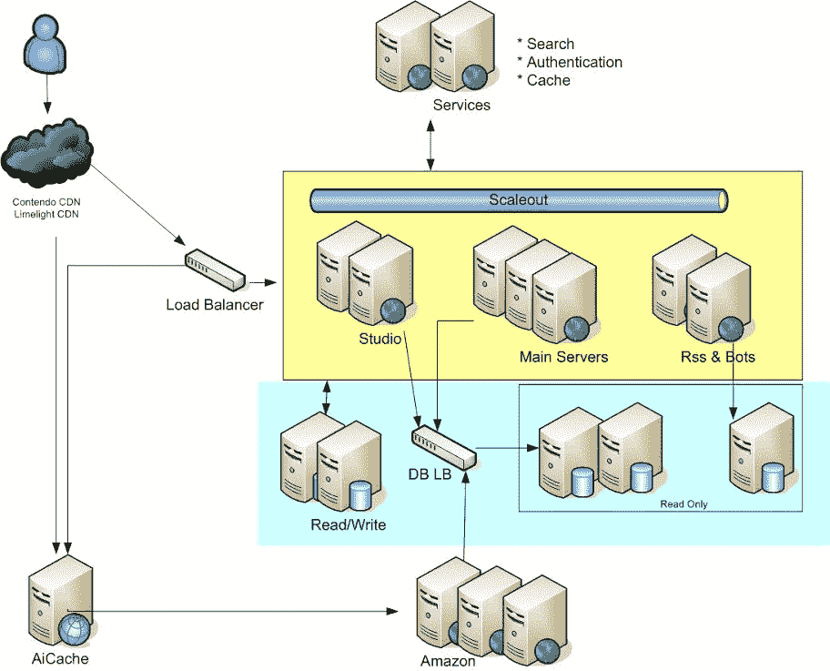

# Cinchcast 体系结构-每天产生 1,500 小时的音频

> 原文： [http://highscalability.com/blog/2012/7/16/cinchcast-architecture-producing-1500-hours-of-audio-every-d.html](http://highscalability.com/blog/2012/7/16/cinchcast-architecture-producing-1500-hours-of-audio-every-d.html)

*这是 [Aleksandr Yampolskiy 博士](http://www.twitter.com/ayampolskiy)， [Cinchcast](http://www.cinchcast.com/) 和 [BlogTalkRadio](http://www.blogtalkradio.com/) 的 CTO 的嘉宾帖子，他负责工程，质量检查，TechOps，电话和 产品团队。*

[Cinchcast](http://www.cinchcast.com) 提供的解决方案使公司能够创建，共享，衡量和货币化音频内容，以吸引和吸引对其业务最重要的人们。 我们的技术将会议桥与实时音频流集成在一起，以简化在线事件并增强与会人员的参与度。 Cinchcast 技术还用于为全球最大的音频社交网络 [Blogtalkradio](http://www.blogtalkradio.com) 提供动力。 今天，我们的平台每天制作和分发超过 1500 小时的原始内容。 在本文中，我们描述了为了扩展平台以支持这种数据规模而做出的工程决策。

## 统计信息

*   每月浏览量超过 5000 万
*   已创建 50,000 小时的音频内容
*   15,000,000 个媒体流
*   175,000,000 次广告展示
*   每秒 40,000 个并发请求的峰值速率
*   MSSQL，Redis 和 ElasticSearch 群集中每天存储的数据量为 TB /天
*   由 10 位工程师组成的团队（在 20 位技术人员中）。
*   大约有 100 个硬件节点正在生产中。

## 数据中心

*   生产网站是从布鲁克林的数据中心运行的。 我们喜欢控制自己的命运，而不是将数据委托给云。
*   Amazon EC2 实例主要用于质量检查和登台环境。

## 硬件

*   大约 50 台 Web 服务器
*   15 个 MS SQL 数据库服务器
*   2 个 Redis NOSQL 键值服务器
*   2 个 NodeJS 服务器
*   2 个用于弹性搜索集群的服务器

### 开发工具

*   .NET 4 C＃：ASP.NET 和 MVC3
*   Visual Studio 2010 Team Suite 作为 IDE
*   StyleCop，用于加强代码标准的 Res​​harper
*   敏捷开发方法，Scrum 用于大型功能，看板任务板用于较小的任务
*   Jenkins + Nunit 用于测试和持续集成
*   按需调味–自动化测试用硒

## 使用的软件和技术

*   **Windows Server 2008 R2 x64** ：操作系统
*   **SQL Server 2005** 在 **Microsoft Windows Server 下运行 2008 年** Web 服务器
*   **均衡器负载均衡器** ：用于负载均衡
*   **REDIS** ：用作分布式缓存层并用于消息发布-子队列
*   **NODEJS** **用于实时分析和更新 Studio 仪表板**
*   **ElasticSearch** ：用于节目搜索
*   **Sawmill +自定义解析器脚本：** 用于日志分析

## 监控

*   **NewRelic** 用于性能监控
*   **Chartbeat** 对性能对 KPI（转化，页面浏览）的影响
*   **Gomez，WhatsupGold 和 Nagios 提供各种警报功能**
*   **SQL Monitor：** 来自 Red Gate-用于 SQL Server 监视

## 我们的方法

*   “简短，聪明，消失”：尊重他人的时间。 不要有问题，要有解决方案。
*   不要去追逐当今的热门技术。 而是“缓解您的主要问题”。 我们采用新技术，但是在业务案例需要时采用新技术。 当您有数百万个用户时，生产中断的需求就会大大降低。
*   达到“基本”，然后担心“优秀”。
*   成为“如何团队”而不是“没有团队”。
*   将安全性纳入软件开发生命周期。 您需要培训开发人员如何编写安全软件，并使之从一开始就成为企业的优先事项。

## 架构

*   所有 Javascript，CSS 和图像都缓存在 CDN 级别。 DNS 指向将请求传递到原始服务器的 CDN。 我们使用 Cotendo 是因为它允许在 CDN 上做出 L7 路由决策。
*   Web 服务器的单独群集用于为常规用户和广告用户提供服务，以 Cookie 区分。
*   我们正在朝着面向服务的体系结构发展，该体系的关键部分（例如搜索，身份验证，缓存）是以各种语言实现的 RESTFUL 服务。 这些服务还提供了一个缓存层。
*   REDIS NOSQL 键值存储（redis.io）用作数据库调用之前的缓存层。
*   横向扩展用于在整个 Web 服务器花园中维护会话状态。 但是，我们正在考虑切换到 REDIS。

 

## 获得的经验教训

*   **无法在 SQL Server 数据库中搜索文本**。 它阻塞了 CPU，所以我们切换到 ElasticSearch（Lucene 派生的）。
*   **Microsoft 的内置会话模块容易出现死锁**，因此我们最终将其替换为 AngiesList 会话模块，并将数据存储到 REDIS。
*   **日志记录是检测问题的关键。**
*   **重塑车轮可能是一件好事**。 例如，最初我们使用供应商产品将 JS / CSS 捆绑在一起，这开始导致性能问题。 然后，我们重新编写了捆绑包，并显着提高了我们网站的性能。
*   **并非所有数据都是相关的**，所以数据库并不总是一个好的媒介。 一个很好的类比是“假设您有水顺着管道流下。 管道的顶部较宽，而底部则较窄。” 顶部是 Web 服务器（其中有很多），底部是数据库（很少，并且被阻塞了）。
*   **在开发过程中不使用指标就像试图在高度计不起作用的情况下将飞机降落在风暴中**。 在整个开发过程中，计算指标，例如站点吞吐量，修复 Blocker /关键 bug 的时间，代码覆盖率，并使用它们来衡量性能。

感谢您的有趣帖子。 您如何处理 sql 数据库的复制？ 谢谢！

有趣的
您模型的“关系”部分是什么？

将记录保留在 Disc 阵列中并在 DB 中保留位置不是一个更好的设计。 另外，您也不要在 CDN 服务器上复制脱机内容。 只是好奇