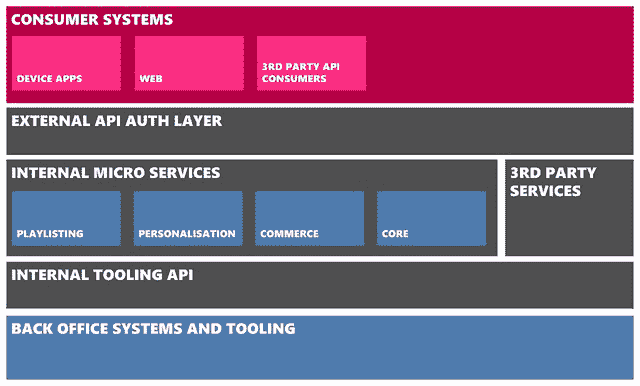
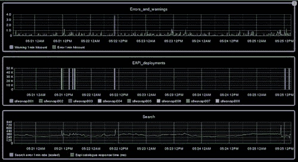
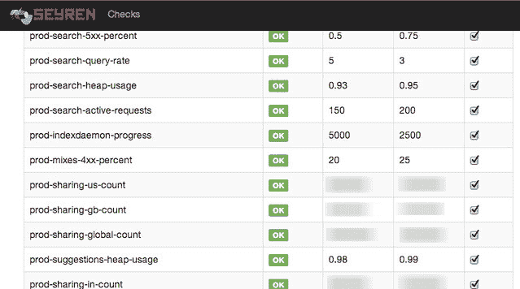
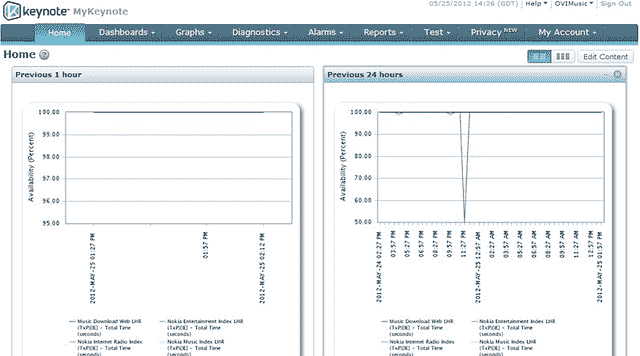
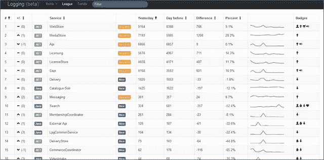
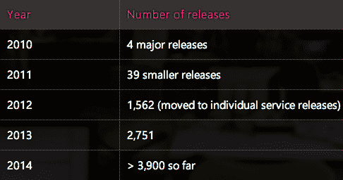

# MixRadio 体系结构-兼顾各种服务

> 原文： [http://highscalability.com/blog/2014/8/25/mixradio-architecture-playing-with-an-eclectic-mix-of-servic.html](http://highscalability.com/blog/2014/8/25/mixradio-architecture-playing-with-an-eclectic-mix-of-servic.html)


*这是 [MixRadio](https://twitter.com/sr_gb) 的首席架构师 Steve Robbins 的来宾[重新发布](http://dev.mixrad.io/blog/2014/08/22/MixRadio-Architecture-Overview/)。*

At MixRadio, we offer a free music streaming service that learns from listening habits to deliver people a personalised radio station, at the single touch of a button. MixRadio marries simplicity with an incredible level of personalization, for a mobile-first approach that will help everybody, not just the avid music fan, enjoy and discover new music. It's as easy as turning on the radio, but you're in control - just one touch of Play Me provides people with their own personal radio station.The service also offers hundreds of hand-crafted expert and celebrity mixes categorised by genre and mood for each region. You can also create your own artist mix and mixes can be saved for offline listening during times without signal such as underground travel, as well as reducing data use and costs.Our apps are currently available on Windows Phone, Windows 8, Nokia Asha phones and the web. We’ve spent years evolving a back-end that we’re incredibly proud of, despite being British! Here's an overview of our back-end architecture.

# 架构概述

我们有机会在 2009 年重新设计后端。今天，我们的后端核心是 RESTful 服务的集合，其模式称为['微服务'](http://martinfowler.com/articles/microservices.html)。 这些服务的大小，功能，开发语言和数据存储各不相同，但都具有共同的属性，例如公开定义良好的 RESTful API，可独立扩展的功能（包括监视功能），我们将在下面介绍更多功能。 围绕这些核心服务，我们有两个类似的代理服务，它们是通过配置驱动的，以公开用于不同目的的 RESTful 资源的子集。 “内部工具 API”代理内部 API 的工具，以涵盖客户服务，内容管理，发布组合，监控和许多其他情况。 在公开场合，我们通过“外部 API 身份验证层”服务公开了针对客户端应用和第三方开发人员的 RESTful API。 此服务还具有执行适当的权限和授权方案的工作，例如 [OAuth2](http://en.wikipedia.org/wiki/OAuth) 。

对于最终用户，我们的 API 服务的应用范围非常广泛。 我们提供 [HTML5 网站](http://www.mixrad.io/)，适用于所有不同类型诺基亚手机的设备应用程序，Windows 8 应用程序，并且我们还向第三方开发人员提供了相同 API 的子集。 我不会在本文中详细介绍我们的应用架构，因为我们团队的内森（Nathan）先前曾写过[。](http://dev.mixrad.io/blog/2014/02/24/Bringing-MixRadio-to-the-new-Nokia-X-family/)

下图概述了系统的主要领域，其中驻留了五十多个微服务：

 

# 使用的技术

我们采取务实的方法，即针对开源技术使用正确的工具来完成这项工作。 目前，我们正在积极使用：

## 语言能力

*   [Clojure](http://clojure.org/) 用于我们的微服务。
*   C＃用于我们的设备应用程序和媒体交付服务。
*   HTML5 / CSS / JavaScript 用于我们的网络体验。

## 存储

*   [MySQL](http://www.mysql.com/)
*   [Solr](http://lucene.apache.org/solr/)
*   [MongoDB](http://www.mongodb.org/)
*   [Redis](http://redis.io/)
*   [Elasticsearch](http://www.elasticsearch.org/)
*   [ZooKeeper](http://zookeeper.apache.org/)
*   [SQLServer](http://www.microsoft.com/sqlserver)

## 基础设施

*   [适用于 Linux 微服务的 AWS](https://aws.amazon.com/) 。
*   [Azure](http://azure.microsoft.com/) 用于 Windows 和媒体存储上运行的媒体服务。
*   [GitHub Enterprise](https://enterprise.github.com/) 用于源代码控制。
*   [Packer](http://www.packer.io/) 用于创建机器映像。
*   [人偶](http://puppetlabs.com/)，用于调配和检查机器映像。

## 监控方式

*   [Nagios](http://www.nagios.org/)
*   [石墨](http://graphite.wikidot.com/)
*   [Tasseo](https://github.com/obfuscurity/tasseo)
*   [塞伦](https://github.com/scobal/seyren)
*   [篝火](https://campfirenow.com/)
*   [PagerDuty](http://www.pagerduty.com/)
*   [主题演讲](http://www.keynote.com/)
*   [Logstash](http://logstash.net/)
*   [Kibana](http://www.elasticsearch.org/overview/kibana/)

# 建筑原理

为了使 API 与五十多种微服务保持一致，我们制定了有关 URI 结构，分页，排序，大小写，处理语言代码等方面的标准； 但是在开放的文化中，我们通常使用原则而不是硬性规则来获得一致性。 我们的服务应：

*   松散耦合，无状态，并通过 HTTP 提供 JSON 的 RESTful 接口。
*   单独部署并拥有自己的数据，即其他服务通过 API（而不是数据库连接）访问数据。 这允许单独的规模以及持久性技术和数据结构的更改。
*   当我们为每个服务使用一个机器实例时，它既不会太大以致于变得笨拙，又不会太小而使其浪费计算资源。
*   实施用于检查的 Healthcheck API，并负责确定健康状况。
*   永远不要破坏他们的消费者。 我们很早就同意一个标准，在资源路径中有一个版本号（例如`/1.x/products/12345/`），这样如果需要进行重大更改，则可以并行部署新版本并被上游消费者采用 。 即使我们仍然保留此功能，多年来也不需要使用它。

除了这些内部原则外，对于面向公众的 API，我们还添加了以下内容：

*   API 已针对移动设备进行了优化：我们使用 JSON，因为与低功耗设备上的 XML 相比，它解析所需的内存要少于 XML，并尽可能使用 GZIP 编码响应，最重要的是-如果不需要数据，则不会返回。 最后一点是与 API 一致性的良好平衡。
*   尽可能使用缓存； API 返回适当的缓存头，以便将内容缓存在最终用户设备和浏览器以及[内容分发网络（CDN）](http://en.wikipedia.org/wiki/Content_delivery_network)上，从而首先使内容更接近我们的消费者。
*   云中会保留尽可能多的逻辑和数据真实性，以减少应用程序中逻辑的重复并提供一致的体验。
*   相同的 API 用于所有客户端-网络，移动，桌面和第三方子集。 但是，为了针对不同的屏幕尺寸和要求进行优化，我们使用了一些技巧。 一个明显的例子是“ itemsperpage” querystring 参数，用于调整返回的内容数量。 另一个适用于 RESTful API 设计，其中资源返回隔离的内容。 我们经常将内容分组为所谓的“视图”，以减少所需的请求数量。

使用视图 API 的一个示例是我们应用程序中的艺术家详细信息页面，该页面包含来自许多资源的数据-艺术家传记，图像，推文，演出，并混合了其中的专辑，热门专辑，热门歌曲和类似歌手。 通过将其组合成一个“视图”，应用程序可以一击即获得约 5KB 的数据。

# 快速微服务

在过去的几年中，我们已经在 [Clojure](http://clojure.org/) 而非 Java 中构建了微服务。 Clojure 是一种动态语言，仍然可以在 Java 虚拟机（JVM）上运行，并且还允许访问 Java 框架。 我们的后端团队出于开发速度和运行时的速度选择使用 Clojure。 Clojure 比 Java 简明得多-例如，这是我们在 Clojure 中重新开发的 Java 服务之一，其代码行数从 44,000 行增加到 4,000 行（包括所有配置，测试和其他工件）。 我们使用 [Leiningen](http://leiningen.org/) 来加快开发速度-Leiningen 提供的一个方面是自定义项目模板，我们有一个名为`cljskel`的模板为我们创建框架服务。 我们打算在以后的帖子中再次使用该模板，但是为了说明使用，我们能够运行以下命令，并具有带有监控 API 的功能性 RESTful 服务：

```
lein new cljskel <project name> 
```

如果您对我们如何进入 Clojure 感兴趣，您可能想观看我们两位工程师去年在伦敦所做的演讲。

# 数据

我们处理的两个最大数据源是我们拥有的 32+百万首曲目的内容元数据（以及相关的艺术家，专辑，混音等）以及来自我们的应用程序的分析数据，例如播放事件，大拇指向上/向下 和导航事件。

Catalog 服务（请参见下图）为我们的消费者体验提供内容元数据和搜索功能。 “主目录”服务存储来自各种来源的原始数据，例如记录标签，我们的内部内容团队和互联网资源（例如 Wikipedia）。 配置驱动的数据模型指定了如何合并来源（例如，优先考虑从我们的内容团队得到更正的某些字段，而不是其他来源），哪些字段可搜索以及哪些字段返回给调用者。 我们可以返回不同的字段来满足不同的用例。 例如，我们不需要搜索结果中的专辑曲目列表，但在显示专辑详细信息时确实需要它们。 主目录服务不会直接为用户流量提供服务，而是“搜索和查询” API 是其余后端的接口。 搜索和查询服务基于 [Apache Solr](http://lucene.apache.org/solr/) 构建，“索引后台程序”服务对主目录进行爬网以获取发布到 Solr 搜索索引的更新。

[](http://dev.mixrad.io/assets/blog/MixRadio-Architecture-Overview/catalogue.png)

收集分析和使用数据对于驱动个性化体验，进行 A / B 测试，CRM，计算业务指标和合同报告至关重要。 随着数据全天不断地从各种应用程序进入后端，许多服务需要同时访问同一数据。 一个例子是用户在曲目上按下了“ thumbs down”按钮，这对于当前播放曲目的混合很重要*和*到用户的整体口味，重复的拇指 下降表示不喜欢艺术家。 为了能够处理我们期望的数据量，去年初我们决定需要一个发布-订阅模型，该模型将：

*   高可用性，无单点故障。
*   通过解耦和暂停传入消息的能力为整个系统提供可伸缩性。
*   与消息格式无关。
*   写延迟低（即“即发即弃”的语义）。
*   为订户提供快速吞吐量。
*   提供简单的发布和订阅 API。
*   支持多个用户使用相同的数据，每个用户可能具有不同的体系结构，并以不同的速度和时间表运行。 例子是实时处理与批处理聚合或归档。

我们从 LinkedIn 选择了 [Apache Kafka](http://kafka.apache.org/documentation.html#introduction) ，因为它非常适合我们的需求。 特别是它是一个持久的消息传递系统，旨在支持许多具有自己状态（例如读取数据的位置）的消费者，而不是假设订户永久存在并以相同速率消费数据。

# 监控方式

我们针对关键用例的<延迟时间为 0.8 秒，在为期 90 天的滚动期内达到 99.99％的可用性-相当于每月停机 4.3 分钟。 因此，当出现问题时，我们如何知道何时出现问题并迅速做出反应？ 我们具有多层监视功能，可以提醒开发人员和操作工程师。

在最低级别上，我们使用 [Nagios](http://www.nagios.org/) 检查虚拟机的基本运行状况，并使用 [PagerDuty](http://www.pagerduty.com/) 来提醒运维工程师。 我们利用每个微服务实现的运行状况检查 API，让 AWS 负载均衡器确定盒子是否需要回收（您可以在此[上一篇文章](http://dev.mixrad.io/blog/2014/05/16/How-we-use-cluppet/)中阅读有关如何配置 AWS 负载均衡器的更多信息）。 [石墨](http://graphite.wikidot.com/)用于收集操作系统级别的指标，例如 CPU 使用率，磁盘空间等。但是，每个微服务也记录自定义指标，这对所涉及的工程师很有帮助。 我们收集的服务指标从低级项目（例如 HTTP 500 错误计数）到高级抽象（激活的订阅数），不计其数。 这是一个石墨仪表板示例：

[ ](http://dev.mixrad.io/assets/blog/MixRadio-Architecture-Overview/monitoring-graphite.png) 

我们在 Graphite 顶部使用 [Tasseo](https://github.com/obfuscurity/tasseo) 提供漂亮的仪表板数据摘要视图，并使用 [Seyren](https://github.com/scobal/seyren) 根据阈值变化发出警报。 Seyren 由我们的一些工程师创立，并在一篇有关 [2012 年奥巴马连任竞选](http://arstechnica.com/information-technology/2012/11/how-team-obamas-tech-efficiency-left-romney-it-in-dust/)中使用的技术的文章中得到提及。

[ ](http://dev.mixrad.io/assets/blog/MixRadio-Architecture-Overview/monitoring-seyren.png) 

在最高级别上，我们使用[主题演讲](http://www.keynote.com/)来监控全球的用例和响应时间：

[ ](http://dev.mixrad.io/assets/blog/MixRadio-Architecture-Overview/monitoring-keynote.png) 

最后，对于详细的诊断，我们避免了必须通过日志传送连接到特定服务器。 我们使用 [Logstash](http://logstash.net/) 将系统，请求，错误和特定于应用程序的日志收集到中央位置，并与自定义仪表板一起使用 [Kibana](http://www.elasticsearch.org/overview/kibana/) 来跟踪特定的错误或查看趋势。 该示例是几年前我们试图减少应用程序错误噪声时的自定义仪表板：

[ ](http://dev.mixrad.io/assets/blog/MixRadio-Architecture-Overview/monitoring-errors.png) 

# 持续交付

连续交付是一种通过自动化部署和测试以可重复的方式快速发布软件的实践。 从大爆炸发布开始，我们花费了数年的时间来改进我们的流程； 迁移到部署管道，然后使用 AWS 中的 Netflix“红/黑”样式模型迁移到今天的状态。 我们工程团队的 Joe 在 6 月的[伦敦持续交付聚会](http://vimeo.com/100788786)上谈到了这一点。

通过查看过去五年中完成的部署次数，可以了解我们的进展情况：

 

## 相关文章

*   [MixRadio 历史记录](http://dev.mixrad.io/blog/2014/08/05/MixRadio-History/)