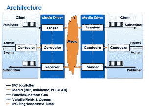

# Aeron：我们真的需要另一个消息传递系统吗？

> 原文： [http://highscalability.com/blog/2014/11/17/aeron-do-we-really-need-another-messaging-system.html](http://highscalability.com/blog/2014/11/17/aeron-do-we-really-need-another-messaging-system.html)

我们真的需要 [另一个](https://www.youtube.com/watch?v=dq4aOaDXIfY) 消息传递系统吗？ 如果它承诺使用创新的设计，以每秒一百万微秒的延迟在机器之间以百万微秒的延迟将数百万条消息以一致的响应时间传递给大量客户端，那么我们可能会做到。

这就是 [Aeron](https://github.com/real-logic/Aeron) （凯尔特神 战斗，而不是主持人，尽管告诉搜索引擎），这是 [Todd Montgomery](https://twitter.com/toddlmontgomery) 团队开发的一种新型高性能开源消息传输库， 多播和可靠协议专家，编译器优化专家 [Richard Warburton](http://insightfullogic.com/blog/) 和 [Martin Thompson  ，这是面糊的表演黑帮。

声称 Aeron 已经在吞吐量方面击败了最好的产品，并且延迟匹配了最高达 90％的最佳商业产品。 Aeron 可以以每秒 600 万条消息的速度推送 40 字节的小消息，这是非常困难的情况。

以下是马丁在 Strangeloop 上对 Aeron 的演讲： [Aeron：开源高性能消息传递](https://www.youtube.com/watch?v=tM4YskS94b0) 。 我将简要介绍他的演讲，并整合到本文末尾列出的信息源中。

Martin 和他的团队处于令人羡慕的位置，拥有一个需要像 Aeron 这样的产品的客户，并愿意为其开发提供资金，同时也使其开源。 因此，在 GitHub 上运行 git [Aeron](https://github.com/real-logic/Aeron) 。 请注意，对于 Aeron 来说还处于初期，他们仍处于繁重的优化阶段。

世界已经改变，因此端点需要前所未有的扩展。 这就是为什么马丁说我们需要一个新的消息传递系统的原因。 现在是一个多面的世界。 我们拥有多核，多插槽，多云，数十亿用户计算，通讯一直在发生。 大量的消费者定期对要从同一发布者读取的频道进行捣乱，这会导致锁争用，排队效应，从而导致吞吐量下降和延迟高峰。

我们需要一个新的消息库来充分利用这个新世界。 [转向微服务](https://groups.google.com/forum/#!topic/mechanical-sympathy/fr7moLcsuiI) 仅增加了需求：

当我们进入微服务世界时，我们需要从通信中获得非常低且可预测的延迟，否则 [USL](http://www.perfdynamics.com/Manifesto/USLscalability.html) 的一致性部分将会出现 雨火和硫磺在我们的设计上。

使用 Aeron 的目标是保持事物的纯正和专注。 到目前为止，我们所做的基准测试表明吞吐量和延迟方面的进步。 十分独特的是，您不必在吞吐量和延迟之间进行选择。 对于其他高端消息传输，这是一个独特的选择。 Aeron 使用的算法可提供最大的吞吐量，同时将直到饱和的等待时间最小化。

“许多通讯产品都是瑞士军刀； [说](https://groups.google.com/d/msg/mechanical-sympathy/fr7moLcsuiI/IMvQY_bCQf8J) Martin，这是了解 Aeron 的好方法。 它不是您习惯的全功能消息传递产品，例如 [Kafka](http://kafka.apache.org/) 。 Aeron 不保留消息，不支持有保证的传递，也不支持群集，也不支持主题。 Aeron 不会知道客户端是否崩溃了，也无法从历史记录同步备份或从历史记录初始化新客户端。

将 Aeron 置于心理矩阵中的最佳方法可能是将其作为面向消息的 TCP 替代品，并在其上写入更高级别的服务。 Todd Montgomery [扩展了](https://groups.google.com/d/msg/mechanical-sympathy/fr7moLcsuiI/XsKndzoR6ycJ) 的构想：

Aeron 是 ISO 第 4 层协议，它提供了许多消息传递系统无法提供的功能，也没有提供某些消息传递系统可以提供的功能.... 让我稍微解释一下所有典型的消息传递系统（不仅是 Kafka 和 0MQ）。

一种更多考虑 Aeron 适合何处的方法是 TCP，但是可以选择可靠的多播传送。 但是，这在一定程度上是有限的，因为 Aeron 在设计上也具有许多可能的用途，这些用途远远超出了 TCP 的功能范围。 以下是一些要考虑的事项：

Todd 继续提供更多详细信息，因此请继续阅读文章以了解更多有关该主题的信息。

Aeron 的核心是 **复制的消息持久记录** 。 通过非常有意识的设计过程，消息从发布到接收的整个过程都是无等待的，零复制。 这意味着延迟非常好并且非常可预测。

总结 Aeron 简而言之。 它是由一支经验丰富的团队创建的，使用了以前许多项目中都得到强化的扎实的设计原则，并得到了并非所有人都拥有的技术支持。 每个方面都经过精心设计，干净，简单，高性能和高度并发。

如果说简单与聪明是无法区分的，那么 Aeron 就有很多聪明之处。 让我们看看他们是如何做到的...

请注意，Martin Thompson 的 [这个话题](https://www.youtube.com/watch?v=tM4YskS94b0) 正在进行中。 我尽了最大的努力来捕捉想法，但是您没有得到的感觉就是它们融合在一起的程度。 马丁在传达这种整体感方面做得很出色，这就是为什么这次演讲值得一看。

## 其他

*   *Todd Montgomery 继续说。*。关于 Aeron 适合何处的一种思考方式是 TCP，但可以选择可靠的多播传递。 但是，这在一定程度上是有限的，因为 Aeron 在设计上也具有许多可能的用途，这些用途远远超出了 TCP 的功能范围。 这里有几件事情要考虑：

    *   及时识别具有完整记录边界的“持久”数据流。 这是{channel，sessionId，channelId，offset，length}元组，它是日志缓冲区策略的核心。 这使得具有任意回放的流的非易失性存储能够掉出……这非常有趣。 这导致以真正机械的同情方式进行数据流的重新连接和持久化。 我对此压力太大了。 实际上，这也为传输协议提供了真正的位置透明性。 即本地订户可以直接从发布者的日志缓冲区中读取，而驱动程序则透明地将数据发送给现成的订户。 到目前为止，我们已经确定了这些内容，但是我认为这也可以应用于处理主动/被动前​​向纠错，轮播，任意重放等的独特方法。

    *   Aeron 没有主题。 它具有单独的非竞争流。 大多数消息传递系统都提供主题空间。 这是一种祝福和诅咒。 通过为 Aeron 故意保留有界的实现方式（但不受设计限制）的流空间，Aeron 允许在顶部构建主题空间（这使 0MQ 和许多其他系统可以利用它）而不会将实现锁定在浪费资源上 对于那些不需要它的用例。

    *   可靠的单播设计是一种模仿 TCP 的熟悉的防火墙可穿越设计。 但是可靠的多播设计允许发布/订阅语义具有无限可配置的流控制策略。 这不仅提供了普通的消息传递，流传输等各种用例可能性。

*   传输媒体已更改。 消息不再只是通过 TCP。 更多的多播正在发生。 Infiniband 正在高性能领域起飞。 [PCI Express](http://en.wikipedia.org/wiki/PCI_Express) 3.0 具有内置的内存模型，因此可以在计算机之间的总线之间传输字节。 这就是许多高性能空间的去向。

*   我们需要在同一台机器上的进程和套接字之间进行通信。 随着使用越来越多的内核构建机器，它们实际上成为了一个盒子中的数据中心。 英特尔的新款 [Haswell CPU](http://www.extremetech.com/computing/189518-intels-new-18-core-haswell-xeon-chips-will-try-to-preempt-the-arm-server-onslaught) 每个插槽具有 18 个内核，每个内核具有两个超线程。 在一台计算机上可能同时运行 240 个线程，我们需要一种方法来分工并有效地进行通信。

*   用纯 Java 8 编写，并利用了该版本新引入的 lambda 表达式。

*   对等而不是代理解决方案，这是它具有如此低的延迟的原因之一。

*   使用 UDP 并将很快拥有 SHM IPC 和 Infiniband。

*   构建高性能系统的秘诀在于简单性。 复杂性会降低性能。 追求简洁的简洁设计。

*   通过提供替代算法提供带有可插拔钩子的自己的流控制。

*   不支持群集和存档的消息，尽管将来的项目可能会添加一些此功能。

*   可靠的多播传递。

*   Aeron 本质上将日志缓冲区从一台机器复制到另一台机器。 从功能上来说，缓冲区是持久的，因为存储的记录不会发生突变，也不会持久存储到磁盘。

*   提供可靠的交货，但不能保证。 如果订户死亡并超时，则将不会重试消息传递。 可以在 Aeron 之上分层协议以存档已发布的消息，以便订户可以恢复，但这不在基本功能之内。

*   不提供交易担保。 因此，要约完成后，当要约返回时，要么被拒绝，要么被放置在共享内存日志缓冲区中，由驱动程序发送。 在流量控制允许的范围内，驱动程序会尽力发送。 但是，Aeron 确实尽力将其提供给订户。 这是一种尽力而为的传递保证，就像 TCP 一样，但是要好一点，因为它可以处理 TCP 无法实现的某些连接故障。 但这并不能保证。

*   为了测试捕获完整的等待时间直方图，同时尝试多个线程同时发布从而发生竞争的情况。 还要与许多其他消息传递因素进行比较。 例如 IPC /单播/多播，不同的消息大小等。

## 基本操作

*   发布者通过一个频道发送消息，供订阅者阅读。 频道内是流向订户的流。

    *   通道保持消息有序。 信息流彼此独立，因此它们不会相互阻塞。

    *   检测到损失并以对延迟和吞吐量的最小影响进行处理。

    *   使用流量控制和背压以免淹没客户。

    *   拥塞避免和控制处理经过拥塞网络的数据包。 它被认为是高性能领域中的一项可选服务。 当发生拥塞时，需要此服务，但是在等待时间需要尽可能低的情况下，拥塞控制算法会使您减速。 一个示例是 TCP 的 [慢启动](http://en.wikipedia.org/wiki/Slow-start) 问题，因为 TCP 试图避免用流量淹没网络。

    *   在处理非常大的消息，处理碎片并避免 [行头阻塞](http://en.wikipedia.org/wiki/Head-of-line_blocking) 的同时，在通道中对流进行多路复用和多路分解。

*   不是框架，而是图书馆。 这是一种可组合的设计，因此可以在其之上构建其他层。

*   设计大约涉及三件事：系统架构，数据结构和协议交互。

    *   正确构建架构，并使其美观整洁。

    *   数据结构非常重要。

    *   如今，人们不再强调良好的协议工作，这是分布式代理进行通信和合作时的基础。

## 架构 [

*   发布者发布，订阅者订阅。 您可以在两台计算机之间进行双向通信，但是每台计算机都需要分别注册一个发布者和一个订阅者。 一对发布者和订阅者只是一种通信方式。

*   通信通过 UDP，UDP 多播，Infiniband，PCI-e 3.0，RDMA 等媒体进行。

*   发送者负责通过媒体发送数据，而接收者则通过媒体接收数据。 发送者和接收者是在各自的线程中运行各自工作的独立代理。 现代处理器确实擅长于一遍又一遍地执行相同的操作，因为它们的高速缓存中存储着指令和数据。

*   导体是独立的代理，可以完成所有不在 A 和 B 之间发送字节的工作。这包括内部管理和管理员（如用户设置，新出版物的事件，新的订阅以及告诉系统正在发生的事情）。

*   发送方和接收方保持非常简单和整洁，因此它们可以使用最佳方法在媒体上的两点之间尽快传输数据。

*   在同一进程中没有共享数据结构。 通信正在使用消息传递。 导体使用消息通过非阻塞结构进行通信。 这允许使用干净的单线程代码，该代码可以运行得很快。 避免了并发和使用队列的锁定。

*   明确分开的关注点意味着可以选择零件的放置位置。 它们都是独立的代理程序，具有自己的线程，运行自己的代码，具有自己的内部数据结构，这些数据结构不共享，因此它们不需要并发，不需要锁，因此可以实现令人难以置信的执行 快速。

    *   导体分为为发送者和接收者提供服务所需的内容以及为客户端提供服务所需的内容。 而且由于通讯不使用共享内存，而是在队列中，因此可以将 Conductor 的这些部分拆分为单独的进程。 媒体驱动程序可以处于自己的进程中，客户端可以处于其自己的进程中。 或者，媒体驱动程序可能位于内核中。 或在 FPGA 中。

## 数据结构

*   Java 中的数据结构过于复杂，间接性太多，这意味着性能低下，因此他们构建了自己的映射，IPC 环形缓冲区，IPC 广播缓冲区，ITC 队列，动态数组，日志缓冲区。

*   环形缓冲区用于在导体，客户端和驱动程序之间进行通信。

*   还需要将事件从驱动程序发送到多个客户端，而不会降低驱动程序的速度，而不考虑客户端的数量，因此广播用于事件。

*   许多数据结构在动态变化，例如给定订阅的订阅者数量，发布的发布者数量，这些数据结构必须是动态的且无阻塞的。 日志缓冲区用于将消息从发布移动到订阅。

## 永久日志

*   消息与标头一起存储在持久日志结构中。 （更多关于日志结构[在此处](http://engineering.linkedin.com/distributed-systems/log-what-every-software-engineer-should-know-about-real-time-datas-unifying)的介绍）。

*   日志已映射到磁盘，但使用内存映射文件保存在内存中。 日志活在文件中，因为文件可跨进程使用。 文件被映射到内存中，从而避免了必须进行系统调用才能进入磁盘的过程。

*   不变的数据结构可以安全无锁地读取，因为它们会随着时间增长。

*   描述了添加消息的协议和状态机。 添加消息不涉及任何锁。

    *   首先，将尾部原子地向前移动，以便另一个线程可以在同一时间添加一条消息。

    *   现在可以添加消息了。 该消息被复制到缓冲区。

    *   为了表示一条消息已完成，将单个字操作写入消息头中的字段。

    *   消息标头已完全写入日志，因此向发送方发送消息只需要编写标头和消息的连续字节，无需动态编写，因此将消息发送至发布者非常有效 很多客户。

*   日志不仅仅是随时间增长的单个文件。 单一文件设计虽然很常见，但存在很多问题。 因为页面错误会一直发生，并且页面错误非常昂贵，这会增加 VM 压力和页面搅动（这是 [页面错误成本](https://plus.google.com/+LinusTorvalds/posts/YDKRFDwHwr6) 上的 Linus Torvalds） ）。 页面错误并没有变得越来越快，过程也越来越快，因此差距是巨大的（尽管这一直是正确的，为什么页面错误总是要避免的原因）。

*   单个文件方法的替代方法是保留三个缓冲区：干净，脏，活动。 活动缓冲区是您正在写入的缓冲区。 肮脏是永恒的历史。 清除是下一个变为活动状态的缓冲区。 导体可以在后台进行清理，因此写入它们不会造成等待时间的损失。 缓冲区在缓存中都很热，因此没有页面缓存正在进行。 另一个线程可以将脏缓冲区存档到另一个数据存储中，以便可以永久保存消息。

*   这是免等待时间的实现方式。 假设有两个编写者试图在两个不同的线程中由两个不同的发布者同时将消息 X 和 Y 写入日志，可能是在不同的过程中写入同一驱动程序。 由于驱动程序用尽了进程，因此可以在多个进程之间共享。 Y 赢得比赛以增加尾巴。 然后 X 递增尾部，但是尾部越过缓冲区的末端。 Y 可以使用它分配的空间。 填充记录放置在 Y 的末尾与缓冲区的末尾之间，因此缓冲区始终是连续且完整的。 X 负责旋转到下一个缓冲区，在该缓冲区中它将消息从缓冲区的开头写入新的尾部。 所有这些工作并没有导致线程的任何延迟。 它完全独立发生，没有阻塞操作。 如果某个进程中断，则其他所有线程均不会阻塞。

## 发送消息 ，

*   标头包含版本信息； 旗; 消息类型； 帧长 术语“偏移量”，即到缓冲区的偏移量，这是将其复制到另一端的位置； 会话 ID，流 ID； 条款 ID； 编码的消息。 所需的所有内容都在标头中，因此可以将其直接写入网络。 写入帧长字节后，消息已发送。

*   标头设计的有趣含义是，流中的每个字节在整个时间上都有唯一的标识符，这是 streamId，sessionId，termId，termOffset 的复合键。 稍后将使用此功能，以便接收者可以告诉发送者日志的哪个区域被删除，因此发送者可以从该点重新发送。

*   使用消息协议在发送方和接收方之间复制日志。 发送方要发送消息时，会向接收方发送设置消息。 接收方发回状态消息。 发送方开始向接收方发送数据。 接收方发送更多状态消息，告诉发送方它还有 X 的剩余空间，因此您可以继续发送。 消息不被确认，NAK 代替。 为了最小化[内爆效应](ftp://www-net.cs.umass.edu/pub/Rubenst98:Proact-TR-98-19.ps.gz)，大多数现代组播协议使用 NAK 代替 ACK。 接收者告诉发送者它还剩下多少空间，这比基于 ack 的方法所需的消息更少。 它为您提供了一种实现流量控制和背压的机制。

*   发送方将其作为心跳发送的最后一条消息发送给接收方。 这种方法还可以处理丢弃最后一条消息的情况（请记住，正在使用 UDP）。

*   当接收者知道有一条消息被丢弃时，它将向发送者发送一个 NAK，用于查找丢失的术语区域。 在这一点上，请记住，正在复制的是日志，因此接收方可以假定整个日志可用，而不仅仅是很小的窗口大小。

*   接收者具有发送者中相同数据结构的副本。 标头和消息被写入日志。 有两个计数器：已完成和高水位标记。 假设已写入消息 1，消息 3 出现在消息 2 之前，因为存在订购问题。 完成的计数器指向消息 1 的末尾。高水位标记指向消息 3 的末尾。消息 2 应该有一个孔。 已完成指向连续的消息流。 如果消息 2 到达完成，则向前移动以指向消息 3 的末尾。

*   使用这种方法，您无需保留遗漏邮件的跳过列表或历史记录中有空白的地方。 这些额外的数据结构很复杂，而且速度很慢。 它们导致并发问题和高速缓存未命中。

*   日志缓冲区在内存中是完全线性的。 访问它们只需要向前迈进内存，这确实是硬件友好的。 指针追逐在性能上确实很糟糕，因为它们会导致页面错误。

*   此表示形式也非常紧凑。 您可以通过记忆尖叫。

*   此设计是回到基础的结果。 考虑如何解决丢失，重新排序，保留历史记录，同时保持内存和并发友好的问题。 结果是一个持久的数据结构，其速度比任何现有方法都要快。 [持久数据结构](http://en.wikipedia.org/wiki/Persistent_data_structure) 是一种数据结构，在修改后始终保留其自身的先前版本。 从轨道的功能角度来看，这是一个想法。 学科合作时，有很多东西要学习。 只执行功能性技术或忽略功能性技术是愚蠢的。

*   导体始终在完成和高水位线之间寻找间隙。 它将发送 NAK，因此发送方将重新发送日志的该部分。 这是简单且易于调试的。

*   要了解消耗了哪些消息，请使用指向字节流中某个位置的计数器。 发布者，发送者，接收者和订阅者都在字节流中保留位置计数器。 这使得监视，应用流量控制和拥塞控制变得容易。 这些计数器在另一个内存映射文件中可用，因此它们可用于单独的监视应用程序。

*   协议很难。 您需要注意大规模的自相似行为。 例如，在多播世界中，当出现问题时，您会得到一种称为自相似行为的信息，这种行为会开始发生模式并建立起共振。 因此必须将随机性注入系统。 NAK 必须在将来的某个随机点发送。 这样可以防止订户立即全部锤击源。

## 吸取的教训 [

*   **人们以** n 估算值吸吮。 即使有团队的丰富经验，他们的估计也全都没有了。 估算只是人类不擅长的事情。

*   **构建分布式系统非常困难** 。 只有不想构建分布式系统的人才有资格构建一个分布式系统，因为他们至少对工作的辛苦程度有所了解。 您只是不能说嘿，让我们创建一个分布式的并发系统。 首先制作一个单线程系统，然后再进行其余工作。

*   **我们的防御代码比特征代码** 更多。 在分布式系统上，事情可能会大规模出错，并且那些故障需要得到处理。 这并不意味着代码中充满了异常处理程序。 他们知道很多失败案例，但是仍然有很多防御性代码。

*   **建立分布式系统是对** 的奖励。 看到整个机器网络针对注入的故障进行调整并全部得到纠正是一件很美好的事情。

*   **从一开始就设计监视和调试** 。 从一开始就让一切可见。 无锁方法的优点之一是，您实际上可以从另一个线程观察状态，这使调试更加容易。

*   **由于配置** ，我们将 3x-4x 的性能留在桌面上。 程序员和系统管理员的分离是一种反模式。 开发人员不会与没有 root 访问权限的人交谈，而不会与拥有网络访问权限的人交谈。 这意味着系统永远不会配置正确，这会导致大量数据包丢失。 丢失，吞吐量和缓冲区大小都与 密切相关。 我们需要锻炼如何弥合差距，知道参数是什么，以及如何解决它们。 因此 知道您的 OS 网络参数以及如何对其进行调整 。

*   **Java 的某些部分确实很烂** 。 无符号类型； NIO 系统布满了锁； 很难在沙盒模型中进行堆外工作并获得所需的性能； 字符串编码不应要求复制缓冲区三次； 有些人是成年人，让我们映射和取消映射内存映射文件，并像成年人一样使用套接字。 哈希图周围的垃圾回收问题是痛苦的； 或字节标志会将字节提升为整数，因此您无法将结果分配回一个字节；

*   **Java 的不错部分** 。 工具。 Java 是世界上最糟糕的语言，拥有世界上最好的工具链：IDE，Gradle，HdrHistogram。 Java 的 lambda 和方法句柄非常好。 字节码检测对于调试确实很有用。 例如，Java 8 中的不安全性非常好，这就是计数器无锁递增的方式，并且可以在 CPU 上很好地扩展，并且内存栅栏使构建广播缓冲区成为可能。 优化器很棒。 垃圾回收对于某些类的算法非常有用。

*   **平均值绝对没有意义** 。 注意百分位数。

## 未来 [

*   现在功能已完成。 现在进行大量的分析和优化。

*   情况看起来很好。 在吞吐量方面已经击败了最好的产品。 可以以每秒 600 万条消息的速度发送 40 字节的小消息，这是非常困难的情况。 时延看起来很棒，那里有最好的商业产品，高达 90％。 除了 90％的百分位数之外，还有很多工作要做，部分是基于算法，​​还有 NIO，选择器和锁。

*   接下来是 C ++端口。

*   Infiniband 和 IPC。

## 相关文章

*   [在 Reddit](http://www.reddit.com/r/programming/comments/2ml0gb/aeron_do_we_really_need_another_messaging_system/) 上/ [在黑客新闻](https://news.ycombinator.com/item?id=8619735)上

*   [Aeron 高性能开源消息传输](http://gotocon.com/dl/goto-berlin-2014/slides/MartinThompson_AeronTheNextGenerationInOpenSourceHighPerformanceMessaging.pdf)

*   [Martin Ahompson 撰写的“ Aeron：开源高性能消息传递”](https://www.youtube.com/watch?v=tM4YskS94b0)

*   [GitHub 上的 Aeron](https://github.com/real-logic/Aeron)

*   Aeron [协议规范](https://github.com/real-logic/Aeron/wiki/Protocol-Specification) 和 [设计概述](https://github.com/real-logic/Aeron/wiki/Design-Overview) 。

*   [日志：每位软件工程师应了解的有关实时数据统一抽象的知识](http://engineering.linkedin.com/distributed-systems/log-what-every-software-engineer-should-know-about-real-time-datas-unifying)

*   [Google：驯服长时间延迟的尾巴-当更多的机器等于更差的结果时](http://highscalability.com/blog/2012/3/12/google-taming-the-long-latency-tail-when-more-machines-equal.html)

*   [伟大的微服务与整体应用 Twitter 近战](http://highscalability.com/blog/2014/7/28/the-great-microservices-vs-monolithic-apps-twitter-melee.html)

*   [简单二进制编码](http://mechanical-sympathy.blogspot.com/)

*   [本周要去 Strangeloop 吗？ 您的“必看”清单上有哪些讲座？](https://groups.google.com/forum/#!topic/mechanical-sympathy/fr7moLcsuiI)

*   [Aeron 性能测试](https://groups.google.com/forum/#!topic/mechanical-sympathy/GrEce0gP7RU)

*   [策略：利用处理器亲和力实现高性能和可预测的性能](http://highscalability.com/blog/2012/3/29/strategy-exploit-processor-affinity-for-high-and-predictable.html)

*   [12 种将吞吐量提高 32 倍，将延迟降低 20 倍的方法](http://highscalability.com/blog/2012/5/2/12-ways-to-increase-throughput-by-32x-and-reduce-latency-by.html)

*   [破坏了 4 个现代硬件神话-内存，HDD 和 SSD 真的是随机访问吗？](http://highscalability.com/blog/2013/6/13/busting-4-modern-hardware-myths-are-memory-hdds-and-ssds-rea.html)

*   [对 Apache Kafka 进行基准测试：每秒 200 万次写入（在三台便宜的机器上）](http://engineering.linkedin.com/kafka/benchmarking-apache-kafka-2-million-writes-second-three-cheap-machines)

*   [HdrHistogram](https://github.com/HdrHistogram/HdrHistogram) -高动态范围（HDR）直方图。

非常感谢您提供大量信息来总结并做得很好，但是声明“发布者和订阅者之间的全双工通信”并不是很准确。 发布者发布，订阅者订阅。 您可以在两台计算机之间进行双向通信，但是每台计算机都需要分别注册一个发布者和一个订阅者。 一对发布者和订阅者只是一种通信方式。

另外，当您说“并非所有邮件都被确认”时，我们不会确认数据包。 我们使用 NAK 代替，我的理解是实际上大多数现代多播协议使用 NAK 代替 ACK 来最小化内爆效应。

太好了，谢谢理查德的改正！

“面对面”，认真吗？

是的，我猜这翻译得不好。 它引用了犹他爵士乐团的约翰·斯托克顿（John Stockton），他是 NBA 历史上最好的球员之一。 因此，这是一个受人尊敬的术语，这就是它的意思。