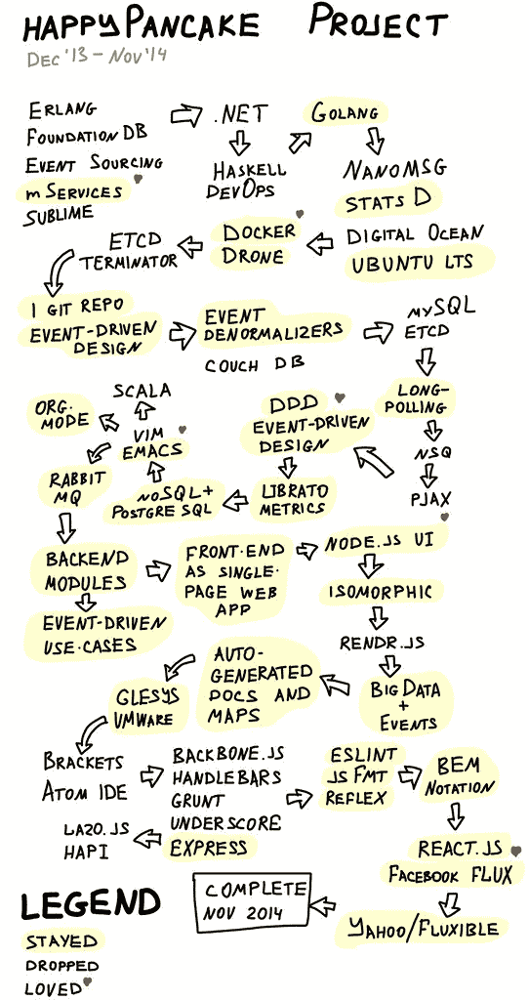
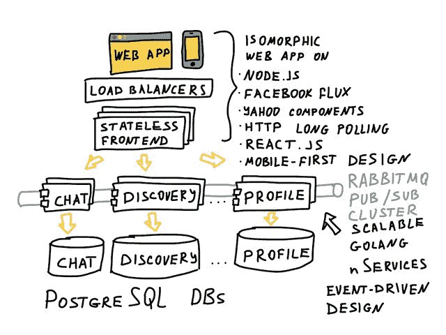
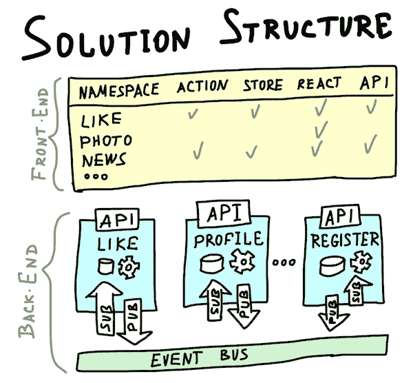
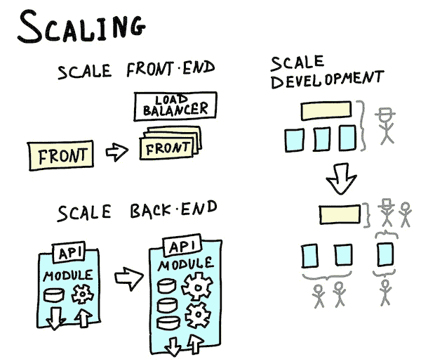

# HappyPancake：建立简单可扩展基金会的回顾

> 原文： [http://highscalability.com/blog/2015/2/23/happypancake-a-retrospective-on-building-a-simple-and-scalab.html](http://highscalability.com/blog/2015/2/23/happypancake-a-retrospective-on-building-a-simple-and-scalab.html)

*这是 [Rinat Abdullin](http://abdullin.com/about-me/) 的来宾转发，他曾从事 *[HappyPancake](http://www.happypancake.com/) 和*的工作，这是瑞典最大的免费约会网站。 最初是用 ASP.NET 和 MS SQL 数据库服务器编写的，但最终变得过于复杂和扩展成本很高。 这是近两年来有关该项目发展的一系列引人入胜的文章中的最后一篇。 有关完整列表，请参见本文结尾。*

我们在 HappyPancake 上的项目已于本周完成。 我们为瑞典最大的免费约会网站的下一个版本**（在挪威和芬兰开展业务）提供了一个简单且可扩展的基础。**

## 旅程

以下是该旅程的简短地图。 它列出了我们为该项目评估的技术和方法。 黄色区域突出显示了进入最终设计的项目。

 

## 项目交付

**项目可交付成果**包括：

*   具有主要功能的可部署全栈应用程序。
*   在软件设计（后端和前端）和一组声明性用例（充当活动文档，系统概述和行为测试套件）中捕获的领域模型。
*   用于开发和持续集成的已配置环境（docker 容器）。
*   进一步发展和扩展系统的策略。
*   用于将现有生产部署迁移到新版本软件的代码。

最终的高层**体系结构很容易推断和扩展**。 它就是这样设计的。

 

从逻辑上讲，整个解决方案由后端模块（由 golang 包表示）和 Facebook Flux 体系结构的元素（通过命名约定在命名空间中组合在一起）组成。

随着项目规模和复杂性的增长，这种结构有助于维护项目。

 

此设计还有助于扩展部署以处理更高的负载。

我们可以通过以下方式**扩展后端**：

*   将单个模块移至更大的服务器；
*   启动单个模块的多个实例；
*   将单个模块的存储切换到集群解决方案，将其移动到更大的服务器，甚至推送到云。

我们可以通过简单地在负载均衡器后面启动新实例来扩展**前端**。

 

解决方案结构还提供了一种在开发人员之间分配工作的自然方法。 给定已建立的发布语言（API 和事件的合同），我们还可以引入更多开发人员，将他们分配给在单个后端模块或前端命名空间上工作。

## 得到教训

*   选择正确的技术可以减少开发工作。
*   在我的下一个项目中，我将尝试着重于分而治之的方法-先隔离一小部分然后进行改进，以限制进行中的工作量。
*   尽早建立所有利益相关者参与的反馈循环至关重要。 这可以建立信任并有助于避免意外。

## 相关文章

*   [关于黑客新闻](https://news.ycombinator.com/item?id=9101133)
*   完整的 HappyPancake 文章系列。 仅标题即可指示项目之字形随时间变化的方式。 [简介](http://abdullin.com/happypancake/intro/)； [新团队](http://abdullin.com/happypancake/2013-12-17/)； [语言是实现细节](http://abdullin.com/happypancake/2013-12-23/)； [与 Golang 一起前进](http://abdullin.com/happypancake/2014-01-18/)； [从 FoundationDB](http://abdullin.com/happypancake/2014-02-02/) 开始； [逐步发展堆栈并学习 Nanomsg](http://abdullin.com/happypancake/2014-02-08/) ； [设计用于吞吐量和低延迟](http://abdullin.com/happypancake/2014-02-17/)； [容器，虚拟化和集群](http://abdullin.com/happypancake/2014-02-24/)； [基准测试和调整堆栈](http://abdullin.com/happypancake/2014-03-19/)； [计划变更](http://abdullin.com/happypancake/2014-04-07/)； [返回基础](http://abdullin.com/happypancake/2014-04-14/)； [消息传递-社交网站的心脏](http://abdullin.com/happypancake/2014-04-21/)； [事件驱动的一周](http://abdullin.com/happypancake/2014-04-28/)； [反应性原型](http://abdullin.com/happypancake/2014-05-05/)； [战术 DDD](http://abdullin.com/happypancake/2014-05-12/) ； [Emergend Design 面对现实](http://abdullin.com/happypancake/2014-05-24/)； [最小可行产品](http://abdullin.com/happypancake/2014-06-01/)； [Almost Demo](http://abdullin.com/happypancake/2014-06-09/) ; [我们的第一个演示](http://abdullin.com/happypancake/2014-06-13/)； [Scala，模块化设计和 RabbitMQ](http://abdullin.com/happypancake/2014-06-30/) ，[分配工作](http://abdullin.com/happypancake/2014-07-06/)； [更智慧的发展](http://abdullin.com/happypancake/2014-07-21/)； [提供功能和测试](http://abdullin.com/happypancake/2014-07-29/)； [数据，用例和新模块](http://abdullin.com/happypancake/2014-08-02/)； [从假期回来](http://abdullin.com/happypancake/2014-08-16/)； [原生性能](http://abdullin.com/happypancake/2014-08-25/)； [功能，用例，Rendr](http://abdullin.com/happypancake/2014-09-07/) ； [Node.js 入门，Lazojs](http://abdullin.com/happypancake/2014-09-15/) ； [Web 开发的好部分](http://abdullin.com/happypancake/2014-09-23/)； [响应式用户体验](http://abdullin.com/happypancake/2014-09-29/)； [供稿，聊天，在线列表和 CSS](http://abdullin.com/happypancake/2014-10-07/) ； [发送给 ReactJS 和 Facebook Flux](http://abdullin.com/happypancake/2014-10-27/) ； [项目完成](http://abdullin.com/happypancake/2014-11-06/)。

喜欢可视化。 您在其中创建了什么软件？