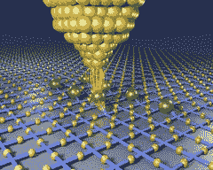

# 数据范围项目-6PB 存储，500GBytes / sec 顺序 IO，20M IOPS，130TFlops

> 原文： [http://highscalability.com/blog/2012/2/2/the-data-scope-project-6pb-storage-500gbytessec-sequential-i.html](http://highscalability.com/blog/2012/2/2/the-data-scope-project-6pb-storage-500gbytessec-sequential-i.html)

“ **数据无处不在，永远不在单个位置。 无法扩展，无法维护。** ， –Alex Szalay

尽管伽利略在望远镜揭示的奥秘上进行了生死教义的比赛，但又没有引起另一场革命，显微镜在奥秘之后放弃了奥秘 还没有人知道它所揭示的内容具有颠覆性。 这些新的感知增强工具首次使人类能够窥见外表的面纱。 数百年来，驱动人类发明和发现的崭新视角。

数据是隐藏的另一种 数据，仅当我们查看不同的比例并调查其底层时才显示自身 模式。 如果宇宙是由信息 真正构成的 [，那么我们正在研究真正的原始事物。 数据需要一个新的眼睛，一个雄心勃勃的项目称为](http://www.scientificamerican.com/article.cfm?id=is-space-digital) [数据范围](https://wiki.pha.jhu.edu/escience_wiimg/7/7f/DataScope.pdf) 旨在成为镜头。

详细的 [论文](https://wiki.pha.jhu.edu/escience_wiimg/7/7f/DataScope.pdf) 进一步说明了它的含义：

> 数据范围是一种新型的科学工具，能够“观察”来自各个科学领域的大量数据，例如天文学，流体力学和生物信息学。 系统将具有超过 6PB 的存储空间，每秒约 500GB 的聚合顺序 IO，约 20M IOPS 和约 130TFlops。 Data-Scope 不是传统的多用户计算集群，而是一种新型仪器，使人们能够使用 100TB 至 1000TB 之间的数据集进行科学研究。 如今，数据密集型科学 计算中存在真空，类似于导致 BeoWulf 集群发展的过程：基于商品组件的廉价而高效的模板，用于学术环境中的数据密集型计算。 拟议的数据范围旨在填补这一空白。

Nicole Hemsoth 对 Data-Scope 团队负责人 Alexander Szalay 博士的访问非常方便，可以在 [计算的新时代：《 Data 博士》](http://www.datanami.com/datanami/2012-01-23/the_new_era_of_computing:_an_interview_with_dr._data.html) 。 Roberto Zicari 在 [空间物体与 Facebook 好友](http://www.odbms.org/blog/2011/04/objects-in-space-vs-friends-in-facebook/) 中也对 Szalay 博士进行了很好的采访。

本文针对其硬件选择和体系结构提供了许多非常具体的建议，因此，请阅读本文以获取更深入的信息。 许多 BigData 操作都具有 Data-Scope 正在解决的相同 IO /规模/存储/处理问题，因此非常值得一看。 以下是一些要点：

*   高性能系统的计算能力和 I / O 能力之间的距离越来越大。 随着多核和基于 GPU 的混合系统的规模不断扩大，我们正在讨论明年的许多 Petaflops
*   该系统将传统磁盘驱动器的高 I / O 性能与少量具有高性能 GPGPU 卡和 10G 以太网互连的超高吞吐量 SSD 驱动器集成在一起。
*   我们需要具有以比今天更大的 I / O 带宽进行读取和写入的能力，并且我们还需要能够以非常高的聚合速率处理传入和传出的数据流。
*   通过使用直接连接的磁盘，消除了存储系统中的许多系统瓶颈，在磁盘控制器，端口和驱动器之间取得了良好的平衡。 如今，构建便宜的服务器并不难，廉价的商业 SATA 磁盘每台服务器可以流超过 5GBps。
*   GPGPU 非常适合于数据并行 SIMD 处理。 这正是许多数据密集型计算的目的。 将 GPGPU 与快速本地 I / O 并置的构建系统将使我们能够以每秒数 GB 的速度将数据流传输到 GPU 卡，从而充分利用其流处理功能。
*   在健康的生态系统中，所有事物都是 1 / f 幂定律，[在数据库选项中]我们将看到更大的多样性。
*   它需要一种整体方法：必须首先将数据带到仪器，然后进行分段，然后再移到同时具有足够的计算能力和足够的存储带宽（450GBps）来执行典型分析的计算节点上， （复杂）分析必须执行。
*   人们普遍认为索引是有用的，但是对于大规模数据分析而言，我们不需要完整的 ACID，交易带来的负担多于好处。
*   实验和仿真数据正在快速增长。 数据集的大小遵循幂定律分布，并且在这种分布的两个极端都面临着巨大的挑战。
*   不同架构组件的性能以不同的速率提高。
    *   CPU 性能每 18 个月翻一番
    *   磁盘驱动器的容量正在以类似的速度增加一倍，这比原始 Kryder 定律的预测要慢一些，这是由更高密度的磁盘驱动的。
    *   在过去十年中，磁盘的旋转速度几乎没有变化。 这种差异的结果是，虽然顺序 IO 速度随密度增加，但随机 IO 速度仅发生了适度的变化。
    *   由于磁盘的顺序 IO 和随机 IO 速度之间的差异越来越大，因此只能进行顺序磁盘访问-如果 100TB 的计算问题主要需要随机访问模式，则无法完成。
    *   即使在数据中心，网络速度也无法跟上数据大小翻倍的步伐。
*   PB 级数据，我们无法将数据移动到计算所在的位置，而必须将计算引入数据中。
*   现有的超级计算机也不太适合进行数据密集型计算。 它们最大程度地延长了 CPU 周期，但缺少大容量存储层的 IO 带宽。 而且，大多数超级计算机缺乏足够的磁盘空间来存储多个月期间的 PB 大小的数据集。 最后，至少在今天，商业云计算平台不是答案。 与购买物理磁盘相比，数据移动和访问费用过高，它们提供的 IO 性能明显较低（〜20MBps），并且提供的磁盘空间数量严重不足（例如，每个 Azure 实例约 10GB）。
*   硬件设计
    *   数据范围将包含 90 个性能和 12 个存储服务器
    *   数据范围设计背后的驱动目标是，在使用商品组件保持较低购置和维护成本的同时，最大化 TBsize 数据集的流处理吞吐量。
    *   直接在服务器的 PCIe 背板上执行数据的首次传递比将数据从共享的网络文件服务器提供给多个计算服务器的速度要快得多。
    *   Data-Scope 的目标是提供大量廉价和快速的存储。 没有满足所有三个条件的磁盘。 为了平衡这三个要求，我们决定将仪器分为两层：性能和存储。 每一层都满足两个标准，而第三层则有所妥协。
    *   Performance Server 将具有高速和廉价的 SATA 驱动器，但会影响容量。
    *   存储服务器将具有更大但更便宜的 SATA 磁盘，但吞吐量较低。 存储层的磁盘空间增加了 1.5 倍，以允许数据分段以及往返于性能层的数据复制。
    *   在性能层中，我们将确保可达到的聚合数据吞吐量保持在理论最大值附近，该最大值等于所有磁盘的聚合顺序 IO 速度。 每个磁盘都连接到一个单独的控制器端口，并且我们仅使用 8 端口控制器来避免控制器饱和。 我们将使用新的 LSI 9200 系列磁盘控制器，该控制器提供 6Gbps SATA 端口和非常高的吞吐量
    *   每个性能服务器还将具有四个高速固态磁盘，用作临时存储的中间存储层和用于随机访问模式的缓存。
    *   性能服务器将使用 SuperMicro SC846A 机箱，具有 24 个热交换磁盘托架，四个内部 SSD 和两个基于 GTX480 Fermi 的 NVIDIA 图形卡，每个图形卡具有 500 个 GPU 内核，为浮点运算提供了出色的性价比。 每张卡估计可运行 3 teraflops。
    *   在存储层中，我们将容量最大化，同时保持较低的购置成本。 为此，我们使用带有 SATA 扩展器的背板在尽可能多的磁盘中分摊主板和磁盘控制器，同时仍为每台服务器保留足够的磁盘带宽以进行有效的数据复制和恢复任务。 我们将使用本地连接的磁盘，从而使性能和成本保持合理。 所有磁盘都是可热交换的，从而使更换变得简单。 一个存储节点将由 3 个 SuperMicro SC847 机箱组成，一个包含主板和 36 个磁盘，另外两个包含 45 个磁盘，总共 126 个驱动器，总存储容量为 252TB。
*   鉴于可移动媒体（磁盘）的改进速度快于网络，因此，sneakernet 将不可避免地成为大型临时还原的低成本解决方案，
*   我们为仪器中的数据设想了三种不同的生命周期类型。 首先是永久性数据，海量数据处理管道以及对超大型数据集的社区分析。

## 相关文章

*   [计算的新纪元：《数据博士》专访](http://www.datanami.com/datanami/2012-01-23/the_new_era_of_computing:_an_interview_with_dr._data.html)
*   [MRI：数据范围的发展–科学的多 PB 通用数据分析环境](https://wiki.pha.jhu.edu/escience_wiimg/7/7f/DataScope.pdf)
*   [GrayWulf：用于数据密集型计算的可伸缩群集体系结构](http://research.microsoft.com/apps/pubs/?id=79429)
*   [空间中的对象与 Facebook 中的好友](http://www.odbms.org/blog/2011/04/objects-in-space-vs-friends-in-facebook/) ，作者：Roberto V. Zicari
*   [极限数据密集型计算](http://salsahpc.indiana.edu/tutorial/slides/0726/szalay-bigdata-2010.pdf)
*   [Alex Szalay 主页](http://www.sdss.jhu.edu/~szalay/)

两个注意事项：

1.由于耐用性极低，因此无法在缓存方案中使用消费者 SSD（Vertex 2）。 企业级 SSD 是这里必不可少的
2。对于在新项目中将使用哪种类型的文件系统（分布式），请不要多说。 5PB 的存储空间，FS 上没有任何单词。

很棒的文章和有趣的项目！

请注意，“有关 Data-Scope 的详细*文件* ...”中缺少该链接，现在具有：about：blank。

否则，一篇很好的文章。

帕特里克