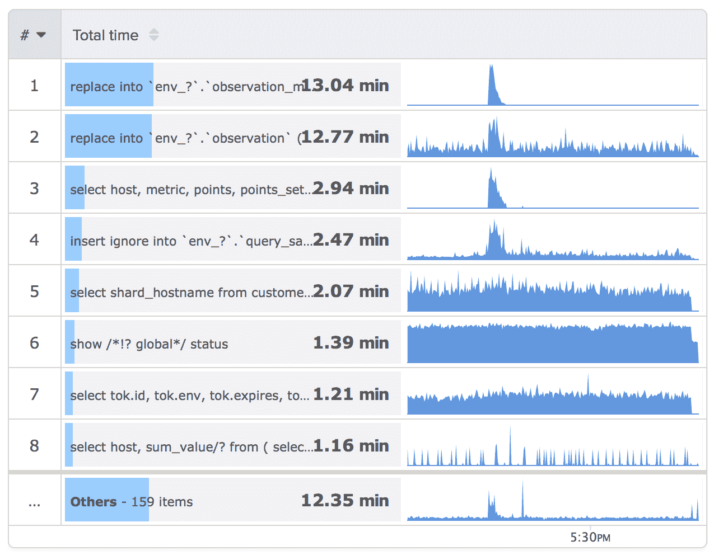

# 我们如何扩展 VividCortex 的后端系统

> 原文： [http://highscalability.com/blog/2015/3/30/how-we-scale-vividcortexs-backend-systems.html](http://highscalability.com/blog/2015/3/30/how-we-scale-vividcortexs-backend-systems.html)


*这是 [Baron Schwartz](https://twitter.com/xaprb) ， [VividCortex](https://vividcortex.com/about-us/) 的创始人& CEO 的来宾帖子，这是专门为当今的大型，多语种持久层设计的首个统一的性能管理工具套件 。*

VividCortex 是用于数据库性能管理的云托管 SaaS 平台。 我们的客户安装了代理，以衡量其服务器执行的工作（查询，流程等），并从中频繁地生成度量和事件。 代理将结果数据发送到我们的 API，在此托管我们的分析后端。 后端系统是数据库，内部服务（准微服务）和面向 Web 的 API 的集合。 这些 API 也为我们的 AngularJS 前端应用程序提供了动力。

我们处理大量数据。 我们高速摄取指标和事件。 我们还执行以交互方式接触大量数据的分析。 我们不是唯一的，我不想暗示我们在事物计划方面给人留下深刻的印象。 我们尚未以“网络规模”运作。 尽管如此，我们的工作负载具有一些相对不寻常的特征，我们已经能够扩展到最大程度，同时在成本和基础架构方面仍然保持相当高的效率。 我的咨询生涯告诉我，建立这样的系统通常对公司来说是一个挑战（对我们来说一直如此）。 我们的故事可能对其他人有用。 因此，我将不必要地详细介绍工作负载的特定部分及其带来的挑战。

## 我们所做的

VividCortex 是一个复杂的系统，具有很多功能，但是热门查询（以及我们为实现此目的而捕获的数据）很容易成为对我们的后端产生重大影响的最重要的功能。 热门查询是一个查询类别的表，按所选维度从大到小排列，并显示一个综合行，该行显示的类别不符合前 N 个。

[](https://camo.githubusercontent.com/2f0d8f8246190511ec9d7a5b99ed48b3d939fdc1/68747470733a2f2f636c6f75642e67697468756275736572636f6e74656e742e636f6d2f6173736574732f3237393837352f363838393234382f38353663663566612d643636302d313165342d383565312d6131393330653962636139662e706e67)

屏幕截图（顺便说一下，来自我们自己的工作量）显示了此功能，并精简了其基本功能。 热门查询实际上是我们的应用程序可以实现的一般任务类别的特定示例：您可以对查询，用户，流程，数据库等的度量进行排名，排序，过滤，切片和切块。 您可以同时在一台或多台主机上执行此操作，因此可以获取全局视图，然后向下钻取到特定主机或主机组。 您可以从许多不同的维度中进行选择。 所有这些本质上都采用度量类别，并按维度对其进行排名，保留前 N 个，最后将其余的折叠到所有行中。

我们还有很多其他的事情要做，但大多数事情在后端实现方面与许多指标和监视系统所做的并没有很大不同。 与“热门查询”相比，这不是一项重大的工程挑战。

## 时间序列数据

我们的时间序列指标是属于序列的带有时间戳的 float64 值。 该系列由度量标准名称和测量它们的主机标识。 时间戳当前是 UTC 中的 uint32 UNIX 时间戳。

指标名称是点分隔的字符串。 我们从许多来源收集了大量指标，所有指标均以 1 秒为单位。

*   每个数据库状态指标。 例如，对于 MySQL，这包括来自 SHOW STATUS 的数百个计数器，以及来自其他来源的数百个计数器。
*   每个 CPU，每个网络设备以及每个块/磁盘设备，内存等的操作系统指标。
*   操作系统中的进程级别指标，包括每个进程的 CPU，内存，IO，打开的文件句柄，网络套接字等。

但最重要的是，我们嗅探网络流量并解码流行数据库产品的有线协议。 目前，我们提供针对 MySQL 和 PostgreSQL 的 GA 支持，Redis 和 MongoDB 处于 beta 测试阶段，并且还有更多。 我们测量入站查询（或视情况而定的请求/命令/等；因产品而异）和响应延迟时间，并提取各种有用的细节（例如错误等）。 在无法监听网络的情况下，可以使用内置的工具，例如 MySQL 的`PERFORMANCE_SCHEMA`和 PostgreSQL 的`pg_stat_statements`视图。 这使我们能够支持诸如 Amazon RDS 之类的部署方案。

> 顺便说一句，捕获这些数据本身会带来有趣的问题，并且我们之前已经在博客上进行了介绍（两个示例： [netlink](https://vividcortex.com/blog/2014/09/22/using-netlink-to-optimize-socket-statistics/) 和 [perf 模式](https://vividcortex.com/blog/2014/11/03/mysql-query-performance-statistics-in-the-performance-schema/)）。 在这里，Go 是我们的一大财富。

最明显的挑战可能是我们收集的系列数量之多。 我们通过消化可变部分，然后对抽象查询进行 md5sum，将相似查询分类。 我们对此进行十六进制编码（对此我感到遗憾并为自己负责，这是一个愚蠢的决定），并将结果嵌入到指标名称中，例如 `host.queries.c.1374c6821ead6f47.tput`。 最后一个要素是维度，在这种情况下，是吞吐量（每秒的速率），但是它可能是诸如延迟，错误率，受影响的行数之类的许多东西之一。 此特定度量标准名称中的可变部分是`c`，它表示这是什么类型的操作（查询，准备好的语句执行等）和`1374c6821ead6f47`，它是摘要查询的校验和。

您可能会猜到，度量标准名称的可变部分可能是高基数的。 我们的一些客户生成了数千万种不同类型的查询，这导致时间序列的组合爆炸式增长。 在最坏的情况下，它是度量标准名称的每个可变部分的叉积，通常包括 2、3、4 或有时更多的可变部分。

我们还生成并存储许多其他数据。 关于查询之类的描述性指标还不够。 我们通过查询事件本身和各种其他事件（例如，为响应系统故障或配置更改而引发的事件）的单个样本来补充这一点。 事实证明，对这些数据进行缩放并不像时间序列度量标准那么困难，这主要是因为这些数据的读取工作负载并不难于扩展。

## 写工作量

按原始事实存储量，后端的写入工作量中最大的部分是时间序列指标。 查询样本和事件在磁盘上构成了很多数据，但这是因为它比时间序列数据紧凑得多。 许多小数据比中等数量的大数据更难处理。

数据库内部和存储引擎的学生将了解，读取优化存储和写入优化存储在某些方面存在冲突。 如果要读取优化的数据，则可能需要在写入时进行额外的工作。 我们绝对需要一些读取优化，您将在后面看到。

写入特性非常简单：数据按时间戳顺序到达，而主要的挑战只是将其持久化以及读取优化所需的放大。 如您所见，我们做了很多事情来回避这一点。

我们将 1 秒分辨率的数据存储 3 天。 我们还将下采样分辨率降低到 1 分钟，并保持更长的时间。 两种保留限额均可在客户合同中协商。 在我们自己的系统中，我们保留 10 天的 1 秒分辨率。

## 读取工作量

我们的时间序列指标有两个主要的读取工作负载。 它们揭示了关于数据库的普遍真理之一：许多不同类型的数据通常可以放入数据库中，甚至是专用数据库。 对于完全不同的目的而言，彼此相邻的数据位可能很重要，并且涉及到完全不同的问题的答案。 这是要提防的。

工作负载 1（我称为范围读取）是在一个时间范围内以所需的分辨率读取一个或多个单独指定的指标。 一个明显的例子是绘制一个具有单个度量标准的时间序列图：宽 600 像素，上周的数据； 在时间戳 1426964208 和 1427569008 之间以主机 100 的 600 个间隔向我提供来自主机 Y 的度量 X。 原则上，读取路径并不十分复杂：找出数据所在的位置以及适合的分辨率（在这种情况下，可以使用 1 分钟的数据），找到起点，并读取终点直到终点 。 根据需要重新采样并将其流回客户端。

实际上，有很多细微差别，但它们并不能从根本上改变我刚才描述的内容。 细微差别包括多个指标（有时数百个左右），知道什么时间范围已被完全下采样，调整采样参数，同时从许多来源（包括可能会延迟的副本）读取数据范围等等。 这些都不是什么大不了的。

只要对数据进行读取优化，范围读取工作负载就没有什么特别困难的了。 即使在很长的时间范围内和多个指标上，它通常也不是大量数据。 我们发现很难快速响应此类读物的大量请求。 稍后我将讨论我们如何确保数据经过读取优化。

2 号工作量比较难。 这是热门查询用例，我将其称为批量读取。 看起来是这样的：从时间戳 A 到 B 读取大量未指定的指标，并对它们进行汇总，排序，返回前 N 位，并包含计算通用行所需的数据。 可以通过解释范围读取的方法来获取跟踪数据，例如在前 N 个数据中显示每个结果的迷你图所需的跟踪数据。 “热门查询”工作负载还包括相同的注意事项，例如在可用时使用较粗的粒度，同时读取等等。

批量读取工作负载的难点在于，它涉及许多指标-可能达数千万甚至更多。 读取单个指标的速度很快-足够快，我们可以以比客户习惯更快的速度呈现充满图表的页面。 （我们经常收到有关图表运行速度的评论。）但是有数千万个图表？ 即使每公制是微秒，不是，我们已经在谈论数十秒。 我们通过这种批量读取获得的数据也非常大。 这就是当“粪便变得虚构”的时候。

还要注意，尽管这些指标受批量读取的影响，但它们也受各个范围读取的影响。 它不是“或”，所以我们无法进行简单的优化，例如将属于类别的度量标准与总是由完全合格的度量标准名称查找的度量标准分开存储。 我们可以复制它们，但这会带来不小的成本。

最后，批量读取的一些挑战性特征似乎几乎是偶然的。 例如，包罗万象的行似乎没什么大不了的，但对于用户界面来说，这两者都是至关重要的，在用户界面中，提供有关用户正在分析的应用程序工作负载以及我们的后端的上下文信息至关重要， 它可以代表大量工作。 请注意，在屏幕截图中，我们正在显示 159 个其他查询，这些查询被分组到了 catchall 行中。 这个数字可能高达数百万。

## 数据分布特征

除了大容量读取工作负载呈现的有趣读取特性外，数据本身还具有一些不寻常的属性，尤其是在值的分布和密度方面。

大多数监视系统和时间序列数据库都是为密集指标（例如 CPU 或内存利用率）构建的。 密集度量标准属于可以依靠其存在的事物，并且在度量它时，总会得到一个值。 大多数用于监视数据的用例都隐式地假设所有指标都是密集的。 这说明了 RRDTool，Graphite 的 Whisper 后端等的设计。

现代应用程序体系结构已经对这些时间序列数据库提出了重大挑战，因为一切都变得高度动态且短暂。 在目前的极端情况下，我们拥有诸如 Docker 和微服务之类的东西，最终我们将拥有许多像亚马逊的 Lambda 那样运行的系统，其中计算节点本身的存在是非常短暂的。 目前，在这种环境中进行监视的挑战已基本解决。 我认为没有一个流行的时间序列数据库可以处理它。

但是在 VividCortex，高度稀疏和动态的数据不是理论上或新兴的用例，而是我们目前的现实。 查询，流程以及我们监控的所有其他各种可变活动，都会生成具有这些特征的监控数据。 如果我们要处理的一件事很不寻常，那很有可能。 （再次，我不主张唯一性，只是不寻常）。

这也是一个程度的问题。 在具有这种数据的*中，我们并不是唯一的，但我们受到的打击可能会比看上去相似的其他公司/产品受到更大的打击。 部分原因是大多数从查询角度衡量产品的产品都是从应用程序的角度来看的。 应用程序代码是有限的，并且不是临时性的，这会生成数量有限的不同类型的查询和其他要度量的内容。*

但是，我们有坐在服务器上的代理，并且正在看到服务器的全部工作负载，而不仅仅是来自已检测应用程序的工作负载。 除非您看到典型服务器从不受监视的来源获得多少工作量，否则这种区别似乎并不重要。 这包括人工活动和其他临时活动，监视系统本身，后端应用程序，cron 作业等。 实际上，仅用于衡量应用程序生成的查询的典型 APM 工具确实存在很多盲点。

无论如何，我们系列的大部分内容（即基数）都是稀疏的，有时仅以相隔几天或几周的间隔记录点。

因为这构成了系列的大部分，但仅占数据的一小部分，所以任何假设将某个块/页面/范围用于一个系列的系统（假设以后将被填充）都是行不通的。 那里几乎是空白。

## 读或写优化？

在存储和检索我们一直在讨论的数据类型时，存在着一个巨大的，存在的，生存或死亡的问题来回答：读取优化还是写入优化？ 通过研究折衷，您可以轻松地建立事业。

如果对其进行了读取优化，则将面临巨大的写扩展挑战。 如果它是写优化的，将存在读取挑战。 让我们看看为什么。

如果我们认为主机和指标是真正一起构成系列 ID 的，那么问题就等同于询问我们要存储按时间戳排序还是按系列排序的数据。

对于（概念上）仅追加的不可变存储（例如我们的时间序列数据），我们将按照时间戳顺序对其进行读取（对吗？），乍一看，写优化似乎是理想的选择，因为数据将自动按照时间戳顺序进行存储。 只需在数据末尾附加点：

```
 v host  metric          ts  value
  |    1  a.b.c.d 1426964208    123
  |    1  d.e.f.g 1426964208  87654
  t    2  a.b.c.d 1426964208  19283
  i    2  d.e.f.g 1426964208    183
  m    3  a.b.c.d 1426964208   9876
  e    4  l.m.n.o 1426964208  72736
  |    5  a.b.c.d 1426964208  17364
  |    1  a.b.c.d 1426964209    129
  |    1  d.e.f.g 1426964209  87656
  v    5  q.q.q.q 1426964209   9988 
```

问题在于我们想要一起读取的数据没有聚集在一起。 如果要读取主机 1，从给定的时间戳到另一个时间戳的度量`a.b.c.d`，我将遍历*大量*不需要的数据来执行此操作。 利用上面描述的稀疏特性，您可以轻松地计算出，我可能比我关心的多读取了几个数量级的数据。 这是*读扩增。*

自然，索引是解决此问题的方法。 这就是发明索引的目的。

但是索引将复制数据并写入，并为写入引入随机 I / O。 当工作集超出内存时，B 树索引的性能和开销也会大大降低，并且我们的数据比内存大。 诸如 LSM 树之类的新一代索引并不能解决所有这些问题。 无论我们怎么看，我们都不会免费获得读取优化和写入优化。 一定会有一些读取，写入和/或空间放大。

鉴于纯写优化存储将无法正常工作，正确权衡的问题至关重要。 如何在不对写入造成严重影响的情况下对数据进行读取优化？ 换句话说，用于读取优化的数据的正确组织是什么？

通过在上面的示例中显示时间序列表的架构，我已经部分给出了我们答案的早期版本。 我们以`(host, metric, timestamp)`顺序在数据上定义了集群主键。 因此，这些点按主机和指标分组在一起，并且在其中按时间戳排序。 这样可以在一段时间内针对一组单独识别的系列的范围读取工作量优化数据。

但是，此群集对批量读取工作没有任何作用。 对于该工作负载，我们正在一系列时间戳上读取大量数据，并且正如我所提到的，这些系列构成了大多数数据。 因此，最有效的方法可能就是扫描整个范围，并丢弃不需要的数据。 二级索引（时间戳优先）可能是诀窍。 我们走了这条路，事实证明，由于要捕获的指标多种多样，因此此处的数学也不可行。 因为我们捕获了许多不同的批量指标组，但一次只查看一组，所以我们仍在检查少数数据，并且仍将极大地放大读数。

在早期，随着我们继续向捕获的数据集中添加越来越多的数据，这个问题变得更加严重。 回想一下，这是我们客户最有价值的用例。 这使其成为非常重要的问题。 我将回到这个问题，稍后再解释我们的解决方案。 现在，我想探索更多我们的架构，并为其他各种有趣的事物设置背景。

## 分片和分区

正如您所期望的，我们拥有多租户分片存储架构。 分片有助于满足我们的几种需求：写入扩展，读取扩展，数据隔离和租期以及安全性。

通常，只能通过分片来实现写缩放。 实际上，这确实是在全局中进行分片的唯一原因。 可以通过“横向扩展”复制来很好地解决读取扩展问题，这可以提供更多的读取容量。

数据隔离对我们很重要。 有时，SaaS 供应商会在所有客户中展示诸如实时分析之类的信息。 这种功能意味着一定程度的混合和缺乏隔离，我觉得有些不安。 我们正在努力防止某人获得广泛，不受限制的访问他们不应看到的数据的可能性。 在安全性与便利性之间取得平衡，我们倾向于使针头远离便利性。 （我们还[对敏感数据](https://vividcortex.com/blog/2014/11/11/encrypting-data-in-mysql-with-go/)进行加密，例如在飞行中和静止时的 SQL 端到端示例。[在即将举行的 Percona Live MySQL 会议](https://www.percona.com/live/mysql-conference-2015/sessions/encrypting-data-mysql-go)中，我将对此进行讨论。）

为此，我们的分片单位是客户的“环境”-考虑分期，生产等。 主机属于一个且只有一个环境，并且所有 API 访问都被隔离到一个环境中。 API 令牌被定义为只能访问一个环境，因此在逻辑级别和物理级别上，每个环境都与所有其他环境隔离。 有时我们谈论按环境和主机进行重新分片，但到目前为止，即使是最大的客户环境也没有问题。

分片实际上是分区，我刚刚描述了按环境分区。 由于多种原因，我们还按时间范围划分数据。 一种是使清除过期数据变得容易。 删除数据的成本太高了，在许多系统中，至少要使系统的写入工作量增加一倍，甚至更多。 取消链接文件要好得多。 从本质上讲，它是免费的。

按时间分区是我们满足批量读取工作负载需求的方法之一。 按时间进行的分区本质上是一个粗粒度，开销少，时间戳优先的索引。 起初，我们一次分配一天； 现在，我们一次分配一个小时用于 1 秒数据，一天一次分配一个 1 分钟数据。

我们最初进行分区的方式是我要承担个人责任的另一个错误。 开始时，我们使用本机 MySQL 分区。 这有一些好处，我认为这些好处将胜过任何缺点：

*   MySQL 本机修剪不包含请求时间戳的分区
*   分区表隐藏了应用程序代码的复杂性
*   MySQL 5.6 为分区添加了许多不错的功能，例如拉出一个分区并分别对其进行操作，然后将其交换回（EXCHANGE PARTITION）的功能。

我还认为，随着 MySQL 5.6 的改进，我们不会遇到早期版本的 MySQL 分区遇到的问题。 我是对的，我们不是。 我们遇到了其他人！ 哎呀。 分区维护作业（删除旧分区并创建新分区以保存将来的数据）将阻止长时间运行的查询，从而导致一切停止，并使服务器无法连接。 模式更改曾遇到类似的问题，在确定大容量读取工作负载无法正常工作并试图修复它时，我们不得不做几次。 模式更改还消耗了大量时间，并且由于元数据锁定等原因，模式更改永远不可能完全熄灭。 这些都是无聊的可预测的事情，只是因为我对它的思考不够深而发生。

因此，我们基本上遇到了几次“ ALTER TABLE 死机”和“分区维护死机”，然后从一开始就切换到应该做的事情。 我们为每个时间范围创建了单独的表，并使用表名对架构版本，数据分辨率和时间范围进行了编码。 1 秒数据的架构版本 1 的示例表名称为`observation_1_s_1424444400_1424448000`。 （我们将时间序列指标称为“观测值”，因为命名很困难，而且我当时还没有想到“点”。）

新的模式版本只是被写入新表中，并且当从所有环境中清除旧数据时，我们最终可以删除旨在处理该模式版本的代码。 我们不再更改。 旧数据将长期存在。

这类似于我在 New Relic 上看到的情况，并且我认为此博客上有较早的文章对此进行了讨论（我也曾在 New Relic 进行过咨询），但是我认为分区的改进使其变得不必要。 为我们。 不幸的是，这是成为顾问的缺点之一。 您认为您了解系统方面的知识，但您不了解 jack，因为您只是在系统附近，您自己还没有操作过它。 活到老，学到老。

## 紧凑的存储

我们的架构看起来并不像我之前显示的那样。 如果考虑以下伪代码之类的模式及其包含的数据，则会发现效率低下：

```
observation (
  host number
  metric string
  ts number
  value number
  primary key(host, metric, ts)
) 
```

首先，将有很多主机重复。 接下来，您将获得指标，这些指标也将疯狂地复制。 时间戳也将基本相似。 而且大多数时间序列值都为零。

最后，最重要的是，每个点将有一行。 这本质上是行标头的疯狂数目，最后附加了一些小数值。

为了解决这个问题并更紧凑地存储我们的数据，我们做了几件事：

*   我们使用主机 ID 和度量 ID，而不使用诸如主机名和度量名称之类的文本字符串。
*   我们以向量的形式将值分批处理，因此它不是每秒一行，而是每更长的时间范围（当前是每分钟，但将来可能会改变）一行。 这将分摊行中键的成本，这是我使用多年的技术。 它确实使某些事情不太方便，但是值得这样做，因为它使行数减少了 60 倍。
*   我们并不总是存储确切的值。 我们使用一种定制的压缩算法，该算法利用了我们看到的时间序列数据的特征。 这进一步减少了我们价值观的存储空间。 某些高动态范围指标有时可能只占误差的一小部分，但没人在乎。
*   我们存储大多数指标的增量，这些指标通常很小且易于压缩。 没有人会像查询数量一样在乎计数器的实际值。 无论如何，它将重置并重新启动。 人们关心的是这类数据的费率，而不是价值。 我们通过计算时间范围内的增量（例如每秒）来生成速率。 我们将某些类型的数据计算为值和费率，但这只是少数。
*   我们不存储零。 一个“心跳”度量标准（例如系统时间戳或正常运行时间计数器）足以确定我们是否及时测量了一批值，因此我们可以分辨出零值与缺失值之间的差异。 这有助于逐步改变度量标准，其中有很多。
*   我们计算各种汇总指标，位图等，并将它们与向量一起存储。 这对于不需要访问每个点的操作很有用，例如批量读取。 它还使我们能够进行诸如下采样之类的事情，而不会犯诸如“平均值”问题之类的愚蠢数学错误。

## API 和服务

我们的外部和内部 API 主要是基于 HTTPS 的 JSON。 一些内部服务使用协议缓冲区而不是 JSON，但是这些附加的依赖项和模式定义是我们仅在需要时添加的内容，并且在我们认为事情已经解决了足够的时间之后，我们就不会浪费额外的程序员时间来重做我们没有做的事情。 没错。

我们最初只有一个整体的 API 流程来处理所有内容。 当然，这仅仅是原型，我们很快就放弃了。 整体式 API 存在许多问题，例如成为单点故障。

我想建议一些通用的良好 API 做法；

*   想一想 API 设计。 不要为自己设计 API，而是为可能想要创建一个假设的应用程序来做与您自己的工作截然不同的人设计 API。 请参阅 [Interagent 指南](https://github.com/interagent/http-api-design)。
*   分离出您的读写路径。 读取和写入工作负载通常非常不同。 对于我们这样的服务，最重要的是我们不会丢失传入的数据。 长时间运行的繁重请求在某些情况下会轻易导致读取错误影响写入，并因此而丢失数据的情况。 使用单独的进程，甚至可能使用单独的服务器进行读写。
*   构建 12 要素应用程序。 首先，我不理解或不同意 12 因子原则，尤其是日志记录，守护进程和配置准则。 我已悔改了自己的罪过。
*   使用“干净”的体系结构，并像洋葱一样分层。 拒绝让内部层的任何事物知道，更不用说与外部事物进行交互。 这意味着内部工作或服务不应与您的公共端点进行交互。 将相同的原理应用于您的代码：代码中的依赖项应仅指向内部，而不能指向外部。

随着时间的推移，我们已经转向了一组准微服务的外部 API，其中（通常是很小的）一组相关端点位于单个二进制文件和进程中，但通过读写分开。 我们通过在某些代码库中构建读写路径来重用某些代码，但是通过 a）仅启用一组读写功能的配置和 b）代理规则，仅激活一组。

当此类服务成为我们要在内部构建的东西时，我们将进行下推重构，充分利用此 API 的实质并将其作为内部服务提供。 然后，外部服务将其大部分工作委托给该内部服务，我们也可以在内部其他地方使用它。

我们还将视情况处理特殊类型的数据和工作负载。 我们有专门用于时间序列数据提取的 API 和内部服务的单独集合，以确保我们可以快速而可靠地持久保存数据，并将写回确认给发送数据的代理或其他 API 客户端。 这些 API 是相当薄的前端：它们将写操作发送到 Kafka，然后完成。

然后，Kafka 使用者将数据从 Kafka 中流回并保留下来，大部分存储到 MySQL 中。 还有少量的 Redis。

卡夫卡很棒。 我希望它不使用 Zookeeper，并且对分区管理和故障转移有些不满意，但总的来说它是简单而可靠的。 但是，更重要的是它启用和鼓励的架构模式。 如果您还没有研究 [Jay Kreps 的有关基于日志的体系结构](https://engineering.linkedin.com/distributed-systems/log-what-every-software-engineer-should-know-about-real-time-datas-unifying)的博客文章，我鼓励您这样做。 尤其是如果您不希望消息队列/总线使您的整体体系结构更加简单明了，则应独立于 Kafka 本身考虑该文章中的想法。

我们非常感谢 Kafka 的 Go Sarama 客户。 非常感谢 Shopify 团队和其他人编写它。 没有它，Kafka 对我们来说将不是一个可用的解决方案。

通过使用 VividCortex，我们发现并解决了 VividCortex 的许多问题。 我们使用暂存来监视生产。 我强烈推荐这种模式。 生产永远不要自我监控，因为如果出现问题，您将无权访问数据以对其进行诊断。

我们还依赖于许多外部服务，包括 GitHub，HipChat，Dyn，Pingdom，CircleCI，VictorOps，BugSnag，还有很多我可能会为遗漏而感到不适。 最重要的两个是 GitHub 和 CircleCI。 我们还有一个几乎完全自动化的测试，构建和部署系统，我们可以通过 Hubot 聊天机器人（chatops）对其进行控制。 它与各种服务交互，包括自定义 Go 内部服务，Jenkins 和 Ansible。 CircleCI 立即对新代码进行了测试-我是否提到了它们的惊人程度-如果通过了，则取决于是否在分支中，将其部署到开发或暂存中。

在“穷人的 Heroku”之后，我们创建了一个称为“ Pooroku”的系统，以将每个人的 dev 分支推送到我们 dev 服务器的适当命名的子域。 合并的主人可能会自动将其部署到生产中，具体取决于相关代码的重要性和潜在后果。 如果没有自动部署到生产环境，则快速`/deploy foo to prod`会处理它。

所有这一切都发生在我们的聊天频道中，因此每个人都可以准确了解正在发生的事情并学习如何做。 如果您不熟悉 ChatOps 的好处，我建议您在[上写 Owen 的博客文章](https://vividcortex.com/blog/2014/06/02/chatops-at-vividcortex/)。 我们每天使用 Owen 等人构建的出色系统部署代码数十次。 我们还做大量其他事情。 在经历了 ChatOps 和持续交付之前，我不知道自己缺少什么。

## 使用围棋

我们从一开始就是 Go 用户，我们很自豪以各种方式支持 Go 社区并为 Go 社区做出贡献。 我们所有的外部和内部 API，服务，Kafka 使用者，工作者和其他系统程序都是用 Go 编写的。 这是我们能够扩展到已经达到的点的一个重要原因。 它的效率，对并发的支持，简单明了，出色的标准库以及静态编译的二进制文件，使它通过多种方式实现了梦想。

如果不是 Go 语言，那么我们在产品开发方面的距离可能只有一半，所支付的费用是 EC2 账单的五倍，或两者兼而有之。

我们在 Go 和数据库上写了[电子书](https://vividcortex.com/resources/building-database-driven-apps-with-go/)。 我们犯了很多错误，而这本书主要是关于我们在此过程中学到的知识。

## 硬件

我们将整个应用程序托管在 EC2 中。 我们故意使用相对弱的实例，这些实例具有有限的 CPU，RAM 和 EBS 卷，且配置的 IOPS 数量适中。 这在很多方面都是错误的。 面对大多数人关于在 EC2 中运行数据库的建议，这种说法不成立。 值得注意的是，这正是我 5 年前谴责的那种情况。 但是，它运作良好，并且是一门金融学科。 这也是避免短期解决硬件问题并突然意识到我们远远不能扩展以满足严重问题的需求的一种方法。

我最近没有看我们正在摄取多少数据（这是那些不方便的跨环境任务之一），但是截至几个月前，我们平均每秒摄取 332,000 个时间序列点，或每天超过 280 亿个 。 那时我们只有三个分片，因此从本质上讲，每台服务器每秒存储大约 100,000 点。 除了执行扇出批量查询时，服务器几乎完全处于空闲状态。 请记住，这是完全 ACID 事务存储，而不是希望与祈祷。

我们还在本地和跨区域复制每个分片，以进行读取扩展，故障转移/ DR 和进行备份，因此，我们的基础架构中实际上有 3 台以上的服务器！

对于读者来说，将这个数字与与此主题相关的类似博客文章进行比较，以了解我们在原始硬件效率和成本方面的表现如何，可能是一个有趣的练习。 我认为，将我们与其他公司进行比较的要点之一是，您经常可以进行很多优化，并且可以获得 1-2 个数量级的效率，甚至更多。 同时，我的诚实评估是，相对于我们的同龄人，我们既不是超效率的，也不是完全低效率的； 我们有点中间。

很好 但是精益运营需要付出一定的代价，您必须全面优化业务，而不仅仅是 EC2 账单。 上市速度是其中的一个重要因素。

## 没有银弹

在我描述我们的系统（尤其是我们的时间序列后端系统）的很多时候，人们会问：“为什么不只使用 X？” 该建议通常听起来很合理，直到您更深入地了解我们的要求为止。 这不足为奇，因为我们很长时间都不知道我们的要求。

我写了的[博客文章中解释了许多要求。 该职位似乎引起了很多人和公司的共鸣。 我认为在问我们为什么不使用特定解决方案之前，有必要先了解我们要解决的一些问题。 （建议卖方在阅读一些愚蠢的解决方案之前，先阅读该文章并进行每节点每秒的运算，以使我们使用的服务器数量是目前的 100,000 倍。）](http://www.xaprb.com/blog/2014/06/08/time-series-database-requirements/)

我不想表现出防御性，好像我的自我让我不愿意考虑更好的解决方案的可能性。 但是请记住，实际上有数百种可能的解决方案需要考虑和/或评估。 那是不切实际的。 快速淘汰是我的首选策略。

人们提出的许多银弹包括 HBase，OpenTSDB，Cassandra 和 Hadoop。 这并不是要批评他们中的任何一个。 结合数学，基准测试和对我们发现的要求的检查，我得出的结论是，其中一些条件较差，一些条件相同，有时甚至更好，但没有一个是即用型的 证明切换的合理性。

某些解决方案可能会取得成功，但这样做的代价是要通过大量的缓存和批处理使事情进一步复杂化，换句话说，不是交钥匙的解决方案。 当然，我们不使用 MySQL 作为统包解决方案，但它仍然设置了很高的标准。 同样，保持技术表面积简单和清洁本身也是我们的一大胜利。

我的确会继续关注特定的解决方案或组合以及某些数据库中正在出现的工作。 我对 NDB（MySQL Cluster，您从未听说过的最令人难以置信的分布式实时数据库），InfluxDB，Cassandra 和 Spark 尤其感兴趣。

否定所有选项的详细信息将花费很长时间，但是作为特定反驳的*样本*，使用 Cassandra（通常用于时间序列数据）将需要传输数百 GB（或更多）的数据 通过网络为我们的一些客户提供服务。 那是因为它尚不支持对数据库本身内的表达式求值。 人们建议的大多数系统通常都存在类似的反对意见。 通常的解释是，当人们将解决方案 X 应用于一个类似的问题并获得成功时，规模的一个维度是他们处境中的 O（1），而这是我们的交叉乘积因子。 许多事情在许多情况下都可以很好地工作，但是当您将一个或三个额外的叉积投入组合时，将变得很困难。

有其他公司存在的证据，证明它们对非常大的数据集进行批量读取类型的查询并使其快速。 例如， [Scalyr 在智能暴力数据处理](http://blog.scalyr.com/2014/05/searching-20-gbsec-systems-engineering-before-algorithms/)上有一篇不错的博客文章。 New Relic Analytics（nee Rubicon）使用蛮力。 我的一些顾问还熟悉内部系统，这些内部系统会在非常大的公司内部大规模进行这种分析。 我们已经详细讨论了技术，成本和结果。

关于这一点，需要注意几件事。 一是我们已经自己做了很多扇出。 Go 使此操作非常容易。 当我们进行批量读取查询时，大量的计算和存储变得很忙，而且我们的处理效率很高，因此我认为没有很多未开发的潜力。 但是，另一件事是，您可以执行 100％扇出的数量有实际限制。 如果设计使一个庞大的查询停止了除一个用户之外的所有用户的访问，那么您将遇到可伸缩性问题。 这就是至少其中一些系统的工作方式； Scalyr 博客文章很好地解释了这里的一些细微差别和折衷。 最后，大规模扇出自动需要大量数据复制，这加剧了写入扩展问题。

最后，尽管有一小段时间我以为使用批量读取查询可能会使用蛮力，但我坚信这不会。 后来，我的一位顾问向我介绍了一位存储专家，他比我更了解硬件的物理功能。 我们在白板上重新进行了数学运算，并找到了类似的答案-要用数千美元的最昂贵的机器以不可思议的成本运行最先进的 PCIe 存储，以足够快地对它进行暴力破解，以满足我们的要求。 正如他所说的那样，“离可行的解决方案还有很多零”。

## 批量读取优化的演变

通过上述上下文，您可能会看到，我们基本上是在使用 MySQL 而不是简单地将其用作构建为分布式 Go 服务集的大规模时间序列数据库的存储引擎。 我们利用 SUM（）和其他几个函数使计算尽可能地靠近数据并避免网络传输，并且利用了 InnoDB 的聚集索引，这是一个巨大的胜利。 否则，我们将在 MySQL 之外进行很多繁重的工作。

希望批量读取的一些挑战现在对您显而易见。 您可能可以做一些数学运算，并弄清楚存储多少数据，拥有多少行等等的粗略数。 但是，批量读取操作的实际实现具有许多重要的细节。 冒着太多的香肠制作方法的风险，我将更深入地研究其中的一些。

回顾一下：

*   可以按多种维度对多种事物进行排名
*   很多稀疏指标
*   很多主持人
*   时间范围大
*   搭配包包的 Top-N

早在最初只是原型时，我们的第一个实现在每个地方都存在很大的效率低下的问题。 我们基本上采用了您可以想象的最简单的嵌套循环方法，如下所示：

1.  查询指标表并找到与所需模式匹配的所有可能指标。
2.  对于每个主机，每个指标，
3.  获取时间范围内的指标并对其重新采样。
4.  使用插入排序来保留前 N 个。
5.  总结剩下的全部内容。
6.  返回。

即使对于较小的数据集，这也需要花费很长时间，并且往往会使内存不足。 我们立即注意到的最大的效率低下之一是，在大多数情况下，步骤 3 不会返回任何数据。 另一个明显的问题是，即使查询非常快，对数据库执行如此多的查询确实非常耗时。

下一步是停止执行单指标读取，并在查询中使用指标/主机对的组合，例如`metric IN(...) and host IN(...)`。但是，这些列表非常大。 MySQL 基本上将此类列表的每种组合视为单独的查询，就像在将其推送到数据库中之前所做的一样。 很好，除了用于此类查询的计划过程一次重新计划每个组合而且在 InnoDB 中并不便宜。 我在高性能 MySQL 中写了更多有关此的内容。 这些查询花了很长时间来计划，即使我们是小批量地进行。 同样，由于数据的稀疏性质，大多数组合在任何给定的时间范围内都没有产生任何行。

显然，我们需要粗粒度的时间戳优先索引只是为了消除考虑中的查询组合，因此我们没有尝试寻找它们。 我们仍将大部分时间用于寻找不存在的数据。

知道这并不是一个真正的大胜利，但是还没有找到更好的方法，所以我们引入了今天内部称为“选择不同”的内容。 针对我们的数据库可能有很多 SELECT DISTINCT 查询，但是这个臭名昭著，以至于用这两个词就足以识别它。 该查询找到了一个时间范围内存在的指标和主机的不同组合。 过了不久，我们才找到解决方案，对此进行了很大的改进，因此我们遭受了如此之久的痛苦，难以接受。

要解决此问题，我们需要一种时间序列事实，即“在时间范围 X 内，主机 Z 上的指标 Y 具有值”。 理想情况下，我们可以问“对于时间范围 X 和主机 Z，存在哪些度量标准”的问题。 一种方法是在时间序列指标表上创建二级索引，但这是一种超昂贵的方法。 另一个方法是创建大致的时间段（例如，按小时计算），并针对在该小时内进入我们的 API 的主机/指标的每种组合简单地记录“是”。 即使已设置为真，也要设置为真，这种行为在 MySQL 中是残酷的低效，因为它仍然是事务，它仍然会被记录下来，并且还会执行许多其他工作。 我们添加了 Redis 来处理该索引。 这大大改善了情况，使我们能够更快地制定特定客户的热门查询。

我们还向指标表添加了 firstseen / lastseen 列，我们在嵌套循环算法的第 1 步中使用了它来进一步修剪。 我们也将 Redis 用作更新这些列的写缓冲区，因为使用每个传入指标更新这些行将花费太多精力。

另一个改进是在重新采样和生成前 N 个和总体的过程中。 我们消除了重采样，只是寻找所需维度的前 N 个最大和。 直接将其推入 MySQL 是简单有效的，查询类似于

```
SELECT host, metric, SUM(val) FROM tbl
WHERE ts BETWEEN x AND y
GROUP BY host, metric
ORDER BY SUM(val) DESC LIMIT N 
```

我们利用向量的摘要列和其他一些次要的东西来尽可能地改善此问题，但是当我们开始计算每个类别的摘要序列并使用它们来避免产生总包时，取得了巨大的成功。 以前我们需要包包，所以我们可以显示每个系列构成了多少。 这一点很重要，因为没有它，您将不知道是否要优化等其他不重要的东西。 由于总系列只是类别中所有系列的总和，我们可以通过将前 N 个加在一起并从总数中减去它们来消除此步骤。 这消除了对单个系列的绝大多数访问，因为对于大多数客户而言，大多数数据都处于拖尾状态。

另一个优化来自观察大多数客户要么查看所有主机上的热门查询，要么仅查看一台或几台主机。 当然，最坏的情况是查看所有这些。 为解决此问题，我们引入了由该系列的所有主机聚合启用的所有主机快速路径。 通过这种优化，Top Queries 对于 1000 个主机的效率几乎与单个主机一样。 （这是读者要弄清楚为什么它效率不高的一种练习。）

最后，我们消除了与查找与类别模式匹配的指标相关的效率低下的问题，并消除了将系列数据归为一个类别时将其数据聚类的方法。 为此，我们识别并编号了指标的类别，并在“观察”表中添加了类别列作为主键的一部分。 这再次依赖于 InnoDB 的集群主键存储的有效性。 它还使 Redis 成为 MySQL 外部的“存在”索引而过时了，从而消除了整个类别的故障场景和不一致情况。 Redis 很棒，但是更少就是更多。

所有这些优化都有很多很多细节，我在掩盖一些细节并引入了不准确性，但是我已经涉及了很多细节，所以我就此止步。

所有这些的要点在于，我们现在能够支持跨大量的稀疏指标与大量主机交叉产生的批量读取，以及通过利用数据中的各种模式来优化单个指标的读取 各种汇总指标，数学和 InnoDB 的聚集索引。

## 集群主键

集群主键是 MySQL + InnoDB 的巨大好处之一。 我[在其他地方](https://vividcortex.com/blog/2014/04/30/why-mysql/)写了关于为什么使用 MySQL 的信息。

我们将数据存储在 MySQL 中的方式，使它为数据进行索引以进行读取优化，同时使写入尽可能地高效，其工作方式比我们期望的要好。 它之所以如此出色的原因之一是 InnoDB 是一个非常复杂的存储引擎。 相对于您认为效率更高的许多数据库和存储引擎，您会惊讶于 InnoDB 算法的真正先进程度以及使用它免费获得的收益。 这包括事务日志记录，写优化，检查点和缓冲池管理等。 如果我们必须自己构建这些东西，或者使用诸如新一代 LSM 存储引擎之类的东西，那么我们几乎肯定会遇到诸如可怕的边缘情况，大量的写入停顿以及极其不稳定的性能之类的事情。 我们采用 VividCortex 进行设计的原因之一是[，因此我们可以准确地检测出这类问题](https://support.vividcortex.com/faults/)。 对于 InnoDB 和 MySQL 工程师来说，我们在低端 EC2 实例上获得了出色的性能，这证明了这一点。

运作良好的另一个原因是我们分割数据的方式。 这使索引树足够小，以至于当它们的工作集大于内存时，我们不会碰到写悬崖。 其结果与 InnoDB 复杂的刷新算法相结合，是我们的读取优化实际上并没有对我们的写入造成太大的损失。

最后，InnoDB 的聚集索引。 如果我们没有使用按索引顺序对数据进行物理聚类的数据库，那么它的工作效率将不那么高。 在 MongoDB 或 Postgres 中可能有多种方法可以做（在 Postgres 中有一些功能，例如部分索引，可以为我们提供更多优化）。 但是，如果没有集群主键，很难想象如何使另一个基础数据库对我们来说像 InnoDB 一样高效。

但是，MySQL 和 InnoDB 中的某些功能仍然不尽如人意。 存储引擎接口固有的效率低下，并且存在许多种锁定方式。 对于我们根本不需要的许多 ACID 东西，还有额外的开销； 如果它们能够更好地工作，那么某些事情将使我们受益，例如数据压缩（在 InnoDB 中，这对我们来说不是胜利，但可以实现更好的实现）。 这种低效率的清单很长，我怀疑机会成本是几个数量级。 不过，与我研究过的几乎所有其他广泛使用的数据库技术相比，MySQL / InnoDB 似乎处于良好的状态。

## 结论

希望您发现这对我们扩展服务规模以满足不断增长的客户群和异常需求是一个有用且有趣的旅程。

我们一直在改进我们的系统。 可以这么说，我们还有很多干粉，但是我们并没有过早地解决我们既看不到开始发生又无法避免的问题。

最后，这不是魔术。 有很多创造力和很多数学，大部分是餐巾纸。 数据受物理学定律的约束，我们可以在很大程度上预测挑战的规模以及解决挑战所应采用的技术的局限性。 更加困难的是预测客户将为产品找到的用例类型，以及由此需要向数据库提出的问题类型。

VividCortex 的出色团队给我留下了深刻的印象，他们每天都在解决棘手的问题，并且看起来很容易。 非常感谢他们，我们的投资者和顾问，许多慷慨的朋友和客户。

## 相关文章

*   [关于黑客新闻](https://news.ycombinator.com/item?id=9291237)
*   [GopherCon 2014 使用数据库/ SQL 构建数据库应用程序](https://www.youtube.com/watch?v=m879N2rzn2g)，作者：Baron Schwartz
*   [男爵 Schwartz：2014 年及以后的 MySQL，SQL，NoSQL 和开源](https://www.youtube.com/watch?v=f1hSvfDIfbo)
*   [MySQL 中的时间序列数据](https://www.youtube.com/watch?v=kTD1NuQXr4k) by Baron Schwartz
*   [转到数据库/ SQL 教程](http://go-database-sql.org/)
*   [VividCortex / dbcontrol](https://github.com/VividCortex/dbcontrol) -Go 的数据库/ sql 程序包的包装，提供了连接池限制

HighScalability 很幸运能够担任该职位-Baron 的文章中总结了很多经验。 :)

不能再同意兰德尔了。 男爵是个地狱的家伙。

运气还不止于此。 如此之多的人选择在 HighScalability 上共享如此高质量的内容，这让我感激不已。

很棒的文章，内容丰富！
我有一个问题。
对于此类数据，TokuDB 似乎是一个很好的解决方案。 是否有不使用它的特定原因，或者只是不考虑使用它？