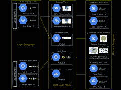

# Appknox 架构-从 AWS 切换到 Google Cloud

> 原文： [http://highscalability.com/blog/2015/5/25/appknox-architecture-making-the-switch-from-aws-to-the-googl.html](http://highscalability.com/blog/2015/5/25/appknox-architecture-making-the-switch-from-aws-to-the-googl.html)

*这是来自 Appknox 的全栈& DevOps 工程师 [dhilipsiva](http://dhilipsiva.com/) 的来宾帖子。*

[Appknox](https://www.appknox.com/) 帮助检测和修复移动应用程序中的安全漏洞。 保护您的应用程序就像提交商店链接一样简单。 我们上传您的应用程序，扫描安全漏洞，然后报告结果。

What's notable about our stack:

*   **模块化设计**。 到目前为止，我们已经对模块进行了模块化，因此我们将前端与后端分离了。 这种架构具有许多优点，我们将在后面的文章中讨论。
*   **从 AWS 切换到 Google Cloud** 。 我们使代码在很大程度上与供应商无关，因此我们能够轻松地从 AWS 切换到 Google Cloud。

## 主要语言

1.  后端的 Python & Shell
2.  前端的 CoffeeScript 和 LESS

## 我们的堆栈

1.  Django 的
2.  Postgres（从 MySQL 迁移）
3.  兔子 MQ
4.  芹菜
5.  雷迪斯
6.  记忆快取
7.  漆
8.  Nginx 的
9.  人的
10.  Google 计算
11.  谷歌云存储

## 架构

### 它是如何工作的？

我们的后端架构由 3 个子系统组成：客户端，数据和工作程序。

### 客户端子系统

客户端子系统由两个不同的负载平衡，自动扩展的 App &套接字服务器组成。 这是所有用户交互的地方。 我们非常注意不要在此处进行任何阻塞调用，以确保将延迟降至最低。

**App Server** ：每个 App 服务器都是单个计算单元，装有 Nginx 和 Django-gunicorn 服务器，由超级用户管理。 用户请求在此提供。 当用户提交其应用程序的网址时，我们会将其提交给 RabbitMQ `download`队列，并立即让用户知道该网址已提交。 如果上载任何应用程序，将从服务器获取签名的 URL。 浏览器将使用此签名 URL 将数据直接上传到 S3，并在完成后通知应用服务器。

**套接字服务器**：每个套接字服务器都是一个装有 Nginx 和一个节点（socket-io）服务器的计算单元。 该服务器使用 Redis 作为其适配器。 是的，当然，这用于实时更新。

### 数据子系统

#### 

该系统用于数据存储，排队和发布/订阅。 这也负责解耦架构。

**数据库群集**：我们使用 Postgres。 不言而喻，它由一个“重写入”母版和几个“重读取”副本组成。

**RabbitMQ** ：我们芹菜工人的经纪人。 对于不同的工人，我们有不同的队列。 主要是`download`，`validate`，`upload`，`analyse`，`report`，`mail`和`bot`。 Web 服务器将数据放入队列，芹菜工作者将其拾取并运行。

**Redis** ：这充当套接字 io 服务器的适配器。 每当我们想要通知用户任何工作人员的更新时，我们都会将其发布到 Redis，Redis 随后将通过 Socket.IO 通知所有用户。

### 工作者子系统

这是所有繁重的起重工作完成的地方。 所有工作人员均通过 Redis 从 RabbitMQ 和已发布更新中获取任务给用户。

**静态扫描仪**：这是一个自动缩放的计算单元组。 每个单位由 4-5 名芹菜工人组成。 每个芹菜工人一次扫描一个应用程序。

**其他任务**：这是一个自动缩放的计算单元组。 每个单位由 4-5 名芹菜工作者组成，他们执行各种任务，例如从商店下载应用程序，生成报告 pdf，上传报告 pdf，发送电子邮件等。

**动态扫描**：这是特定于平台的。 每个 Android 动态扫描程序都是一个按需计算实例，该实例具有 android 模拟器（带有 SDK）和一个捕获数据的脚本。 该模拟器显示在浏览器的画布上，供用户进行交互。 每个 iOS 扫描仪都位于托管的 Mac-Mini 服务器场中，该服务器场具有支持 iOS 平台的脚本和模拟器。

## 选择堆栈的原因

我们选择 **Python** 是因为我们用于扫描应用程序的主要库位于 python 中。 而且，我们比已知的任何其他语言都更喜欢 python。

我们选择 **Django** 是因为它具有模块化功能。

**灰烬**-我们认为这是目前最强大的前端框架。 是的，学习曲线比其他任何曲线都陡峭，但是一旦您爬上那座陡峭的山峰，您将绝对喜欢余烬。 这是很自以为是的。 因此，只要您遵守它的约定，就可以减少编写工作。

**Postgres** -最初，我们选择 MySQL 是因为它是事实。 在甲骨文收购 Sun Microsystems（MySQL 的母公司）之后，MySQL 陷入停滞。 我想我们都期望如此。 因此，我们确实使用了社区维护的 MariaDB（MySQL 的一个分支）。 后来，我们需要持久键值存储，这是 Postgres 开箱即用的。 它在 Python 中发挥的非常好。 我们使用 UUID 作为主键，这是 Postgres 中的本机数据类型。 另外，`uuis-ossp`模块提供了在数据库级别生成和操作 UUID 的功能，而不是在应用程序级别创建它们的功能，这更加昂贵。 因此我们切换到 Postgres。

其余的都是事实。 **RabbitMQ** 用于任务队列。 **Celery** 用于任务管理。 **Redis** 用于发布/订阅。 **Memcached &清漆**用于缓存。

## 事情未按预期进行

未能按预期进行的事情之一是**缩放套接字**。 我们最初使用的是 Django-socket.io。 我们意识到这无法扩展到多个服务器。 因此，我们将其编写为单独的节点模块。 我们使用了支持 Redis-adapter 的节点的 socket-io 库。 客户端连接到节点的套接字服务器。 因此，我们现在从 python 代码发布到 Redis。 Node 只会将通知推送给客户端。 可以独立于充当客户端 JSON 端点的应用程序服务器进行扩展。

## 关于堆栈的显著资料

我们喜欢**模块化设计**。 到目前为止，我们一直在对模块进行模块化，以至于我们将前端与后端分离。 是的，你没有看错。 所有 HTML，CoffeeScript 和 LESS 代码都是独立于后端开发的。 前端开发不需要服务器在运行。 在开发过程中，我们依靠前端设备来获取假数据。

我们的**后端命名为** **Sherlock** 。 我们检测移动应用程序中的安全漏洞。 所以这个名字似乎很贴切。 Sherlock 很聪明。

我们的**前端称为 Irene** 。 还记得艾琳·阿德勒（Irene Adler）吗？ 她美丽，多彩，并告诉我们用户出了什么问题。

我们的**管理员名为 Hudson** 。 还记得哈德森夫人吗？ 夏洛克的女房东？ 考虑到我们应该为可怜的沃森博士扮演什么角色。 也许我们会。

因此，Sherlock 不提供任何 HTML / CSS / JS 文件。 我再说一遍，它**不提供任何单个静态文件/ HTML 文件**。 夏洛克和艾琳都是独立开发的。 两者都有单独的部署过程。 两者都有自己的测试用例。 我们将 Sherlock 部署到**计算实例**，并将 Irene 部署到 **Google Cloud Storage** 。

这种架构的**优势在于：**

1.  前端团队可以**独立于后端的**工作，而无需互相踩脚。
2.  从服务器移除**等繁重的工作，例如在服务器上呈现页面。**
3.  我们可以**开放源代码的前端代码**。 轻松雇用前端人员。 只需要求他们修复存储库中的错误，便可以雇用他们。 毕竟，即使您不开源它，任何人都可以读取前端代码？

## 我们的部署流程

该代码是从`master`分支自动部署的**。 我们遵循 [Vincent Driessen](http://nvie.com/posts/a-successful-git-branching-model/) 的 Git 分支模型。 Jenkins build 提交到`develop`分支。 如果成功，我们将进行另一项手动测试，只是要确保将其与`master`分支合并并自动部署。**

## 最初使用的 AWS。 我们决定使用 Google Cloud 的原因有 3 个。

1.  我们喜欢基于**基于项目的方法来管理不同应用程序的资源**。 它使访问基础架构更加实用。 由于我们的“动态扫描”功能的复杂性，它使识别实例更加容易。
2.  当我们受到打击时，它具有**令人敬畏的文档**，并获得了 Google 工程师的私人 1：1 帮助。
3.  我们收到了一些**重要的 Google 积分**，这有助于我们在早期阶段削减成本。

我始终远离 IaaS 提供商提供的特殊服务。 例如，我们没有使用 Amazon RDS 或 SQS。 配置了我们自己的数据库服务器，RabbitMQ 和 Redis 实例。 这样做的原因是-这些服务相对较慢（且成本较高），并且您的产品依赖于供应商。 我们将所有这些抽象为独立于供应商的。 我们忘了抽象的一件事就是存储。

我们直接消耗了 S3。 当我们尝试迁移到 Google Cloud 时，这只是一个小小的选择。 因此，当我们决定迁移到 Google Storage 时，我们对存储层进行了抽象，并遵循了 Google [Storage Migration docs](https://cloud.google.com/storage/docs/migrating) 的要求。 而且一切正常。 现在，无需更改代码即可将代码库托管在 Google Cloud 和 AWS 上。 当然，您将不得不更改配置。 但不是代码。

感谢您的来信。 因此，迁移到 Google 云的原因就在于此。 但是，需要对第 1 点进行说明。

你说什么意思

“我们喜欢基于“项目”的方法来管理不同应用程序的资源。它使访问基础架构更加务实。由于“动态扫描”功能的复杂性，它使识别实例更加容易。”

谢谢
anand

@anand

你好 这里是“ dhilipsiva”。

对于我们的“动态扫描”功能，我们动态创建一个新实例，进行扫描，并在完成扫描后终止它（出于安全原因）。

在 AWS 中，您将必须创建一个网络接口并将其分配给应该属于同一 VPN 的实例（在创建实例时）。 使用 AWS 时，我们必须等待设备启动，获取 IP 并在启动后继续启动扫描过程。

但是在 Google Cloud 中，无论何时创建实例，该实例都将自动可见，并且对同一 Project 中的其他实例也可以访问[它会自动进行联网]。 而且我们不必检测 IP，我们可以将实例的“名称”用作其他实例的域并进行访问。 IP 不是必需的。 在这种情况下，我们不必等待任何事情。 只需将一些启动脚本放入“动态扫描”实例中，一切便是事件驱动的。

不知道这是否能正确解释这一点，但可悲的是，这就是我可以分享的所有信息：P

您可以寻找 Nginx + lua-resty-redis 而不是 nodejs。
缩放效果更好且非常轻便

嗨，吉里达尔，那是一个非常好的建议。 感谢分享。 一定会调查一下。

架构图未完整显示，工作子系统被隐藏了！如果显示完整，将会更好！