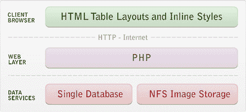
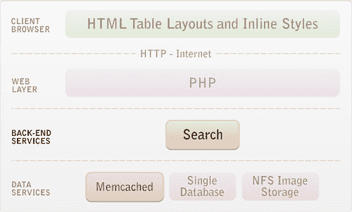
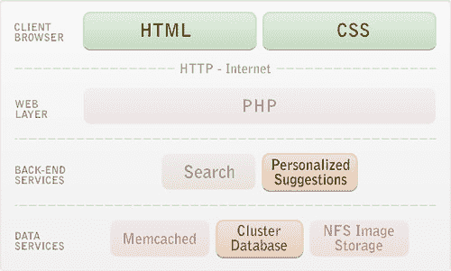
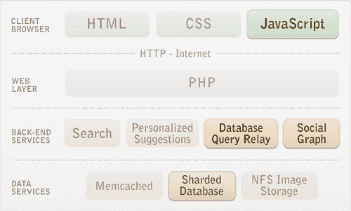
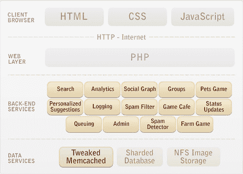

# 标记式架构-扩展到 1 亿用户，1000 台服务器和 50 亿个页面视图

> 原文： [http://highscalability.com/blog/2011/8/8/tagged-architecture-scaling-to-100-million-users-1000-server.html](http://highscalability.com/blog/2011/8/8/tagged-architecture-scaling-to-100-million-users-1000-server.html)

*这是 [Johann Schleier-Smith](http://www.crunchbase.com/person/johann-schleier-smith) 和 CTO &联合创始人 Tagged 的嘉宾帖子。*

## 关于 Tagged 如何扩展到 1,000 台服务器的五个快照

自 2004 年以来，[标记为](http://www.tagged.com/)已从微小的社交实验发展成为最大的社交网络之一，每月向访问与新朋友见面和社交的数百万成员提供 50 亿页。 一次一步，这一演变迫使我们发展自己的体系结构，最终形成了功能强大的平台  。

## V1：PHP Webapp，100k 用户，15 台服务器，2004 年

 

Tagged 诞生于一个孵化器的快速原型文化中，该孵化器通常每年都会推出两个新概念来寻找大赢家。 LAMP 是这种工作方式的自然选择，当 Java 开发主要面向大型企业的开发，Python 吸引了很少的程序员并且 Perl 带来了错误的排序时，LAMP 强调了灵活性和快速的周转时间。 另外，我们知道 Yahoo 是 PHP 的大力支持者，因此有可能在需要时扩展业务。

在以前的项目中运行 MySQL 的丰富经验使我对这项技术产生了深恶痛绝的关系。 本着实验的精神，我们为 Tagged 购买了一些入门级 Oracle 许可证，以了解这样做是否更好。

值得注意的是，仍然建立了许多较小的网站，就像原始的“已标记”一样。 简单有其美，无状态 PHP 和有状态 Oracle 之间的双向划分将最棘手的部分集中在单个服务器中，同时易于添加额外的页面呈现计算能力。

## V2：缓存的 PHP **w** **ebapp，1 百万用户，20 台服务器，2005**

 

即使在 8 台服务器上，Tagged 的 Web 流量也比我们大多数人所知道的要多。 幸运的是，memcached 具有双重优势，可以删除 90％以上的数据库读取，并确保包含各种信息的社交网站页面可以快速呈现。

从一开始，我们的对象缓存就着重于显式缓存更新，而采用了更简单的技术，例如删除无效密钥或基于计时器使过期数据过期。 以更复杂的代码为代价，这大大减少了数据库负载并保持了站点的快速运行，尤其是在涉及到频繁更新的对象时。

除了标准的社交网络功能（朋友，个人资料，消息）外，我们的网站还不断增加复杂性，并增加了搜索和社交发现功能。 我的团队说服我使用 Java 来构建搜索，以便我们可以从 Lucene 库中受益。 当我们学会很好地运行它时，我感到宽慰，而我对 JDK 1.0 的早期经验所产生的不情愿也转化为对该平台的热情。

## V3：数据库可扩展，1000 万用户，100 台服务器，2006 年

 

随时都有 1000 万注册用户和数千在线用户，我们迎接了我一直在恐惧的挑战。 我们刚刚筹集了资金，并且正在为增长而努力，但是数据库的容量正在爆炸。 我们争先恐后地发布了一个缓存或 SQL 调优优化，但是我们服务器的 CPU 会一次又一次地趋向 100％。

扩大规模的想法提供了一个快速解决方案，但是多路服务器硬件可能要花费数百万美元，因此我们选择了 Oracle RAC，这使我们可以使用标准网络连接许多商用 Linux 主机来构建一个大数据库。 结合最新 CPU 的优势，Oracle RAC 的容量比我们的第一台数据库服务器增加了 20 倍，这是至关重要的，并使应用程序开发人员可以专注于构建新功能。

当 Tagged 开始通过将来自大型内存数据集的统计数据缝合在一起来提供个性化的人员匹配建议时，Java 进一步进入了环境，这与 PHP 完全不切实际。

## V4：数据库分片，5000 万用户，500 台服务器，2007 年

 

毫无疑问，对数据库进行分片是扩展 Tagged 中最具挑战性，也是最有意义的一集。 通过将用户分散在多个数据库中，我们最终获得了一种设计，该设计可以在所有地方仅通过添加硬件即可进行扩展。

我们在 Tagged 的规则是将每个表划分为 64 个分区，并且除非有非常有说服力的例外理由，否则我们坚持默认设置。 仅将受益于玩家之间高性能保护交易的某些游戏垂直划分在单独的数据库中。

对现有数据进行分片表示跨数 TB 的复杂转换。 最初，我们一次依靠应用程序代码来替换功能来攻击功能，以替换联接，但最终我们在应用程序的核心遇到了一系列表，这些表对于这种方法过于紧密地联系在一起。 编写迁移软件以生成 SQL，我们使用触发器跟踪源系统上的更改并逐步更新目标，从而导出，转换和重新加载了亿万行，以便最终的同步少于 30 分钟。

具有许多数据库意味着具有许多数据库连接。 尤其是当我们添加了更多的“社交发现”功能（例如我们的第一个约会功能“遇见我”）时，分片将淹没 PHP，后者缺少 Oracle 连接池。 为了解决这个问题，我们构建了一个 Java 应用程序，该应用程序公开了一个用于运行查询的 Web 服务，该应用程序还将继续提供非常方便的监视点并允许正常处理数据库故障。

## V5：完善和扩展功能，8000 万用户，1,000 台服务器，2010 年

 

我们在这里前进了几年。 解决了关键数据库可伸缩性问题后，我们发现通过添加硬件来支持扩展很简单。 PHP 和 memcached 继续为我们服务，并支持快速的功能开发。

在这段时间里，可伸缩性的考虑转向了减少故障，从而解决了越来越多的易碎部件的威胁。 通过负载平衡器运行状况检查和无响应服务的自动关闭，可以保护 Web 层免于依赖项的问题。 我们还设计了核心组件以提高弹性，例如，如果 memcached 的连接过载，则必须在减轻负担后立即恢复。

Java 发挥了更加重要的作用，部分原因是接受度和专业知识的提高，但挑战也日益增加。 为了与垃圾邮件和其他滥用作斗争，我们的算法利用了大容量共享内存空间以及计算密集型技术。 社交游戏也得益于 Java 的性能和并发控制，但是代价是复杂性高。 我们现在需要比以前管理更多不同的应用程序池。

## 未来

如今，Tagged 每月向其数百万成员提供 50 亿页面浏览量。 由于我们已经实现了可扩展的设计，因此我们可以将大部分精力花在创建更好地为用户服务的功能上。 我们拥有创建可扩展软件的有效工具，但是可以想象会有更好的工具，因此当前的投资重点是软件库，以提高程序员的效率和生产率，而我们即将开发的开源，基于图形的数据库项目 [Stig](http://www.stigdb.org) 适用于大型社交网络，实时服务和云应用程序。

## 相关文章

*   [Johann Schleier-Smith 对 theCube 的采访](http://siliconangle.tv/video/johann-schleier-smith-cto-cofounder-tagged)

PHP 和 Oracle 数据库用户（如 Tagged）的经验导致 Oracle Database 11g 的“数据库常驻连接池”功能。 PHP 现在具有可与 Oracle 数据库一起使用的本机连接池，从而使其具有高度可伸缩性，而无需早期先驱者必须实施的中间解决方案。 关于 PHP 和 Oracle DRCP 的白皮书为： [PHP 可伸缩性和高可用性：数据库常驻连接池和快速应用程序通知](http://www.oracle.com/technetwork/topics/php/whatsnew/php-scalability-ha-twp-128842.pdf)。

享受了这种架构的失败，对非 OSS 堆栈可伸缩系统进行了有趣的研究。

以我的经验，如果您使用 Oracle 的任何东西来尝试“省钱”，您可能犯了一些更深层次的错误。 其中很大一部分可能是出于非操作性原因而不选择 MySQL。

从长远来看，Oracle 的主要问题是对其平台的大量锁定。 您将无法轻松地从 Oracle 迁移过来，尤其是当您使用 Java 存储过程之类的更独特（且公平，有用的）功能时。 加上他们对自己的企业级 Linux 的热爱，当您吸引 2 亿或 3 亿用户时，确实会使您的财务困难。

另一方面，如果它能正确完成工作，并且您的长期扩展和性能不受影响，那么如果您拥有知道如何使用它的人，那么任何工具都将是不错的选择。

这很有趣。 节目的王者是 Java，而那个家伙坚持在每张图中都贴上“ PHP”。 那就是您的“架构”。

您可能会认为 Oracle 现在已经为您完成了扩展。 考虑到吹牛他们可以在两个 Exadata 系统上运行 Facebook，那么为什么对于带标签的它开箱即用呢？ 还是仅当您立即购买 Exa 东西时才起作用，还是根本不起作用？ 有任何信息/见解吗？

PHP 在 Apache 前叉模式下运行，即作为独立进程运行，这在高度可扩展的世界中是相对异常的。 该过程模型意味着 Oracle 的传统基于线程的中间层池解决方案不适用于 PHP。 在 Oracle DB 11g 中引入 Oracle DRCP 连接池之前，被标记为先驱者并实现了其池解决方法，有关链接，请参见我先前的评论。 DRCP 之所以有效，是因为连接池是在数据库服务器上处理的，因此可以在中间层进程和应用程序服务器之间共享该池。 白皮书显示了一个基准，该基准具有由商品服务器上的数据库处理的数以万计的 PHP 连接。

JDK 1.0，太慢了。
但是 JDK 1.6 更好。
并且您不应该在 1.0 版中想象...看一下 JDK 5 或 6。