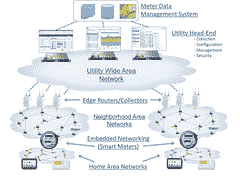

# 需要物联网吗？ 这是美国一家主要公用事业公司从 550 万米以上收集电力数据的方式

> 原文： [http://highscalability.com/blog/2015/9/7/want-iot-heres-how-a-major-us-utility-collects-power-data-fr.html](http://highscalability.com/blog/2015/9/7/want-iot-heres-how-a-major-us-utility-collects-power-data-fr.html)

*我偶然发现了 [理查德·法利（HT。 关于](https://www.linkedin.com/in/drfarley) [高级计量基础架构](https://en.wikipedia.org/wiki/Smart_meter) 在加利福尼亚如何工作的说明。 这是真正的物联网领域。 因此，如果没有典型的职位结构，这就是原因。 他慷慨地允许通过一些修改将其重新发布。 当您看到“美国主要公用事业”时，请用最有可能的加利福尼亚电力公司代替它。*

旧的机械仪表的轴承会随着时间的流逝而磨损，并产生摩擦力，从而导致读数下降。 这种摩擦将导致模拟仪表的旋转速度慢于其应有的速度，从而导致读数低于实际使用情况-从而产生“自由功率”。 这就像时钟在齿轮磨损之后落后时间。

对于 *美国主要公用事业* 当您的电表由于某种原因而无法读取时，会发生“估计计费”。 [CPUC](http://www.cpuc.ca.gov/PUC/documents/codelawspolicies.htm) 认可的算法几乎总是对消费者有利。 *美国主要公用事业公司* 讨厌必须进行估算的帐单，因为它们几乎总是必须根据算法和 CPUC 规则进行低估。 并非 100％对此表示肯定，但是如果他们低估了这一点，他们就不得不承担成本。 在极少数情况下，他们高估了您的收入（例如，您在错过的假期中正在休假），那么您将在下一个结算周期被“烦恼”。

*美国主要公用程序* 并未实时显示您的实际使用情况。 对于那些对螺母和螺栓感兴趣的人，以下是 *美国主要公用事业* 的 AMI 系统的工作方式（AMI 是高级计量基础设施的缩写）：

*   家用电表每小时测量一次过去一小时的用电量，并将其（加密）存储在电表中。 对于商用电表，每 15 分钟进行一次测量。

*   取决于实际的仪表制造商（ *美国主要公用事业* 使用多个），它可能还会记录其他传感器数据，例如温度和电压。

*   您的电表已连接到网状网络，该网络包括邻居的所有电表以及多个“接入点”，类似于您在家中为 WiFi 网络运行的网络。 通讯是视线，范围约为数百码。

*   您的仪表具有全球唯一的 IPv6 地址，该地址是非常大型的 IPv6 网络的一部分。

*   接入点通常位于电线杆的顶部，并为相当大的区域提供服务-*美国主要公用事业*在整个北部和中部 Ca 拥有约 2,000 家，为 550 万户家庭和企业提供服务。

*   如果您的仪表无法直接连接到接入点，它将通过附近的仪表进行中继。 实际上，大多数仪表至少要经过几跳才能到达接入点，而仪表的传输中很大一部分实际上是在中继相邻流量。 网格非常有弹性，可以根据网络中的故障自动进行重组。

*   接入点通常通过蜂窝网络（有时是卫星，有时甚至是以太网）连接到主要在西海岸的多个数据中心。

*   数据中心每 4 个小时与您的电表建立连接，并下载自上次下载以来记录的所有电表数据。 这些通信都是加密的。

*   这一切都非常迅速-在 30 分钟内*，美国主要的* *实用程序*已读取了 550 万米中的 95％以上。 每个仪表的读取时间通常不到一秒钟。

*   AMI 系统为计费系统提供数据。 *美国主要公用事业* 每天使用数小时内从电表下载的最新数据，向约 5％的客户发送账单。 使用手动抄表功能，距离 *最近的读数已经过了几天甚至几周，美国的主要公用事业公司* 能够发出账单并取钱。 “现金到现金”时间。

您的仪表还有一个电容器，如果您失去市电，它有时间发送“最后一声”消息。 *美国主要公用事业* （通常）知道断电的时间。 通常，这些最后的喘息消息会在 80％的时间内通过>，但它会因区域密度和拓扑结构而异。 成功率部分取决于消息必须中继通过多少个相邻仪表。 当您的电源中断时，通常也对大多数邻居起作用，因此中继链可能会断开。 在停电的边缘，相邻的电表仍然有电，成功会更好。

许多公用事业公司每 15 分钟测量一次住宅用电量，一些试点项目正在每 15 秒进行一次测量，从而启用了所谓的“负载分解”分析功能，即能够根据其使用情况识别单个设备的使用情况 电源签名，甚至确定何时出现设备问题，例如冰箱压缩机坏了。 您可能会想到，这会生成大量数据，以及一些严重的隐私问题！

## 相关文章

*   [关于 HackerNews](https://news.ycombinator.com/item?id=10182054)

很酷。

非常有趣的阅读，谢谢！