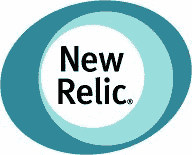

# 新的文物建筑-每天收集 20 亿多个指标

> 原文： [http://highscalability.com/blog/2011/7/18/new-relic-architecture-collecting-20-billion-metrics-a-day.html](http://highscalability.com/blog/2011/7/18/new-relic-architecture-collecting-20-billion-metrics-a-day.html)

*这是 New Relic 应用性能工程师 [Brian Doll](/cdn-cgi/l/email-protection#0e6c7c676f604e606b797c6b62676d206d6163) 的来宾帖子。*

New Relic 的多租户 SaaS Web 应用程序监视服务持续不断地每秒收集并保存超过 100,000 个指标，同时仍提供 1.5 秒的平均页面加载时间。 我们相信，良好的体系结构和良好的工具可以帮助您处理大量数据，同时仍然提供非常快速的服务。 在这里，我们将向您展示我们如何做到的。

*   新遗物是应用程序性能管理（APM）即服务
*   应用内代理检测（字节码检测等）
*   支持 5 种编程语言（Ruby，Java，PHP，.NET，Python）
*   全球监控超过 175,000 个应用程序进程
*   10,000+客户

## 统计资料

*   每天收集超过 20 亿个应用程序指标
*   每周收集超过 1.7 亿个网页指标
*   每个“时间片”指标约为 250 个字节
*   每秒插入 10 万个时间片记录
*   每天有 70 亿条新数据行
*   由 9 个分片的 MySQL 服务器处理的数据收集

## 架构概述

*   语言特定的代理（Ruby，Java，PHP..NET，Python）每分钟一次将应用程序指标发送回 New Relic
*   “收集器”服务提取应用程序指标并将其保存在正确的 MySQL 分片中
*   实时用户监控 javascript 代码段针对每个页面浏览将前端性能数据发送到“信标”服务
*   客户登录 http://rpm.newrelic.com/查看其性能仪表板
*   我们每天收集的数据量惊人。 最初，每个指标均以全分辨率捕获所有数据。 随着时间的流逝，我们会对数据进行定期处理，从每分钟到每小时，再到每天平均。 对于我们的专业帐户，我们会无限期地存储每日指标数据，因此客户可以看到他们在长期内的改进情况。
*   我们的数据策略针对读取进行了优化，因为我们的核心应用一直需要按时间序列访问指标数据。 为了使数据保持最佳状态以实现更快的读取速度，更容易在写操作上付出代价，以确保我们的客户可以在一天中的任何时间快速访问其性能数据。 通过将客户分布在多台服务器上，可以对数据库进行分片。 在每个服务器中，每个客户都有单独的表，以使客户数据在磁盘上保持紧密并保持每个表的总行数减少。
*   New Relic 管理用于监视系统的多种警报。 客户可以设置其 APDEX 分数和错误率的阈值。 New Relic 还具有可用性监视功能，因此客户可以在短短 30 秒内收到停机事件的警报。 我们主要发送电子邮件警报，使用我们的 PagerDuty.com 集成向多个客户发送电子邮件，并通过 SMS 集成进行更复杂的通话轮换。
*   让我们从客户请求一直到 New Relic 堆栈进行一次 Web 交易。
    1.  最终用户查看 Example.com 上的页面，该页面使用 New Relic 监视其应用程序性能
    2.  运行 Example.com 的应用程序运行时已安装了 New Relic 代理（适用于 Ruby，Java，PHP，.NET 或 Python）
    3.  为每个事务捕获详细的性能指标，包括每个组件花费的时间，数据库查询，外部 API 调用等
    4.  这些后端指标在客户的 New Relic 代理中保留最多一分钟，然后将其发送回 New Relic 数据收集服务。
    5.  同时，嵌入在网页中的是新的 Relic 真实用户监控 JavaScript 代码，该代码可跟踪这种单一客户体验的性能
    6.  在客户的浏览器中完全呈现页面后，New Relic 信标会收到一个请求，其中提供了有关后端，网络，DOM 处理和页面呈现时间的性能指标。
    7.  在 Example.com 上工作的工程师登录到 New Relic，并查看了最新的应用程序性能指标以及每位客户的最终用户体验，包括浏览器和地理信息。

## 平台

### 网页界面

*   Ruby on Rails
*   Nginx 的
*   的 Linux
*   2 个@ 12 核心 Intel Nehalem CPU 带 48Gb RAM

### 数据收集器和 Web 信标服务

*   爪哇
*   码头上的 Servlet
*   应用指标收集器：每分钟 180k +请求，在 3 毫秒内响应
*   Web 指标信标服务：每分钟 200k +请求，在 0.15 毫秒内响应
*   使用 Percona 构建的 MySQL 分片
*   的 Linux
*   9 @ 24 核 Intel Nehalem，带 48GB RAM，SAS 附加 RAID 5
*   裸机（无虚拟化）

### 有趣的 MySQL 统计资料：

*   New Relic 每小时为每个帐户创建一个数据库表以保存度量标准数据。
*   该表策略针对读取和写入进行了优化
*   始终需要在特定的时间窗口内基于特定帐户的一个或多个指标来绘制图表
*   指标（指标，代理，时间戳）的主键允许来自特定代理的特定指标的数据一起位于磁盘上
*   随着时间的推移，当创建新表时，这会在 innodb 中创建更多页面拆分，并且 I / O 操作会在一小时内增加
*   新帐户将以循环方式分配给特定的分片。 由于某些帐户比其他帐户大，因此有时会将分片从分配队列中拉出，以更均匀地分配负载。
*   由于表中包含如此多的数据，因此无法进行模式迁移。 而是使用“模板”表，从中创建新的时间片表。 新表使用新定义，而最终从系统中清除旧表。 应用程序代码需要注意多个表定义可能一次处于活动状态。

## 挑战性

*   数据清除：汇总指标和清除粒度指标数据是一个昂贵且几乎连续的过程
*   确定哪些指标可以预先汇总
*   大帐户：一些客户拥有许多应用程序，而另一些客户拥有数量惊人的服务器
*   MySQL 优化和调整，包括操作系统和文件系统
*   I / O 性能：裸机数据库服务器，每个帐户表与大型表的读取性能
*   负载均衡碎片：大帐户，小帐户，高利用率帐户

## 得到教训

*   New Relic 使用 New Relic 监视自己的服务（临时监视生产）
*   旨在随时提高运营效率和简化操作
*   保持苗条。 New Relic 拥有约 30 名工程师，为 1 万名客户提供支持
*   时髦！=可靠：高性能系统有许多重要但无聊的方面，但并不是所有时髦的解决方案都可以解决。
*   使用合适的技术来完成工作。 New Relic 主要 Web 应用程序始终是 Rails 应用程序。 数据收集层最初是用 Ruby 编写的，但最终被移植到 Java。 导致此更改的主要因素是性能。 该层目前每分钟支持超过 18 万个请求，并在大约 2.5 毫秒内做出响应，并具有足够的扩展空间。

## 相关文章

*   [如何在仅 9 台服务器上构建具有类似 Twitter 吞吐量的 SaaS 应用程序](http://www.slideshare.net/newrelic/how-to-build-a-saas-app-with-twitterlike-throughput-on-just-9-servers)作者：Lew Cirne

> >为每个事务捕获详细的性能指标，包括在每个组件中花费的时间，数据库查询，外部 API 调用等

这种仪器的开销是多少？ 就延迟而言？

感谢您的详细帖子

几个问题

1.你做后写吗？ 有关的任何细节。 哪种工具/技术
2.有关“负载平衡分片”的更多详细信息将有所帮助
3.为什么选择 Java 而不是 Rails ...特定的性能原因。

谢谢。

> 在每个服务器中，每个客户都有单独的表，以使客户数据在磁盘上保持紧密并保持每个表的总行数减少。

也许他们不知道文件系统如何工作？ 除非您预分配了该块，否则它将像其他所有文件一样随文件的增长而随机写入磁盘。 他们似乎认为，通过使用“ innodb_file_per_table”选项将其放入自己的表中并不保证文件会在磁盘上聚集。

@Hrish：“这种检测的开销是多少？就延迟而言？”

我们不断监控仪器的开销，并确保其开销尽可能低。 开销因应用程序而异，但通常在 5％的范围内。 与不了解生产系统的机会成本相比，这种开销显得微不足道。 我已经看到许多公司在使用 New Relic 的短短几天内就大大缩短了他们的响应时间，因此开销远远超过了其本身。

@Subhash：
1.您是否在后面写？ 有关的任何细节。 哪种工具/技术

不，我们不做后写。

2.有关“负载平衡分片”的更多详细信息将有所帮助

我们采用经典的分片模式，因为客户指标对他们来说是唯一的，并且我们不需要在各个帐户之间引用指标。 理想情况下，我们希望将负载分配到每个分片上。 在这种情况下，负载既指数据量（在给定时间段内每个分片接收多少数据），也指查询量（那些客户访问其指标的积极程度）。 我们每个帐户允许无限数量的用户，因此某些帐户有许多用户一次访问其性能数据。 我们一起研究这些指标以及诸如 CPU 和内存之类的系统指标，以确定负载在整个分片上的分布情况。

我们以循环方式将新帐户分配给特定的分片。 这听起来非常简单，而且确实如此。 这里的过早优化可能需要付出很大的努力才能进行管理，而带来的好处却很小。 您只是无法确定注册新帐户后的忙碌程度。 我们会不时注意到特定的分片比其他分片更忙。 这可能是由于新帐户非常庞大，或者是由于现有帐户利用率提高。 为了帮助平衡分片，我们只从分配队列中删除该分片，因此暂时不会获得任何新帐户。 由于我们一直在注册新帐户，因此其余的碎片将赶上来，我们将其重新添加。

我已经与几个为具有类似数据需求的公司在生产中运行分片的人交谈过，看来这种方法相当普遍。 正如他们所说，做最简单的事情就可以了:)

3.为什么选择 Java 而不是 Rails ...特定的性能原因。

用于数据收集的服务端点已从 Ruby 移植到 Java。 这些服务非常强大，并且不会经常更改。 他们需要从成千上万个应用程序实例中获取指标数据，并将其放入正确的分片中的正确的数据库表中。 除了耐用性，这些保养的最重要特征是原始速度。 使用当前的 ruby 实现，根本不可能与 Java servlet 竞争速度和效率。 我们的 Real User Monitoring 信标服务（作为 Java Servlet 部署）的响应时间为 0.15 毫秒。 十五分之一毫秒！ 这是每分钟 280k +请求。

您特别强调数据库服务器是裸机。 这是否意味着其他内容已虚拟化？
我很惊讶您确实运行自己的服务器。 我一直以为您是那些早期的云采用者之一。 :)

您是否在单个数据中心中运行？ 您如何处理高可用性？

“ [开销]通常在 5％的范围内”

除非有人指出执行的检测程度和检测到的主要组件的等待时间，即一个非常慢的 Rails 应用程序甚至更慢的数据库访问，否则这毫无意义。

与其他产品的单位成本相比，NewRelic 的速度要慢近 10,000-100,000 倍。
http://williamlouth.wordpress.com/2011/03/17/which-ruby-vm-consider-monitoring/

顺便说一句，我想知道如何将 NewRelic 下面的屏幕截图中的多个 SQL 语句打包成 250 个字节。
http://williamlouth.wordpress.com/2010/03/02/does-transaction-tracing-scale-analysis/

我认为您还应该指出，考虑到发送之前在 1 分钟的示例窗口中对高级度量聚合进行了批处理，因此所测量的页面数与对服务的入站调用数不同。

如果您打算从事 APM 业务，那么您至少可以尝试对数字的实际含义和关联性进行准确和更加透明的了解。

您是否曾经考虑过使用 Mysql Cluster？ NDB？ 无需分片即可立即获得巨大的读取/写入可扩展性。

我们一直在使用 Galera 群集来处理 1440K 更新，每分钟有足够的净空。

顺便说一句，恭喜并感谢您分享非常有用的信息。