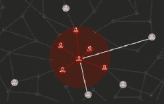

# 在不到五分钟的时间里，Facebook 如何告诉您的朋友您在灾难中很安全

> 原文： [http://highscalability.com/blog/2015/9/28/how-facebook-tells-your-friends-youre-safe-in-a-disaster-in.html](http://highscalability.com/blog/2015/9/28/how-facebook-tells-your-friends-youre-safe-in-a-disaster-in.html)

*这是文章更新： [Facebook 的安全检查如何进行](http://highscalability.com/blog/2015/11/14/how-facebooks-safety-check-works.html)。*

在灾难中，迫切需要立即了解您所爱的人的安全。 在 9/11 期间，我有这种感觉。 我知道在我们地区的下一场野火中，我会有这种感觉。 我生动地记得在 [1989 年洛马普里埃塔地震](https://en.wikipedia.org/wiki/1989_Loma_Prieta_earthquake) 期间的感觉。

大多数地震都没有引起注意。 不是这个，每个人都知道。 在计算机实验室中，天花板不再像雪花一样飘落下来之后，我们确信建筑物不会倒塌，所有想法都转向了亲人的安全。 就像其他人必须拥有的一样。 拨打电话几乎是不可能的，因为电话从全国各地涌入湾区，所以所有电话线都很忙。 信息被卡住了。 由于电视显示出持续不断的死亡和破坏，许多无聊的时光被浪费了。

25 年后的今天，我们还能做得更好吗？

Facebook 可以。 通过名为 [安全检查](https://www.facebook.com/about/safetycheck/) 的产品，该产品在灾难期间将亲朋好友联系在一起。 发生灾难时，“安全检查”会提示该地区的人员指示他们是否还可以。 然后，Facebook 通过告诉他们的朋友们如何做来结束担忧循环。

[Facebook 工程师经理 Brian Sa](https://www.linkedin.com/pub/brian-sa/2/7a7/a3b) 根据 2011 年日本福岛 [毁灭性地震的经历创建了安全检查](http://www.telegraph.co.uk/news/worldnews/asia/japan/8953574/Japan-earthquake-tsunami-and-Fukushima-nuclear-disaster-2011-review.html) 。 他在@Scale 发表的演讲中讲述了自己的故事，这是他感人至深的故事。

地震期间，布莱恩（Brian）在 Facebook 上张贴了一条标语，提供了有用的信息来源，但他被感动找到了一种更好的方式来帮助有需要的人。 那一刻成为安全检查。

我对安全检查的第一反应是该死，为什么以前没有人想到这个？ 这是一个强大的主意。

当我听 [相同视频](https://www.youtube.com/watch?v=ptsCWGZW_P8) 和 [Peter Cottle ]](https://www.linkedin.com/pub/peter-cottle/a/961/387) ，Facebook 的软件工程师，他还谈到了建筑安全检查。

可能只有 Facebook 可以创建安全检查。 此观察与 Brian 在演讲中的主要课程很好地吻合：

*   **以只有您可以** 的方式解决实际问题。 与其走传统路线，不如想想您和您的公司可以扮演的独特角色。

只有 Facebook 可以创建安全检查，不是因为您可能会想到资源，而是因为 Facebook 允许员工进行诸如安全检查之类的疯狂事情，并且因为只有 Facebook 拥有 15 亿地理分布的用户，而他们之间只有一定程度的分离 4.74 条优势，只有 Facebook 拥有狂热于阅读新闻源的用户。 稍后再详细介绍。

实际上，Peter 在 Facebook 的产品开发 Catch-22 中谈到了资源是如何成为问题的。 安全检查小组很小，没有很多资源。 他们必须先构建产品并在没有资源的情况下证明其成功，然后才能获得构建产品的资源。 必须在不花费大量金钱和资源的情况下大规模有效地解决该问题。

通常情况下，约束条件导致了一个明智的解决方案。 一个小的团队无法建立庞大的管道和索引，因此他们编写了一些骇人听闻的 PHP 并有效地大规模完成了这项工作。

那么 Facebook 如何建立安全检查？ 这是我对 Brian 和 Peter 的演讲的掩饰：

*   您可以将 Facebook 视为这种巨大的原始汤。 数十亿人使用 Facebook，随着时间的流逝，各种行为开始浮出水面，有些趋势在不断蔓延。

    *   一个病毒性的例子是用户如何开始将自己的个人资料图片更新为红色的平等标志，以表示婚姻平等。

    *   在支持下，Facebook 建立了 Rainbow 覆盖工具，使使用个人资料图片进行交流变得更加容易。 这种做法最早起源于 Facebook。 在发明状态消息之前，用户将更改其个人资料图片以传达其当前的时代精神。

    *   轻松自定义个人资料图片**的采用率提高了 1000 倍**。

*   这使他们有了 **的概念，使人们在灾难中更容易告诉朋友他们还可以** 。

    *   在灾难期间，人们会更新状态，说他们还可以。

    *   这不是让人们知道您还可以的问题的理想解决方案。

    *   它不是很结构化。 双向都有问题，告诉人们您没事的方向，而您的朋友得到您没事的信息。

    *   首先，不是所有的朋友都能看到此更新。

    *   第二，用户无法获取受灾难影响的所有朋友的名单。

    *   在灾难状态通知问题上应用更加结构化的思想导致 [安全检查](https://www.facebook.com/about/safetycheck/) 。

*   工作原理：

    *   如果您身处灾区，Facebook 会给您发送推送通知，询问您是否还可以。 （关于灾难发生的时间由谁决定什么也没说）。

    *   轻按“我很安全”按钮表示您很安全。

    *   通知所有朋友您安全。

    *   朋友还可以查看受灾影响的所有人员及其生活状况的列表。

*   您如何在特定区域中建立受灾难影响的人员群体？ 建立地理索引是显而易见的解决方案，但是它有缺点。

    *   人们在不断移动，因此索引会过时。

    *   拥有 15 亿人口的地理索引非常庞大，并且会占用很多他们没有的资源。 请记住，这是一个很小的团队，没有大量资源来尝试实施解决方案。

    *   该解决方案应该始终在发生事件时才起作用，而不是一直保持活动状态很少使用的数据管道。 这要求能够进行动态 **动态即时** 查询。

*   解决方案 **利用社交图的形状及其属性** 。

    *   如果发生灾难，例如尼泊尔的地震，则在每个新闻提要负载 中都会打开 **安全检查钩。**

    *   **人们检查其新闻提要时，挂钩将执行**。 如果检查新闻源的人不在尼泊尔，那么什么也不会发生。

    *   当尼泊尔某人查看其新闻时，就是发生魔术的时候。

    *   安全检查 **在社交网络上向所有好友** 狂热。 如果朋友在同一地区，则将发送推送通知，询问他们是否可以。

    *   **该过程保持递归重复** 。 对于在灾区找到的每个朋友，都会派出工作来检查他们的朋友。 通知根据需要发送。

*   实际上，该**溶液是** **非常有效的**。 因为该算法能很快地找到人，所以产品体验让人感到实时和即时。 例如，同一房间中的每个人似乎都会同时收到他们的通知。 为什么？

    *   使用新闻提要会给用户提供**随机抽样，偏向于最活跃的用户** **和最多的朋友**。 并且它过滤掉不活动的用户，这是数十亿行不需要执行的计算。

    *   **图是密集且互连的** 。 [六度凯文·培根](https://en.wikipedia.org/wiki/Six_Degrees_of_Kevin_Bacon) 是错误的，至少在 Facebook 上是这样。 Facebook 的 15 亿用户中，任意两个用户之间的 **平均距离为 4.74 边缘** 。 抱歉，凯文。 拥有 15 亿用户，整个图表可在 5 跳内进行浏览。 通过遵循社交图谱可以有效地联系到大多数人。

    *   使用社交图谱方法免费提供了 **许多并行性** 。 可以将好友分配给不同的计算机并进行并行处理。 他们的朋友一样，依此类推。

*   **竞争条件成为问题的解决方案** 对解决方案的分布式性质造成了影响。

    *   两个不同数据中心中的两台机器的用户与同一个人成为朋友。 这意味着要遍历两个边缘，最终会向同一个人发送两个通知。

    *   认为这没什么大不了的，但实际上，用户发现在灾难情况下获得多个通知确实压力很大。 用户认为如果他们同时收到两个通知，他们一定会遇到麻烦。 而且，您也不希望与安全相关的项目在灾难中感到车祸。

    *   数据库用于存储状态，因此只有一台计算机可以检查用户。 问题是当您有多个数据中心时，例如在欧洲一个在美国，一个在美国，则传播延迟使确定用户是否正在处理的时间过长。

    *   为两层解决方案添加了内存中锁定结构。 检查内存中锁定，如果为用户设置了该位，则该用户的作业将中止。

*   最大的产品推出是针对尼泊尔地震。

    *   在不到 5 分钟的时间内，邀请了 300 万人发表他们的身份。 尼泊尔的人口太多，因此要检查 10 亿行。

    *   **在大约 5 分钟内浏览了 Facebook 用户群的 2 / 3rd** 。

*   在构建安全检查的第一个版本时遇到一些问题。

    *   台式机，移动网络和本机应用程序的碎片化在跨多个平台管理内容，功能和操作方面造成了极大的复杂性。

    *   想要个性化需要手动编码的内容，该编码缓慢，乏味且容易出错。

    *   当系统仅在紧急情况下处于开机状态时，很难判断它是否在紧急情况下可以正常工作。

    *   那么，为了构建一个跨平台但仍然可以本地响应的系统，应该采用哪种客户端-服务器模型？ 如何包含动态内容？ 如何测试系统以确保其可靠性？

*   选择让服务器负责文本和图像以及配置信息。 客户端将预取数据，处理实时失效，并本地响应客户端事件。

*   实时失效。

    *   每当您处理预取的数据时，务必指定该数据应何时过期。 例如，如果用户打开该应用程序并上传了一些数据，则他们关闭该应用程序并仅在几天后打开它。 如果上载的数据是选举公告，则如果选举通过，则用户不应看到该公告。

    *   TTL（生存时间）参数告诉客户端在需要刷新数据之前可以使用数据多长时间。

    *   交互计数指示用户可以与数据交互多少次。

    *   更多可选的过滤器，例如：remaining_battery_percentage，如果设备电量不足，它将告诉客户端不要向用户显示消息。

*   强制执行内容限制

    *   指定文本中的最大行数不是一个好主意。 字符串翻译成其他语言时，可能会急剧增长。

    *   不同的平台和设备具有不同的屏幕尺寸，因此一个固定的限制无效。

    *   因此，请在服务器上定义内容长度限制，并内置一个缓冲区以应对较长的翻译。

*   动态内容

    *   这样可以对安全检查消息进行个性化设置，例如在文本中插入用户名。

    *   提出了一种语言，例如邮件合并，以指定诸如“危机名称”和“危机 URL”之类的替代词。

*   正缓存

    *   您记得以前符合资格的单位

    *   安全检查是与用户保持固定通信渠道的设备类型。 对于事件持续时间，没有视图限制。 如果在星期五将其打开，则将持续交付直到星期五将其关闭。

    *   正向缓存有利于长期运行的单元，因为您无需评估任何单元的资格。 您确实需要检查缓存单元的资格，因为您不想显示它超出预期的时间。

*   负缓存

    *   您记得没有单位合格的地方。

    *   琥珀色警报是一次性消息。 这种类型的设备的负载曲线确实不同。 例如，如果它是在上午 8:50 开启的，那么在上午 9:00 之前它已经达到峰值投放，然后衰减很快。 一小时内达到了一半的人，三小时内几乎达到了所有目标受众。

    *   负缓存有利于短期运行的单元，因为在大多数情况下，没有可显示的单元。 负缓存记住了这一事实。

*   黑暗发射

    *   使用实时流量测试了系统，以发现意外问题。 使用了一个标志使它对用户隐藏，因此不会对用户造成影响。

    *   运行测试 24 小时发现了一些意外问题。 产生社交句子的子系统之一的容量不足。

*   终止开关

    *   Facebook 由数百个联锁系统组成。

    *   有时，在发生灾难性故障的情况下，您需要快速减轻负载。

    *   Kill 开关使您可以完全关闭整个系统。 您还可以杀死特定的应用程序版本或设备。

## 相关文章

*   [上 reddit](https://www.reddit.com/r/tech/comments/3mq29e/how_facebook_tells_your_friends_youre_safe_in_a/)