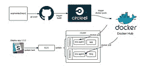
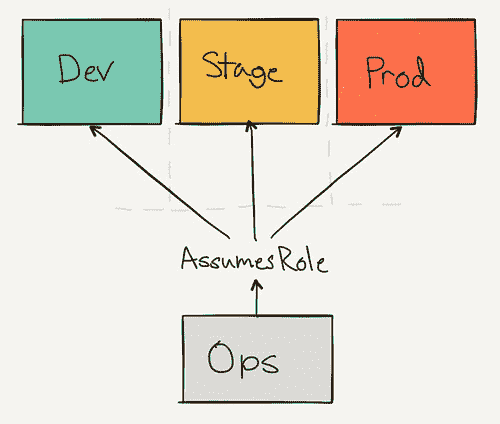
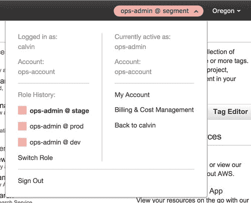
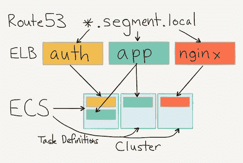
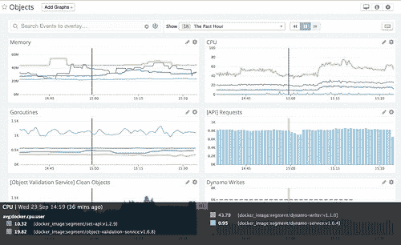
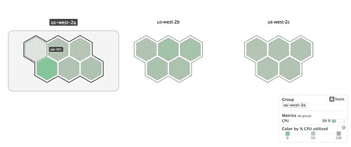

# 细分：使用 Docker，ECS 和 Terraform 重建基础架构

> 原文： [http://highscalability.com/blog/2015/10/19/segment-rebuilding-our-infrastructure-with-docker-ecs-and-te.html](http://highscalability.com/blog/2015/10/19/segment-rebuilding-our-infrastructure-with-docker-ecs-and-te.html)



*这是[段](https://www.linkedin.com/in/calvinfo)的 CTO /联合创始人 [Calvin French-Owen](https://www.linkedin.com/in/calvinfo) 的来宾[重新发布](https://segment.com/blog/rebuilding-our-infrastructure/)。*

在 Segment 成立之初，我们的基础设施遭到了相当大的破坏。 我们通过 AWS UI 设置了实例，拥有未使用的 AMI 的墓地，并且通过三种不同的方式实现了配置。

随着业务开始腾飞，我们扩大了 eng 团队的规模和体系结构的复杂性。 但是，只有少数知道神秘奥秘的人才能从事生产工作。 我们一直在逐步改进流程，但是我们需要对基础架构进行更深入的检查，以保持快速发展。

所以几个月前，我们坐下来问自己：*“如果今天设计基础架构设置会是什么样？”*

在 10 周的过程中，我们完全重新设计了基础架构。 我们几乎淘汰了每个实例和旧配置，将服务移至可在 Docker 容器中运行，并切换到使用新的 AWS 账户。

我们花了很多时间思考如何制作可审核，简单易用的生产设置，同时仍具有扩展和增长的灵活性。

这是我们的解决方案。

## 单独的 AWS 账户

我们没有使用区域或标签来分隔不同的暂存和生产实例，而是切换了完全独立的 AWS 帐户。 我们需要确保我们的配置脚本不会影响我们当前正在运行的服务，并且使用新帐户意味着我们一开始就有空白。

 

`ops`帐户用作跳转点和集中登录。 组织中的每个人都可以拥有一个 IAM 帐户。

其他环境具有一组 IAM 角色，可以在它们之间进行切换。 这意味着我们的管理员帐户只有一个登录点，并且只有一个位置可以限制访问。

例如，爱丽丝可能可以访问所有三个环境，但是鲍勃只能访问开发人员（因为他删除了生产负载平衡器）。 但是它们都通过`ops`帐户输入。

无需复杂的 IAM 设置来限制访问，我们可以轻松地按环境锁定用户并按*角色将其分组。* 通过界面使用每个帐户就像切换当前活动角色一样简单。

 

不必担心暂存盒可能不安全或会更改生产数据库，我们免费获得*真正隔离*。 无需额外配置。

能够共享配置代码的另一个好处是，我们的登台环境实际上可以反映产品。 配置上的唯一区别是实例的大小和容器的数量。

最后，我们还启用了各个帐户的合并结算。 我们使用相同的发票支付每月帐单，并查看按环境划分的费用的详细分类。

## Docker 和 ECS

设置好帐户后，就可以设计服务的实际运行方式了。 为此，我们转向了 [Docker](https://docker.com/) 和 [EC2 容器服务（ECS）](https://aws.amazon.com/ecs/)。

截至今天，我们现在在 Docker 容器中运行我们的大多数服务，包括我们的 API 和数据管道。 容器每秒接收数千个请求，每月处理 500 亿个事件。

Docker 最大的单一好处是在一定程度上使团队能够从头开始构建服务。 我们不再需要复杂的配置脚本或 AMI，只需将生产集群交给一个映像即可运行。 不再有状态的实例，我们保证在 staging 和 prod 上运行相同的代码。

在将我们的服务配置为在容器中运行之后，我们选择了 ECS 作为调度程序。

总体而言，ECS 负责在生产中实际运行我们的容器。 它负责调度服务，将它们放置在单独的主机上，并在连接到 ELB 时重新加载零停机时间。 它甚至可以跨可用区进行调度，以提高可用性。 如果某个容器死亡，ECS 将确保将其重新安排在该群集中的新实例上。

切换到 ECS 大大简化了服务的运行，而无需担心新贵作业或预配实例。 就像添加一个 [Dockerfile](https://gist.github.com/calvinfo/c9ffb5c28133be525c62) ，设置任务定义并将其与集群关联一样简单。

在我们的设置中，Docker 映像是由 CI 构建的，然后被推送到 Docker Hub。 服务启动时，它将从 Docker Hub 中拉出映像，然后 ECS 在机器之间调度它。

 

我们会根据服务集群的关注程度和负载情况对其进行分组（例如，针对 API，CDN，App 等的不同集群）。 具有单独的群集意味着我们可以获得更好的可见性，并且可以决定为每个实例使用不同的实例类型（因为 ECS 没有实例相似性的概念）。

每个服务都有一个特定的任务定义，该任务定义指示要运行哪个版本的容器，要运行多少个实例以及要选择哪个集群。

在运行期间，服务向 ELB 进行自身注册，并使用运行状况检查来确认容器实际上已准备就绪。 我们在 ELB 上指向本地 Route53 条目，以便服务可以相互通信，并仅通过 DNS 进行引用。

 

设置很好，因为我们不需要任何服务发现。 本地 DNS 为我们完成所有簿记工作。

ECS 运行所有服务，我们从 ELB 获得免费的 cloudwatch 指标。 这比在启动时向中央机构注册服务要简单得多。 最好的部分是我们不必自己处理国家冲突。

## 使用 Terraform 进行模板化

Docker 和 ECS 描述了如何运行我们的每个服务的地方， [Terraform](https://terraform.io/) 是将它们结合在一起的粘合剂。 从高层次上讲，它是一组配置脚本，用于创建和更新我们的基础架构。 您可以将其视为类固醇上的 Cloudformation 版本，但这并不能使您感到惊讶。

除了运行一组用于维护状态的服务器外，还有一组描述集群的脚本。 配置在本地运行（并在将来通过 CI 运行）并致力于 git，因此我们可以连续记录生产基础架构的实际状况。

这是用于设置堡垒节点的 Terraform 模块的示例。 它创建了所有安全组，实例和 AMI，因此我们能够轻松地为将来的环境设置新的跳转点。

```
// Use the Ubuntu AMI
module "ami" {
    source = "github.com/terraform-community-modules/tf_aws_ubuntu_ami/ebs"
    region = "us-west-2"
    distribution = "trusty"
    instance_type = "${var.instance_type}"
}

// Set up a security group to the bastion
resource "aws_security_group" "bastion" {
    name = "bastion"
    description = "Allows ssh from the world"
    vpc_id = "${var.vpc_id}"

    ingress {
        from_port = 22
        to_port   = 22
        protocol  = "tcp"
        cidr_blocks = ["0.0.0.0/0"]
    }

    egress {
        from_port = 0
        to_port = 0
        protocol = "-1"
        cidr_blocks = ["0.0.0.0/0"]
    }

    tags {
        Name = "bastion"
    }
}

// Add our instance description
resource "aws_instance" "bastion" {
    ami = "${module.ami.ami_id}"
    source_dest_check = false
    instance_type = "${var.instance_type}"
    subnet_id = "${var.subnet_id}"
    key_name = "${var.key_name}"
    security_groups = ["${aws_security_group.bastion.id}"]
    tags  {
        Name = "bastion-01"
        Environment = "${var.environment}"
    }
}

// Setup our elastic ip
resource "aws_eip" "bastion" {
    instance = "${aws_instance.bastion.id}"
    vpc = true
} 
```

我们在阶段和产品中使用相同的模块来设置我们的个人堡垒。 我们唯一需要切换的是 IAM 密钥，我们已经准备就绪。

进行更改也很轻松。 Terraform 不会总是拆除整个基础架构，而会在可能的地方进行更新。

当我们想将 ELB 耗尽超时更改为 60 秒时，只需执行简单的查找/替换操作即可，然后是`terraform apply`。 而且，两分钟后，我们对所有 ELB 进行了完全更改的生产设置。

它具有可复制性，可审核性和自我记录性。 这里没有黑匣子。

我们将所有配置都放在了`infrastructure`中央存储库中，因此很容易发现如何设置给定的服务。

不过，我们还没有达到圣杯。 我们希望转换更多的 Terraform 配置以利用模块，以便可以合并单个文件并减少共享样板的数量。

一路上，我们在`.tfstate`周围发现了一些陷阱，因为 Terraform 始终首先从现有基础架构中读取数据，并抱怨状态是否不同步。 我们最终只是将我们的`.tfstate`提交给了仓库，并在进行了任何更改之后将其推送了，但是我们正在研究 [Atlas](https://atlas.hashicorp.com/) 或通过 CI 来解决该问题。

## 移至 Datadog

至此，我们有了基础架构，配置和隔离。 最后剩下的是度量和监视，以跟踪生产中正在运行的所有内容。

在我们的新环境中，我们已将所有指标和监视切换到 [Datadog](https://datadog.com/) ，这是出色的。

 

我们一直对 Datadog 的 UI，API 以及与 AWS 的完全集成感到非常满意，但是要充分利用该工具，需要进行一些关键的设置。

我们要做的第一件事是与 AWS 和 Cloudtrail 集成。 它提供了 10,000 英尺的视图，可了解我们在每个环境中发生的情况。 由于我们正在与 ECS 集成，因此 Datadog feed 会在每次任务定义更新时进行更新，因此最终会免费获得部署通知。 惊人地搜索提要很容易，并且可以轻松地追溯到上一次部署或重新安排服务的时间。

接下来，我们确保将 Datadog-agent 作为容器添加到基本 AMI（ [datadog / docker-dd-agent](https://hub.docker.com/r/datadog/docker-dd-agent/) ）。 它不仅从主机（CPU，内存等）收集指标，而且还充当我们 statsd 指标的接收器。 我们的每项服务都会收集有关查询，延迟和错误的自定义指标，以便我们可以在 Datadog 中进行浏览并发出警报。 我们的 go 工具包（即将开源）将自动在代码行中收集 [`pprof`](https://golang.org/pkg/net/http/pprof/) 的输出并将其发送，因此我们可以监视内存和 goroutine。

更酷的是，代理可以可视化环境中主机之间的实例利用率，因此我们可以对可能存在问题的实例或群集进行高层概述：

 

此外，我的队友文斯（Vince）为 Datadog 创建了 [Terraform 提供程序，因此我们可以完全针对*实际生产配置*编写警报脚本。 我们的警报将被记录，并与产品中正在运行的警报保持同步。](https://github.com/segmentio/terraform-datadog)

```
resource "datadog_monitor_metric" "app.internal_errors" {
    name = "App Internal Errors"
    message = "App Internal Error Alerts"

    metric = "app.5xx"
    time_aggr = "avg"
    time_window = "last_5m"
    space_aggr = "avg"
    operator = ">"

    warning {
        threshold = 10
        notify = "@slack-team-infra"
    }

    critical {
        threshold = 50
        notify = "@slack-team-infra @pagerduty"
    }
} 
```

按照惯例，我们指定两个警报级别：`warning`和`critical`。 `warning`可以让当前在线的任何人知道某些东西看起来可疑，应在任何潜在问题发生之前就将其触发。 `critical`警报是为严重的系统故障而“半夜醒来”的问题保留的。

更重要的是，一旦我们过渡到 Terraform 模块并将 Datadog 提供程序添加到我们的服务描述中，那么所有服务最终都会获得*免费*的警报。 数据将直接由我们的内部工具包和 Cloudwatch 指标提供动力。

## 让好时光泊坞窗运行

一旦我们将所有这些组件准备就绪，就可以开始进行转换了。

我们首先在新的生产环境和旧的生产环境之间建立了 [VPC 对等连接](http://docs.aws.amazon.com/AmazonVPC/latest/UserGuide/vpc-peering.html)-允许我们对数据库进行集群并在两者之间进行复制。

接下来，我们对新环境中的 ELB 进行了预热，以确保它们可以处理负载。 亚马逊不会提供自动调整大小的 ELB，因此我们不得不要求他们提前对其进行调整（或缓慢调整规模）以应对增加的负载。

从那里开始，只需要使用加权的 Route53 路由将流量从旧环境稳定地增加到我们的新环境，并不断监视一切都看起来不错。

如今，我们的 API 蓬勃发展，每秒处理数千个请求，并且完全在 Docker 容器内运行。

但是我们还没有完成。 我们仍在微调我们的服务创建，并减少样板，以便团队中的任何人都可以通过适当的监视和警报轻松构建服务。 而且，由于服务不再与实例相关联，因此我们希望围绕容器的使用改进工具。

我们还计划关注这一领域的有前途的技术。 [Convox](https://convox.com/) 团队正在围绕 AWS 基础架构构建出色的工具。 [Kubernetes](http://kubernetes.io/) ，[中层](https://mesosphere.com/)， [Nomad](https://nomadproject.io/) 和 [Fleet](https://github.com/coreos/fleet) 看起来像是不可思议的调度程序，尽管我们喜欢 ECS 的简单性和集成性。 看到它们如何被淘汰将是令人兴奋的，我们将继续关注它们以了解我们可以采用什么。

在所有这些业务流程变更之后，我们比以往任何时候都更加坚信将基础架构外包给 AWS。 他们通过将许多核心服务产品化而改变了游戏规则，同时保持了极具竞争力的价格。 它正在创建一种新型的初创公司，可以高效而廉价地生产产品，同时减少维护时间。 而且我们看好将在其生态系统之上构建的工具。

Datadog 链接已断开，它显示 SSL 错误。 正确的网址是 https://www.datadoghq.com/

我们是一家初创公司，我们正在尝试从头开始设置 evyrthing。 感谢您的帖子。