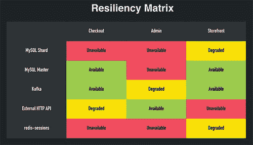
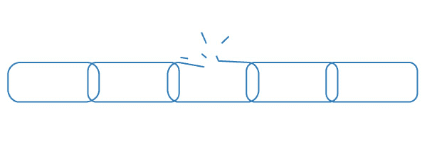

# Shopify 如何扩展以处理来自 Kanye West 和 Superbowl 的 Flash 销售

> 原文： [http://highscalability.com/blog/2015/11/2/how-shopify-scales-to-handle-flash-sales-from-kanye-west-and.html](http://highscalability.com/blog/2015/11/2/how-shopify-scales-to-handle-flash-sales-from-kanye-west-and.html)

*这是[缩放您的代码](https://twitter.com/christophelimp)的创建者 Christophe Limpalair 提出的来宾[重新发布](https://scaleyourcode.com/blog/article/23)。*

在本文中，我们介绍了 Shopify 使平台具有弹性的方法。 这不仅有趣，而且实用并且可以帮助您开发自己的应用程序。

## Shopify 的扩展挑战

Shopify 是一个电子商务解决方案，每个月处理大约 3 亿独立访客，但是正如您所看到的，这 3 亿人不会以均匀分布的方式出现。

他们的**最大挑战之一是所谓的“闪存销售”** 。 这些快速销售是在非常受欢迎的商店在特定时间销售商品的时候。

例如， **Kanye West** 可能会出售新鞋。 结合 **Kim Kardashian** ，仅 Twitter 上的**就有 5000 万人以下**。

他们也有在超级碗上做广告的顾客。 因此，他们不知道会有多少流量。 **可能有 200,000 人在 3:00** 出现，并在几个小时内结束特价销售。

**Shopify 如何适应这些流量的突然增加？** 即使他们无法在特定销售中很好地扩展规模，也如何确保它不会影响其他商店？ 在简要说明 Shopify 的上下文架构之后，这就是我们将在下一部分中讨论的内容。

## Shopify 的架构

即使 Shopify **去年移至 Docker** ，他们**仍未脱离 Monolithic 应用程序**。 我问西蒙（Simon）为什么，他告诉我说，他们并不会轻易承担[微服务](http://martinfowler.com/articles/microservices.html "Microservices explanation")的开销。 但是，如果他们决定走这条路，此举使他们在将来可以更轻松地过渡。

无论如何，它们的体系结构看起来像这样：

一个**请求**进入 **Nginx** ，然后进入运行中的**服务器集群 带有 Rails 应用程序**的 Docker。

对于**数据层**，他们使用以下方法：

*   记忆快取
*   雷迪斯
*   弹性搜索
*   的 MySQL
*   卡夫卡
*   动物园管理员

此**的大部分运行在自己的硬件**上。 他们还在 AWS 上运行了**几件事。

为了降低成本，Shopify **运行多租户平台**。 这意味着它们在单个服务器上有多个商店-例如，shopA.com 和 shopB.com 是从同一服务器提供服务的。

即使迁移到 Docker [并非一帆风顺](https://www.youtube.com/watch?v=Qr0sATj9IVc "Simon Eskildsen on switching to Docker")，他们最终还是从中获得了一些好处：

迁移到 Docker 使 Shopify 得以运行 **在大约 5 分钟（Docker 之前的 15 分钟）内在数十万行 Ruby 上进行持续集成**，并在 3 个数据中心中将其部署到 300-400 个节点仅需 3 分钟（之前 15 分钟）。 这些是令人印象深刻的变化。**

## 他们如何处理交通高峰

理想情况下，平台可以自行处理峰值。 这还没有完全实现，因此他们在大量销售之前要通过**性能清单**。

在 Kanye West 的示例中，他们坐了 2 周，并通过组合平台的关键部分进行了**广泛的被动负载测试和性能优化**。

为了运行各种测试，他们使用了称为“弹性矩阵”的工具。

（图片来自 [Simon 的会议演讲](https://speakerdeck.com/sirupsen/dockercon-2015-resilient-routing-and-discovery "Simon Eskildsen on Resilient Routing and Discovery and Dockercon 2015")）

**弹性矩阵**可以帮助确定服务提供时系统发生了什么 下跌降落。

说 Redis 失败了，Redis 被用作结帐的组成部分。 您是否将整个站点拆毁并置于维护模式？ 不，您可以退出所有人，仍然允许他们在没有客户帐户的情况下进行结帐。 然后，在 Redis 备份后，将电子邮件地址与客户帐户相关联并填补空白。

进入系统列表（如店面，管理仪表板，API 等），然后查看服务中断时会发生什么—系统的其他部分也会受到影响？ 尝试**消除这些依赖关系，您的应用程序弹性将大大提高。** 这就像一条链，您的应用程序的强度仅与最弱的链接一样强。

为了帮助此过程，Shopify 团队**开源了 Toxiproxy 和 Semian** 。

[Toxiproxy](https://github.com/Shopify/toxiproxy "Toxiproxy") 会在您选择的任何系统中引入**控制的潜伏期**。

[Semian](https://github.com/Shopify/semian "Semian") 用于验证您没有**单点故障**。

有关弹性的更多信息，请查看 [Simon 的会议演讲](https://speakerdeck.com/sirupsen/dockercon-2015-resilient-routing-and-discovery "Simon Eskildsen on Resilient Routing and Discovery and Dockercon 2015")中的其中之一，他将提供更多详细信息。 超级有趣。

在此弹性工作的基础上，Shopify 还能够**超额配置，因为他们拥有自己的硬件**。 对于他们来说这很便宜，但是如果您在云上运行，它可能不会那么便宜。 查看成本与收益的关系，看看是否对您有意义。

另一个大挑战是扩展数据存储。 由于 Shopify 处理金融交易，因此其数据库*不能*不同步。 解决方案？ **Shopify 在大约 2 年前对 MySQL** 进行了分片。 他们非常积极地进行分片，并且目标是随着时间的推移增加**和较小的分片**。

Simon 继续说**扩展数据库非常困难**-尤其是分片。 它几乎总是应该是不得已的方法。 您可能需要先缓存很多东西。 但是分片的好处是它们有助于隔离事件。 如果一个客户群中发生了一些疯狂的事情，那么整个平台中只有一小部分会受到影响。

回到弹性测试，Simon 强调说，大多数**数据库扩展问题已通过许多弹性工作和自动故障转移**得到解决。

## 他们计划进行哪些其他改进？

展望未来，团队正在研究**相互隔离的**层，它们相互为应用程序提供服务。 他们正在做的另一件事是让**的商店同时用完不同大陆上的多个不同数据中心**。 这对于数据局部性来说非常重要，也可以防止意外事件。

杰里米·埃德伯格（Jeremy Edberg）在[的采访](/interviews/interview/11 "Jeremdy")中告诉我，Netflix 也投入了大量资源来防范突发事件。

除了这些计划之外，他们还研究**使故障转移变得可以轻松地每天多次执行**。 如果您对它们如何在整个数据中心之间执行故障转移测试感到好奇，请参阅 [Simon 的采访页面](/interviews/interview/14 "Simon Eskildsen interview with ScaleYourCode")。

就目前的情况而言，他们无法在不临时取消检出的情况下对整个数据中心进行故障转移。 但是，他们目前正在研究一种解决方案，以解决此问题。

## 采取的行动

My goal with this article is to give you easily-digestible knowledge you can take action on. What action(s) can you take now? Well, you probably want to avoid sharding, so can you cache more? You may not be able to over-provision due to cost, but what about checking out the resiliency matrix? Even if you don't have the resources to pull this off right now, building one of these matrices or even just thinking about it can be helpful.

如此高的收益率是您的瓶颈。 没有留下深刻印象