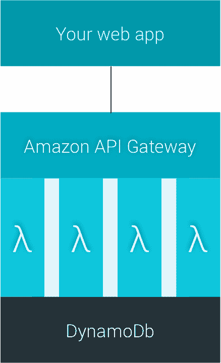
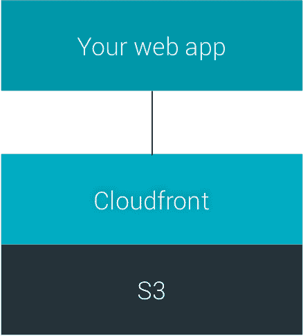
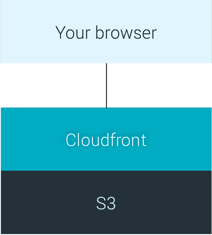
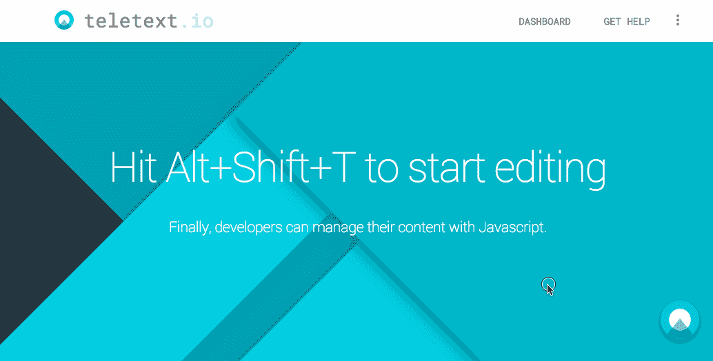

# 无服务器启动-服务器崩溃！

> 原文： [http://highscalability.com/blog/2015/12/7/the-serverless-start-up-down-with-servers.html](http://highscalability.com/blog/2015/12/7/the-serverless-start-up-down-with-servers.html)

*这是来自 [Teletext.io](https://teletext.io/ "Teletext.io") 的 [Marcel Panse](http://www.linkedin.com/in/marcelpanse "Marcel Panse") 和 [Sander Nagtegaal](http://www.linkedin.com/in/centrical "Sander Nagtegaal") 的来宾帖子。*

在早期的 [Peecho 时代](http://www.peecho.com/ "Peecho")中，我们[写了一篇文章](http://highscalability.com/blog/2011/8/1/peecho-architecture-scalability-on-a-shoestring.html "Peeacho architecture - scalability on a shoestring")，解释了如何使用 [Amazon Web Services](http://aws.amazon.com/ "Amazon Web Services") 构建真正可扩展的架构。 自动缩放，无情的解耦，甚至对未使用的服务器容量进行自动出价，都是我们当时用来操纵的技巧。 现在，是时候将其进一步迈出一步了。

我们想介绍 [Teletext.io](https://teletext.io/ "Teletext.io - content as a service") ，也称为*无服务器启动*-再次完全基于 AWS 构建，但仅利用了 [Amazon API Gateway](https://aws.amazon.com/api-gateway/ "Amazon API Gateway") ， [Lambda](https://aws.amazon.com/lambda/ "AWS Lambda") 函数， [DynamoDb](https://aws.amazon.com/dynamodb/ "AWS DynamoDb") ， [S3](https://aws.amazon.com/s3/ "AWS S3") 和 [Cloudfront](https://aws.amazon.com/cloudfront/ "AWS Cloudfront") 来实现。

## 约束的美德

我们喜欢规则。 在我们之前的初创公司 [Peecho](http://www.peecho.com/ "Peecho printing") 中，产品所有者必须为每个想要添加到正在进行的 sprint 中的用户故事支付*五十次俯卧撑*。 现在，在我们目前的公司 [myTomorrows](https://mytomorrows.com/ "myTomorrows - expanding access to drugs in development") 中，我们的*开发人员舞会*颇具传奇色彩：在每日站立时，您只能在跳舞时讲*- 导致有史以来最高效的会议。*

这种思维方式一直贯穿于我们的产品开发。 乍一看似乎违反直觉，但限制了创造力。 例如，我们所有的徽标设计都是通过技术制图工具 [Omnigraffle](https://www.omnigroup.com/omnigraffle "Omnigraffle") 完成的，因此我们无法使用可怕的*镜头光斑*等。 无论如何-最近，我们发起了另一个计划 [Teletext.io](https://teletext.io/ "Teletext.io") 。 因此，我们需要一个新的限制。

*在 Teletext.io，我们不允许使用服务器。 连一个都没有。*

这是一个不错的选择。 我们将解释原因。

## 为什么服务器损坏

在过去的几年中，Amazon 云已经使我们非常满意能够使用 EC2 服务器实例的自动扩展群集，并在其顶部具有负载平衡器。 这意味着，如果您的一台服务器出现故障，则可以自动启动新服务器。 当出现意外的高峰流量时，也会发生同样的情况。 然后将启动额外的服务器。

尽管这很酷，但也有缺点。

*   首先，即使您没有任何流量或收入，您**仍需要保持最少数量的服务器实例**处于活动状态，以便能够为任何访问者提供服务。 这要花钱。
*   其次，由于云实例在操作系统之上运行已安装的软件，因此您不仅需要维护自己的代码，还需要**确保服务器软件保持最新**并可以运行。
*   第三，您**不能以精细的方式**向上或向下扩展，但一次只能一台完整的服务器。

在基于带有微服务的 API 的体系结构中，这意味着小任务的开销很大。 幸运的是，现在有解决此问题的选项。 首先让我们看一下眼前的问题。

## 抓痒

我们全新的解决方案源于个人对自定义软件中*内容管理*的不满。 在大多数初创企业中，按钮，仪表板，帮助部分甚至整个网页中的 HTML 文本必须由*程序员*而不是文本编写者来管理和部署。 对于开发人员和编辑人员而言，这确实很烦人。

多年来，我们试图找到一种可以正确解决此问题的分布式内容管理服务。 我们失败了。 因此，几个月前，我们受够了，并决定只需要自己构建一些东西。

## 计划

我们计划创建一个非常简单的基于 Java 的服务，该服务可以使用 HTML 的通用数据属性标记元素来注入集中托管的内容。 它应该能够处理本地化和动态插入数据。 最重要的是，它应该为内容编写者提供一种在自己的应用程序中使用嵌入式 WYSIWYG 编辑器随时更改文本的方法。

除了一些用户体验警告之外，这里还面临三个技术挑战。

1.  由于实时网站依靠它来获取内容，因此这种新的商品服务应该永远不会失败。 曾经
2.  它应该非常非常快，因此您的访问者甚至不会注意到内容正在加载。
3.  内容应由 Google 编制索引。

第三个问题与体系结构本身无关。 可信赖的搜索引擎以神秘的方式运转，因此我们所能做的就是[测试假设](http://www.centrical.com/test/google-json-ld-and-javascript-crawling-and-indexing-test.html "Google crawling an indexing test for javacript insertion and JSON-LD structured data")。 剧透：是的，它有效。 不过，前两个问题的解决方案掌握在您自己手中。 这些都可以通过低成本的巧妙解决方案来解决。

## 建筑模块

让我们深入研究基于 Amazon Web Services 的一些最新功能的系统构建块。

### Amazon API 网关

[Amazon API Gateway](https://aws.amazon.com/api-gateway/ "Amazon API Gateway") 是一项托管的 AWS 服务，允许开发人员在 AWS 管理控制台中单击几下即可创建任意规模的 API。 该服务可以触发其他 AWS 服务，包括 Lambda 函数。

### AWS Lambda

而不是运行云实例，我们使用 [AWS Lambda](https://aws.amazon.com/lambda/ "AWS Lambda") 。 该名称源自希腊字母 lambda（λ），用于表示在函数中绑定变量。 AWS Lambda 使您可以在不维护任何服务器实例的情况下运行代码。 您可能会想到具有单个任务的原子无状态功能，该功能可能会运行有限的时间（当前为一分钟）。 这些功能可以用 Javascript（Node.js），Python 或 Java 编写。

如果您上传 Lambda 代码，Amazon 将负责以高可用性运行和扩展代码所需的一切。 Lambda 并行执行。 因此，如果发出一百万个请求，则将执行一百万个 Lambda 函数，而不会损失速度或容量。 据亚马逊称，“扩展功能没有基本限制”。

最好的是，从开发人员的角度来看，Lambda 函数在不执行时甚至不存在。 它们仅在需要时出现。 而没有上升的事物，也不会下降的事物。

### DynamoDB

Lambda 函数将其数据存储在数据存储中。 因为我们的规则说不允许我们使用任何服务器，所以我们不能使用关系数据库服务（RDS）。 相反，我们使用 Amazon 的大型托管数据存储 DynamoDB。

[Amazon DynamoDB](https://aws.amazon.com/dynamodb/ "AWS DynamoDb") 是适用于所有规模的所有应用程序的 NoSQL 数据库服务。 它受到完全管理，并支持文档和键值存储模型。 Netflix，AirBnB 和 IMDb 等其他用户已经证明了该服务的可扩展性。

## 建筑

我们的系统分为三个部分：

1.  内容管理
2.  内容传递
3.  我们的网站

关注点的分离是设计使然。 内容管理 API 或我们自己的网站中的问题绝不会导致客户网站的中断。 因此，内容的交付应完全自主。

### 内容管理

 内容管理部分是编辑者用来编辑 HTML 和文本的部分。 编辑者只能通过连接到 [AWS IAM](https://aws.amazon.com/documentation/iam/ "AWS Identity and Access Management") 的 [AWS Cognito 身份池](https://aws.amazon.com/cognito/ "AWS Cognito")使用他们的 Google 帐户登录，而该池仅使用 Javascript。 为了加载草稿内容，存储编辑并发布结果，将调用 Amazon API Gateway，从而触发 Lambda 函数。 Lambda 函数全部与单个 API 调用有关，并将其数据存储在 DynamoDb 中。

如您所见，没有服务器可能崩溃或卡住。

### 内容传送

如前所述，我们决定将内容的交付与编辑功能完全脱钩，因此即使灾难来袭，您的应用程序仍能正常工作。 当编辑者决定将新内容发布到他的应用程序的实时版本时，另一位 Lambda 立即将草稿内容作为平面 JSON 文件复制到 [S3](https://aws.amazon.com/s3/ "AWS S3") ，这是亚马逊用于文件的数据存储。 JSON 文件包含元数据和描述内容的 i18n 本地化 HTML 字符串。

 从此处开始，应用程序中的 Teletext.io 脚本可以通过 [Cloudfront](https://aws.amazon.com/cloudfront/ "AWS Cloudfront") CDN 访问这些文件，从而确保高可用性和高性能。 我们添加了一个巧妙的预取算法，以确保在您需要它们之前在浏览器中检索并缓存了最受欢迎的文件，因此无需实际加载内容即可配置下次点击。

由于发布的内容的传递不涉及服务器端逻辑，因此它确实非常快速且实用。

### 我们的网站

 但是[我们的网站](https://teletext.io/ "Teletext.io - content management as a service")呢？ 我们选择了一个简单但有效的概念-再次没有服务器。 该网站是使用 [React 框架](https://facebook.github.io/react/ "Facebook React JS")作为单页应用程序，并使用[作为单个静态文件](http://docs.aws.amazon.com/AmazonS3/latest/dev/WebsiteHosting.html "Static single-page website in S3")部署到 S3 的。 然后，将 Cloudfront 配置为最上方的内容交付机制，从而确保了来自世界各地许多端点的超快速内容交付。

同样，此方法基于平面文件传递，因此非常健壮。

静态应用使用 HTML5 pushState 和 React Router 进行 URL 处理。 通常，存在一个问题。 如果您访问根以外的特定 URL，则 Web 服务器必须动态呈现与前端动态呈现的相同的路由。 目前这在 S3 中是不可能的。 但是，我们找到了一个技巧，我们想在这里分享。

1.  在 S3 中将应用程序配置为[一个静态网站，其根指向主文件。](http://docs.aws.amazon.com/AmazonS3/latest/dev/WebsiteHosting.html "Static single-page app in S3")
2.  不要添加任何 S3 重定向规则。 甚至不添加自定义错误页面。
3.  创建一个指向 S3 存储桶的 Cloudfront 发行版。
4.  在 Cloudfront 中创建一个自定义错误响应，该响应也指向主文件。 确保执行固定的 200 响应。

结果是，所有 URL 路径（根目录除外）均在 S3 中导致 404 响应，然后触发缓存的 Cloudfront 自定义错误响应。 最后的答复只是您的单页应用程序。 现在，在浏览器中，您可以根据当前路径处理所有路由。

只有一个缺点。 在任何情况下，您都无法返回实际的 404 HTTP 响应代码。 但是，作为回报，您将获得一个超便宜，超可扩展的单页面应用程序。

### 实用津贴

使用 Lambda 会对您的开发过程产生影响。 不过，支持正在改善。 例如，以前无法对 Lambda 函数进行版本控制。 这导致测试和部署的风险很大。 但是，亚马逊[最近推出了其版本控制系统](http://docs.aws.amazon.com/lambda/latest/dg/versioning-aliases.html "Versioning AWS Lambda")，现在我们可以使用*可变别名*。 这意味着现在可以具有可以独立更新的同一功能的不同版本，类似于测试环境还是生产环境。

## 结果

我们的免费增值服务现已向客户开放。 我们吃自己的狗食，所以我们也用它。 在以下 GIF 中，您可以在我们自己的网站上看到正在使用的功能。

但是，系统的真正可扩展性在我们的每月 AWS 账单中显示。

### 成本

成本完全取决于实际使用情况。 为简单起见，我们将忽略临时免费层，以及我们使用的许多小型服务。

*   使用 **Lambda** ，您**只为您消耗的**计算时间付费-当代码未运行时不收费。 还有一个永久的免费套餐。
*   **Amazon API Gateway** 没有**没有最低费用或启动费用**。 您只需为收到的 API 调用和转移的数据量付费。
*   **DynamoDb** 的费用也基于**按使用量付费**，尽管定价有些复杂。 简而言之，它基于存储，读取和写入。
*   然后是 S3 和 Cloudfront。 基本上，您需要为存储和带宽付费。

我们刚刚开始-为了计算成本，我们做了一些假设。 让我们考虑一个相当大的网站作为我们的普通客户。 我们猜测这样的客户端每月使用 1000 个 API 调用（仅用于编辑），因此需要 1GB 的数据输入，并需要大约 10GB 的与流量相关的数据。 永久性存储我们估计为 500MB。 我们预计 Lambda 执行时间不会超过 2 秒。

对于几个不同数量的此类客户，我们的每月费用将如下所示（四舍五入，以美元为单位）。

| 顾客 | 网关 API | 拉姆达 | DynamoDb | S3 | 云前 | 总 |
| --- | --- | --- | --- | --- | --- | --- |
| 0 | 0 | 0 | 0 | 0.25 | 1.00 | 1.25 |
| 100 | 9.50 | 0 | 3.50 | 1.50 | 85.00 | 99.50 |
| 1000 | 93.50 | 4.00 | 3.50 | 15.00 | 850.00 | 966.00 |
| 10000 | 935.00 | 35.00 | 3.50 | 150.00 | 8050.00 | 9173.50 |
| 100000 | 9350.00 | 410.00 | 3.50 | 1500.00 | 76700.00 | 87963.50 |

如您所见，**成本主要由 CDN** 决定，而 CDN 在大流量时变得越来越便宜。 API 和关联的 Lambdas 属性所占的比例要小得多。 因此，如果您构建的服务较少依赖 Cloudfront，则可以做得更好。

## 关闭服务器

凭借对创造力约束的热爱，我们成功启动了无需维护服务器，自动扩展，负载平衡器和操作系统的初创企业。 这不仅是一个具有几乎无限的峰值容量的真正可扩展的解决方案，而且是一个非常便宜的解决方案-尤其是在牵引力出现之前的早期。

所以...服务器崩溃了！

[在 HackerNews](https://news.ycombinator.com/item?id=10690842) 上/ [在 Reddit](https://www.reddit.com/r/programming/comments/3vwrf4/on_high_scalability_building_a_company_using_only/) 上

先生们，

很棒的帖子。 我喜欢它！

请通过类似的方式检查我们的项目：https://github.com/MitocGroup/deep-microservices-todo-app（无服务器 Web 应用程序）和 https://github.com/MitocGroup/deep-framework（无服务器 Web 框架） 。 如果有兴趣，让我们联系（我的电子邮件地址在 Github 上：）

最好的祝愿，
尤金一世。

由于您没有使用大多数/任何 Cloudfront，因此您是否考虑过改用 Cloudflare 之类的设备，无论系统中有多少客户端，您都需要支付固定费率？ 消除了 Cloudfront 扩展成本

耶稣哭了。

难以置信。 您能为新手指出一些好的教程吗？

可怕。 几乎可以追溯到 80 年代。

> 如您所见，没有服务器可能崩溃或卡住。

是的，Amazon 完全没有服务器在运行。 而且，您的 Cloudfront 成本是可悲的，并且您不懂工程。 F *** ing 硅谷赶时髦的人。

我认为您的 Dynamo 定价不正确。 我无法想象拥有 3.5 万美元/月的 10 万客户的存储和吞吐量。

而且，CDN 数量是如此之高，甚至不使用它可能也很有意义。

您可以花 7.6 万美元从一级提供商那里购买 10PB CDN 流量。

感谢您分享您的故事 Marcel 和 Sander，有趣的方法。

请调整您的文章标题，因为*非常*令人误解。 您并不是在谈论无服务器设置，而是在谈论摆脱管理自己的服务器的麻烦。 他们将其称为[平台即服务（PAAS）](https://www.wikiwand.com/en/Platform_as_a_service)。 这不是什么新鲜事物，请参阅已建立的解决方案，例如 [Heroku](https://www.heroku.com/home) 和 [Google App Engine](https://cloud.google.com/appengine/) ，仅提及其中两个。

顺便说一句，您还没有真正解决您的大胆挑战＃1（“这项新的商品服务永远都不会失败。 您认为他们不受故障影响吗？ （提示：他们几个月前才遇到问题...）。 通过不必自己维护服务器，当然可以减少错误：许多中断是由系统更新和/或人为错误引起的。

我一直在考虑采用这种架构，但我担心的一件事是安全性。 您将所有（通常）服务器端逻辑用于身份验证或数据库访问配置在哪里？ 在每个 lambda 函数内部？ 还是作为每个 lambda 函数随后调用的单独的 lambda 函数（看起来可能是多余的）？

我正在为我的雇主开发此模式：API 网关-> Lambda-> DynamoDB。 没有要管理的服务器。 甜。 但这是一个相当新的模式，因此某些主题的文档可能参差不齐。 许可有点麻烦。 但是我明白了：与机架，堆叠和管理我们自己的服务器相比，这看起来更便宜，更可靠（我们每年比 AWS 停机更多）。 可伸缩性问题在该模型中消失了：我可以在免费的 AWS 层上构建整个基于微服务的应用程序，而要将该基础架构扩展到具有数百万用户的全球应用程序所需的唯一事情就是：我的信用卡。

哇-一篇相当不错的好文章的评论中有很多无知和仇恨。

@Jos de Jung-标题不是*很有误导性，它已经死了。 您只是不了解这些单词的含义，也不了解它们的含义（根据您的其他评论）（提示：它比 PaaS 复杂得多）。 标题为“无服务器**启动**”-表示它们作为启动公司不拥有或租赁任何服务器。 它是 100％准确的。 他们还需要购买在 AWS 服务器上运行的计算时间，存储空间，cdn 等。*

@the_dude-好像您今天忘记服药了...

Marcel Panse 和 Sander Nagtegaal-感谢出色的文章和灵感。 我将在下一个项目中积极使用此模型。 祝您好运！

嗨，EvanZ，很高兴听到您正在考虑这一点，但您需要做一些阅读工作！ AWS 提供了两种内置机制（Cognito，IAM）以及一种可以调用自己的安全提供者的集成模式。 我当前的实现是使用 Cognito。

干杯，

ws

这荒谬地更加复杂，并且如果没有更多的话甚至容易失败。 亚马逊仍然可能失败，并且由于使用了这么多服务，因此链中任何地方的任何失败都可能导致问题。

小型 EC2 实例可以解决所有这些问题。 为了安全起见，请使用 2 进行故障转移。 对于此应用程序，99％的用户仅在读取数据，因此这两个小型实例将永远永久扩展。 您只需在任何基本的 webapp 框架中进行编程并像往常一样进行部署。

Digital Ocean 甚至会更便宜，并且有许多 CDN 都比 CloudFront 便宜。 同样，他们绝对不会推出 50TB 的数据，对于高度可压缩的文本内容来说，这是一个荒谬的带宽。 这就像是说他们将为前 100 个新闻站点提供所有文字一样。

另外，他们的商业模式糟透了，因为我看不出谁愿意为此付出代价。 通常，需要编辑的文本（例如 CMS 中的文章）已经具有编辑器。 网站上的文本多长时间随机更改一次？ 即使这样，开发人员仅输入新文本并部署多长时间？

糟糕的公司，胡扯的工程和无用的博客文章。

我一直在使用相同的模式通过 Angular2 在站点上进行构建。

我一直想创建一个个人站点来用作博客，并作为共享项目/设计的垃圾场。 除此之外，我真的不想处理后端的建设，维护和付款。 S3 作为污垢很便宜，并且可以保证 5 9s 的正常运行时间（即比我一个人可以管理的更好）。

因此，我创建了一个 Angular2 SPA（单页应用程序），配置了 S3 重定向，并将路径重写添加到了角度路由器。 我真的希望我能引起 Angular 开发团队的注意，以便他们可以改进路由器来处理无服务器的边缘情况，包括 html 历史记录重写。

使用 grunt 和 s3 插件可以轻松实现自动化。 就像 Je​​kyll 一样，Markdown 将用作所有内容的格式，不同之处在于没有编译步骤。 我创建了一个 Web 组件，可将 markdown 直接转换为 html（即不久将支持 AJAX 请求的内联缓存）。

它正在开发中，但可以在[  中看到开发版本

一旦功能完全正常，我计划写一下该过程：使用 Angular2 / ES6 构建网站； 使用 JSPM； 创建一个 ng2 Web 组件。 在此之前，如果您有兴趣，请随时在 GitHub 上查看我的句柄。

这是一个好主意 Giggaflop。 有人在 cloudflare 上这样做吗？ 我很好奇可能会出现什么问题以及它是否会起作用。 谢谢。

对于那些正在寻找可以为无服务器架构创建最佳实践的演示 Web 应用程序的人，请查看我们的 SansServer 项目（ [https://github.com/bclemenzi/sans-server](https://github.com/bclemenzi/sans-server) ）。

该项目利用在 Maven 安装时使用自定义 Java 注释在 AWS 中自动构建和配置的基于 Java 的 Lambda 函数。 还非常关注支持多个开发人员和环境。

我创建了一个新框架，以将 JAVA 应用程序部署到 AWS Lambda + API Gateway 基础架构

https://github.com/lambadaframework/lambadaframework

嘿，马塞尔，感谢您对我们所有人（尤其是我）的教育，这些人在服务器方面都愚蠢，现在我知道很多，这一切都感谢您。 继续写作和分享这样的读物:)

很棒的帖子。 只是一个问题。 您在项目中的哪里存储图像等？

“我们的开发人员舞会具有传奇色彩：在每日站立比赛中，您只能在跳舞时讲话，这是有史以来最高效的会议。”

你一定是在跟我开玩笑。

这是有关此博客文章中涉及的主题的全面分步教程。

[http://serverless-stack.com](http://serverless-stack.com)

后端教程包括有关由 Cognito 保护的 Lambda + API Gateway 的章节。 前端教程包括有关在 S3 + CloudFront + SSL + Route53 自定义域上托管的 React SPA 的章节。 本教程详细介绍了如何构建 CRUD 无服务器 API 并将其完全连接到 AWS 上的 React SPA。 API 函数在 ES6 中，并且已通过 Cognito 用户池进行了身份验证。 它还显示了如何在 S3 上托管您的应用程序以及如何使用 CloudFront 和 Route 53 将其提供服务。这是一个端对端教程，显示了实际的无服务器架构。

有趣的帖子。

我还在一个后端团队中工作，该团队使用无服务器 AWS Lambda 作为我们的 node.js 后端开发工具。 我们发现，无服务器减轻了我们管理服务器部分（操作部分）的负担。 但是，我们注意到，与使用基于 Express JS 的 node.js 服务器的时间相比，我们的开发速度正在下降。 这是因为我们无法启动在我们自己的本地开发计算机中运行的&服务，也无法在其中调试我们的服务。 无服务器 AWS Lambda 上的调试问题对我们来说很繁琐：它要求我们将代码部署到 AWS 上，调用它，然后通过查看一堆 Cloudwatch 的日志流（我们的代码有一堆 console.log 以了解其中发生了什么）。 基于这个事实，我想听听您的想法，当您无法在本地计算机上运行&无服务器调试代码时，如何提高团队开发效率？

干杯。

也许尝试从命令行测试代码？ 这是我的方法：

＃！ / usr / bin / env 节点

var question_id =（process.argv.length > = 3）？ process.argv [2]：“ test2”;

var lambda = require（“ ../ index.js”）;

var AWS = require（'aws-sdk'）;
AWS.config.loadFromPath（“ ./ awscfg.json”）;

var context = {
functionName：“ testFunction”，
AWS：AWS，
DB：new AWS.DynamoDB（），
DBCLIENT：new AWS.DynamoDB.DocumentClient（），
SES ：新的 AWS.SES（）
};

var Decision = {[
questionId：question_id，
评分：“优秀”，
文本：“哇！”
}

var request = {
方法：“ acceptProAnswer”，
参数：决策，
ID：1
}

lambda.handler（请求，上下文，函数（错误，响应）{
console.log（“ handler：error：” +错误+“ response：” + JSON.stringify（response））;
}）

精彩的文章。 对于诸如*不比...* 和*并非真正无服务器*可靠的大量评论，我强烈建议您学习这项技术。 这是我们所有人都使用的技术堆栈-只是配置更智能。 构建 H / A 解决方案并消除 SPOF 几乎是微不足道的。 我关心的是性能，但是在 Lamba 工作了几个月后，我感到非常高兴。

很高兴看到其他人继续使用这项技术。 它消除了新技术公司的巨大启动障碍