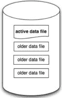

# Riak 的 Bitcask-用于快速键/值数据的日志结构哈希表

> 原文： [http://highscalability.com/blog/2011/1/10/riaks-bitcask-a-log-structured-hash-table-for-fast-keyvalue.html](http://highscalability.com/blog/2011/1/10/riaks-bitcask-a-log-structured-hash-table-for-fast-keyvalue.html)

如果从头开始，您将如何实现键值存储系统？ Basho 使用 [Bitcask](http://downloads.basho.com/papers/bitcask-intro.pdf) （他们的 Riak 的新后端）决定采用的方法是一种有趣的组合，使用 RAM 存储指向值的文件指针的哈希映射和用于高效写入的日志结构文件系统。 在这次出色的 [Changelog 采访](http://thechangelog.com/post/1525527959/episode-0-4-0-riak-revisited-with-andy-gross-mark-philli)中，来自 Basho 的一些人更详细地描述了 Bitcask。

基本的木桶：

*   密钥存储在内存中以便快速查找。 所有密钥必须适合 RAM。
*   写操作仅是追加操作，这意味着写操作严格是顺序执行的，不需要查找。 写是直写的。 每次更新值时，都会附加磁盘上的数据文件，并使用文件指针更新内存中的索引。
*   O（1）随机磁盘搜寻可满足读取查询的需求。 如果所有密钥都适合内存，则延迟是非常可预测的，因为不会在文件中四处寻找。
*   对于读取，将使用内核中的文件系统缓存，而不是在 Riak 中编写复杂的缓存方案。
*   旧值将被压缩或“合并”以释放空间。 Bitcask 具有[窗口合并](http://blog.basho.com/2011/01/05/riak-0.14-released/)： *Bitcask 对所有非活动文件执行定期合并，以压缩旧版本存储数据占用的空间。 在某些情况下，这可能会导致进行合并的 Riak 节点上的某些内存和 CPU 峰值。 为此，我们添加了指定 Bitcask 何时执行合并的功能。*
*   通过 Bitcask 上方的[软件层，使用](http://wiki.basho.com/An-Introduction-to-Riak.html)[向量时钟](http://blog.basho.com/2010/01/29/why-vector-clocks-are-easy/)实现获取和设置并发。
*   值索引的键存在于内存中以及提示文件中的文件系统中。 数据文件合并时生成提示文件。 重新启动时，仅需要为非合并文件重建索引，该文件应占数据的一小部分。

Eric Brewer（CAP 定理）通过考虑您是否有能力将所有密钥保存在内存中（这在现代系统中很有可能），使 Bitcask 产生了想法，您可以相对容易地设计和实现存储系统。 [提交日志](http://wiki.apache.org/cassandra/Durability)可用作数据库本身，提供了原子性和持久性。 只需写入一次即可保留数据。 单独写入数据文件，不需要提交日志。

值更新后，首先将其附加到磁盘提交日志中。 然后，将键映射到磁盘指针的内存中哈希表将更新为指向文件和文件中记录的偏移量。 因此，读取仅需要一个文件 I / O。 哈希键可找到文件指针，您只需查找偏移量并读取该值。 对于写入，它只是文件的追加。 很漂亮 在纯内存数据库和虚拟存储层支持的基于磁盘的数据存储之间，这是一个很好的折衷方案。

一些潜在的问题：

*   如果您怀疑密钥的数量将超过 RAM，那么将工作集保留在内存中的体系结构将是一个更好的选择。
*   它比纯内存数据库要慢。
*   问题通常在垃圾回收阶段作为资源高峰而出现，同时回收用于删除值的空间。 Bitcask 希望通过将垃圾收集的调度安排到特定时期来降低成本，尽管在拥有国际用户的 24x7 物业中，这可能还不够。
*   在每次写入时进行同步可能会有些痛苦。 如果将写入缓冲并同步复制到备份节点以提高可用性，则可以提高写入吞吐量。
*   我不相信操作系统缓存。 操作系统缓存不知道您的访问模式。 自定义缓存可能会带来复杂性，但是很难相信当出现问题时它的性能不会更好或无法调整。 Basho 似乎对这种方法感到满意，但仍然让我感到不安。 如果流量具有均匀分布或类似 pareto 的分布，会发生什么？ 对您的应用进行基准测试！

## **相关文章**

*   [变更日志采访](http://thechangelog.com/post/1525527959/episode-0-4-0-riak-revisited-with-andy-gross-mark-philli)，其中描述了 [Bitcask](http://downloads.basho.com/papers/bitcask-intro.pdf) 。
*   [Bitcask-Justin Sheehy 和 David Smith 编写的用于快速键/值数据的对数结构哈希表](http://downloads.basho.com/papers/bitcask-intro.pdf)，灵感来自 Eric Brewer。
*   [Redis Diskstore](http://groups.google.com/group/redis-db/browse_thread/thread/d444bc786689bde9) 。 这是 Redis 的操作方式。
*   [RethinkDB 内部：缓存体系结构](http://www.rethinkdb.com/blog/2011/01/rethinkdb-internals-the-caching-architecture/#)。 这是 RethingDB 的工作方式。
*   [Bitcask Rocks](http://pl.atyp.us/wordpress/?p=2868) ，作者：Jeff Darcy。 *至少对于这些简单测试而言，Bitcask 的性能与广告中所宣传的相同。 如果不进行调整，则读写操作似乎都在摊销大量操作的查找成本。*
*   [克服 I / O 瓶颈：J Ousterhout 的日志结构文件系统](http://www.google.com/url?sa=t&source=web&cd=3&ved=0CCoQFjAC&url=http%3A%2F%2Fciteseerx.ist.psu.edu%2Fviewdoc%2Fdownload%3Fdoi%3D10.1.1.37.9531%26rep%3Drep1%26type%3Dpdf&ei=n8ckTcS1O46WsgObqPCDAg&usg=AFQjCNFxzphJrEx281Sm9nZuA7iQR1XpBg&sig2=16OP4cTwBPgjjUp1B5Qx4Q)案例
*   [Riak SmartMachine 基准测试：技术细节](http://joyeur.com/2010/10/31/riak-smartmachine-benchmark-the-technical-details/)
*   [P O'Neil 的日志结构化合并树（LSM-Tree）](http://www.google.com/url?sa=t&source=web&cd=2&ved=0CB0QFjAB&url=http%3A%2F%2Fciteseerx.ist.psu.edu%2Fviewdoc%2Fdownload%3Fdoi%3D10.1.1.44.2782%26rep%3Drep1%26type%3Dpdf&ei=780kTdPyGI7ksQPAvMzNAQ&usg=AFQjCNGGoN9IFTLShcv2HbL0RVQdElfxow&sig2=kO9xiGo1mgbywgsRpPi4Kg)
*   [该死的凉爽算法：日志结构化存储](http://blog.notdot.net/2009/12/Damn-Cool-Algorithms-Log-structured-storage)，作者：Nick Johnson
*   [HBase Architecture 101-Lars George 的预写日志](http://www.larsgeorge.com/2010/01/hbase-architecture-101-write-ahead-log.html)
*   [Cassandra Wiki 耐久性条目](http://wiki.apache.org/cassandra/Durability)
*   [Alfred-是 node.js 的快速进程内键值存储。](http://pgte.github.com/alfred/) *Alfred 将数据存储在仅附加文件*中。
*   [Bigtable：结构化数据的分布式存储系统](http://osdi2006.blogspot.com/2006/10/paper-bigtable-distributed-storage.html)

“如果您怀疑您将拥有比 RAM 更多的密钥，那么在内存中保留工作集的体系结构将是一个更好的选择。”

是的，DB / Java（http://www.oracle.com/technetwork/database/berkeleydb/overview/index-093405.html）几乎是开箱即用的，并且与 Bitcask 具有相对相似的整体方法。 这些年来，有很多类似系统的例子，Basho 选择了基础知识，并根据自己的需求构建了一些特定的东西。 可以在 Gray 和 Reuter 的“事务处理：概念和技术”中找到许多理论（例如，扎根于 System R（http://zh.wikipedia.org/wiki/IBM_System_R））。

“在每次写入时进行同步可能会有些痛苦。如果对写入进行缓冲并且将数据同步复制到备份节点以实现高可用性，则可以提高写入吞吐量。”

好吧，如果您真正是同步的并且不想延迟等待写操作的人，则缓冲的好处有限。 实际上，许多系统都会引入延迟，以便可以进行缓冲。 同步复制到备份节点会带来一系列问题，需要适当调整网络堆栈。 您还面临着处理副本丢失的所有麻烦。 我相信，通常 Riak 会在存储层之外处理该问题。

“将旧值压缩或“合并”以释放空间。”-有些人可能会说这是 DB 语言中的检查点。

“我不相信操作系统缓存。OS 缓存不知道您的访问模式。自定义缓存可能会带来复杂性，但是很难相信它会在出现问题时表现不佳或变得更可调。”

自定义缓存只能在编写或更新之前知道其开发人员所看到的访问模式。 换一种说法，任何高速缓存的性能仅与到目前为止公开和调整的访问模式集一样好。 随着时间的流逝，操作系统缓存已暴露于许多不同的访问模式，并且在大多数情况下都表现出合理的平衡。 我确定在特定情况下自定义缓存会更好，但是 Riak 工作负载是否足够具体/可预测？ 可能不是现在，也许以后。

我忘了说了，电池保护的写缓存之类的东西是使磁盘同步更便宜的另一种方法。

在[文章](http://www.varnish-cache.org/trac/wiki/ArchitectNotes)中比较了 Squid 和 Varnish 的体系结构，作者声称自定义内存管理会因分页而影响性能。 考虑到这一点，他建议您最好将其留给操作系统。

这些论点对这里讨论的情况也无效吗？

@Hugh Redis 开发人员现在正在考虑他先前决定绕过操作系统页面缓存的决定-https://groups.google.com/d/topic/redis-db/1ES8eGaJvek/discussion

去年，我曾提醒他有关那篇不错的 Varnish 文章-请在此处查看评论＃29 http://antirez.com/post/redis-virtual-memory-story.html

好吧，有些人喜欢刻苦学习；-)

与矢量时钟的链接已断开。 正确的链接应该是 http://basho.com/posts/technical/why-vector-clocks-are-easy/