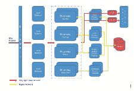
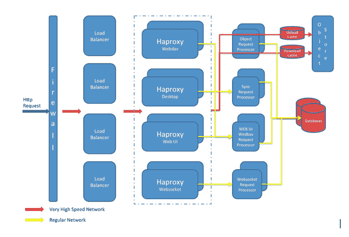
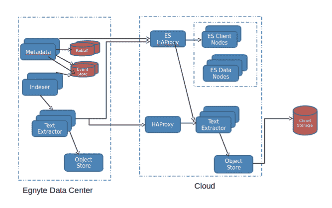
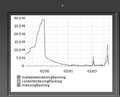
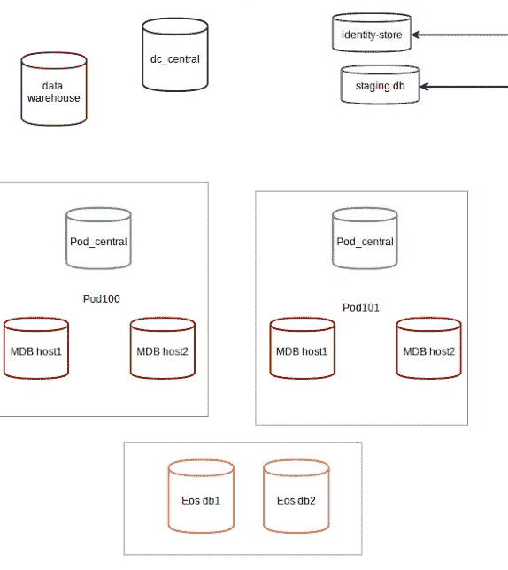

# Egnyte 体系结构：构建和扩展多 PB 分布式系统的经验教训

> 原文： [http://highscalability.com/blog/2016/2/15/egnyte-architecture-lessons-learned-in-building-and-scaling.html](http://highscalability.com/blog/2016/2/15/egnyte-architecture-lessons-learned-in-building-and-scaling.html)

*这是 [Kalpesh Patel](https://www.linkedin.com/in/kpatelatwork) 的来宾帖子，他是在家工作的建筑师。 他和他的同事们花费大量的工作时间扩展了那里最大的分布式文件系统之一。 他在 [Egnyte](https://www.egnyte.com/) （一家企业文件同步共享和分析启动）中工作，您可以在 [@kpatelwork 与他联系 ]](https://twitter.com/kpatelwork) 。*

您的笔记本电脑有一个文件系统，该文件系统被数百个进程使用，它受到磁盘空间的限制，无法弹性扩展存储，如果您运行很少的 I / O 密集型进程或尝试与 100 个其他用户共享它，它会很麻烦。 现在解决这个问题，并将其放大为遍布全球的数百万付费用户使用的文件系统，您将可以通过云霄飞车扩展该系统，以满足每月的增长需求并满足 SLA 要求。

**Egnyte 是一家企业文件同步和共享创业公司**，成立于 2007 年，当时 Google 硬盘还没有诞生，而 AWS S3 的成本却很高。 我们唯一的选择是放开袖子，自己建立一个对象存储，S3 和 GCS 的超时成本变得合理，并且由于我们的存储层基于插件体系结构，因此我们现在可以插入任何便宜的存储后端。 我们已经多次重新架构了许多核心组件的架构，在本文中，我将尝试分享当前的架构是什么，我们学到的扩展规模的经验教训以及我们仍需改进的内容。

## 平台

*   Tomcat

*   MySQL

*   HAProxy

*   Nginx

*   Memcached

*   Apache

*   [Elasticsearch](https://www.elastic.co/)

*   Redis

*   RabbitMQ

*   CentOS

*   人偶

*   新遗物

*   AppDynamics

*   ZooKeeper

*   LDAP

*   Nagios

*   石墨

*   仙人掌

*   Apache FTP 服务器

*   OpenTSDB

*   Google BigQuery

*   Google BigTable

*   Google Analytics

*   MixPanel

*   表格

*   ReactJS /主干/木偶/ jQuery / npm / nighwatch

*   Rsync

*   [PowerDNS](https://www.powerdns.com/)

*   服装

*   基于 REST API 的 SOA 体系结构。

*   Java 用于驱动核心文件系统代码

*   Python 通常用于驱动大多数客户端代码，迁移脚本，内部脚本。 一些 python 代码仍然驻留在服务器上，但是由于我们有更多的 Java 熟悉和扩展经验的服务器开发人员，大多数 python 代码已迁移到 Java。

*   原生 Android / iOS 应用

*   适用于各种平台的桌面和服务器同步客户端

*   GCE

*   GCS / S3 / Azure /...。

## 统计信息

*   3 个主要数据中心，包括欧洲的 1 个（由于安全港规定）

*   200 多个 Tomcat 服务节点

*   由 Tomcat / nginx 提供支持的 300 多个存储节点

*   100 多个 MySQL 节点

*   50 多个 Elasticsearch 节点

*   20 多个 HAProxy 节点

*   和许多其他类型的服务节点

*   我们服务器和 GCS 中存储了数 PB 的数据

*   在 Elasticsearch 中建立索引的数 PB 数据内容

*   许多桌面客户端将文件与云同步

## 认识您

### 您的系统名称是什么，我们在哪里可以找到更多信息？

Egnyte 是启动公司的名称，核心系统有很多主要部分，例如 CFS（云文件服务器），EOS（Egnyte 对象存储），事件同步和...。您可以在中找到更多关于这些的内容 [对于技术人员](https://www.egnyte.com/blog/category/for-the-techies/) 部分，在我们的博客中。

### 您的系统是干什么的？

它推动了成千上万企业的同步和共享需求，而云使它们现有的文件系统可以被 FTP，webdav，移动，公共 api，Web UI 和...等各种端点使用。

### 您为什么决定构建此系统？

在 2007 年，企业/员工队伍开始变得更加分散，客户正在使用多个设备来访问相同的文件，并且有必要使这种体验尽可能的顺畅

### 您的项目经费如何？

这是一家自负盈亏的公司，后来我们在过去 8 年中进行了 5 轮募集，筹集了 6250 万美元的 [。](https://www.crunchbase.com/organization/egnyte#/entity)

### 您的收入模式是什么？

我们没有免费用户，但是我们提供 15 天免费试用，之后客户无需支付席位即可付费。

### 您如何销售产品？

我们从 SEM / SEO 开始，但随着时间的增长，我们通过许多渠道为企业客户争取了诸如社交媒体，Biz 开发，贸易展览，SEM，SEO，入站营销和高联系销售的客户。

### 您从事这项工作多久了？

它成立于 2007 年，目前已有 8 年的历史。

### 您的系统多大？ 尝试感受一下系统的工作量。

我们存储数十亿个文件和多个 PB 的数据。 根据 New Relic，我们平均每秒观察到超过 2K 的 api 请求。 由于安全港规定和位置相近，我们将数据存储在 3 个主要数据中心中。 有关更多信息，请参见统计信息部分。

### 您的输入/输出带宽使用量是多少？

我没有确切的数字，因为它一直在增长，但是客户上个月下载了接近 1 PB 的压缩/未压缩数据。

### 您提供多少份文件？ 多少张图片？ 多少数据？

我们存储数十亿个文件和多个 PB 的数据。 我们存储各种文件，而我们的前 5 个文件扩展名是 pdf，doc / docx，xl​​s / xlsx，jpeg 和 png。

### 免费用户与付费用户的比例是多少？

我们所有的用户均为付费用户。 我们提供 15 天的免费试用期，之后将其转换或将其禁用。

### 在过去一个月中有多少个帐户处于活动状态？

我们所有的客户都是付费帐户，并且每个月几乎所有人都处于活动状态。 我们满足他们文件系统的需求，谁在家不用电？

## 您的系统如何设计？

### 您的系统的体系结构是什么？

我们使用基于 REST 的面向服务的体系结构，它使我们能够独立扩展每个服务。 这也使我们能够将某些后端服务移至公共云中托管。 所有服务都是无状态的，并使用数据库或我们自己的对象存储进行存储。 由于服务众多，因此很难将所有服务都绘制在一张图中。

10,000 英尺的 [典型请求流](https://www.egnyte.com/blog/2015/02/handling-millions-of-requests-at-egnyte/) 的外观如下

大约 10000 英尺的 [搜索架构](https://www.egnyte.com/blog/2015/06/scaling-elasticsearch-at-egnyte/) 如下

### 您的系统面临哪些特定的设计/架构/实施挑战？

最大的 架构 挑战包括：-

1.  节俭地扩展文件存储

2.  扩展元数据访问

3.  文件与桌面客户端的实时同步

### 您是如何应对这些挑战的？

1.  对于存储，我们编写了自己的存储，现在我们使用可插拔的存储体系结构来存储到任何公共云，例如 S3，GCS，Azure...。

2.  为了扩展元数据，我们移至 Mysql 并开始使用分片。 在某个时候，我们暂时投入了更多的硬件来腾出空间，以便一层一层地剥去鳞屑洋葱。

3.  对于实时同步，我们必须更改同步算法，使其更像 Svn，客户端接收增量事件并尝试与云状态进行最终的一致同步。

4.  监视，监视和监视。 您无法优化无法衡量的内容。 在某个时刻，我们监控太多，无法专注于所有指标，我们不得不依靠异常检测工具，例如 New Relic，AppDynamics，OpenTSDB 和自定义报告，以使我们能够专注于从绿色变为[...] >黄色->红色。 目的是在客户通知 之前，将它们捕获为黄色， [时捕获它们。](https://www.egnyte.com/blog/2013/06/improving-service-reliability/)

### 您的系统如何发展以应对新的扩展挑战？

我们已经多次重新构造了许多层。 我无法在本文中全部说明，但我将尝试列出过去 7 年中核心元数据，存储，搜索层的几次迭代。

1.  版本 1：在 Lucene 中搜索文件元数据，通过 NFS 安装在 DRBD Filers 中存储的文件，在 Lucene 中搜索。 阻塞点 ：Lucene 更新不是实时的，必须替换。

2.  版本 2：Berkeley db 中的文件元数据，通过 NFS 安装在 DRBD Filers 中的文件，在 lucene 中搜索。 阻塞点 ：我们突破了 NFS 的限制，它在左右两侧都阻塞了，必须用 http 代替。

3.  Version3：Berkeley db 中的文件元数据，通过 HTTP 服务的 EOS Filers 中存储的文件，在 lucene 中搜索。 阻塞点 ：即使分片的 Berkeley DB 在压力下也阻塞，并且数据库崩溃，恢复工作数小时，必须更换它。

4.  版本 4：MySQL 中的文件元数据，通过 HTTP 服务的 EOS Filers 中存储的文件，在 lucene 中搜索。 阻塞点 ：公共云开始变得便宜。

5.  版本 5：MySQL 中的文件元数据，存储在 EOS / GCS / S3 / Azure 中并通过 HTTP 提供的文件，在 lucene 中进行搜索。 阻塞点 ：搜索开始阻塞，必须更换。

6.  版本 6：MySQL 中的文件元数据，通过 HTTP 服务的 EOS / GCS / S3 / Azure 中存储的文件，在 Elasticsearch 中搜索。 这是当前的体系结构，很快，其中一个可能需要另一个轮回：)。

### 您是否使用任何特别酷的技术或算法？

*   在核心服务之间进行呼叫时，我们使用 [指数退避](https://en.wikipedia.org/wiki/Exponential_backoff) 指数断路器，以避免断路器打雷。

*   我们在核心服务节点资源上使用公平分配分配方式来处理传入请求。 标记核心服务节点上的每个传入请求并将其分类为不同的组。 每个组都有专用的容量，如果一个客户每秒发出 1000 个请求，而另一个客户每秒发出 10 个请求，则此系统将确保第二个客户不会遇到嘈杂的邻居问题。 诀窍是，由于散列，两个客户都可能偶然巧合地落在某个节点上的同一组上，但是他们不会在所有节点上都落在同一组上，因此我们将节点名称添加为哈希值。

*   带有 SLA 的某些核心服务被隔离在 POD 中，这确保了一个不好的客户不会阻塞整个数据中心。

*   我们在桌面同步客户端代码中使用基于事件的同步，因为发生服务器事件时，它们会从服务器推送到客户端，并且客户端会在本地重播它们。

### 您做什么工作是与众不同的，人们可以从中学到什么？

专注于启动的核心功能，如果您必须构建自定义功能，则可以这样做。 有很多独特的东西，但是存储层，基于事件的同步绝对值得学习，在这里有更多详细信息。 [规范文件系统](https://www.egnyte.com/blog/2015/04/egnyte-canonical-file-system/) 。

## 您学到了什么？

*   您无法优化您无法测量的内容：测量所有可能的结果，然后优化系统中使用率最高为 80％的部分。

*   当您身材矮小的时候，请慢慢介绍技术，不要试图从中找到解决当前问题的理想工具。 编码是生命周期中最简单的部分，但是如果您最初拥有太多技术，则其维护（如部署/操作/学习曲线）将非常困难。 当您很大时，您将有足够的脂肪来划分服务，并让每个服务使用其自己的技术并进行维护。

*   当您是一家初创公司时，有时您需要快速采取行动，介绍您现在可以做的最好的解决方案，如果发现有牵引力，请加班对其进行重新设计。

*   寻找单点故障，并不懈地寻找下来。 付出额外的努力来解决使您彻夜难眠的问题，并尽快从防御模式转变为进攻模式。

*   在 SOA 中，如果您的服务受阻，则构建断路器以开始发送 503s。 与其惩罚每个人，不如看看是否可以公平分配资源并仅惩罚滥用用户。

*   在服务使用者中添加了自动修复功能，服务可能会阻塞，并且桌面客户端或其他服务之类的消费者可以进行指数补偿以释放服务器压力，并在该服务再次运行时自动修复。

*   始终可用：请提供服务级别的断路器和客户提供的断路器。 例如 如果通过 webdav 或 FTP 访问文件系统存在性能问题，并且需要 4 个小时进行修复，那么在这 4 个小时内，您只需在防火墙处杀死 FTP / webdav 并要求客户使用 Web ui 或其他机制即可工作。 同样，如果一个客户造成了异常而使系统窒息，则可以暂时禁用该客户或该客户的服务，并在问题解决后重新启用它。 为此，我们使用功能标志和断路器。

*   保持简单：每个月都有新工程师加入，因此目标是从第一周开始就提高他们的生产力，简单的架构可确保轻松上岗。

### 您为什么成功？

牵引力胜过一切。 当 EFSS 市场刚刚爆发时，我们达到了 [产品/市场适合度](https://www.linkedin.com/pulse/marc-andreessen-product-market-fit-startups-marc-andreessen) 。 具有良好执行力的时机，管理团队的财务纪律导致成功。 许多竞争对手采用了免费增值模式，并筹集了大量资金，但是从第一天开始我们就开始收费，这使我们能够专注于根据市场需求发展解决方案/团队。 专注于付费客户使我们能够交付企业级解决方案，而无需支付免费增值罚金。

### 您希望自己做些什么？

我希望当我们开始时公共云的成本不会过高。 我也希望我们从第一天开始就使用 SOA，花了一些时间才到达那里，但是现在我们就在那里。

### 您不会更改什么？

目前，我不会替换 MySQL / EOS，因为它允许我们从防御定位转向进攻定位。 我不能在两年后发表评论，我会有相同的想法，我们可能会更改或扩大其中一些想法。 当您遇到下一个增长突增时，架构会发生变化。

## 您应该做多少前期设计？

很好的问题。 答案是“取决于”，

*   如果您要设计诸如核心存储层或核心元数据层之类的东西，那么再多花 2 周的时间对设计就不会造成太大的影响。 当我们在核心元数据层上从 Berkeley DB 迁移到 MySQL 时，我承受着很大的压力，我曾想过要走捷径，当我通过首席技术官运行时，他建议花一些时间并“做正确的事”。 作为回顾，这是一个极好的决定。

*   对于公共 API，最好做一个不错的前端设计，因为您没有第二次机会对其进行更改，并且必须将其维护 4-5 年。

*   但是，如果您要为内部服务设计一些东西并将其迁移到新架构将不会花费一年，那么我建议您进行非常少的前端设计，并快速构建版本并随着使用量的增加对其进行迭代。

## 您如何考虑将来更改架构？

*   在一周中进行部署（我们快到了）

*   将更多公共云用于任何新服务，并将更多服务迁移到公共云。

*   将其余的源代码从 svn 移至 git

*   使当前的开发环境尽可能接近生产环境（可以使用 docker 或…）。

*   自动化架构管理

*   添加更多性能基准测试

*   建立持续的交付渠道，以便我们可以将部署增加为每周或每天，而不是每两周一次。

*   通过重新构建从某些增长最快的表中删除联接。

*   为 Mysql 分片添加自动平衡器，因此我不必担心偶尔出现的热点。

*   将某些脂肪服务分成颗粒状

*   使用内存缓存代理

## 您的团队如何设置？

### 您的团队中有多少人？

大约有 100 名工程师（devops / ops / qa / developers /…），其余是销售，市场营销，支持和人力资源。

### 他们在哪里？

最初是分布相当分散的工程团队，但现在主要吸引人是孟买的 [波兹南](https://en.wikipedia.org/wiki/Pozna%C5%84) 。 一些像我这样的远程员工 和其他一些员工在家工作。

### 谁扮演什么角色？

这是一个很大的团队，我们有产品经理，UX 团队，开发人员，Scrum 团队，架构师，工程师扮演各种角色。 最初，工程团队很平坦，每个人都会向工程副总裁报告，但现在我们在两者之间增加了一层管理。

### 您是否有特定的管理理念？

如果您开发某些产品，那么您拥有该产品的生命周期，这意味着您将与 QA，devops 一起确保其测试/部署。 投入生产时，您可以使用各种内部工具（例如 New Relic / Nagios）对其进行监视，如果存在回归，则可以对其进行修复。

### 如果您有分散的团队，该如何工作？

自治，1-1 交流，黑客马拉松使他们具有挑战性，他们会受到激励。

### 您的开发环境是什么？

*   适用于服务器团队的 Ubuntu

*   UI 团队使用 Windows / mac 并连接到用于 REST API 服务器的本地 Ubuntu VM 或连接到共享的 QA 实例

*   Eclipse /想法

*   适用于构建的

*   Maven

*   Git / SVN

*   詹金斯

*   ReviewBoard / Sonar

*   JIRA

*   Google 文档

*   Jabber / Slack / Hangouts / Skype

### 您的开发过程是什么？

我们在服务器团队中使用 Scrum，并且每两周发布一次。 长期功能开发人员/团队在沙盒上工作，完成后通过单元测试/硒/手动 QA 对它进行测试，然后合并到主干以捕获 2 周的发布流程。 我们吃了自己的狗粮，代码在发布前 1 周发布到了 UAT（所有员工使用的 egnyte.egnyte.com），我们发现了自动测试未发现的任何意外情况。 我们每个星期五晚上进行生产部署， [每天监视新文物，并报告任何异常的异常报告](https://www.egnyte.com/blog/2013/06/improving-service-reliability/) 。 我们正在将部署更改为即将在一周中完成。

### 您有什么可以做的不同还是感到惊讶？

许多工程师在家工作，令人惊讶的是，有了自主权，许多远程员工像总部员工一样富有生产力和积极性。

## 您使用什么基础架构？

### 您使用哪种语言来开发系统？

大多数是 Java / Python

### 您有多少台服务器？

最后，我知道我们有 700 多个。 100 多个 MySQL 服务器，50 多个 Elasticsearch，200 多个 tomcat 服务节点，300 多个本地存储节点，20 多个 HAProxy 节点和缓存文件管理器，nginx，python 服务器以及其他各种节点。

### 如何将功能分配给服务器？

我们使用面向服务的体系结构，并根据服务类型分配服务器。 一些顶级服务是：

*   元数据

*   储存空间

*   对象服务

*   Web UI

*   索引

*   EventSync

*   搜索

*   审核

*   快照/数据监视器

*   内容智能

*   实时事件传递

*   文本提取

*   集成

*   缩略图生成

*   防病毒软件

*   垃圾邮件

*   预览版

*   rsync

*   API 网关

*   结算

*   支持

*   销售

*   等等。

### 如何配置服务器？

大多数服务都是伪造的，并在 VM 上运行，我们仅针对 MySQL，memcached，Metadata 服务器，索引之类的少数事物进行物理运行，但是除了数据库/缓存/存储节点之外，大多数服务都会转换为 VM。 我们使用第三方根据模板来配置服务器，并将其放入数据中心，以供使用。

### 您使用什么操作系统？

CentOS7

### 您使用哪个 Web 服务器？

Nginx，Apache。 在一些旧的流程中使用了 Apache，但随着时间的流逝，它将被弃用。

### 您使用哪个数据库？

MySQL。 我们过去曾使用过其他数据库，例如 Berkeley DB，Lucene，Cassandra，但由于开发人员/操作人员的熟悉程度和可伸缩性，我们将所有数据库都超时迁移到了 MySQL。 有关更多信息，请参见 Egnyte 的 [MySQL](https://www.egnyte.com/blog/2012/10/mysql-at-egnyte/) 。

### 您是否使用反向代理？

是 Nginx 和 HAProxy

### 您是否并置，使用网格服务，使用托管服务等？

我们搭配。

### 您的存储策略是什么？

我们首先创建自己的服务器，然后在机器中打包尽可能多的硬盘驱动器，我们过去将它们称为 DRBD Filers。 我们这样做是因为 AWS 成本过高。 我们已经评估了 [GlusterFS](https://www.gluster.org/) ，但当时它无法扩展以满足我们的需求，因此我们构建了自己的。 加班 S3 变得便宜了，GCS / Azure 诞生了，我们将存储层设计为可插入的，因此现在客户可以决定要使用哪个存储引擎（例如，Egnyte，S3，GCS，Azure 等）。

### 您如何增加产能？

我们进行能力计划会议，并根据监控指标中的关键指标并预定一些额外的能力得出了一些指标。 现在，某些服务已启用云服务，我们只需单击一下按钮即可提供更多服务。

### 您是否使用存储服务？

是 Egnyte，S3，GCS，Azure 和

### 您如何处理会话管理？

我们多次重写了体系结构，目前 99％的服务是无状态的。 只有服务 Web UI 的服务使用会话，我们在 [memcached-session-manager](https://code.google.com/archive/p/memcached-session-manager/) 支持的 tomcat 中使用粘性会话，但最终我的计划是使它也变得无状态 。

### 您的数据库是如何设计的？ 主从？ 碎片？ 其他？

我们几乎对所有具有自动故障转移功能的数据库都使用了 Master-Master 复制，但是在一些突变程度很大的数据库上的切换是手动完成的，我们遇到了一些问题，其中由于复制滞后，自动切换会导致应用程序数据不一致，我们 需要重新架构一些核心文件系统逻辑来解决此问题，我们最终将完成此工作。 下面是有关处理数据库升级的问题，详细回答了有关数据库体系结构的更多详细信息。

### 您如何处理负载平衡？

我们根据客户使用 DNS 访问系统的 IP 进行地理平衡，并在数据中心内使用 HAProxy 将其路由到相应的 POD，并在内部 POD 中再次使用 HAProxy 路由他们

### 您使用哪个 Web 框架/ AJAX 库？

我们已经多次更改了 UI，这是一直在变化的一件事。 过去我们曾经使用过 ExtJS，YUI，JQuery，而没有使用过。 最新的迭代基于 ReactJS / Backbone / Marionette 。

### 您使用哪种实时消息框架？

我们使用 [大气](https://github.com/Atmosphere/atmosphere) ，但最终我们将其替换为 NodeJS

### 您使用哪个分布式作业管理系统？

为此，我们使用 RabbitMQ 和基于 Java / python 的消费者服务。

### 您的网站是否有标准 API？ 如果是这样，您将如何实施？

我们的 API 分为 3 种类型：-

1.  公共 API： 这是我们向第三方应用程序开发人员和集成团队以及我们的移动应用程序公开的 api。 我们会按照正确的弃用工作流程弃用/升级 api 签名，并且更改始终向后兼容。 我们使用 Mashery 作为网关，API 记录在 [https://developers.egnyte.com/docs](https://developers.egnyte.com/docs)

2.  适用于我们客户的 API： 此 API 对我们客户而言是内部的，如果我们以外的人使用此 api，则我们不保证向后兼容。

3.  服务之间的内部受保护的 API ：这是服务在我们的数据中心内部用于彼此通信的 API，无法从外部防火墙调用。

### 您的对象和内容缓存策略是什么？

我们存储 PB 的数据，但无法缓存所有数据，但是如果客户在给定的 15 天时间内拥有 5000 万个文件，则他可能只使用其中的 100 万个文件。 我们有基于 tomcat / nginx / local 文件系统的缓存文件管理器节点，它以 LRU 方式运行。 我们可以弹性增加减少缓存文件服务器的数量。 我们最大的问题之一是上传速度，如何从世界任何地方尽可能快地将数据上传到 Egnyte，为此，我们构建了特殊的 Network pops。 [为 Egnyte 客户加速数据访问](https://www.egnyte.com/blog/2014/03/speeding-up-data-access-for-our-customers/)

Memcached 用于缓存元数据，我们使用单独的 memcached 池来缓存长期存在的静态数据和文件系统元数据。 核心文件系统元数据非常庞大，不适合当前的内存缓存节点，并且会逐出最近使用的其他类型的数据。 为防止这种情况，我们使用 2 种池，应用程序代码决定在哪里查找哪种数据。 我们允许在文件系统 Memcached 缓存中逐出，并在其他种类的 Memcached 池中争取零逐出。

### 您的客户端缓存策略是什么？

对于我们的 Web ui，我们使用 PageSpeed 进行资源优化，缓存，并使用 requireJS 和其他各种方式仅下载所需的模块。 我们的 Mobile 和 Desktop 客户端丰富使用本地文件系统作为缓存。

### 您使用哪些第三方服务来帮助您构建系统？

Google BigQuery，New Relic，AppDynamics，MixPanel，Flurry，Tableau 是我们使用的一些分析服务，但大多数核心组件均由我们构建。

## 您如何管理系统？

### 如何检查全局可用性并模拟最终用户性能？

我们使用不同 AWS 区域中的节点来一致地测试带宽性能。 我们还使用内部 haproxy 报告来绘制客户观察到的上载/下载速度，并主动寻找它们，并使用网络弹出消息和其他策略来加速数据包。

### 您如何健康检查服务器和网络？

使用 Nagios 监视器和 New Relic 以及一些内部主动异常分析。 有关更多详细信息，请参见此 [博客文章](https://www.egnyte.com/blog/2013/06/improving-service-reliability/)

### 如何绘制网络和服务器统计数据以及趋势图？

我们使用石墨，仙人掌，Nagios 和 New Relic，AppDynamics。

### 您如何测试系统？

硒，Junit，鼻子，睡表和手动测试。

### 您如何分析效果？

New Relic，AppDynamics 用于监视生产 tomcat 节点的性能。 我们使用石墨/ nagios /内部工具和其他工具来监视系统其他部分的性能。 有关此问题的更多详细信息，请参见此博客文章 [分布式系统中的调试性能问题](https://www.egnyte.com/blog/2014/10/debugging-performance-issues-in-distributed-systems/)

### 您如何处理安全性？

专用安全团队在每个版本之前都会运行自动化的安全基准测试。 连续自动化笔测试已在生产中运行。 我们还使用漏洞赏金计划并与 Whitehat 测试公司合作。 一些客户使用第三方进行自己的安全性测试。

### 您如何处理客户支持？

我们有专门的 24X7 分布式客户成功团队，我们使用 Zendesk 和 JIRA

### 您是否实施网络分析？

我们使用 Google Analytics（分析），Mixpanel，Flurry 来衡量功能使用情况

### 您是否进行 A / B 测试？

是的，我们使用功能标记进行 A / B 测试。 有关更多信息，请参见 [在 Egnyte 使用功能标志](https://www.egnyte.com/blog/2014/01/how-we-migrated-millions-of-users-from-ldap-to-mysql-using-feature-flags/)

### 您要运行多少个数据中心？

3 个主要数据中心，其中一个在欧洲（由于安全港规定） ，网络遍布世界各地。

### 您的系统如何部署在数据中心中？

Puppet 用于部署大多数新代码。 我们仍在重写架构中最后的几篇文章，这些文章目前都是使用 Shell 脚本部署的。

### 您使用哪种防火墙产品？

我们混合使用了瞻博网络 SRX 和 Fortigate 防火墙。

### 您使用哪个 DNS 服务？

PowerDNS

### 您使用哪些路由器？

思科

### 您使用哪些开关？

Arista

### 您使用哪个电子邮件系统？

我们使用自己的 SMTP 服务器来处理出站电子邮件，对于一些内部工具，我们使用 SendGrid，对于入站电子邮件，我们使用 GMail。

### 如何备份和还原系统？

对于 MySQL，我们使用 [Percona XTraBackup](https://www.percona.com/doc/percona-xtrabackup/2.3/index.html) ，对于 Elasticsearch，该数据被复制 3 次，并且我们还使用 ElasticSearch GCS 备份插件将数据备份到 GCS。 对于客户文件，我们将其复制 3 次。 如果存储 Filer 无法恢复，我们将丢弃它，添加一个新 Filer 并再次复制副本。 对于某些客户，我们还会将其数据复制到他们选择的提供者。 对于使用 S3，Azure 或 GCS 作为可插拔存储层的客户，它将确保复制以防止数据丢失。

### 如何进行软件和硬件升级？

大多数节点是无状态的，并且有状态组件具有主动-主动故障转移。 通过将节点从池中取出并进行升级并将其放回池中来处理升级。

### 您如何处理升级时数据库架构的重大更改？

不同的服务使用不同类型的数据库，并且它们以不同的方式升级。 在 10000 英尺处，它们如下图所示：

1.  EOS db 存储对象元数据并且增长非常快，它经过分片，并且我们将继续添加更多此类数据。

2.  MDB 的增长速度更快，经过了分片，并且我们会继续增加更多。

3.  DC_central 是 dns 数据库，并且保持相当静态。 我们运行了许多此副本以实现可伸缩性。

4.  Pod_central 具有快速变异的数据，但每个表的增长量不超过 2000 万行。 我们运行了许多此副本以实现可伸缩性。

*   每个数据库架构始终是向前和向后兼容的，即我们绝不会在同一发行版中删除列和代码，我们首先在发行版 1 中部署停止使用该列的代码，而在发行版 2 中两周后，我们删除该列。

*   非分片数据库每 2 周更新一次。 它们是存储各种功能驱动表的表。 我们目前正在使用脚本升级它们，但现在已更改为使用 [Sqitch](http://sqitch.org/)

*   使用自动脚本进行分片 db 新列更改

*   分片数据库迁移是一件痛苦的事情，因为我们有 7000 多个分片并且还在不断增长，您无法在 1 小时的升级窗口中完成。 方法是：

    *   实时代码根据需要迁移行。 这意味着迁移可能会持续数年。

    *   使用功能标记迁移，您同时拥有新旧代码，并且在后台迁移客户，然后翻转标记以将其切换到新代码路径而无需停机，更多的是 [ [此处](https://www.egnyte.com/blog/2014/01/how-we-migrated-millions-of-users-from-ldap-to-mysql-using-feature-flags/) 和 [此处](https://www.egnyte.com/blog/2015/06/scaling-elasticsearch-at-egnyte/)

    *   当我们从 lucene 迁移到 ElasticSearch 时，除了重新索引所有内容外，我们别无选择，我们使用 [功能标记](https://www.egnyte.com/blog/2015/06/scaling-elasticsearch-at-egnyte/) 进行了检索，大约花了 3 -4 个月完成。

*   模式一致性检查器报告可确保升级后所有数据中心中的所有模式均相同。

### 您是否有单独的运营团队来管理您的网站？

是的，我们有一个专门的 devops 团队和一个 IT / Ops 团队，负责监视和管理系统。

## 其他

### 您欣赏谁？

AWS ：他们的创新步伐令人赞叹。

Google ：他们的工具，例如 BigQuery，Analytics（分析）都很棒。

Elasticsearch ：其余 api 的简单性和架构很棒。

MySQL： 即可。

Eclipse / Jenkins ：插件架构很好。

### 您是否模仿了其他人的公司/方法？

我们是 [http://highscalability.com/](http://highscalability.com/) 的常规读者，许多设计都受到它的启发。

*   POD 架构的灵感来自 Tumblr 的 Cell 架构，虽然不完全匹配，但是隔离故障的概念是相同的。

*   受 Facebook 启发的架构在 12 小时后会在内存缓存和刷新键中产生抖动。

*   受 [http://highscalability.com/上一些文章的启发，将](http://highscalability.com/) [指纹添加到每个数据库查询](https://www.egnyte.com/blog/2014/10/debugging-performance-issues-in-distributed-systems/)

我们正在招聘，请在 [职位页面](http://www.egnyte.com/jobs/engineering.html) 中查看我们，然后在 [与我们联系 [电子邮件保护的]](/cdn-cgi/l/email-protection) 。

[关于 HackerNews](https://news.ycombinator.com/item?id=11104555)