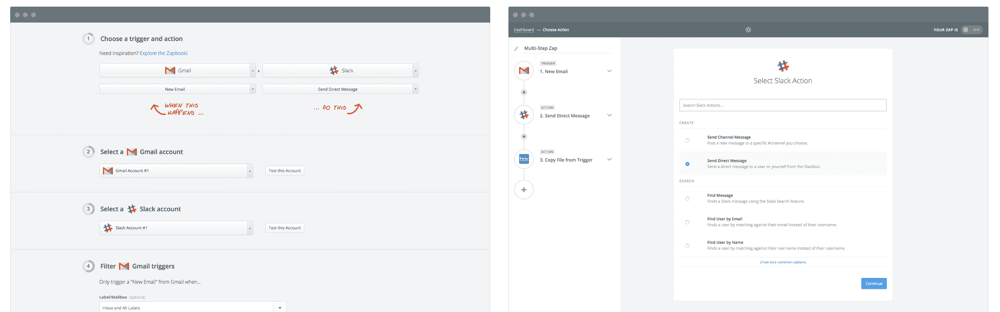

# Zapier 如何自动化数十亿个工作流自动化任务的旅程

> 原文： [http://highscalability.com/blog/2016/2/29/a-journey-through-how-zapier-automates-billions-of-workflow.html](http://highscalability.com/blog/2016/2/29/a-journey-through-how-zapier-automates-billions-of-workflow.html)

*这是[的来宾](http://stackshare.io/zapier/scaling-zapier-to-automate-billions-of-tasks)[转贴了](http://stackshare.io/zapier/scaling-zapier-to-automate-billions-of-tasks) [Bryan Helmig](http://stackshare.io/bryanhelmig) ，是 [Zapier](http://stackshare.io/zapier) 的共同创始人& CTO，他可以轻松地在 Web 之间自动执行任务 应用。*

[Zapier](http://stackshare.io/zapier) 是一项 Web 服务，可自动执行 500 多个 Web 应用程序之间的数据流，其中包括 MailChimp，Salesforce，GitHub，Trello 等。

想象一下[建立一个工作流](https://zapier.com/multi-step-zaps/)（或我们称为“ Zap”）的操作，该操作在用户填写您的 Typeform 表单时触发，然后在您的 Google 日历上自动创建事件，发送 Slack 通知并完成以下操作 在 Google 表格电子表格中添加一行。 那是扎皮尔。 即使对于非技术用户来说，构建这样的 Zaps 也非常容易，并且可以无限地自定义。

作为首席技术官和联合创始人，我构建了许多原始的核心系统，如今领导工程团队。 我想带您**，了解我们的堆栈**，以及我们如何构建它以及如何在今天继续改进它！

## 幕后的团队

使 Zapier 滴答作响需要很多时间，因此我们在工程领域有四个不同的团队：

*   **前端团队**在非常强大的工作流编辑器上工作。
*   **全栈团队**是跨功能的，但专注于工作流引擎。
*   **开发人员小组**保持引擎嗡嗡作响。
*   **平台团队**（可协助质量检查）以及我们开发人员平台的入门合作伙伴。

总而言之，这涉及约 15 名工程师（并且还在不断增加！）。

## 架构

**我们的堆栈不会赢得任何新奇奖**-我们正在使用一些非常标准的（但很棒的）工具为 Zapier 提供动力。 更有趣的是我们使用它们来解决特定品牌问题的方式，但让我们将基础知识排除在外：

### 前端

从主干**过渡到 React** 的过程中，我们感到有些困惑。 我们使用 ES6 的 [Babel](http://stackshare.io/babel) 和 [Webpack](http://stackshare.io/webpack) + [Gulp](http://stackshare.io/gulp) 来编译前端。 我们严重依赖 [CodeMirror](http://stackshare.io/codemirror) 来做一些我们需要的更复杂的输入小部件，并使用 [React](http://stackshare.io/react) + [Redux](http://stackshare.io/reduxjs) 为超级用户做很多繁重的工作 -强大的 Zap 编辑器。

### 后端

[Python](http://stackshare.io/python) 为我们的大部分后端提供了动力。 [Django](http://stackshare.io/django) 是 HTTP 方面的首选框架。 [Celery](http://stackshare.io/celery) 是我们分布式工作流程引擎的*大型*部分。 大部分常规 API 工作都是通过具有历史意义的 [`requests`](https://github.com/kennethreitz/requests) 库（带有一堆自定义适配器和抽象）完成的。

### 数据

[MySQL](http://stackshare.io/mysql) 是我们的主要关系数据存储-您会在 MySQL 内部找到我们的用户，Zaps 等。 [Memcached](http://stackshare.io/memcached) 和 [McRouter](http://stackshare.io/mcrouter) 看起来像是无处不在的缓存层。 其他类型的数据将进入其他更有意义的数据存储中。 例如，在 [Redis](http://stackshare.io/redis) 中发现了用于计费和节流的飞行中任务计数，而 [Elasticsearch](http://stackshare.io/elasticsearch) 存储了 Zaps 的历史活动提要。 对于数据分析，我们喜欢一些 [AWS Redshift](http://stackshare.io/amazon-redshift) 。

### 该平台

我们的大多数平台都位于我们相当**的整体式核心 Python 代码库**中，但是有许多有趣的分支提供了专门的功能。 最好的例子可能是我们如何利用 [AWS Lambda](http://stackshare.io/aws-lambda) 运行合作伙伴/用户提供的代码来自定义应用程序行为和 API 通信。

### 基础设施

由于 Zapier **在 AWS** 上运行，因此我们触手可及。 [EC2](http://stackshare.io/amazon-ec2) 和 [VPC](http://stackshare.io/amazon-vpc) 是此处的中心，尽管我们会尽可能使用 [RDS](http://stackshare.io/amazon-rds) 以及大量的自动伸缩组，以确保服务器池处于最佳状态。 顶部形状。 [Jenkins](http://stackshare.io/jenkins) ， [Terraform](http://stackshare.io/terraform) ， [Puppet](http://stackshare.io/puppet) 和 [Ansible](http://stackshare.io/ansible) 都是开发团队的日常工具。 为了监视，我们对 [Statsd](http://stackshare.io/statsd) ， [Graylog](http://stackshare.io/graylog) 和 [Sentry](http://stackshare.io/sentry) （他们*很好*）不够满意。

## 一些粗糙的数字

这些数字代表一个大概的最小值，以帮助读者了解 Zapier 体系结构的总体大小和尺寸：

*   每天约有超过 800 万个任务自动化
*   每天超过约 6000 万次 API 调用
*   每天有超过 1000 万个入站 Webhooks
*   在 [ELB](http://stackshare.io/aws-elastic-load-balancing) 之后运行 HTTP 的〜12 个 c3.2xlarge 框
*   运行 [Celery](http://stackshare.io/celery) 的大约 100 个 m3.2xlarge 后台工作者（在轮询，挂钩，电子邮件，杂项中分隔）
*   集群中约 3 m3.medium [RabbitMQ](http://stackshare.io/rabbitmq) 节点
*   〜4 个 r3.2xlarge [Redis](http://stackshare.io/redis) 实例-一个热，两个故障转移，一个备份/映像
*   〜6 个 c3.xlarge McRouter 实例之后的〜12 m2.xlarge [Memcached](http://stackshare.io/memcached) 实例
*   〜3 m3.xlarge 无数据 ElasticSearch 实例之后的〜10 m3.xlarge [ElasticSearch](http://stackshare.io/elasticsearch) 实例
*   〜1 个 c3.2xlarge Graylog 服务器后面的〜6 m3.xlarge ElasticSearch 实例
*   集群中约 10 个 dc1.large [Redshift](http://stackshare.io/amazon-redshift) 节点
*   1 个主 db.m2.2xlarge [RDS MySQL](http://stackshare.io/amazon-rds) 实例，带有〜2 个以上的副本，可用于生产读取和分析
*   少数支持 RDS MySQL 实例（下面有更多详细信息）
*   ...以及大量的微服务和杂项专业服务

## 改善架构

虽然架构的主要内容保持不变-我们仅执行了几次大规模迁移-但为将产品分为两类进行了大量工作：

1.  支持重大新产品功能
2.  为更多用户扩展应用程序

让我们深入研究每个示例，尽可能多地获取细节，而不会陷入困境！

#### 大型功能，例如多步 Zaps

当我们在 Startup 周末启动 Zapier（有趣的事实：它首先被称为 Snapier！）时，我们在不到 54 个小时的时间内布置了基本架构（由大量的咖啡和更多的啤酒推动）。 总的来说，这是体面的。 **我们保持设计非常非常简单**，这在当时是正确的选择。

除了**之外，*也是*简单**。 具体来说，我们将 Zaps 分为两步：将触发器与一个动作配对，一个句号。

我们很快就意识到了错过的机会，但是过渡将非常复杂。 我们必须实现一个有向树，并支持任意数量的步骤（节点），但要对现有 Zaps（其中已有数十万个）保持 1 对 1 的支持。 我们必须做到这一点，同时还要保留对数百个独立合作伙伴 API 的支持。

从数据模型开始，我们在 MySQL 中构建了一个非常简单的有向树结构。 想象一下一个表，其中每行都有一个自引用`parent_id`外键，再加上一个额外的`root_id`外键以简化查询，您几乎就可以了。 我们讨论了切换到适当的图形数据库（例如 neo4j）的决定，但由于我们进行的查询种类简单且遍历较小的孤立图形（大约 2 至 50 个节点），因此决定拒绝这样做。

进行此工作的一个关键方面是步骤间的独立性。 每一步都必须消耗一些数据（例如，要读取哪个文件夹或要添加到哪个列表 ID），做一些 API 魔术操作并返回一些数据（例如，创建的新文件或添加到列表的新卡） ，但不知道其在工作流程中的位置。 每个独立的步骤都是愚蠢的。

中间是**全知的工作流引擎，该引擎通过将步骤作为任务串在一起来协调独立的 Celery 任务**-一步是由 Zap 的有根树定义的。 这个无所不知的引擎还包含所有其他优点，例如错误&重试处理，报告，日志记录，节流等。

即使在获得后端支持之后，我们仍然遇到另一个巨大的问题：**您如何为该对象构建 UI？**

首先，确保团队中有一些*出色的*设计师和 Javascript 工程师。 然后，您将在嵌套的 Backbone 视图中工作一段时间，然后再进入 React。 :-)认真地说： [React](/react) 是我们正在构建的各种复杂接口的天赐之物。

React 的独特之处之一是性能特性对开发人员很友好，但前提是您必须弄清楚数据。 如果您不使用不可变的数据结构，则应使用一些结构共享库来进行所有突变，以及正在开发的深层`Object.freeze()`来捕捉直接尝试突变的地方。

构建如此复杂的 UI 面临许多挑战，其中大部分围绕测试和反馈，但要花费大量时间才能从不同的 API 中获取长尾数据，以使其优雅地适合于相同位置。 几乎每种奇怪的数据形状都必须考虑在内。

最后，我们的任务是让新编辑器在用户面前进行 alpha 和 beta 测试。 为此，我们同时发布了两个版本的编辑器，并使用功能开关选择了加入用户。在对结果感到满意之前，我们进行了数月的测试和调整，您可以查看 [Multi-Step Zap 发布 页](https://zapier.com/multi-step-zaps/)了解其最终结果。

## 扩展应用程序

如果服务无法正常启动并可靠运行，那将是徒劳的。 因此，我们的大部分注意力集中在支持水平可伸缩性*和*冗余基础结构以确保可用性的应用程序设计上。

到目前为止，我们做出的一些更明智的决策是**，使我们对**感到满意的技术倍增，而**遇到瓶颈**时，则会分离出隔离的功能。 关键是**重用完全相同的解决方案，然后将其移动到另一个可以自由漫游 CPU 和 RAM 新鲜牧场的盒子**。

例如，在过去一年左右的时间里，我们注意到会话数据耗尽了主数据库的 IO 和存储量。 由于会话数据实际上是具有较弱一致性要求的键/值排列，因此我们对诸如 [Cassandra](http://stackshare.io/cassandra) 或 [Riak](http://stackshare.io/riak) （甚至是 Redis！）之类的方案进行了激烈的辩论，但最终决定站起来 具有单个会话表的 MySQL 实例。

作为工程师，我们的本能是找到最适合该工作的工具，但是**作为实际问题**，该工作并不能保证额外的操作复杂性。 我们知道 MySQL，它可以进行简单的键/值存储，我们的应用程序已经支持它。 畅所欲言。

此外，仔细设计应用程序可以使水平缩放同样简单。 长期运行的后台任务（例如我们的多步骤 Zaps）不受**轻写模式**的严格一致性要求的约束，因此**使用 MySQL 读操作是微不足道的（而且很安全！）。 仅将**复制为*主要*接触点。 即使我们偶尔在几分钟内得到了可怕的复制品延迟，但 99.9％的 Zaps 并没有改变-并且肯定不会很快改变-因此它们继续嗡嗡作响。

另一个好的做法是**假设最坏的**。 从一开始就设计失败。 尽管通常说起来容易做起来难，但如今实际上却很容易做到。 对于初学者：**将自动缩放组与自动替换**一起使用。 一个常见的误解是，ASG 仅用于扩展以适应波动的负载。 **错误！** **ASG + ELB 组合可以成为可靠性的骨干**，它使您可以随意杀死实例，而不必担心，因为它们会迅速被替换。

不知何故，我们不断地学习到，系统越简单，您的睡眠就越好。

## 日常

在本地，我们的工程师享受 [Docker](http://stackshare.io/docker) 提供的功能全面的环境。 `[docker-machine](http://stackshare.io/docker-machine)`和 [`docker-compose`](http://stackshare.io/docker-compose) 一起构成了 MySQL，Memcached，Redis，Elasticsearch 以及所有 Web 和后台工作人员的正确版本。 我们通常建议在本地运行 [`npm`](/npm) 甚至是`runserver`，因为 VirtualBox 会破坏文件监视功能。

规范的 [GitHub](http://stackshare.io/github) “拉动请求模型”驱动了我们的大部分工程重点项目，其中记录了日常工作，并在合并之前进行了最终代码审查。 [Hackpad](http://stackshare.io/hackpad) 包含了我们的大部分文档，其中包括大量的入门文档。

Zapier 的一大优势是[所有人都支持](https://zapier.com/blog/everyone-on-support/)。 每四到五周，每位工程师都会花费整整一周的支持来帮助调试和解决棘手的客户问题。 这对我们非常重要，因为它为了解客户的痛苦提供了基线（此外，您可能必须处理所运送的错误！）。

对于 CI 和部署，我们使用 [Jenkins](http://stackshare.io/jenkins) 对每个 PR 中的每个提交运行测试，并提供公司任何人都可以按下的“一键式部署”。 新工程师在工作的第一周点击部署按钮的情况并不少见！

我们在独立的 VPC 中拥有一个**完整的登台环境，以及一些非常适合测试长期拉动请求的独立 Web 框。 金丝雀部署到生产中很常见-完整记录所有错误，由 Graylog 提供。**

## 你也可以扎皮尔！

开发人员可以使用 Zapier 来做一些很棒的事情。

除了多步骤 Zaps，我们还启用了将 [Python](https://zapier.com/help/code-python/) 和 [Javascript](https://zapier.com/help/code/) 编写为工作流中的代码步骤的功能。 无需自己托管和运行脚本-我们会处理所有这些。 我们还提供了绑定以调用网络（`requests`和`fetch`），甚至在两次运行之间存储一些状态！

我们的用户正在采用代码步骤来构建 [Slack](http://stackshare.io/slack) 机器人（以及游戏！），以替换一次性脚本以及更多其他内容。 我个人使用代码步骤来编写机器人和工具，以将代码&错误度量标准跟踪到电子表格中，转换格式奇怪的数据，并替换*吨* crontabs。

或者，如果您具有希望非开发人员能够使用的 API，那么我们也将拥有一个史诗般的[开发人员平台](https://zapier.com/developer/)。 只需定义触发器，搜索和操作，任何用户都可以将您的 API 混合到他们的工作流中，并将您的应用程序与 GitHub，Salesforce，Google Docs 等 500 多种应用程序集成。

而且，我们经常在招聘，因此，如果您想帮助我们帮助人们更快地工作并自动执行最繁琐的任务，请关注我们的[工作页面](https://zapier.com/jobs/)！

[关于 HackerNews](https://news.ycombinator.com/item?id=11082359)

链接已断开...

感谢抓住 Gigi！

为什么使用 MySQL？ Postgres 不是它的超集吗？

您能否评论一下如何在芹菜上实现编排？ 以我的经验，很难做到这一点，因为很多逻辑是在任务级别定义的，例如，很难在运行时修改任务的行为，因为它的定义是静态的，并且在将模块加载到工作程序时变成静态的。