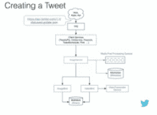

# Twitter 如何每秒处理 3,000 张图像

> 原文： [http://highscalability.com/blog/2016/4/20/how-twitter-handles-3000-images-per-second.html](http://highscalability.com/blog/2016/4/20/how-twitter-handles-3000-images-per-second.html)

今天，Twitter 正在每秒创建并永久保存 3,000 张（200 GB）图像。 更好的是，由于媒体存储政策的改进，2015 年 Twitter 节省了 600 万美元。

并非总是如此。 2012 年的 Twitter 主要基于文本。 霍格沃茨没有在墙上挂满所有酷炫的动态图像。 现在是 2016 年，Twitter 已经进入了一个拥有丰富媒体的未来。 Twitter 已经通过开发新的*媒体平台*进行了过渡，该平台可以支持带有预览的照片，多张照片，GIF，藤蔓和嵌入式视频。

Twitter 的软件开发工程师 [Henna Kermani](https://www.linkedin.com/in/henna-kermani-27701146) 在 [Mobile @上进行了有趣的演讲，讲述了媒体平台的故事 伦敦规模](https://www.atscalelondon.co.uk/) ： [每秒 3,000 张图像](https://code.facebook.com/posts/1566627733629653/mobile-scale-london-recap/) 。 演讲主要集中在图像管道上，但她说大多数细节也适用于其他形式的媒体。

这次演讲中一些最有趣的教训：

*   **做可能可行的最简单的事情确实会使您陷入困境**。 上载带有图像的 tweet 的简单方法是“全有或全无”操作，是一种锁定形式。 它的伸缩性不好，尤其是在网络较差的情况下，这使得 Twitter 很难添加新功能。

*   **解耦**。 通过将媒体上传与推文脱钩，Twitter 能够独立地优化每种途径，并获得了许多运营灵活性。

*   **移动不处理斑点**。 请勿在系统中传输大量数据。 它占用了带宽，并为每个必须处理数据的服务带来了性能问题。 而是存储数据并使用句柄引用它。

*   移至**分段可恢复上传**导致媒体上传失败率大大降低。

*   **实验和研究**。 Twitter 通过研究发现，图像变体（缩略图，小图像，大图像等）的 20 天 TTL（生存时间）是一个最佳选择，在存储和计算之间取得了很好的平衡。 映像在 20 天后被访问的可能性很小，因此可以将其删除，**每天节省近 4TB 的数据存储量**，**几乎减少了一半** **所需的计算服务器数量** ，每年可节省数百万美元。

*   **按需**。 可以删除旧的图像变体，因为它们可以即时重新创建而不是预先计算。 按需执行服务可提高灵活性，使您对执行任务的方式更加了解，并提供集中控制点。

*   **渐进 JPEG** 作为标准图像格式是真正的赢家。 它具有强大的前端和后端支持，并且在速度较慢的网络上表现非常出色。

Twitter 走向富媒体的未来之旅中发生了许多美好的事情，让我们了解一下他们是如何做到的...

## 旧方法-2012 年的 Twitter

### 写入路径

*   用户在应用程序中撰写推文，并可能在其中附加图像。

    *   客户端将推文发布到整体端点。 该图像将与所有其他推特元数据捆绑在一起上传，并传递到流程中涉及的每个服务。

    *   这个端点是旧设计中很多问题的根源。

*   **问题＃1** ：大量浪费的网络带宽

    *   发推文的创建和媒体上载紧密地结合到一个操作中。

    *   正在上传，上传完全成功或完全失败。 由于任何原因导致的故障，网络故障，瞬态错误等，都要求整个上载过程从头开始重新启动，包括媒体上载。 上载可以完成 95％，如果失败，则必须重新上载所有内容。

*   **问题 2** ：对于新的较大尺寸的介质，无法很好地扩展

    *   这种方法无法扩展到视频等大型媒体。 较大的文件会增加失败的可能性，尤其是在新兴市场（如巴西，印度，印度尼西亚）网络缓慢且不可靠的地方，他们确实希望提高推文上传成功率。

*   **问题 3** ：内部带宽使用效率低下

    *   连接到 TFE 的端点，即 Twitter 前端，用于处理用户身份验证和路由。 用户被路由到图像服务。

    *   图像服务与 Variant Generator 对话，后者生成不同大小（例如小，中，大，缩略图）的图像实例。 这些变体存储在 BlobStore 中，BlobStore 是为大型有效负载（如图像和视频）优化的键值存储。 这些图像永远存在。

    *   创建和保留推文的过程中还涉及许多其他服务。 因为端点是整体的，将媒体与推文元数据结合在一起，所以该捆绑包也流经所有服务。 如此大的有效负载被传递给了不直接负责处理图像的服务，它们不是媒体管道的一部分，但仍被迫进行优化以处理大型有效负载。 这种方法在内部带宽方面效率很低。

*   **问题 4** ：膨胀的存储空间

    *   不再需要几个月和几年前发布的推文中的图像，这些图像将永久存在于 BlobStore 中，从而占用了空间。 即使有时删除推文时，图像也会保留在 BlobStore 中。 没有垃圾收集。

### 读取路径

*   用户看到一条推文以及与之相关的图像。 图片从何而来？

*   客户端从 CDN 请求图像的变体。 CDN 可能需要询问图像的来源 TFE。 这最终将导致在 BlobStore 中直接查找特定大小的 URL 的图像。

*   **问题 5** ：不可能引入新的变体

    *   设计不是很灵活。 添加新的变体，即大小不同的图像，将需要为 BlobStore 中的每个图像回填新的图像大小。 没有随需应变的设施。

    *   缺乏灵活性使 Twitter 很难在客户端上添加新功能。

## 新方法-2016 年的 Twitter

### The Write Path

#### 将媒体上传与发帖分离。

*   上传的内容为头等公民。 创建了一个上传端点，唯一的责任是将原始媒体放入 BlobStore

*   这在处理上传方式方面提供了很大的灵活性。

*   客户端与 TFE 对话，后者与 Image Service 对话，后者将图像放入 BlobStore 中并将数据添加到元数据存储中。 而已。 没有涉及其他隐藏服务。 没有人在处理媒体，没有人在传递媒体。

*   从图像服务返回 mediaId（媒体的唯一标识符）。 当客户想要创建推文，DM 或更新其个人资料照片时，mediaId 将用作引用媒体的句柄，而不是提供媒体。

*   假设我们要使用刚刚上传的媒体创建一条推文。 流程如下：

    *   客户端点击更新端点，并在发布中传递 mediaId； 它将到达 Twitter 前端； TFE 将路由到适合于所创建实体的服务。 对于推文，它是 TweetyPie。 DM 和配置文件有不同的服务； 所有服务将与图像服务对话； 图像服务器具有处理诸如人脸检测和儿童色情检测之类的功能的后处理队列。 完成此操作后，Image Service 与 ImageBird 对话以获取图像，或与 VideoBird 对话以获取视频； ImageBird 将生成变体； VideoBird 将进行一些转码； 生成的任何媒体都将放入 BlobStore。

    *   没有媒体通过。 节省了大量浪费的带宽。

#### 分段的可恢复上传。

*   走进地铁，在 10 分钟后出来，上传过程将从停止的地方恢复。 对用户而言是完全无缝的。

*   客户端使用上载 API 初始化上载会话。 后端将为它提供一个 mediaId，该 ID 是整个上传会话中要使用的标识符。

*   图像分为多个部分，例如三个部分。 使用 API​​附加分段，每个追加调用给出分段索引，所有附加都针对相同的 mediaId。 上载完成后，上载完成，可以使用媒体了。

*   这种方法对于网络故障更具弹性。 每个细分都可以重试。 如果网络由于任何原因而掉线，您可以暂停并取回网络恢复时停在的网段。

*   具有巨大收获的简单方法。 对于文件> 50KB，巴西的图像上传失败率下降了 33％，印度为 30％，印度尼西亚为 19％。

### The Read Path

#### 推出了名为 MinaBird 的 CDN 原始服务器。

*   MinaBird 可以与 ImageBird 和 VideoBird 对话，因此，如果不存在图像大小变体和视频格式变体，则可以即时生成它们。

*   MinaBird 在处理客户端请求方面更流畅，更动态。 例如，如果有《数字千年版权法案》下架，很容易阻止访问或重新启用对特定媒体的访问。

*   Twitter 能够即时生成变体和代码转换，因此 Twitter 在存储方面变得更加聪明。

    *   按需变量生成意味着不需要将所有变量存储在 BlobStore 中。 巨大的胜利。

    *   原始图像将保留直到删除。 变体仅保留 20 天。 Media Platform 团队针对最佳有效期限进行了大量研究。 所有请求的图像中大约有 50％的时间最多为 15 天左右。 保留比这更旧的图像会导致收益递减。 没人会要求使用较旧的媒体。 15 天后尾巴很长。

    *   由于没有 TTL（生存时间），没有过期，因此媒体存储每天的存储量每天增长 6TB。 这种按需生成所有变体的惰性方法导致每日存储增长 1.5TB。 20 天的 TTL 使用的存储空间不会比惰性方法多得多，因此在存储空间方面并不会花费太多，但是在计算方面这是一个巨大的胜利。 使用懒惰的方法来计算读取的所有变体将需要每个数据中心使用 150 台 ImageBird 机器，而使用 20 天 TTL 则需要 75 台左右。 因此 20 天的 TTL 是最佳选择，可以在存储和计算之间取得良好的平衡。

    *   由于节省存储空间和计算就是节省资金，2015 年 Twitter 通过引入 20 天 TTL 节省了 600 万美元。

#### 客户端改进（Android）

*   使用 Google 创建的图像格式 [WebP](https://en.wikipedia.org/wiki/WebP) 进行了为期 6 个月的实验。

    *   图像平均比相应的 PNG 或 JPEG 图像小 25％。

    *   锯增加了用户的参与度，尤其是在新兴市场中，在这些新兴市场中，较小的图像尺寸会降低网络压力。

    *   iOS 不支持。

    *   仅在 Android 4.0+上受支持。

    *   缺乏平台支持使 WebP 的支持成本很高。

*   渐进 JPEG 是 Twitter 尝试的另一种选择。 它在连续扫描中呈现。 第一次扫描可能是块状的，但是它将通过连续扫描进行完善。

    *   更好的性能。

    *   易于在后端支持。

    *   的编码速度比传统 JPEG 慢 60％。 由于编码只会发生一次，而投放会发生多次，因此这不是一个大问题。

    *   不支持透明度，因此保留了透明的 PNG，但是其他所有内容都在渐进 JPEG 上收敛。

    *   在客户端， [Facebook 的 Fresco](https://github.com/facebook/fresco) 库提供了支持。 关于壁画有很多很好的话要说。 2G 连接的结果令人印象深刻。 首次扫描 PJPEG 仅需要大约 10kb，因此加载时间不会很长。 本机管道仍在等待加载，什么也没有显示，而 PJPEG 正在显示可识别的图像。

    *   在 tweet 详细信息视图中正在进行的负载实验的结果。 p50 加载时间减少了 9％。 p95 加载时间减少了 27％。 故障率降低了 74％。 连接速度较慢的用户确实会获得巨大的成功。

## 相关文章

*   [关于 HackerNews](https://news.ycombinator.com/item?id=11535418)

*   [Twitter 用来处理 1.5 亿活跃用户，300K QPS，22 MB / S Firehose 的架构，并在 5 秒内发送推文](http://highscalability.com/blog/2013/7/8/the-architecture-twitter-uses-to-deal-with-150m-active-users.html)

*   [Twitter 如何使用 Redis 进行扩展-105TB RAM，39MM QPS，10,000 多个实例](http://highscalability.com/blog/2014/9/8/how-twitter-uses-redis-to-scale-105tb-ram-39mm-qps-10000-ins.html)

*   [DataSift 架构：每秒 120,000 条推特的实时数据挖掘](http://highscalability.com/blog/2011/11/29/datasift-architecture-realtime-datamining-at-120000-tweets-p.html)

“今天，Twitter 正在每秒创建并保留 3,000（200 GB）图像。”

与...不同

“ Twitter 可以创建大约 3,000 张独特的图像，并每秒传输大约 200 GB 的图像。”

请不要更改其含义。

我并不是要批评/挑剔这是什么引人入胜的文章，但是开头段落中的 200GB 数字不是很清楚–每秒 200GB：“每秒可保留 3,000（200 GB）图像” 。

除非我缺少任何东西，否则这似乎是不正确的。 对于 3000 张图像，相当于 200GB，它们将需要很大的文件（每个〜68mb），而且每天 6TB 的存储量（无 TTL）将不可用（在 200GB /秒的情况下，它们需要更多 16PB /天，无 TTL）。

我尝试过数学，最合乎逻辑的是：200GB /分钟，这将使我们平均获得 1.3MB /图像，这看起来更准确，但仍然是 281TB /天。

如果有人可以弄清楚我是不是愚蠢还是真正的价值应该是很棒的。

我认为 200GB 包含必要的复制。 因此，200GB 可能至少是图像原始大小的 3 倍。

另外，Twitter 可能需要每个图像有多个版本，例如 缩略图，原始图片等。每个都有不同的分辨率。 这就增加了很多存储空间。

不管 Twitter 进行多少复制，仍然很难相信一张图像会占用约 66 MB 的空间。 数字/单位在这里肯定是错误的。

哦，这应该是“ Twitter 可以创建约 3,000 个唯一图像，每秒传输约 200 GB 图像。” 正如第一个评论试图指出的那样。 原始来源：https://code.facebook.com/posts/1566627733629653/mobile-scale-london-recap/

没有狗屎夏洛克，这些都是众所周知的技术，对不起，没什么有趣的。

你好

好吧，我不认为客户端改进版在 Android 4.0+上受支持会存在任何问题，因为我记得该版本于 2011 年发布。 因此，可能每个人都拥有较年轻的版本。

这句话的意思很明确：“ Twitter 可以创建大约 3,000 个唯一的图像，并每秒传输大约 200 GB 的图像。”

“创建大约 3,000 张独特的图像”：如果以 3 种不同的尺寸保存图像，则用户上传了 1,000 张图像。
“每秒传输大约 200 GB 的图像”：并不是说它们存储 200 GB 的图像。 但是他们传输 200 GB。 这意味着它们每秒可交付 200 GB 的图像。

他们是否将图像存储两次？
图片服务将图片上传到 Blob 存储并返回 mediaId。
mageBird 将生成变体； VideoBird 将进行一些转码； 生成的任何媒体都将放入 BlobStore。