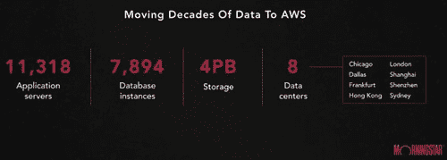

# 为何将 Morningstar 迁移到云端：降低 97％的成本

> 原文： [http://highscalability.com/blog/2017/8/14/why-morningstar-moved-to-the-cloud-97-cost-reduction.html](http://highscalability.com/blog/2017/8/14/why-morningstar-moved-to-the-cloud-97-cost-reduction.html)

企业不会迁移到云。 如果他们这样做，那就等于承认您的 IT 团队很糟糕。 那是常识。 投资研究提供商晨星（Morningstar）正在迁移到云中，他们正变得越来越有企业精神。 他们并没有让我感到无能，他们只是不想再担心所有低级的 IT 问题。

晨星（Morningstar）的 CTO Mitch Shue 在 [AWS Summit Series 2017](https://www.youtube.com/watch?v=vhNvhJGOhSw&ab_channel=AmazonWebServices) 上做了简短的演讲。 它并没有完整的技术细节。 那不是有趣的部分。 演讲更多地是关于他们的动机，他们采取行动的过程以及他们所经历的一些结果。 尽管这更有趣，但我们之前已经听到了很多。

我发现最有趣的是晨星作为金丝雀测试的想法。 如果晨星公司成功，那么该死的公司可能破产，我们将看到呆板的主流企业更多地采用云技术。 这是一个复制猫的世界。 这种先例为其他 CTO 提供了做出相同决定所需的掩护。

在整个演讲中，最重要的想法是：迁移到云上可以节省很多成本，但是他们更感兴趣的是“创建无摩擦的开发经验以刺激创新和创造力”。

软件正在吞噬世界。 毫无疑问，晨星展望未来，看到赢家将是那些能够以最快的速度开发最好的软件的人。 他们需要更好地开发软件。 拥有自己的基础架构是技术债务的一种形式。 是时候偿还债务并开始进行真正的创新工作了，而不是苦苦挣扎。

这是我的谈话内容：

## 基础设施

*   全球 8 个数据中心
*   11,318 个应用服务器
*   7,894 个数据库实例
*   4PB 存储

## 改变的时候了

*   想象一下在修补，升级，管理和保护 8 个全球数据中心方面所做的工作。 运行非常复杂。
*   问题不在于他们的 IT 员工。 他们对 IT 感到满意。
*   想要最大化人才，拥有更少的基础架构并专注于核心业务。
*   想要简化和减少复杂性。
*   运行数据中心并不能与它们区分开。

## 改变文化

*   过渡到云需要来自世界各地的 1400 名技术人员的参与。 不容易做到。
*   来自世界各地的许多半自治团体都有各自的路线图和团队目标。
*   既定的高级技术目标：最大化人才，拥有更少的基础设施，减少复杂性，提高产品完整性，产品安全性，产品可恢复性，产品可靠性，更好的正常运行时间，更好的监控和更快的事件响应。
*   选择目标的目的是易于重复，易于理解且不会过期。
*   不要对自己的文化感到被动。 通过有目的的重复将这些目标融入您的文化：大量会议，博客文章，演示和对话。
*   迁移到 AWS 支持这些目标。

## 策略：快速行动然后优化

*   数据收集团队最初使用提升和转换方法迁移到 AWS。 那使他们迅速进入了云端。
*   一旦一切正常，他们就开始降低复杂性。
*   将 SQL Server 替换为 RDS for PostgreSQL。
*   添加了用于消息传递的 Kinesis，因此他们可以更好地控制工作负载分配。
*   由于他们的应用程序每天仅运行 2-4 小时，因此他们用 Lambda 函数替换了所有 EC2 实例。
*   致力于制定按需创建和销毁整个计算机环境的策略。
*   将他们的数据湖移至 S3。
*   不断进行迭代以降低复杂性。

## 结果：降低了 97％的成本

*   当然，该项目是经典的 Lambda 用例。 空闲时间这么多，全时 EC2 实例没有多大意义。
*   但话又说回来，您可以想象整个企业中有许多这样的潜在优化。

## 未来

*   到 2017 年，核心数据 API 将移动数 TB 的数据，每天处理数百万条消息。
*   到 2018 年，他们将存储超过 2PB 的数据，每天处理超过 20 亿条消息，以支持超过 5 亿美元的产品收入。
*   到 2020 年将自己的基础设施减少 70％的目标。
*   悉尼数据中心将于 2018 年关闭。通过迁移非生产环境来缩小深圳的占地面积。
*   创建了一个卓越的云计算中心，以重新考虑安全性，部署和运营等领域。
*   将启动再培训计划，以对内部人员的技能进行投资和现代化（不错！）。
*   成本效率很高，但他们也有兴趣创造一种无摩擦的开发经验以刺激创新和创造力。 他们采取此举似乎是一个重要原因。

## 为什么选择 AWS？

*   谈话的这一部分听起来像是 AWS 新闻稿，毕竟这是一次 AWS 会议，但这是企业 CTO 如何思考问题的一个很好的例子。
*   喜欢 AWS 的步伐创新，服务呼吸和专业支持。
*   转向 AWS 并拥有更少的基础架构意味着更多的容量，更多的安全性，更高的可靠性，更多的安心和更多的创新自由。

[关于 HackerNews](https://news.ycombinator.com/item?id=15010310)

上周没有“互联网说可扩展性”一文。 这是故意遗漏的吗？ :)

通过重写所有基础架构和代码将成本降低 97％，可以
迁移到 AWS：昂贵，但不到 2020 年在全球范围内维护 1995 年的基础架构
投入使用，成本降低了 70％以上

如果您不能让工程师和开发人员升级/优化软件，请上云；如果您不是一家没有客户的初创公司，请始终保持低价……

抱歉，该 zbb。 我本来有最好的意图，但我生日那天不在，只是没有足够的时间来完成它。 我们本周上班。 如果我的老手仍然可以输入:-)

我也错过了星期五的帖子！

希望你生日快乐。

我做了卡尔，谢谢！

>如果您不是一家没有客户的初创企业，它总是“低声”。

这就是为什么我认为这是一个有趣的案例，修剪。 显然，他们有自己的印章，可以按自己的方式办事。 如果他们认为节省的成本不堪重负，他们会坚持并留下来，但事实并非如此。

关于它们的“空闲时间优化”，我一无所获：为什么有人需要 11k 的应用程序服务器和 7k 的数据库服务器来处理“每天仅工作 2-4 小时”的应用程序？

我对 Reader 的理解是，这些数字是指他们的整个系统，而空闲时间是指他们最初选择迁移到 AWS 的系统。

“用 RDS 替换 PostgreSQL 的 SQL Server”可能节省了 50％的 M $