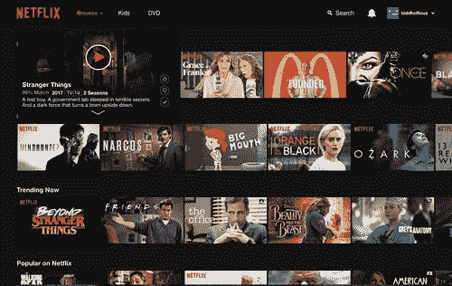
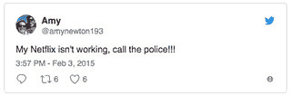
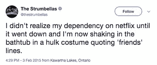
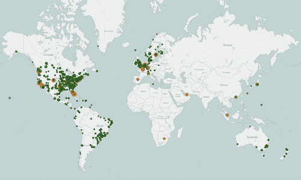
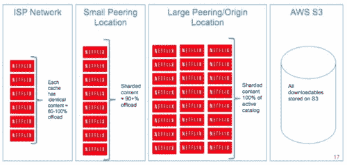
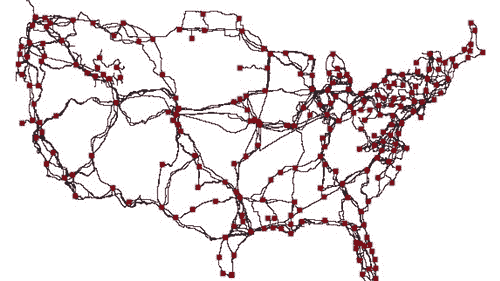
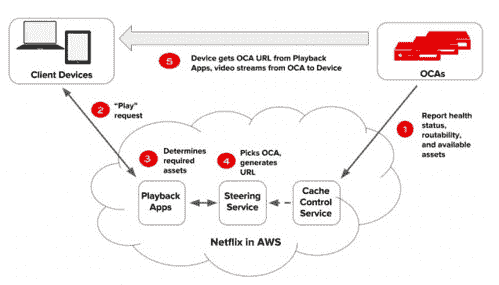

# Netflix：按下 Play 会发生什么？

> 原文： [http://highscalability.com/blog/2017/12/11/netflix-what-happens-when-you-press-play.html](http://highscalability.com/blog/2017/12/11/netflix-what-happens-when-you-press-play.html)

本文是我新书[中的一章，就像我 10 岁时一样解释云](https://smile.amazon.com/Explain-Cloud-Like-Im-10-ebook/dp/B0765C4SNR)。 第一版是专门为云新手编写的。 我进行了一些更新并添加了几章— *Netflix：按 Play 时会发生什么？* 和*什么是云计算？-*将其升级到比初学者高几个刻度。 我认为即使是经验丰富的人也可以从中受益。

我还在独立的 Kindle 电子书中创建了本文的某种扩展版本。 您可以在 [Netflix 上找到该电子书：按下 Play 会发生什么？](https://www.amazon.com/Netflix-What-Happens-When-Press-ebook/dp/B079ZKT9G8/)

因此，如果您正在寻找关于云的良好介绍或认识某个人，请看一下。 我想你会喜欢的。 我为结果感到非常自豪。

我从几十个有时有些矛盾的资料中整理了这一章。 事实随着时间的流逝而变化，并且取决于谁在讲故事以及他们要针对的受众。 我试图创造尽可能连贯的叙述。 如果有任何错误，我很乐意修复。 请记住，本文不是技术性的深入探讨。 这是一篇大图文章。 例如，我什至没有提到*微服务*这个词：-)

Netflix 似乎很简单。 按播放，视频就会神奇地出现。 容易吧？ 没那么多。

鉴于我们在*中的讨论，什么是云计算？ 在*一章中，您可能希望 Netflix 使用 AWS 来提供视频。 在 Netflix 应用程序中按新闻播放，存储在 S3 中的视频将通过 Internet 从 S3 直接流式传输到您的设备。

完全明智的方法……以提供更小的服务。

但这根本不是 Netflix 的运作方式。 它比您想象的要复杂和有趣得多。

看看为什么我们来看看 2017 年一些令人印象深刻的 Netflix 统计数据。

*   Netflix 拥有超过 1.1 亿订户。
*   Netflix 在 200 多个国家/地区运营。
*   Netflix 每季度的收入接近 30 亿美元。
*   Netflix 每季度增加超过 500 万新订户。
*   Netflix 每周播放超过 10 亿小时的视频。 相比之下，YouTube 每天流 10 亿小时的视频，而 Facebook 每天流 1.1 亿小时的视频。
*   Netflix 在 2017 年每天播放 2.5 亿小时的视频。
*   Netflix 占美国峰值互联网流量的 37％以上。
*   Netflix 计划在 2018 年在新内容上花费 70 亿美元。

**我们学到了什么？**

Netflix 非常庞大。 他们是全球性的，拥有很多成员，播放很多视频，并且有很多钱。

另一个相关的事实是 Netflix 是基于订阅的。 会员每月支付 Netflix 费用，并可随时取消。 当您按 play 在 Netflix 上放松时，效果会更好。 不高兴的成员退订。

**我们要深入**

Netflix 是我们讨论过的所有想法的绝妙示例，这就是为什么本章比我们介绍的其他云服务要详细得多的原因。

深入研究 Netflix 的一个重要原因是，他们可以提供比其他公司更多的信息。

Netflix 拥有*通信*作为核心[文化价值](https://www.slideshare.net/BarbaraGill3/netflix-culture-deck)。 Netflix 不仅仅符合其标准。

实际上，我要感谢 Netflix 如此开放的架构。 多年来，Netflix 就其运作方式进行了数百次演讲，并撰写了数百篇文章。 整个行业对此都更好。

在 Netflix 上进行大量详细介绍的另一个原因是 Netflix 令人着迷。 我们大多数人曾经一次或一次使用 Netflix。 谁会不喜欢在帘子后面偷看，看看是什么让 Netflix 滴答作响？

**Netflix 在两个云中运行：AWS 和 Open Connect。**

Netflix 如何使会员满意？ 当然有了云。 实际上，Netflix 使用两种不同的云：AWS 和 Open Connect。

两种云必须无缝协作才能提供无数小时的客户满意视频。

**Netflix 的三个部分：客户端，后端，内容交付网络（CDN）。**

您可以将 Netflix 分为三部分：客户端，后端和内容交付网络（CDN）。

*客户端*是用于浏览和播放 Netflix 视频的任何设备上的用户界面。 它可能是 iPhone 上的应用程序，台式计算机上的网站，甚至是智能电视上的应用程序。 Netflix 控制着每个设备的每个客户端。

在您按下*播放*之前发生的所有事情都发生在*后端*中，该后端在 AWS 中运行。 这包括准备所有新传入的视频以及处理来自所有应用程序，网站，电视和其他设备的请求。

按下*播放*后发生的所有事情均由 Open Connect 处理。 Open Connect 是 Netflix 的自定义全球内容交付网络（CDN）。 Open Connect 将 Netflix 视频存储在世界各地。 当您按播放时，来自 Open Connect 的视频流将进入您的设备，并由客户端显示。 不用担心 我们稍后再讨论 CDN 的含义。

有趣的是，在 Netflix，他们实际上并没有说*在视频*上大受欢迎，而是说*单击标题*上的开始。 每个行业都有自己的术语。

通过控制所有三个区域（客户端，后端，CDN），Netflix 已实现了完整的垂直整合。

Netflix 从始至终控制着您的视频观看体验。 这就是为什么当您从世界任何地方单击播放时，它都可以起作用的原因。 您可以在观看时可靠地获取要观看的内容。

让我们看看 Netflix 如何做到这一点。

## **在 2008 年，Netflix 开始转向 AWS**

Netflix 于 1998 年成立。起初，他们通过美国邮政服务公司租借了 DVD。 但是 Netflix 看到了未来的点播视频流。

Netflix 在 2007 年推出了其点播流媒体服务，该服务使订户可以通过 Netflix 网站在个人计算机上或在各种受支持的平台上的 Netflix 软件（包括智能手机和平板电脑，数字媒体播放器，视频）流式传输电视连续剧和电影。 游戏机和智能电视。

就个人而言，点播视频流是未来，这似乎很明显。 是的。 我曾在几家尝试制作视频点播产品的初创公司工作。 他们失败了。

Netflix 成功。 Netflix 的表现肯定不错，但是他们迟到了，这对他们有所帮助。 到 2007 年，互联网已经足够快且便宜，足以支持流视频服务。 以前从未如此。 快速，低成本的移动带宽的增加以及功能强大的移动设备（如智能手机和平板电脑）的推出，使任何人都可以随时随地以流媒体的方式更轻松，更便宜。 时间就是一切。

## **Netflix 通过运行自己的数据中心开始**

EC2 只是在 2007 年才开始使用，大约与 Netflix 的流媒体服务启动的时间相同。 Netflix 不可能使用 EC2 来启动。

Netflix 建立了两个彼此相邻的数据中心。 他们经历了我们在前面几章中讨论过的所有问题。

建立数据中心需要大量工作。 订购设备需要很长时间。 安装和使所有设备正常工作需要很长时间。 并且，一旦他们一切正常，它们将耗尽容量，整个过程必须重新开始。

设备的交货期长，迫使 Netflix 采用所谓的*垂直缩放*策略。 Netflix 制作了在大型计算机上运行的大型程序。 这种方法称为构建*整体*。 一个程序可以完成所有工作。

问题是，当您像 Netflix 一样快速成长时， 很难使整体可靠。 事实并非如此。

## **服务中断导致 Netflix 迁移到 AWS**

在 2008 年 8 月的三天内，由于数据库损坏，Netflix 无法运送 DVD。 这是不可接受的。 Netflix 必须做点什么。

建立数据中心的经验告诉 Netflix 一个重要的教训-他们不擅长建立数据中心。

Netflix 擅长的是向其成员提供视频。 Netflix 宁愿集中精力于更好地提供视频，而不是擅长于构建数据中心。 建立数据中心并不是 Netflix 的竞争优势，而提供视频则是。

当时，Netflix 决定迁移到 AWS。 AWS 刚刚成立，因此选择 AWS 是一个大胆的举措。

Netflix 之所以选择 AWS，是因为它想要一个更可靠的基础架构。 Netflix 希望从其系统中消除任何单点故障。 AWS 提供了高度可靠的数据库，存储和冗余数据中心。 Netflix 想要云计算，因此不再需要构建大型的，不可靠的整体。 Netflix 希望在不构建自己的数据中心的情况下成为全球服务。 这些功能没有一个在其旧的数据中心中可用，甚至永远都不会。

Netflix 选择 AWS 的原因是，它不想做任何*无差别的繁重任务*。 无差别的繁重工作是必须要做的，但并不能为核心业务提供优质视频观看体验带来任何好处。 AWS 为 Netflix 进行了所有不可区分的繁重工作。 这使 Netflix 人专注于提供业务价值。

Netflix 花了八年多的时间才能完成从自己的数据中心到 AWS 的迁移过程。 在此期间，Netflix 的流媒体客户数量增长了八倍。 Netflix 现在可以在数十万个 EC2 实例上运行。

## **Netflix 在 AWS 中更可靠**

并不是说 Netflix 从来没有经历过 AWS 停机的情况，但是总的来说，它的服务比以前更加可靠。

您再也不会看到这种抱怨了：

 

或这个：

 

Netflix 之所以如此可靠，是因为他们已采取非常规步骤来确保其服务的可靠性。

Netflix 在三个 AWS 区域中运营：一个位于北弗吉尼亚州，一个位于俄勒冈州波特兰市和一个位于爱尔兰都柏林。 在每个区域内，Netflix 在三个不同的可用区中运营。

Netflix 表示没有计划在更多地区开展业务。 添加新区域非常昂贵且复杂。 大多数公司在一个地区开展业务，更不用说两个或三个了。

具有三个区域的优点是任何一个区域都可能发生故障，而其他区域将介入处理发生故障的区域中的所有成员。 当区域出现故障时，Netflix 将此*撤离*。

让我们举个例子。 假设您正在英国伦敦观看新的*纸牌屋*。 因为它距离伦敦最近，所以您的 Netflix 设备很可能已连接到都柏林地区。

如果整个都柏林地区失败了怎么办？ 这是否意味着 Netflix 应该停止为您服务？ 当然不是！

Netflix 检测到故障后，会将您重定向到弗吉尼亚。 您的设备现在可以与弗吉尼亚州地区通话，而不是都柏林通话。 您甚至可能没有注意到发生了故障。

AWS 区域多久发生一次故障？ 每月一次。 嗯，一个地区实际上并不是每个月都会失败。 Netflix 每月进行一次测试。 Netflix 每个月都会故意导致区域故障，以确保其系统可以处理区域级别的故障。 一个区域可以在六分钟内撤离。

Netflix 将其称为*全球服务模型*。 任何客户都可以在任何地区以外的地方服务。 这真太了不起了。 而且它不会自动发生。 AWS 无法处理区域故障或为多个区域的客户提供服务。 Netflix 独自完成了所有这些工作。 Netflix 是弄清楚如何使用多个区域创建可靠系统的先驱。 我不知道有其他公司会竭尽所能使他们的服务如此可靠。

在这三个地区中的另一个优势是，它使 Netflix 遍及全球。 Netflix 进行了一些测试，发现如果您在世界任何地方使用 Netflix 应用程序，都会从这三个地区之一获得快速服务。

## **Netflix 在 AWS 中省钱**

这可能会让很多人感到惊讶，但是 AWS 比 Netflix 便宜。 每个流视图的云成本最终只是其旧数据中心成本的一小部分。

为什么？ 云的弹性。

Netflix 可以在需要时添加服务器，并在不需要时将其退还。 Netflix 不必拥有大量额外的计算机，只是为了处理高峰负载而无所事事，而仅在需要时才支付所需的费用。

我们在*中讨论的所有内容什么是云计算*？ 章节。

## **在按下 Play 之前，AWS 会发生什么？**

任何不涉及提供视频的内容都将在 AWS 中处理。

这包括可伸缩计算，可伸缩存储，业务逻辑，可伸缩分布式数据库，大数据处理和分析，推荐，转码以及数百种其他功能。

不用担心，您不需要了解所有这些内容，但是由于您可能会发现它很有趣，因此我将对其进行简要说明。

**可扩展计算和可扩展存储。**

*可伸缩计算*为 EC2，*可伸缩存储*为 S3。 在这里对我们来说没有什么新鲜的。

您的 Netflix 设备（iPhone，TV，Xbox，Android 手机，平板电脑等）与 EC2 中运行的 Netflix 服务进行对话。

查看可能要观看的视频列表？ 这就是您的 Netflix 设备正在与 EC2 中的计算机联系以获取列表。

询问有关视频的更多详细信息？ 这就是您的 Netflix 设备正在与 EC2 中的计算机联系以获取详细信息。

就像本书中提到的所有其他云服务一样。

**可扩展的分布式数据库。**

Netflix 将 DynamoDB 和 Cassandra 都用于其分布式数据库。 这些名称对您而言并不意味着什么，它们只是高质量的数据库产品。

*数据库*。 数据库存储数据。 您的个人资料信息，帐单信息，您曾经看过的所有电影以及所有此类信息都存储在数据库中。

*已分发。* 分布式表示数据库不在一台大型计算机上运行，​​而是在多台计算机上运行。 您的数据将复制到多台计算机，因此，如果一台或什至两台保存数据的计算机发生故障，您的数据将是安全的。 实际上，您的数据已复制到所有三个区域。 这样，如果某个区域发生故障，那么当新区域准备开始使用它时，您的数据就会在那里。

*可扩展*。 可伸缩性意味着数据库可以处理您想要放入的尽可能多的数据。 这是分布式数据库的一大优势。 可以根据需要添加更多计算机以处理更多数据。

**大数据处理和分析。**

*大数据*只是意味着有很多数据。 Netflix 收集了大量信息。 Netflix 知道每个人观看时都观看了什么，观看时所处的位置。 Netflix 知道成员观看了哪些视频，但决定不观看。 Netflix 知道每个视频被观看了多少次……还有更多。

将所有数据以标准格式放入称为*处理*。

理解所有这些数据称为*分析*。 分析数据以回答特定问题。

**Netflix 只为您个性化艺术品。**

这是一个很好的例子，说明 Netflix 如何利用其数据分析功能吸引您观看更多视频。

在四处寻找在 Netflix 上观看的内容时，您是否注意到每个视频始终显示一个图像？ 这就是*标头图片*。

标题图片旨在吸引您，吸引您选择视频。 这个想法是标题图像越引人注目，您观看视频的可能性就越大。 而且，您观看的视频越多，您退订 Netflix 的可能性就越小。

这是*陌生事物*的不同标题图片的示例：

 

了解为每个视频专门选择的显示图像可能会让您感到惊讶。 并非所有人都看到相同的图像。

以前每个人都看到相同的标题图像。 运作方式如下。 成员从一组选项中随机显示一张图片，如上面 *Stranger Things* 拼贴中的图片。 Netflix 会在每次观看视频时进行计数，记录选择视频时显示的图片。

对于我们的*陌生事物*示例，假设显示了中央的合影时，*陌生事物*被观看了 1,000 次。 对于所有其他图片，每张只被观看了一次。

由于组图片是吸引成员观看的最佳方式，因此 Netflix 会使其永远成为 *Stranger Things* 的标题图像。

这称为*数据驱动*。 Netflix 以数据驱动公司而闻名。 在这种情况下，将收集数据（在这种情况下为与每张图片关联的视图数），并用于做出最佳决策（选择哪种标题图像）。

聪明，但您能想象做得更好吗？ 是的，通过使用更多数据。 这就是未来的主题-通过学习数据来解决问题。

你和我可能是截然不同的人。 您是否认为我们受到相同类型的标题图像的激励？ 可能不是。 我们有不同的口味。 我们有不同的偏好。

Netflix 也知道这一点。 因此，Netflix 现在可以个性化显示给您的所有图像。 Netflix 会尝试选择与您的视频最相关的艺术品。 他们是如何做到的？

请记住，Netflix 记录并统计您在其网站上所做的一切。 他们知道您最喜欢哪种电影，最喜欢哪些演员，等等。

假设您的建议之一是电影*善意狩猎*。 Netflix 必须选择标题图像才能显示给您。 目标是显示一张图像，让您了解可能感兴趣的电影。Netflix 应该向您显示哪张图像？

如果您喜欢喜剧，Netflix 会向您展示罗宾·威廉姆斯（Robin Williams）的图像。 如果您更喜欢浪漫电影，则 Netflix 会向您显示马特·达蒙（Mat Damon）和米妮·德米妮（Minnie Driver）准备亲吻的图像。

 

通过向罗宾·威廉姆斯（Robin Williams）展示，Netflix 使您知道电影中可能有幽默感，并且因为 Netflix 知道您喜欢喜剧，所以该视频非常适合。

Matt Damon 和 Minnie Driver 的图像传达了完全不同的信息。 如果您是喜剧迷并且看到了这张图片，则可以跳过。

这就是为什么选择正确的标题图片如此重要的原因。 它发送强烈的个性化信号，指示电影的内容。

这是另一个示例*低俗小说*。

 

如果您看过很多由乌玛·瑟曼（Uma Thurman）主演的电影，那么您很可能会看到乌玛（Uma）的标题图片。 如果您看过很多由约翰·特拉沃尔塔（John Travolta）主演的电影，那么您很可能会看到约翰（John）的标题图片。

您能看到选择最佳个性化艺术品如何使您更有可能观看特定视频吗？

Netflix 在选择艺术品时会吸引您的兴趣，但 Netflix 也不想骗您。 他们不想显示 clickbait 图片只是为了让您观看您可能不喜欢的视频。 这没有任何动机。 Netflix 不按观看的视频付费。 Netflix 尝试将*的遗憾降到最低。 Netflix 希望您对观看的视频感到满意，因此他们会选择最适合您的标头图像。*

这只是 Netflix 如何使用数据分析的一个小例子。 Netflix 到处都采用这种策略。

**建议。**

Netflix 通常只会向您显示 40 到 50 个视频选项，但是它们有成千上万个视频可用。

Netflix 如何决定？ 使用机器学习。

这就是我们刚才讨论的*大数据处理和分析*的一部分。 Netflix 会查看其数据并预测您的需求。 实际上，您在 Netflix 屏幕上看到的所有内容都是使用机器学习专门为您选择的。

## **从源媒体到您所观看内容的转码**

在这里，我们开始过渡到 Netflix 处理视频的方式。

Netflix 必须先将视频转换为最适合您的设备的格式，然后才能在您喜欢的所选设备上观看视频。 此过程称为*转码*或*编码*。

转码是将视频文件从一种格式转换为另一种格式，以使视频可以在不同平台和设备上观看的过程。

Netflix 一次将多达 300,000 个 CPU 的所有视频编码在 AWS 中。 比大多数超级计算机都大！

**源媒体的来源。**

谁向 Netflix 发送视频？ 制作室和工作室。 Netflix 将此视频称为*源媒体*。 新视频将提供给*内容运营团队*进行处理。

该视频采用高清格式，大小为 TB 级。 TB 很大。 想象 60 叠像埃菲尔铁塔一样高的纸。 太太了。

在您观看视频之前，Netflix 会通过严格的多步骤过程对其进行处理。

 

**验证视频。**

Netflix 要做的第一件事是花费大量时间来验证视频。 它查找可能由先前的代码转换尝试或数据传输问题引起的数字伪像，颜色变化或丢失的帧。

如果发现任何问题，视频将被拒绝。

**进入媒体管道。**

验证视频后，将其输入到 Netflix 所谓的*媒体管道*中。

*管道*只是一系列步骤，需要经过一系列步骤才能使数据准备就绪，就像工厂的流水线一样。 70 多种不同的软件可帮助您制作每个视频。

处理单个多 TB 大小的文件是不切实际的，因此，管道的第一步是将视频分成许多较小的块。

然后将视频块通过管道放置，以便可以并行对其进行编码。 并行仅表示在同一时间处理块。

让我们用一个例子来说明并行性。

 

假设您有一百只需要洗的脏狗。 一个人一个接一个地洗狗，哪个会更快？ 还是租用一百个洗狗器同时洗一次会更快？

显然，同时使用一百只狗狗洗衣机更快。 那是并行性。 这就是 Netflix 在 EC2 中使用如此多服务器的原因。 他们需要大量服务器来并行处理这些巨大的视频文件。 它也可以。 Netflix 表示，可以在短短 30 分钟之内对源媒体文件进行编码并将其推送到 CDN。

编码后，将对它们进行验证，以确保没有引入新的问题。

然后将这些块组装回一个文件中，并再次进行验证。

**结果是一堆文件。**

编码过程会创建很多文件。 为什么？ Netflix 的最终目标是支持每台联网设备。

Netflix 于 2007 年开始在 Microsoft Windows 上流式传输视频。 随着时间的推移，增加了更多设备-Roku，LG，三星蓝光，Apple Mac，Xbox 360，LG DTV，Sony PS3，Nintendo Wii，Apple iPad，Apple iPhone，Apple TV，Android，Kindle Fire 和 Comcast X1。

Netflix 总共支持 2200 种不同的设备。 每个设备都具有在该特定设备上看起来最佳的视频格式。 如果您在 iPhone 上观看 Netflix，则会看到一个视频，该视频可为您提供最佳的 iPhone 观看体验。

Netflix 将视频的所有不同格式称为*编码配置文件*。

Netflix 还创建针对不同网络速度优化的文件。 如果您在快速网络上观看，则观看的视频质量会比在慢速网络上观看时的观看质量更高。

也有用于不同音频格式的文件。 音频被编码为不同质量级别和不同语言。

也包括字幕文件。 视频可能具有多种不同语言的字幕。

每个视频都有很多不同的观看选项。 您看到的内容取决于您的设备，网络质量，Netflix 计划以及您的语言选择。

**我们正在讨论多少文件？**

对于 *The Crown，* Netflix 存储了约 1200 个文件！

*陌生人事物*第 2 季有更多文件。 它以 8K 拍摄，有 9 集。 源视频文件有很多太字节的数据。 仅编码一个季节就花费了 190,000 个 CPU 小时。

结果？ 9,570 种不同的视频，音频和文本文件！

让我们看看 Netflix 如何播放所有视频。

## **三种不同的流媒体视频策略**

Netflix 尝试了自己的小型 CDN 三种不同的视频流策略； 第三方 CDN； 和打开连接。

首先定义 CDN。 CDN 是*内容分发网络*。

Netflix 的*内容*当然是我们在上一节中讨论的视频文件。

*分发*表示视频文件是通过*网络*从中央位置复制的，并存储在世界各地的计算机上。

对于 Netflix，存储视频的中心位置是 S3。

## **为什么要建立 CDN？**

CDN 背后的想法很简单：通过在全球范围内传播计算机，使视频尽可能接近用户。 当用户想要观看视频时，请找到带有视频的最近的计算机，然后从那里流式传输到设备。

CDN 的最大好处是速度和可靠性。

想象一下，您正在伦敦观看视频，并且该视频是从俄勒冈州波特兰市流传输的。 视频流必须通过许多网络，包括海底电缆，因此连接速度慢且不可靠。

通过将视频内容尽可能靠近观看者移动，观看体验将尽可能快且可靠。

具有存储视频内容的计算机的每个位置称为 PoP 或*存在点*。 每个 PoP 都是提供访问 Internet 的物理位置。 它容纳服务器，路由器和其他电信设备。 稍后我们将详细讨论 PoP。

## **第一个 CDN 太小**

2007 年，当 Netflix 首次推出其新的流媒体服务时，它在 50 个国家/地区拥有 3600 万会员，每月观看超过十亿小时的视频，每秒流式传输数 TB 的内容。

为了支持流媒体服务，Netflix 在美国的五个不同位置构建了自己的简单 CDN。

当时，Netflix 视频目录足够小，每个位置都包含其所有内容。

## **第二个 CDN 太大**

在 2009 年，Netflix 决定使用第三方 CDN。 大约在这个时候，第三方 CDN 的价格下降了。

对于 Netflix，使用第三方 CDN 非常合理。 当您可以使用现有的 CDN 服务立即到达全球时，为什么还要花费所有时间和精力来构建自己的 CDN？

Netflix 与 Akamai，Limelight 和 Level 3 等公司签订了合同，提供 CDN 服务。 使用第三方 CDN 没错。 实际上，几乎每个公司都这样做。 例如，NFL 使用 Akamai 直播足球比赛。

通过不构建自己的 CDN，Netflix 有更多时间来从事其他更高优先级的项目。

Netflix 在开发更智能的客户端上投入了大量时间和精力。 Netflix 创建了适应不断变化的网络条件的算法。 即使面对错误，网络过载和服务器过载，Netflix 仍希望成员始终查看最佳图像。 Netflix 开发的一种技术是切换到另一个视频源（例如另一个 CDN 或另一个服务器），以获得更好的效果。

同时，Netflix 还为我们之前提到的所有 AWS 服务投入了大量精力。 Netflix 将 AWS 中的服务称为*控制平面*。 控制平面是一个电信术语，用于标识控制其他所有部分的系统部分。 在你的身体里，你的大脑是控制平面。 它控制着其他一切。

然后，Netflix 认为通过开发自己的 CDN 可以做得更好。

## **开放式连接正好**

在 2011 年，Netflix 意识到需要大规模的 CDN 解决方案以最大化网络效率。 视频分发是 Netflix 的核心竞争力，并且可能是巨大的竞争优势。

因此，Netflix 开始开发自己的专用 CDN Open Connect。 Open Connect 于 2012 年推出。

Open Connect 对于 Netflix 具有很多优势：

*   不会那么贵。 第三方 CDN 昂贵。 自己做可以节省很多钱。
*   更好的质量。 通过控制整个视频路径（代码转换，CDN，设备上的客户端），Netflix 认为它可以提供出色的视频观看体验。
*   更可扩展。 Netflix 的目标是在世界各地提供服务。 快速提供支持，同时提供高质量的视频观看体验，这需要构建自己的系统。

第三方 CDN 必须支持用户从世界任何地方访问任何种类的内容。 Netflix 的工作要简单得多。

Netflix 确切知道其用户是谁，因为他们必须订阅 Netflix。 Netflix 确切知道需要提供哪些视频。 知道它只需要提供大量视频流，就可以让 Netflix 做出许多其他 CDN 无法做出的明智优化选择。 Netflix 也对会员了解很多。 该公司知道他们喜欢观看哪些视频以及何时观看。

有了这种知识，Netflix 就构建了一个非常出色的 CDN。 让我们详细了解 Open Connect 的工作原理。

## **开放式连接设备**

还记得我们怎么说 CDN 的计算机遍布全球吗？

Netflix 开发了自己的视频存储计算机系统。 Netflix 称它们为 Open Connect 设备或 OCA。

这是在站点中早期安装 OCA 的样子：

 

上图中有许多 OCA。 OCA 分为多个服务器的群集。

每个 OCA 都是一台快速服务器，经过高度优化，可传送大文件，并带有大量用于存储视频的硬盘或闪存驱动器。

以下是一台 OCA 服务器的外观：

 

有几种不同类型的 OCA 用于不同目的。 有大型 OCA 可以存储 Netflix 的整个视频目录。 有较小的 OCA，它们只能存储 Netflix 视频目录的一部分。 小型的 OCA 每天在非高峰时段都通过 Netflix 调用*主动 cachin* g 的过程填充视频。 稍后，我们将详细讨论主动缓存的工作原理。

从硬件的角度来看，OCA 没有什么特别的。 它们基于商用 PC 组件，并由各种供应商在定制情况下组装。 如果需要，您可以购买相同的计算机。

请注意，所有 Netflix 的计算机都是红色的吗？ Netflix 的计算机经过专门设计以匹配其徽标颜色。

从软件角度看，OCA 使用 FreeBSD 操作系统和 NGINX 作为 Web 服务器。 是的，每个 OCA 都有一个 Web 服务器。 使用 NGINX 的视频流。 如果这些名称都没有意义，请放心，我只是为了完整性而将它们包括在内。

站点上的 OCA 数量取决于 Netflix 希望站点的可靠性，从该站点传递的 Netflix 流量（带宽）的数量以及站点允许流式传输的流量的百分比。

当您按下播放键时，您正在观看附近特定位置来自特定 OCA 的视频流。

为了获得最佳的视频观看体验，Netflix 真正想要做的就是将视频缓存在您的房屋中。 但这还不可行。 其次，最好是将迷你 Netflix 尽可能靠近您的房屋放置。 他们是如何做到的？

## **Netflix 将 Open Connect Appliances（OCA）放在哪里？**

Netflix 从全球 1000 多个位置的数千台服务器提供大量视频流量。 看看这张视频投放位置的地图：

 

YouTube 和 Amazon 等其他视频服务在其自己的骨干网络上交付视频。 这些公司从字面上构建了自己的全球网络，用于向用户交付视频。 这是非常复杂且非常昂贵的。

Netflix 采用了完全不同的方法来构建其 CDN。

Netflix 不运营自己的网络； 它也不再运行自己的数据中心。 相反，互联网服务提供商（ISP）同意将 OCA 放入其数据中心。 OCA 是免费提供给 ISP 的，以嵌入其网络。 Netflix 还将 OCA 放置在互联网交换位置（IXP）中或附近。

使用这种策略，Netflix 不需要操作自己的数据中心，但是它获得了仅在其他人的数据中心中的常规数据中心的所有好处。 天才！

最后两段内容非常密集，因此我们将其分解。

**使用 ISP 来构建 CDN。**

ISP 是您的互联网提供商。 您是从谁那里获得互联网服务的。 它可能是 Verizon，Comcast 或数千种其他服务。

这里的要点是 ISP 位于世界各地，并且与客户关系密切。 通过将 OCA 放置在 ISP 数据中心中，Netflix 也遍布全球，并且与客户关系密切。

**使用 IXP 构建 CDN。**

Internet 交换位置是 ISP 和 CDN 在其网络之间交换 Internet 流量的数据中心。 就像参加聚会与您的朋友交换圣诞节礼物一样。 如果每个人都在一个地方，则交换礼物更容易。 如果每个人都在一个地方，则交换网络流量会更容易。

IXP 位于世界各地：

 

*TeleGeography 的 Internet 交换图*

伦敦互联网交易所的外观如下：

 

*伦敦互联网交换所（LINX）*

深入查看那些黄色的光缆，您将在荷兰阿姆斯特丹的 AMS-IX Internet 交换点看到类似的内容：

 

*Wikimedia Commons*

上图中的每条导线将一个网络连接到另一个网络。 这就是不同的网络相互交换流量的方式。

IXP 就像高速公路的立交桥，仅使用电线：

 

*Wikimedia Commons*

对于 Netflix 而言，这是另一个胜利。 IXP 遍布全球。 因此，通过将其 OCA 放入 IXP 中，Netflix 不必运行自己的数据中心。

## **每天都会主动将视频缓存到 OCA**

Netflix 的所有视频都位于 S3 中。 他们拥有所有这些视频服务计算机，分布在世界各地。 只缺少一件事：视频！

Netflix 使用它称为*主动缓存*的过程来有效地将视频复制到 OCA。

**什么是缓存？**

藏匿处是藏有弹药，食物和宝藏的地方，尤其是地下藏身的地方。

你知道冬天松鼠会埋坚果吗？

 

他们埋没螺母的每个位置都是*缓存*。 在冬季，任何松鼠都可以找到坚果藏起来并砍掉。

北极探险者派小队向前走，沿着他们走的路线储存食物，燃料和其他物资。 后面的较大团队将在每个缓存位置停止并重新供应。

松鼠和北极探险家都*活跃*； 他们提前做一些事情，为以后做准备。

每个 OCA 都是您最有可能希望观看的视频的视频缓存。

**Netflix 通过预测您想要观看的内容来缓存视频。**

Netflix 在世界任何地方都非常准确地知道其会员喜欢观看什么以及何时观看。 还记得我们曾说过 Netflix 是一家数据驱动公司吗？

Netflix 使用其受欢迎程度数据来*预测*成员明天可能希望在每个位置观看的视频。 在此，*位置*表示容纳在 ISP 或 IXP 中的 OCA 集群。

Netflix 将预测的视频复制到每个位置的一个或多个 OCA。 这称为*前置*。 视频甚至可以在任何人问到之前放在 OCA 上。

这为会员提供了很棒的服务。 他们想要观看的视频已经接近他们，可以进行流式传输了。

Netflix 运行所谓的*分层缓存系统。*

我们之前讨论的较小的 OCA 位于 ISP 和 IXP 中。 这些文件太小，无法包含整个 Netflix 视频目录。 其他位置的 OCA 包含 Netflix 大部分视频目录。 尽管如此，其他位置仍具有包含整个 Netflix 目录的大型 OCA。 这些都是从 S3 获得他们的视频。

每天晚上，每个 OCA 都会醒来，并向 AWS 的服务询问应包含哪些视频。 AWS 的服务根据我们之前提到的预测向 OCA 发送了应该包含的视频列表。

每个 OCA 都负责确保列表中包含所有视频。 如果位于同一位置的 OCA 拥有应有的视频之一，则它将复制本地 OCA 的视频。 否则，将找到并复制带有视频的附近 OCA。

由于 Netflix 预测明天会流行什么，因此通常需要一天的时间才能将视频放到 OCA 上。 这意味着可以在安静的非高峰时段复制视频，从而大大减少了 ISP 的带宽使用。

Open Connect 中永远不会出现*缓存未命中*的情况。 高速缓存未命中将要求 OCA 提供特定的视频，而 OCA 则说它没有该视频。 高速缓存未命中总是在其他 CDN 上发生，因为您无力将内容复制到任何地方。 由于 Netflix 知道必须缓存的所有视频，因此它始终知道每个视频的确切位置。 如果较小的 OCA 没有视频，则始终可以保证其中一个较大的 OCA 具有视频。

Netflix 为什么不将他们的所有视频复制到世界上每个 OCA？ 其视频目录太大，无法在所有位置存储所有内容。 2013 年，Netflix 的视频目录超过 3 PB。 我不知道今天有多大，但我只能假设它很大。

这就是为什么 Netflix 开发了一种方法，该方法使用*预测*他们的会员想要观看的数据，选择在每个 OCA 上存储哪些视频。

让我们举个例子。 *纸牌屋*是一个非常受欢迎的节目。 应该将其复制到哪些 OCA？ 可能是每个地点，因为全世界的成员都想观看纸牌屋。

如果视频不像《纸牌屋》那么受欢迎怎么办？ Netflix 决定应将其复制到哪个位置，以最好地满足附近的会员请求。

在一个地点中，像《纸牌屋》这样的热门视频被复制到许多不同的 OCA 中。 视频越受欢迎，它将被复制到更多的服务器。 为什么？ 如果只有一个非常受欢迎的视频的副本，则将视频流传输给成员将使服务器不堪重负。 正如他们所说，许多指针可以使灯工作。

将视频仅复制到一个 OCA 时，该视频不会被视为实时视频。 Netflix 希望能够在世界各地同时播放相同的内容。 仅当有足够数量的 OCA，且具有足够的视频副本以适当地提供它时，该视频才被视为直播且可供成员观看。

例如，2016 年 *Daredevil* 第 2 季是 Netflix 首次同时在所有国家/地区的所有设备上放映该节目的所有剧集。

## **托管 OCA：ISP 中有哪些内容？**

ISP 为什么会同意将 OCA 群集放入其网络中？ 乍一看，它看起来过于宽大，但是您会很高兴知道它根植于自身利益。

要了解原因，我们需要讨论网络的工作方式。 我知道在整本书中我们都说过可以通过互联网访问云服务。 Netflix 并非如此，至少在观看视频时如此。 使用 Netflix App 时，它通过互联网与 AWS 对话。

互联网是网络的互连。 您有提供 Internet 服务的 ISP。 我从康卡斯特获得了互联网服务。 那意味着我的房子使用光缆连接到康卡斯特的网络。 Comcast 的网络就是他们的网络； 不是互联网，而是互联网。

假设我要进行 Google 搜索，然后在浏览器中输入查询，然后按 Enter。

我对 Google 的请求首先通过 Comcast 的网络传输。 Google 不在 Comcast 的网络上。 在某些时候，我的请求必须转到 Google 的网络。 这就是互联网的目的。

互联网将 Comcast 的网络连接到 Google 的网络。 这些被称为*路由协议*的事物的行为类似于流量警察，指示网络流量的去向。

当我的 Google 查询路由到互联网时，它不再位于 Comcast 的网络上，也不再位于 Google 的网络上。 它位于*互联网主干网*上。

互联网由许多选择互操作的私有网络组成。 我们前面介绍的 IXP 是网络相互连接的一种方式。

在美国，这是远程光纤网络的地图：

 

*InterTubes：对美国远程光纤基础设施的研究*

Netflix 对 Open Connect 所做的工作是将其 OCA 群集放置在 ISP 网络内。 这意味着，如果我观看 Netflix 视频，我将与 Comcast 网络中的 OCA 交谈。 我所有的视频流量都在 Comcast 的网络上； 它永远不会上网。

扩展视频传输的关键是尽可能接近用户。 执行此操作时，您不会使用 Internet 主干。 在网络的本地部分上满足请求。

为什么这是一件好事？ 回想一下，我们说 Netflix 已经消耗了美国 37％以上的互联网流量。 如果 ISP 不合作，Netflix 将使用更多的互联网。 互联网无法处理所有视频流量。 ISP 必须增加更多的网络容量，而这是昂贵的。

目前，ISP 网络中最多可提供 Netflix 内容的 100％。 通过减轻 ISP 的互联网拥塞，可以降低成本。 同时，Netflix 会员体验到高质量的观看体验。 网络性能为每个人提高。

这是双赢。

## **开放连接可靠且具有弹性**

之前我们讨论了 Netflix 如何通过耗尽三个不同的 AWS 区域来提高其系统的可靠性。 Open Connect 的体系结构实现了相同的目标。

可能不是立即显而易见的是，OCA 彼此独立。 OCA 充当自给自足的视频服务群岛。 当其他 OCA 发生故障时，从一个 OCA 流式传输的成员不会受到影响。

OCA 失败时会发生什么？ 您使用的 Netflix 客户端会立即切换到另一个 OCA，并恢复流式传输。

如果一个地点有太多人使用 OCA，该怎么办？ Netflix 客户端将发现要使用的负载更轻的 OCA。

如果成员用来流视频的网络过载了怎么办？ 同样的事情。 Netflix 客户端将在性能更好的网络上找到另一个 OCA。

Open Connect 是一个非常可靠且具有弹性的系统。

## **Netflix 控制客户端**

Netflix 可以优雅地处理故障，因为它可以控制运行 Netflix 的每台设备上的客户端。

Netflix 自己开发 Android 和 iOS 应用程序，因此您可能希望它们来控制它们。 但是，即使在像 Netflix 这样没有构建客户端的智能电视这样的平台上，Netflix 仍然可以控制它，因为它可以控制*软件开发套件*（SDK）。

SDK 是*，一组允许开发应用程序的软件开发工具。* 每个 Netflix 应用都向 AWS 发出请求，并使用 SDK 播放视频。

通过控制 SDK，Netflix 可以一致且透明地适应慢速网络，失败的 OCA 以及可能出现的任何其他问题。

## **最后：这是您按 Play 时会发生的情况**

到达这里很漫长。 我们学到了很多。 到目前为止，这是我们学到的知识：

*   Netflix 可以分为三个部分：后端，客户端和 CDN。
*   来自 Netflix 客户端的所有请求均在 AWS 中处理。
*   所有视频均来自 Open Connect CDN 中附近的 Open Connect 设备（OCA）。
*   Netflix 在三个 AWS 区域之外运营，通常可以处理任何区域的故障，甚至无需成员注意。
*   Netflix 将新的视频内容转换为多种格式，因此可以根据设备类型，网络质量，地理位置和会员的订阅计划选择最佳格式进行观看。
*   Netflix 每天都会通过 Open Connect，根据他们预测每个位置的会员想要观看的内容在世界各地分发视频。

这是 Netflix 如何描述播放过程的图片：

[  

现在，让我们完成图片：

*   您选择要在某些设备上运行的客户端观看的视频。 客户端向在 AWS 中运行的 Netflix 的*回放应用*服务发送*播放*请求，指示您要播放哪个视频。
*   我们之前没有讨论过，但是在您上演之后发生的大部分事情都与许可有关。 并非世界上每个地方都有观看每个视频的许可证。 Netflix 必须确定您是否具有观看特定视频的有效许可证。 我们不会谈论它是如何工作的-这确实很无聊-但请记住，它一直在发生。 Netflix 开始开发自己的内容的原因之一是避免许可问题。 Netflix 希望同时向全球所有人放映节目。 创建自己的内容是 Netflix 避免担心许可问题的最简单方法。
*   考虑到所有相关信息，Playback Apps 服务将返回最多十个不同 OCA 服务器的 URL。 这些是您一直在 Web 浏览器中使用的相同 URL。 Netflix 使用您的 IP 地址和来自 ISP 的信息来确定最适合您使用的 OCA 群集。
*   客户端可以智能地选择要使用的 OCA。 它通过测试与每个 OCA 的网络连接的质量来做到这一点。 它将首先连接到最快，最可靠的 OCA。 客户端会在整个视频流传输过程中继续运行这些测试。
*   客户端进行调查以找出从 OCA 接收内容的最佳方法。
*   客户端连接到 OCA，然后开始将视频流式传输到您的设备。
*   您是否在观看视频时注意到图像质量有所不同？ 有时看起来像是像素化，过了一会儿图像又恢复为高清画质了吗？ 那是因为客户正在适应网络质量。 如果网络质量下降，客户端将降低视频质量以使其匹配。 当质量下降太多时，客户端将切换到另一个 OCA。

当您在 Netflix 上按播放时，就会发生这种情况。 谁会想到这么简单的事情，就像观看视频那么复杂？

## 相关文章

*   [在 HackerNews](https://news.ycombinator.com/item?id=15901967) 和[在 HackerNews](https://news.ycombinator.com/item?id=15986753)
*   [在 Reddit 上](https://www.reddit.com/r/tech/comments/7j6j99/netflix_what_happens_when_you_press_play/)和[在 Reddit 上](https://www.reddit.com/r/programming/comments/7m1aug/netflix_what_happens_when_you_press_play_high/)

很好的文章！

但是封面选择信息已经过时：https：//medium.com/netflix-techblog/artwork-personalization-c589f074ad76

在完成本章后，Netflix 如何粗鲁地改变事情:-)

看起来是一个很大的变化。 他们不是为所有人选择一张图像，而是对其进行个性化设置。 整 rick

优秀文章，谢谢

感谢您的博客文章，我从开始乞讨到结束

我更新了帖子以反映新的标题图像选择信息。 对我而言，最有趣的是选择点击诱饵图像和在给定用户偏好和视频性质的情况下具有实际意义的图像之间的区别。 假设选择正确，该图像将成为快速的个性化滤镜。

这是一个非常有趣的阅读。 他们在客户端使用什么技术？ 有什么特别的框架吗？ 有什么特别的方法可以使他们显示 x 个视频而不会导致客户端变慢？

很棒的帖子。 感谢您抽出宝贵的时间来撰写本文。 大概念以非常易于理解的格式传达。

优秀的职位。 用非常容易理解的单词和有趣的内容进行解释。

一个真正的问题-如果 Netflix 占峰值互联网流量的 37％，而 YouTube 的流量是 Netflix 的 7 倍，这是否意味着 YouTube 占峰值互联网流量的 259％？ 不知何故，我看不出数字是如何累加的-真正的问题。 与 YouTube，Facebook 和所有其他大型提供商相比，我之前听说过这个数字为 37％，这个数字似乎始终是> 100％-这意味着有问题。 它是什么？

很棒的帖子。 谢谢。

不错的文章。 Netfiix 内容交付背后的更详细版本。

感谢您的博客，我真的很喜欢阅读它。

很棒的文章！ 爱它！ 谢谢

就 Netflix 背景发生的事情而言，这只是我还是我还是这篇文章很棒？
感谢您也分享了服务的发展，我总是给人一种印象，即 AWS 通常比单独托管更昂贵，但我从未真正考虑过正常托管的高峰时间... 您没有其他选择。

发送到 Netflix 的源文件通常为千兆字节而不是 TB。 很棒的文章！！！

用外行的语言和有趣的方式很好地解释了（考虑到与网络相关的信息通常很无聊）。 甚至连祖父母也可能会理解这篇文章。
感谢您的努力。

一篇写得很好的文章，以这种轻松和交错的流程表达了一个复杂的框架。

我把它展示给了我的 CS 新手。 她一直想知道更多有关“云”的知识，这有助于她以相关的方式理解许多基本概念。

很酷的文章，但我认为 OCA 必须执行某些类似 AAA 的服务，或者 AWS 服务器必须与 OCA 建立会话以供客户端使用。 即使已加密视频，OCA 也无法立即使用该 URL 为任何人提供服务。

“ Netflix 从始至终控制着您的视频观看体验”

其实并不是。 Netflix 不能通过 ISP 网络控制“最后一英里”上交付内容的质量。
同时，这篇文章很棒！ 非常感谢。

好的帖子，尽管花了太长时间才到达最后的项目符号列表，这毕竟是帖子的本意。 同样，解释性的隐喻充其量也很紧张（洗狗器，松鼠坚果贮藏室，埃菲尔铁塔高度的 50 叠纸）。

> Netflix 必须确定您是否具有观看特定视频的有效许可证。 我们不会谈论它是如何工作的，这真的很无聊

相反，这听起来很有趣！ 他们使用什么数据源？ 什么是许可区域？ 他们如何处理所有格式重叠的许可证以及来自不同供应商和产品的不兼容许可证的所有奇怪的小巧情况？

会，我完全同意你的看法。 在这种情况下，DM 很有趣，但这是我的书中的一章，而这本书是针对云新手的。 对于他们来说，需要更多的解释性材料，我认为 DM 将使您分心。

对于问以下问题的人：“真正的问题-Netflix 是否占峰值互联网流量的 37％，而 YouTube 则是 Netflix 最高流量的 7 倍-是否意味着 YouTube 占峰值互联网流量的 259％”

我的猜测是 avergae youtube 视频的质量不如 netflix。 大量 youtube 播放 480，而大量 netflix 播放 4k

启发性很好的解释文章-谢谢

感谢您的有趣阅读。 广泛的体系结构视角和详细说明之间的完美平衡！