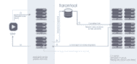
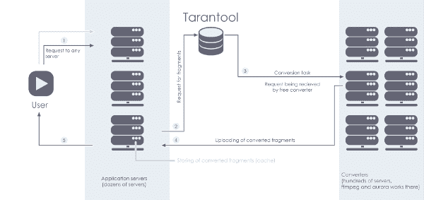

# 我们如何在 Mail.Ru Cloud 中实现视频播放器

> 原文： [http://highscalability.com/blog/2016/3/28/how-we-implemented-the-video-player-in-mailru-cloud.html](http://highscalability.com/blog/2016/3/28/how-we-implemented-the-video-player-in-mailru-cloud.html)



我们最近在 [Mail.Ru Cloud](https://cloud.mail.ru/) 中添加了视频流服务。 开发工作首先考虑将新功能用作通用的“瑞士军刀”，它将播放任何格式的文件并可以在具有可用云的任何设备上工作。 上传到云端的视频内容大体上属于两类之一：“电影/系列”和“用户视频”。 后者是用户使用手机和相机拍摄的视频，这些视频在格式和编解码器方面用途最为广泛。 由于许多原因，在没有事先进行标准化的情况下在其他最终用户设备上观看这些视频通常是一个问题：缺少所需的编解码器，或者文件太大而无法下载，等等。

在本文中，我将详细解释如何在 Mail.Ru Cloud 中播放视频，以及如何使 Cloud Player“杂食性”并确保最大数量的最终用户设备上的支持 。

## 存储和缓存：两种方法

上传后，许多服务（例如 YouTube，社交网络等）会将用户的视频转换为适当的格式。 视频只有在转换后才能播放。 Mail.Ru Cloud 中使用了另一种方法：**原始文件在播放时会进行转换**。 与某些专门的视频托管网站不同，我们无法更改原始文件。 我们为什么选择此选项？ Mail.Ru Cloud 主要是一种云存储，如果用户在下载文件时发现文件质量下降或文件大小发生了一些变化，他们将感到非常惊讶。 另一方面，我们无法承受**存储所有文件的预先转换后的副本：这将需要太多空间**。 我们还必须做很多额外的工作，因为某些存储的文件将永远不会被监视，甚至一次也不会被监视。

即时转换的另一个优点是：如果我们决定更改转换设置或例如添加其他功能，则无需重新转换旧视频（不一定总是如此） 可能，因为原始视频已经消失了）。 在这种情况下，一切都会自动应用。

## 这个怎么运作

我们正在使用 Apple 创建的 HLS（HTTP 实时流）格式[进行在线视频流。 HLS 的思想是将每个视频文件都切成小片段（称为“媒体片段文件”），这些片段被添加到播放列表中，并为每个片段指定名称和时间（以秒为单位）。 例如，将一个两小时的电影切成十秒钟的片段，作为一系列 720 个媒体片段文件。 根据用户希望从哪一刻开始观看视频，播放器会从传输的播放列表中请求适当的片段。 **HLS** 的好处之一是**用户无需在播放器读取文件头的同时等待视频开始播放**（等待时间可能会非常长 如果是完整版电影且移动互联网速度较慢）。](https://developer.apple.com/streaming/)

这种格式提供的另一个重要可能性是**自适应流**，它允许根据用户的 Internet 速度即时更改质量。 例如，您开始使用 3G 以 360p 观看，但是火车进入 LTE 区域后，您将继续以 720p 或 1080p 观看。 它在 HLS 中非常简单地实现：播放器会获得“主播放列表”，其中包括针对不同带宽的备用播放列表。 加载片段后，播放器会评估当前速度，并据此决定下一个片段的质量：相同，较低或较高。 我们目前支持 240p，360p，480p，720p 和 1080p。

## 后端

，

[ ](https://habrastorage.org/files/1c6/c3e/67d/1c6c3e67dd6c4b0bbe4c2595aeffd099.png) 

Mail.Ru 云服务由**三组服务器**组成。 第一组是**应用服务器**，它接受视频流请求：它创建 HLS 播放列表并将其发送回去，分发转换后的片段并设置转换任务。 第二组是具有嵌入式逻辑的**数据库（ [Tarantool](http://tarantool.org/) ），用于存储视频信息并管理转换队列。 第三组**转换器**从 Tarantool 中的队列接收任务，然后将任务完成情况再次记录在数据库中。 收到视频文件片段的请求后，我们首先在我们的一台服务器上检查数据库，以获取转换后的质量要求的即用型片段。 这里有两种情况。**

第一种情况：我们确实有一个转换后的片段。 在这种情况下，我们会立即将其寄回。 如果您或其他人最近提出了要求，则该片段将已经存在。 这是第一个缓存级别，适用于所有转换的文件。 值得一提的是，我们还使用了另一种缓存级别，其中经常请求的文件分布在多个服务器上，以避免网络接口过载。

第二种情况：我们没有转换后的片段。 在这种情况下，将在数据库中创建一个转换任务，我们等待它完成。 正如我们前面所说，它是 Tarantool（一个非常快速的开源 NoSQL 数据库，可让您在 Lua 中编写存储过程），它负责存储视频信息和管理转换队列。 应用程序服务器和数据库之间的通信如下进行。 应用服务器发出一个请求：“我需要 720p 质量的 movie.mp4 文件的第二个片段； 准备等待的时间不超过 4 秒钟”，并且在 4 秒钟之内它将收到有关从何处获取片段的信息或错误消息。 因此，数据库客户端对立即执行任务或通过一系列复杂操作不感兴趣如何执行任务：它使用非常简单的界面，可以发送请求并接收请求的内容。

我们提供数据库容错能力的方法是**主副本故障转移**。 数据库客户端仅将请求发送到主服务器。 如果当前的主服务器有问题，我们会将其中一个副本标记为主服务器，然后将客户端重定向到新的主服务器。 当客户端继续与主机交互时，这样的主副本切换对客户端是透明的。

除了应用程序服务器之外，还有谁可以充当数据库客户端？ 可能是那些准备开始转换片段的转换器服务器，现在需要到源视频文件的参数化 HTTP 链接。 这种转换器和 Tarantool 之间的通信类似于上述应用服务器的接口。 转换程序发出一个请求：“给我一个任务，我准备等待 10 秒钟”，如果任务在这 10 秒钟内出现，则会将其分配给一个正在等待的转换程序。 我们在 Tarantool 内部的 Lua 中使用了 IPC 通道，以轻松实现客户端到转换器的任务转发。 通道允许不同请求之间的通信。 这是一些用于转换片段的简化代码：

```
function get_part(file_hash, part_number, quality, timeout)
    -- Trying to select the requested fragment
    local t = v.fragments_space.index.main:select(file_hash, part_number, quality)

    -- If it exists — returning immediately
    if t ~= nil then
        return t
    end

    -- Creating a key to identify the requested fragment, and an ipc channel, then writing it
    -- in a table in order to receive a “task completed” notification later
    local table_key = msgpack.encode{file_hash, part_number, quality}
    local ch = fiber.channel(1)
    v.ctable[table_key] = ch

    -- Creating a record about the fragment with the status “want to be converted”
    v.fragments_space:insert(file_hash, part_number, quality, STATUS_QUEUED)

    -- If we have idle workers, let’s notify them about the new task
    if s.waitch:has_readers() then
        s.waitch:put(true, 0)
    end

    -- Waiting for task completion for no more than “timeout” seconds
    local body = ch:get(timeout)

    if body ~= nil then
        if body == false then
            -- Couldn’t complete the task — return error
            return box.tuple.new{RET_ERROR}
        else
            -- Task completed, selecting and returning the result
            return v.fragments_space.index.main:select{file_hash, part_number, quality}
        end
    else
        -- Timeout error is returned
        return box.tuple.new{RET_ERROR}
    end
end

local table_key = msgpack.encode{file_hash, part_number, quality}
v.ctable[table_key]:put(true, 0)
```

实际的代码稍微复杂一点：例如，它考虑了在请求时片段处于“正在转换”状态的场景。 由于采用了这种方案，转换器可以立即收到新任务的通知，而客户端也可以立即收到任务的完成的通知。 这非常重要，因为用户看到视频加载微调器的时间越长，他们甚至有可能在视频开始播放之前就离开页面。

如下图所示，大多数转化以及因此等待时间都不会超过几秒钟。

 

## 转换次数

对于**转换**，我们使用的是根据需要进行修改的 **FFmpeg** 。 我们最初的计划是使用 FFmpeg 内置工具进行 HLS 转换。 但是，我们的用例遇到了问题。 如果您要求 FFmpeg 将 20 秒的文件转换为带有 10 秒的片段的 HLS，则会得到两个文件和一个播放列表，它们可以毫无问题地播放。 但是，如果您要求先转换 0 至 10 秒，然后再转换 10 至 20 秒（启动 FFmpeg 转换器的另一个实例），则从一个文件转换到另一个文件时（大约在 10 秒），您会听到明显的喀哒声。 我们花了几天时间尝试不同的 FFmpeg 设置，但没有成功。 因此，我们必须进入 FFmpeg 并编写一个小补丁。 它需要一个命令行参数来解决“ click”错误，该错误源于对音频和视频轨道进行编码的细微差别。

此外，我们还使用了当时尚未包含在 FFmpeg 上游的其他一些可用补丁。 例如，一个[补丁](https://trac.ffmpeg.org/ticket/2513)，用于解决 MOV 文件转换缓慢的已知问题（iPhone 制作的视频）。 一个名为“ Aurora” 的**守护程序控制从数据库获取任务并启动 FFmpeg 的过程。 “ Aurora”守护程序以及位于数据库另一端的守护程序都是用 Perl 编写的，并且与 EV 事件循环和各种有用的模块异步工作，例如： [EV-Tarantool](https://github.com/Mons/EV-Tarantool) 和 [Async :: Chain](https://metacpan.org/pod/Async::Chain) 。**

有趣的是，**在 Mail.Ru Cloud 中没有为新的视频流服务**安装额外的服务器：转换（需要大量资源的部分）在特别隔离的环境中在我们的存储上运行。 日志和图表显示，我们的能力所能承受的负载是我们现在所承受的能力的几倍。 仅供参考：自我们的视频流媒体服务于 2015 年 6 月启动以来，已请求超过 **500 万个独特视频； 每分钟观看 500–600 个唯一文件**。

## 前端

如今，几乎每个人都拥有智能手机。 或两个。 为您的朋友和家人制作简短的视频没什么大不了的。 这就是为什么我们准备好有人将视频从手机或平板电脑上传到 Mail.Ru Cloud 并立即从其设备中删除视频以释放空间的情况。 如果用户想向他人展示此视频，则只需使用 Mail.Ru Cloud 应用程序将其打开，或在其桌面上的 Cloud Web 版本中启动播放器。 现在可以不在手机上存储所有视频片段，同时始终可以在任何设备上访问它们。 移动互联网上的流式传输比特率降低了，因此，以兆字节为单位的大小也降低了。

此外，在移动平台上播放视频时，我们使用 Android 和 iOS 本机库。 这就是为什么视频可以在移动浏览器中“开箱即用”的智能手机和平板电脑上播放的原因：我们不需要为使用的格式创建额外的播放器。 与网络版本相似，在台式计算机上，自适应流机制被激活，并且图像质量动态适应当前带宽。

我们的播放器与竞争对手的播放器之间的主要区别之一是我们的视频播放器独立于用户的环境。 在大多数情况下，开发人员会创建两个不同的播放器：一个是带有 Flash 界面的播放器，另一个是（对于具有本地 HLS 支持的浏览器，例如 Safari），一个是完全相同的，但是用 HTML5 实现，随后上传了适当的文件。 接口。 我们只有一名球员。 我们的目标是可以轻松更改界面。 因此，我们的播放器在视频和音频方面看起来非常相似-所有图标，布局等均以 HTML5 编写。 播放器不依赖于播放视频所使用的技术。

我们使用 Flash 绘制视频，但是整个界面都基于 HTML； 因此，我们不会遇到版本同步问题，因为不需要支持特定的 Flash 版本。 一个开放源代码库足以播放 HLS。 我们编写了一个垫片，将 HTML5 视频元素界面转换为 Flash。 这就是为什么我们可以假设我们将始终使用 HTML5 来编写整个界面的原因。 如果浏览器不支持这种格式，我们只需将本机视频元素替换为我们自己的实现相同界面的元素。

如果用户的设备不支持 Flash，则视频将以具有 HLS 支持的 HTML5 播放（到目前为止，仅在 Safari 中实现）。 使用本地工具在 Android 4.2+和 iOS 上播放 HLS。 如果没有支持且没有本机格式，我们将为用户提供文件下载。

## ***

如果您有实现视频播放器的经验，欢迎访问评论部分：我非常想知道如何将视频分成多个片段，如何在存储和缓存之间进行选择，以及面临的其他挑战。 总之，让我们分享我们的经验。

[关于 HackerNews](https://news.ycombinator.com/item?id=11375147)

很棒的文章！

很棒的文章。 您能告诉我们更多有关 ffmpeg 补丁以消除音频点击的信息吗？

谢谢。 如此棒的文章。

因此，转换的视频（频繁和较少）在 ttl 之后会自动删除吗？
其次，为什么转换器使用 http 协议从存储中获取视频？ 使用套接字不能更快完成吗？

您启动了多少个 tarantool 实例？ TT 集群有多大？

对于此特定任务，我们只有两个实例-主实例和副本实例。 我们知道，在 Mail.Ru Group 的在线广告系统上，生产中的 Tarantool 集群的最大规模约为 500 个实例。

For this specific task we only have two instances - a master and a replica. The maximum knows to us size of a Tarantool cluster at production is around 500 instances at the Mail.Ru Group's online ad system.