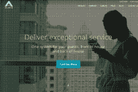

# 如何使用微服务建立财产管理系统集成

> 原文： [http://highscalability.com/blog/2016/2/10/how-to-build-your-property-management-system-integration-usi.html](http://highscalability.com/blog/2016/2/10/how-to-build-your-property-management-system-integration-usi.html)

*This is a guest post by Rafael Neves, Head of Enterprise Architecture at [ALICE](http://info.aliceapp.com), a NY-based hospitality technology startup. While the domain is **Property Management, it's also a good microservices intro.* 在零散的款待系统世界中，集成是必不可少的。 您的系统将需要与来自不同提供程序的不同系统进行交互，每个提供程序都提供自己的应用程序接口（API）。 不仅如此，而且当您与更多的酒店客户整合时，将需要更多的实例来连接和管理此连接。 物业管理系统（PMS）是任何酒店的核心系统，随着行业变得越来越紧密联系，集成至关重要。

为了在酒店业提供软件解决方案，您肯定需要与 PMS 提供者建立 2 路集成。 挑战在于大规模建立和管理这些连接，并在多个酒店中使用多个 PMS 实例。 您可以采用几种方法来实现这些集成。 在这里，我提出一种简单的架构设计来构建集成基础，随着您的成长，该基础将增加 ROI。 这种方法是微服务的使用。

## 什么是微服务？

企业软件设计思想领袖 Martin Fowler 提供了微服务的全面定义[：](http://martinfowler.com/articles/microservices.html)

> 在过去的几年中，出现了“微服务体系结构”一词，用于描述将软件应用程序设计为可独立部署的服务套件的特定方式。 尽管没有这种架构样式的精确定义，但围绕业务能力，自动部署，端点中的智能以及对语言和数据的分散控制，组织周围存在某些共同特征。

本质上，微服务是很小的软件组件，专注于真正做好一件事情。 不必编写一个大型的整体应用程序，而是可以使用微服务将其分解，每个微服务在给定的域中管理一个集中的功能。

因此，它们是自治的，彼此独立执行。 因此，对一项服务的更改不应要求对另一项服务的更改。 随着您的成长和进行更改，您无需担心会影响其他微服务。

微服务是：

*   小
*   专注于
*   松耦合
*   高内聚性

## 为什么微服务功能强大

微服务架构提供了很多好处。 主要优点包括：

### 可扩展性

*   您的单个系统将与具有不同属性的多个 PMS 实例集成。 从规模上讲，当与 1000 个属性进行集成时，即使它们正在运行来自同一供应商的相同 PMS 系统，您也需要显式管理不同的 1000 个集成。 为了增加复杂性，这些实例可以来自不同的提供程序。
*   随着您添加许多 PMS 实例和属性，它可以优雅地扩展。 如果您使用的是整体应用程序，则必须将所有内容扩展为一个大块。 在流量高峰期间，可能很难理解性能瓶颈在哪里，而对于微服务而言，透明度要高得多。
*   当您拥有微服务时，很清楚哪些服务存在性能问题，您可以轻松调整其容量（底层硬件），而不必增加运行正常流量负载的其他服务的容量。

### 弹性

*   旅馆中的 PMS 实例可能已关闭或出现性能问题，这不会影响系统的性能或正常运行时间。
*   您可以实现任意数量的微服务。 部署的次数越多，容错和对更改的管理就越多。

### 技术堆栈独立性

*   您可以具有多个技术堆栈； 每个服务都将拥有最适合的技术堆栈。 您的访客配置文件可能在关系数据库中，而他们的请求可能在 NoSQL 数据库中。
*   对特定技术栈没有长期的承诺； 毕竟，您可以拥有多个。

### 添加，更改或取消功能&重构 [

*   微服务非常小（通常只有几百行代码）。
*   由于代码具有内聚性，因此更容易理解：它可以做一件事。
*   对其所做的更改不会直接影响其他服务。
*   删除整个微服务更容易，并且不会对整个系统造成风险

### 部署方式

*   酒店希望提供卓越的服务。 如果您的系统已关闭或未提供其所有功能（例如，不将来宾入住请求推送到您的 PMS 或从中读取更新），他们将无法交付。
*   回滚也更容易。 如果出了什么问题，回滚一个带有自己数据库的微服务要比回滚一个单个数据库的整个系统要容易。
*   部署单片应用程序的下一版本时，总是很麻烦：即使您仅添加了一个功能，也必须立即部署整个应用程序。 一起部署所有内容都是有风险的。 ，

请记住，如果仅集成一个 PMS，则微服务是一个过大的杀伤力。 如果要与具有 1000 个不同属性的 1000 个 PMS 实例集成，那么该体系结构的好处就显而易见了。

## 传统方法：单片应用程序

借助传统方法（整体应用程序）开始您的业务并开始新产品是很有意义的，因为它更容易。 目前，您仍在学习域以及域如何集成。

整体更易于开发和部署，采用整体方法，则更容易回答诸如如何建模预订服务以及如何在访客配置文件微服务中实现访客对帐操作之类的问题。

但是，就像您的公司一样，整体式增长非常迅速，并且随着系统的增长，很难扩展：

添加了新功能，推出了新的代码行，并且当系统变得太大时，它变得难以驯服和理解。 更改系统需要进行严格的回归测试，以确保新功能不会破坏系统的其他部分，因为整体应用程序通常不具有内聚力，也没有松散耦合。

故障排除和调试更加困难，因为存在更多具有更多相互依赖性的代码。 更新服务可能需要更改共享的基础结构代码，并且在引入错误时可能导致感染。 庞大的代码库使新手开发人员难以入职和培训。

它影响部署：应用程序越大，启动时间就越长。 是的，您可以简单地添加更多服务器并在所有服务器上复制应用程序，但是您仍然只有一个数据库。 不仅如此，系统的某些部分可能会更占用内存，而其他部分则需要大量 CPU。 那么，当您无法分别缩放每个组件时该怎么办？ 您添加更多服务器！

这是非常昂贵的。 这样，一旦您对域有了更好的了解，就可能想要开始将系统分解为微服务。

## 架构概述

现在，我们已经解释了采用微服务架构的长期好处，让我们研究一下如何设计此微服务框架的一些细节：

这里的关键是隔离：集成的系统应该彼此独立运行。 IE：您的核心系统独立于在属性 X 上运行的属性管理系统，并且独立于在属性 Y 上运行的系统。

通过在核心系统和要与之集成的所有资产管理系统之间引入连接器（中间件），可以实现这种隔离。

中间件由消息队列和后台工作者组成：

*   可用于实现的服务示例：
    *   消息队列：RabbitMQ，IronMQ 等。
    *   背景工作者：IronWorker，AWS Lambda 等。

消息队列提供系统之间的异步通信。 发件人系统（例如您的系统）将消息发布到队列中，并一直位于该队列中，直到后台工作人员（订阅该队列）在以后处理该消息为止。

然后，后台工作人员负责处理消息（解析其内容），然后管理与 PMS API 的集成。 同样，它将数据保存到中间件数据库中。

请记住，后台工作程序可以是像 AWS Lambda 这样的云服务，也可以是内部用 Java 开发的应用程序，也可以是在 Windows 服务中开发的应用程序。 正如我们将在下面详细介绍的那样，微服务的技术堆栈并不重要。

请记住，一个消息队列保证 FIFO（先进先出），因此队列中的所有消息都按照它们进入的顺序进行处理。如果您有多个队列，则将一条消息发布到队列中 可以比发布到队列 Y 的消息更早地处理 X，这在您的设计中应予以考虑。

另外，虽然 PMS 可能位于酒店的内部，但您的系统也不一定要位于云中或内部。

请记住，此服务控制与预留关联的所有生命周期事件，因此它不仅是 CRUD 包装器。 如果您需要为该预订分配房间，添加陪同客人或什至办理入住手续，则可以将适当的请求发送给该同一工作人员。

现在让我们根据 Martin 的描述来分析微服务的每个主要特征，以及我们的架构如何实现它们：

## 1-围绕业务能力的组织

每个工作人员都实现了如何与 PMS 集成的逻辑。 您可以将多个工作人员插入到属性中的同一 PMS 实例中，在其他酒店中添加更多连接到同一属性管理系统（同一供应商）的工作人员，还可以在以下位置添加连接到不同属性管理系统（不同供应商）的其他工作人员 其他属性。

因此，假设您需要更改与某些 API 方法的交互方式，则只需将新版本部署到其中一个工作程序，而不会影响其他工作程序。 您可以让一个工人来处理预订，另一个可以来宾。

可以在 Linux crontab 中安排一些后台工作程序，以按照给定的时间表重复执行。 其他消息始终在运行，在到达队列时处理消息。 其他后台工作人员也可以回调您的核心系统 API，以插入或更新从 PMS 收集到的新信息（即从 PMS 中获取/读取数据并将其加载到您的核心系统中）。

在萨姆·纽曼（Sam Newman）撰写的 *Building Microservices* 一书中，他指出“从事较小代码库的较小团队往往生产力更高。”这是通过微服务实现的

它不仅可以提高生产率，还可以使团队或个人从一种微服务转移到另一种（通用共享代码库）。

它也可以促进创新，因为长时间从事同一项目的个人或团队可能只会提出有限范围的新想法。 而如果您允许您的团队在产品和项目之间切换，他们可能会提出成千上万个新想法。

## 2-自动部署

微服务需要以自动化方式进行部署。 为什么？ 首先，因为您有很多。 如果必须手动部署它们中的每一个，这将很容易出错并且非常耗时。 这取决于您拥有的微服务数量。 您可以彼此独立地分别释放每个服务。

请注意，我的意思是在此处将新版本部署到微服务，而不是分解新的工作程序实例。 您已经在运行工作程序，但是您想部署新版本的代码。 让我们用一个例子说明一下：

*   假设您必须与 1000 个属性集成，其中 500 个属性使用供应商 1（PMS_1）的 PMS，其中 500 个属性使用供应商 2（PMS_2）的 PMS。
*   由于无论 PMS 供应商如何，这里的域上下文都非常相似，因此每个 PMS 实例将很可能具有相似数量的工作线程，除非您想通过添加更多相同类型的工作线程来扩展给定的连接。 简单来说，假设每个 PMS 实例有 5 个工作线程（一个用于保留，一个用于来宾配置文件，等等）。
*   由于 PMS_1 API 与 PMS_2 API 不同，因此与 PMS_1 集成的保留服务的代码与与 PMS_2 集成的保留服务的代码不同。
*   在 1000 个属性上，您有 5000 个工作人员，然后：
    *   2500 名 PMS_1 员工
        *   500 名预订工人，每个属性中带有 PMS_1 的一名
        *   500 位访客资料工作人员，每个属性中带有 PMS_1 的一名
        *   500 名 X 工人，每个资产带有 PMS_1 的一名工人
        *   500 名 Y 工人，每个属性为 PMS_1 的工人
        *   500 名 Z 工人，每个属性中带有 PMS_1 的一名工人
    *   2500 名 PMS_2 员工
        *   500 名预订工人，每个属性为 PMS_2 的一名
        *   500 位访客资料工作者，每个属性中带有 PMS_2 的一名
        *   500 名 X 工人，每个资产带有 PMS_2 的一名工人
        *   500 名 Y 工人，每个属性为 PMS_2 的工人
        *   500 名 Z 工人，每个资产中带有 PMS_2 的一名工人
*   假设您对与 PMS_1 集成的 Reservation 服务的代码进行了更改，它已经过测试并且可以发布。
*   假设您有一个源代码存储库，并且每个微服务都内置有您选择的持续集成工具，这是非常明智的选择，那么您需要将代码部署到 500 个工作程序（与 PMS_1 集成的 500 个保留工作程序）。

其次，微服务的目的之一是要具有敏捷性，并且要具有敏捷性，您需要自动化。 这就是持续集成（CI）和持续交付（CD）的神奇之处：

CI 是一种开发实践，要求开发人员一天几次将代码集成到共享存储库中。 然后，提交触发构建。 如果构建失败，则每个人都会收到警报（原则上会发出偏差警报）。 此处的关键是尽早确定提交问题（即代码问题）。 如果构建成功，则可以将其部署到您的应用程序服务器。 这导致我们实现持续交付：

连续交付是确保成功构建的工件可以快速部署到生产中的一种做法。 这是通过首先将您的应用程序部署到暂存环境（具有与生产环境相同的特征）来实现的。 只需按“部署”按钮，就可以将应用程序部署到您的生产环境中。 最好的是，因为它只是一个按钮，所以您无需中断软件工程师的工作。

*   可用于实现 CI / CD 的服务示例：Atlassian Bamboo，TeamCity，Jenkins 等。

虽然，请不要将持续交付与持续部署混淆。 我不会在这里详细介绍它，但是我会留下 PuppetLabs 的[很棒的文章](https://puppetlabs.com/blog/continuous-delivery-vs-continuous-deployment-whats-diff)来介绍持续交付和持续部署之间的区别。

还应注意，微服务的部署要比单片应用程序安全得多，这应有助于自动化。

## 3-端点的智能

后台工作人员封装了如何与 PMS 集成的逻辑。 如果我们需要更改逻辑或 PMS API 已更改，我们只需要在一个地方进行更改-它不在您的主系统中（将其与对下游 API 的更改隔离开来）。

另外，每个 PMS 都有自己的 API，因此您可以隔离与核心系统中的每个 API 进行通信的逻辑。

## 4-语言和数据的分散控制

每个微服务可以拥有自己的技术堆栈。 让您拥抱技术的异质性。

例如：如果我们需要提高特定组件的性能，则可以选择能够实现所需性能的其他技术堆栈。 新服务不依赖于较早的技术定义，而是在适当时利用新的语言或技术。

每个工作程序可以使用不同的技术构建：工作程序 1 可以使用 Java 开发，带有 MySQL 数据库以处理来宾配置文件，而工作程序 2 可以使用 C＃开发，具有 NoSQL DB 来处理来宾消息。 记住：他们是独立的。

您需要担心它们的集成，即它们之间如何实际通信。 您将实现返回 JSON 的 RESTful API 还是使用 XML 的 SOAP API？

现在，让我们更深入地研究中间件。

## 中间件

中间件提供了系统与要集成的多个属性管理系统之间的隔离。 它由消息队列和后台工作者组成。

中间件不应保持状态：两端的系统（即您的系统和 PMS 系统）负责保持有关酒店，访客资料，预订等的状态。中间件只是在两者之间创建映射。 这样做的原因是，您不想引入一个新的组件，该组件还存储可能导致一致性问题的状态：您将在 3 个不同的系统（酒店物业管理系统）中存储相同的实体（例如，预订）。 ，中间件和核心应用程序），并且由于集成中的某些错误，它们可能会有所不同。 在这种情况下，谁持有关于保留真实有效状态的真相？

中间件必须提供允许您协调核心系统中的内容与 PMS 中的内容的方法。 因此，如果在核心系统中创建了新请求，但是由于某种原因（实例处于脱机状态，软件错误，网络问题等），则该请求未保存到 PMS 中（例如，向来宾作品集收费） ），中间件应提醒用户该问题并提供重新处理集成的方法。 它必须清楚地显示每条消息在队列中的位置以及每个后台工作人员的状态。 它必须允许您查看给定消息失败及其失败的原因，并提供重试（重新处理）给定消息的机制。

您可以在中间件数据库的顶部具有一个缓存层，以便更快地访问常见对象，例如城市代码，信用卡类型等。 一些财产管理系统将此作为具有键-值对的枚举来实现。 可用于提供缓存层的工具示例包括：自托管的 Redis，托管的 Redis 解决方案（例如 AWS Elasticache），Memcache。

## 使用微服务的挑战

在构建任何软件时，尤其是在大规模集成系统中，总是存在挑战。

纽曼在《构建微服务》一书中提醒我们，“故障成为大规模的统计确定性”，而在实现微服务时（这是整体的）肯定是这种情况。

接受一切都会失败（硬盘，网络等）并接受这一事实，很难处理多个独立服务的失败。

分布式和异步体系结构难以实现且难以调试。 您需要查看散布在多个实例中的日志，并查看分布式事务性，以了解为什么最终会出现古怪的状态。 如果在同步工作流的中间发生错误，则很难回滚状态。 了解故障发生的位置非常困难，因为工作可能并行进行，并且可能引入了难以管理的竞争条件。

确保与微服务的大规模一致性是另一个挑战。 想象一下，您有一个管理来宾个人资料的服务，另一个服务来管理预订。 如果新客人首次在您的酒店预订了预订，则预订微服务将创建新的预订记录，而客人资料微服务将需要创建新的客人资料。 如果访客个人资料存在错误并且未成功创建新的访客个人资料怎么办？ 如果管理不正确，最终将导致一个孤立的预订，该预订未绑定到任何访客个人资料。 从规模上讲，这可能很难跟踪和管理。

异步分布式体系结构可能会导致其他问题。 让我们想象一下系统发送到事务处理队列的某种类型的请求会使您的工作人员崩溃。 另外，假设您添加了多个工作程序，它们从同一队列中提取消息以加快处理速度。 第一个工作人员从队列中提取消息，然后死亡。 当它死亡时，对请求的锁定将超时，并将原始请求消息放回到队列中。 然后，您的下一个工作人员将从队列中提取相同的消息并获得相同的结果：消息将死亡。

另一个挑战是，您将不得不监视不断重新部署的数百种服务。 这将促使需要专用的 DevOps 资源或团队来管理大量服务。

您还需要考虑整体系统性能，因为您有很多通过网络进行的远程呼叫。 众所周知，网络不可靠：数据包可能会延迟，丢失等。此外，系统之间的消息不是实时流动的：您将消息发布到队列中，然后在（ 不久），它将得到处理。

最后，使用微服务很难有效地实现版本控制：您最终将更改服务的接口。 您将如何处理？

使用每种架构方法都需要权衡。 尽管微服务存在挑战，但每种方法都存在挑战。 当大规模管理多个 PMS 集成时，使用微服务的好处远远超过成本。

**考虑大规模实施的经济性：**

以下是实现微服务时要考虑的一些比较成本：

*   大规模部署时，100 个不同的 PMS 集成可能需要 100 个服务器。
*   使用单片方法，这些服务器始终处于运行状态。
*   在微服务世界中，微服务在需要时唤醒，在不需要时关闭。
*   借助 AWS Lambda 或 IronMQ 等云服务，您需要为 CPU 时间而非服务器时间付费。
*   当采用按需供应系统（如 Amazon Web Services 提供的系统）时，我们可以根据需要对需要的那些组件应用此扩展。 这使我们能够更有效地控制成本。 ，

因此，随着时间的流逝，微服务在为计算能力付费时会更具成本效益，因为有需求可以使您更紧密地管理成本并最终减少浪费。 很少有一种架构方法可以与几乎立即节省成本紧密相关。

那么，从这里去哪里呢？

## 拆解整体结构

我经常听到的一个常见问题是：“我已经构建了单片应用程序。我是否需要从头开始重新构建它以实现微服务架构？”

简短的答案是：**否**。

长的答案是，您可以将您的整体碎片分开。 它应该是一种渐进的方法，以便您可以了解有关核心功能以及它如何与其他核心功能交互的更多信息。 这对于您了解服务应该是什么以及它们如何相互通信至关重要。 采取“边走边学”的方法，逐步定义系统的哪些部分应成为微服务。 我将在以后的文章中保留有关如何设计和实现此策略的详细信息。

我希望这可以解释其好处或使用微服务方法来构建 PMS 集成。 随着您的系统和微服务数量的增长，这种方法将帮助您以更灵活，高效和经济高效的方式进行扩展。

## 相关文章

*   [关于 HackerNews](https://news.ycombinator.com/item?id=11074151)
*   [微服务-不是免费的午餐！](http://highscalability.com/blog/2014/4/8/microservices-not-a-free-lunch.html)
*   [伟大的微服务与 Monolithic Apps Twitter 近战](http://highscalability.com/blog/2014/7/28/the-great-microservices-vs-monolithic-apps-twitter-melee.html)
*   [来自 Google 和 eBay 的关于建立微服务生态系统的深刻教训](http://highscalability.com/blog/2015/12/1/deep-lessons-from-google-and-ebay-on-building-ecosystems-of.html)
*   [生产中的微服务-好的，坏的，有效的](http://highscalability.com/blog/2014/10/27/microservices-in-production-the-good-the-bad-the-it-works.html)
*   [微服务中最讨厌的七个反模式](http://highscalability.com/blog/2015/8/3/seven-of-the-nastiest-anti-patterns-in-microservices.html)
*   [改变一切的融合：数据重力+容器+微服务](http://highscalability.com/blog/2015/3/25/the-convergence-that-changes-everything-data-gravity-contain.html)
*   [我们如何构建更好的复杂系统？ 容器，微服务和持续交付。](http://highscalability.com/blog/2015/4/27/how-can-we-build-better-complex-systems-containers-microserv.html) 

诸如此类的技术是使物业管理更加有效和高效的好方法。 我们希望将来能看到更多诸如此类的技术创新。 感谢您分享本文，这是设置此集成的不错的教程。