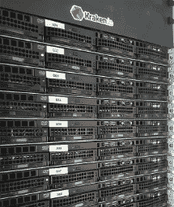
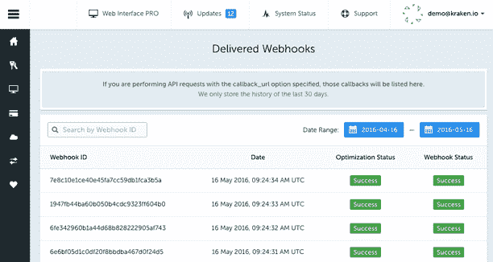
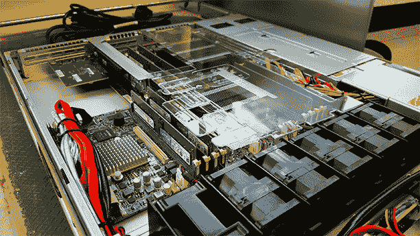
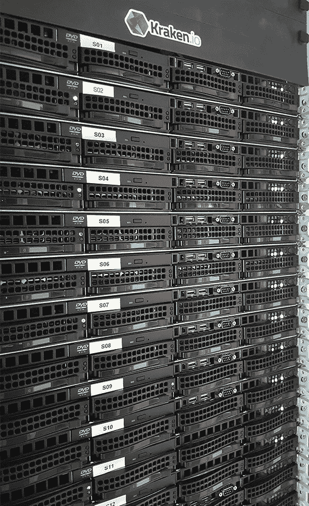
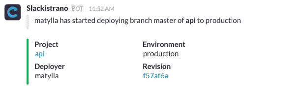
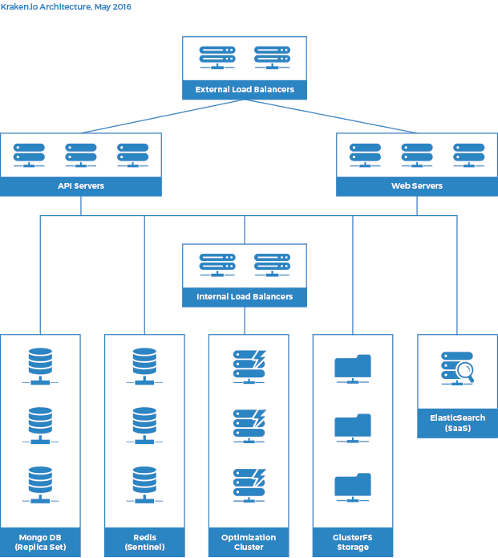
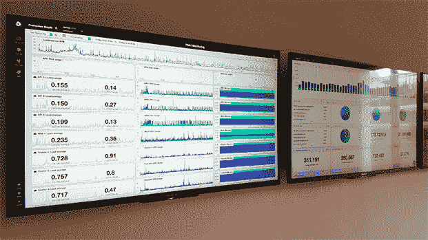

# 每天可处理数百万个请求的图像优化技术

> 原文： [http://highscalability.com/blog/2016/6/15/the-image-optimization-technology-that-serves-millions-of-re.html](http://highscalability.com/blog/2016/6/15/the-image-optimization-technology-that-serves-millions-of-re.html)

本文将介绍 [Kraken.io](https://kraken.io/) 如何构建和扩展每天可处理数百万个请求的图像优化平台，以保持 始终保持高性能，同时保持尽可能低的成本。 在撰写本文时，我们将介绍当前的基础结构，并介绍一些我们学到的有趣的知识，以便将其运用于此处。

### 让我们制作一个图像优化器

您想开始在 CDN 帐单上省钱，并且通常通过将较少的字节通过网络推送到用户的浏览器来加快网站速度。 很有可能超过 [的流量有 60％](http://httparchive.org/interesting.php) 仅是图像。

使用 ImageMagick（您确实读过 [ImageTragick](https://imagetragick.com/) ，对吗？），您可以使用以下简单命令降低 JPEG 文件的质量：

$ convert -quality 70 original.jpg Optimized.jpg

$ ls -la

-rw-r--r-- 1 matylla 职员 5897 5 月 16 日 14:24 original.jpg

-rw-r--r-- 1 matylla 职员 2995 May 16 14:25 Optimized.jpg

恭喜。 通过屠宰 JPEG 的质量，您刚刚将其压缩了约 50％。 图像现在看起来像 Minecraft。 它看起来不是这样-它可以销售您的产品和服务。 理想情况下，Web 上的图像应具有出色的质量，并且不会以过高的质量或 EXIF 元数据的形式出现不必要的膨胀。

现在，您打开自己喜欢的图像编辑软件并开始以 Q 级播放，同时将 JPEG 保存为 Web。 事实证明，您测试的这张特定图片在 Q76 看上去很棒。 您开始以质量设置为 76 保存所有 JPEG。但是请稍等片刻...有些图像即使在 Q80 情况下也看起来很糟糕，而有些图像甚至在 Q60 时也很好。

好的。 您决定以某种方式使其自动化-谁想手动测试您拥有维护“特权”的数百万张图像的质量。 因此，您创建了一个脚本，该脚本可以生成不同 Q 级别的输入图像的数十个副本。 现在，您需要一个度量标准，该度量标准将告诉您哪个 Q 级适合特定图像。 MSE？ SSIM？ MS-SSIM？ PSNR？ 您如此绝望，甚至开始计算和比较输入图像不同版本的 [感知哈希](https://en.wikipedia.org/wiki/Perceptual_hashing) 。

有些指标的效果要好于其他指标。 对于某些类型的图像，有些效果很好。 有些非常快，而另一些则需要很长时间才能完成。 您可以通过减少处理每个图像的循环次数来逃脱现实，但是很可能您错过了理想的 Q 级别，并且图像要么重于原来的水平，要么质量下降过高。

那么在白色背景下的商品图片呢？ 您真的想减少对象周围的振铃/晕影。 基于每个图像的自定义色度二次采样设置如何？ 如今，白色背景下的那件红色连衣裙看上去已经被洗掉了。 您已经了解到，剥离 EXIF 元数据将使文件变小一点，但是您还移除了 Orientation 标签，现在图像旋转不正确。

那只是 JPEG 格式。 对于您的 PNG，您可能想重新压缩 7-Zip 或 Deflate 压缩后的图像，例如 Google 的 [Zopfli](https://github.com/google/zopfli) 。 您启动脚本并观看 CPU 上的风扇开始熔化。

您可能需要一个可靠的工具，该工具可以优化所有图像，无论格式如何。 [Kraken.io](https://kraken.io/) 是一种这样的工具。

### 关于 Kraken.io

Kraken.io 是图像优化和压缩 SaaS 平台，具有其他操作功能，例如图像大小调整。 我们的目标是尽可能自动缩小图像的字节大小，同时保持视觉信息的完整性和始终如一的高质量，从而无需手动检查结果的保真度。

### 软件

除了基于 PHP 的 Kraken.io 前端外，几乎我们所有的软件都是在 [节点](https://nodejs.org/en/) 中编写的。 由于优化流水线能够使用二进制数据流，因此我们大量使用了节点流。

当图片首次出现在我们的平台上时，首先会通过“ kraken-identify”过程进行抽签，以可靠地检测最重要的功能-图像格式（JPEG，PNG，GIF，SVG 等），图像类型（逐行/ 基线 JPEG，动画/静态 GIF 等），以及嵌入的颜色配置文件和 EXIF 元数据的存在。

我们只需要读取几个字节，就不需要解压缩整个图像，也不需要将解压缩的数据加载到内存中。

确定我们刚收到的文件确实是图像后，我们将对其进行进一步处理。 对于某些特定的图像，我们还计算了独特颜色的数量。 唯一色计数是一种直方图类型的操作，它固有的速度很慢，无法对压缩数据进行处理，因此我们仅在非常特定的图像子集上使用它。

然后，图片会通过 HTTP 通过我们的优化管道传递。 这使我们可以将二进制数据（图像本身）与优化设置（作为字段或标头）一起抽取。 与我们的优化集群的 HTTP 连接保持打开状态，直到该过程完成，并且来自集群的 HTTP 响应被流回到磁盘（直接流到 GlusterFS 目标位置），因此我们不会经常接触磁盘。 当我们从群集中流回整个响应时，任何优化后的数据都会通过 HTTP 标头传输。

（可选），如果 API 用户要求，我们可以将优化的资产存储在他或她选择的外部存储中- [S3](https://kraken.io/docs/storage-s3) ， [Azure](https://kraken.io/docs/storage-azure) ， [云文件](https://kraken.io/docs/storage-cloudfiles) 或 [SoftLayer  。

最后一个任务（用于 API）是终止与 API 客户端的 HTTP 连接，并以优化结果做出响应，例如：

{

“ file_name”：“ sku126933.jpg”，

“ original_size”：35761，

“ kraked_size”：10799，

“ saved_bytes”：22462，

“ kraked_url”：“ https://dl.kraken.io/api/3e/db/24/08e20232a13c35fc1a72356537/sku126933.jpg”，

“ original_width”：600，

“ original_height”：600，

“成功”：是

}

对立即解析响应正文不感兴趣的用户可以使用我们的 [Webhook 传递系统](https://kraken.io/docs/wait-callback) 。 通过在请求中指定 callback_url，用户将指示 API 应用程序将优化结果 POST 到其自己的端点。 在这种情况下，我们排队一个 Webhook 任务（使用 Redis 作为代理）。 仅用于 Webhook 交付的其他计算机从队列中使用，POST 优化结果并将一些数据保存在 MongoDB 中。

在 Kraken.io 帐户中交付了 Webhooks 视图

### 硬件

图像优化和重新压缩具有巨大的处理要求。 由于我们一直在努力降低总拥有成本，因此对我们而言，云决不是一个选择。 通过与我们的数据中心签订相当长的合同，我们可以将托管费用减少 30％。

一小会儿，在投资购买自己的硬件之前，我们一直在租用专用机器。 那没有按预期工作。 当时，我们的提供商阻止了 OS 的重新部署，并且我们不得不采用痛苦而费时的电子邮件通信路径来重新部署系统。 另外，您不知道之前有谁在使用该机器，该机器的整体运行状况如何以及真正*内部*安装了哪些组件。 有一天，我们发现，即使所有 API 机器都安装了相同的 CPU，但每台机器都有不同的 CPU 固件，并且 sysbench 的结果因机器而异。

幸运的是，这段时间已经过去很久了，我们在自己的硬件上运行，我们可以根据需要微调所有设置（尝试对租用设备进行 CPU 频率缩放）。

所有单插槽计算机（API，Web，负载平衡器，Webhook Delivery）当前正在运行 Xeon E3-1280 v5（Skylake）。 对于完成所有艰苦工作的 Optimization Cluster，我们每台计算机使用 2 个 Xeon E5-2697 v3，具有 128 GB RAM 和 RAID-1 设置中的四个 SSD 硬盘驱动器进行镜像。 在启用 HT 的情况下，上述设置使我们可以在每个群集计算机上访问 28 个物理核心和 56 个线程。

我们的优化人员之一（Xeon E5-2697）

英特尔最近为 [E5-2600 产品线](http://ark.intel.com/products/family/91287/Intel-Xeon-Processor-E5-v4-Family#@All) 推出了 v4（Haswell），我们正在对此进行研究，但没有将群集升级到 v4 的紧迫性 。

Kraken.io 的平台占用大量 CPU 和 I / O，并处理大量文件。 为了在 I / O 级别获得更高的性能，我们将在未来几个月内为 API，集群和存储计算机推出 PCIe-SSD 驱动器。

API，存储和优化集群

自己的硬件需要一定的价格。 而且这个价格是，即使在高峰时期，您也需要比实际需要的容量多很多。 订购，压力测试和部署新机器最多需要 7 天的时间。 我们提供了一个定制的 AWS 集成，它将为我们提供计算优化的实例并扩展优化集群。 幸运的是，即使我们发现集群计算机上的负载高达 60（每个线程 1.07），我们也从未使用过它。 该解决方案的缺点是，我们不仅必须为 AWS 实例支付额外费用，而且还必须为数据中心与 AWS 之间的额外流量支付额外费用。

### 供应，发现和软件部署

我们安装的每台新计算机都由 [工头](http://theforeman.org/) 管理和配置。 我们将所有配置都保留在 [Puppet](https://puppet.com/) 中，因此只需单击几下即可使新机器进入生产就绪状态。 在 Puppet 中维护健康的代码库是另一个需要讨论的主题，尤其是在谈论定制软件包时。

软件部署是通过 [Capistrano](http://capistranorb.com/) 完成的。 因为所有应用程序都是用 Node 编写的，所以几乎所有应用程序都使用类似的配方。 当我们需要查明过去发生的特定部署并将其与 [中的可用数据关联时，与](https://www.serverdensity.com/) [Slack](https://slack.com/) 的集成非常有用。 ] ServerDensity 或 [ElasticSearch](https://www.elastic.co/) 。

Capistrano 的松弛集成

### 数据存储

我们在三台独立的机器上使用 [副本](https://docs.mongodb.com/manual/replication/) 设置中的 [MongoDB](https://www.mongodb.com/) 作为我们的主要数据存储。 由于我们的数据集相对较小，并且我们对所有时间序列数据都使用了封顶集合，因此我们从未真正考虑过 DB 分片。 当然，看着三分之二的 DB 机器几乎什么也不做，只是等待主服务器发生故障，这不是我喜欢的事情，但是当时间到来时（并且会），我们会睡得很好。

第二个数据存储是 [前哨](http://redis.io/topics/sentinel) 设置中的 [Redis](http://redis.io/) 出于与上述相同的原因）。 主要用作 Kraken.io 前端上的任务队列和会话管理的消息代理。

### 文件存储

在上一代 Kraken.io 中，我们曾经将优化的资产直接存储在执行优化工作的同一台计算机上。 在将角色（API，Web，处理群集和存储）分离之后，我们发现自己迫切需要可扩展的网络文件系统。 [GlusterFS](http://www.gluster.org/) 易于设置且易于维护。

从应用程序服务器到 GlusterFS 计算机，我们有数百万个图像通过网络传输。 对于我们而言，非常重要的一点是不要经常移动这些文件。 一旦保存在 Gluster 中，图像将停留在该位置，直到其自动删除为止。

说到-清理作业。 通过 API 优化的图像会在 1 小时后自动删除，而通过 Web Interface 处理的图像会在我们的系统中保留 12 个小时。 在存储计算机上运行的清理脚本需要首先统计所有目录，并选择 mtime > 1hr（对于 Web Interface 为 mtime > 12hr）的目录。 当您拥有数百万个目录时，对它们的简单统计可能会花费大量时间，因此我们希望清理脚本能够快速运行。 可行的简单补救措施是将具有优化映像的目录放入另外三个级别的两字符目录中。

用作目标目录的原始文件 ID，例如 dd7322caa1a2aeb24109a3c61ba970d4 变为 dd / 73/22 / caa1a2aeb24109a3c61ba970d4

这样，在第一层，第二层和第三层上最多可以遍历 255 个目录。

### 负载均衡器

外部和内部负载平衡器都是 [Nginx](http://nginx.org/) -基于 [Keepalived](http://www.keepalived.org/) 。 即使我们的两个外部环境都出现问题，内部的环境也会自动提升自己，也为公共交通服务。 这也有助于我们晚上入睡，并给我们时间用新机器从柏林到法兰克福旅行（飞行 1 小时）。

我们在内部计算机上未使用任何 HTTP 服务器。 所有内部流量都从负载均衡器直接反向代理到 Node 应用程序。 要记住的一件事-Nginx 默认使用 HTTP 协议 1.0 作为 HTTP 代理。 将 proxy_http_version 标志设置为 1.1 可以节省很多麻烦，并且通常可以提高性能，尤其是对于长时间运行的保持活动连接。

### 联网

由于我们在上行链路级别（两个独立的 10 Gbps 上行链路）上也很冗余，因此每个机架至少需要两个交换机，每台机器至少需要两个以太网控制器。 随着机架的增长，每台计算机在交换机上占据五个端口（BMC，到控制器 1 的上行链路 A 和 B，到控制器 2 的上行链路 A 和 B），当前我们在每个机架上运行四个 HP ProCurve 交换机。

Kraken.io Architecture，2016 年 5 月

### 监视和警报

在上一代 Kraken.io 中，我们使用了 Sensu，Graphite 和 InfluxDB。 由于我们想将全部注意力转移到产品本身，而不是维护和监视监视工具（谁在监视正在监视它们的监视工具？），因此我们需要一种 SaaS 来减轻这种痛苦。 在测试了几项服务之后，我们最终选择了 [ServerDensity](https://www.serverdensity.com/) 作为我们所有机器的主要监视和警报工具，并且到目前为止，它仍然可以正常工作。

ServerDensity 指标始终显示在我们的办公室中

作为一项附加措施，我们使用 [Pingdom](https://www.pingdom.com/) 进行正常运行时间和实时用户监视。 我们已经从 Pingdom 看到了一些误报，而解决方法只是增加需要失败的支票的数量才能发出警报。

### 数据挖掘

当我们尝试将支持的技术数量保持在最低限度时，我们使用了外部 ElasticSearch 提供程序。 平均每天，我们会发送 2GB 的日志以进行进一步处理和数据挖掘。 可以这样查询 ES 非常方便：

“为我提供 800 Kb 以下 JPEG 文件的优化结果，该文件具有嵌入式 ICC 配置文件，唯一颜色计数大于 10.000，用户 X 在三天前进行了无损优化”。

在我们不断努力改进优化堆栈时，我们需要能够立即跟踪我们的部署结果。 在峰值负载下，足以在“优化集群”中进行一些小的调整，并在几分钟之内获取有意义的数据。

### 摘要

如果您到目前为止做的不错，那将涵盖 Kraken.io 基础结构工程的有趣部分。 我们相信，随着我们的发展和订户数量的增长，我们将继续学习更多，希望您喜欢本文。

[关于 HackerNews](https://news.ycombinator.com/item?id=11910151)

我总是喜欢阅读有关图像优化的文章。
但是在本文之后，我检查了 kraken.io 网站，以及所有可用的信息... :(

总体来说不错。 尽管看到整条文章中散布着大量的“流行语”，这似乎是一种绝技。 不过，请欣赏本文的坦率。

对于正在为其 Web 应用程序寻求图像优化服务的人的旁注-现代 CDN 已经将此作为其产品的核心部分。 Instart Logic 特别提供了出色的图像优化服务，您可以利用专有算法利用它来转换图像，调整图像大小并降低图像质量。

您可以在构建时压缩和缩小映像，然后可以由您选择的任何 CDN 进行选择。 这个过程已经使用了数十年。

这是我们今天在 [CircleHD](https://circlehd.com "CircleHD") 使用的一些工具

gifsicle-压缩 GIF 图像
jpegtran-压缩 JPEG 图像
optipng-压缩 PNG 图像
svgo-压缩 SVG 图像

@AgnivaDeSarker：我很好奇您在上一篇文章中有什么资格成为“流行语”？