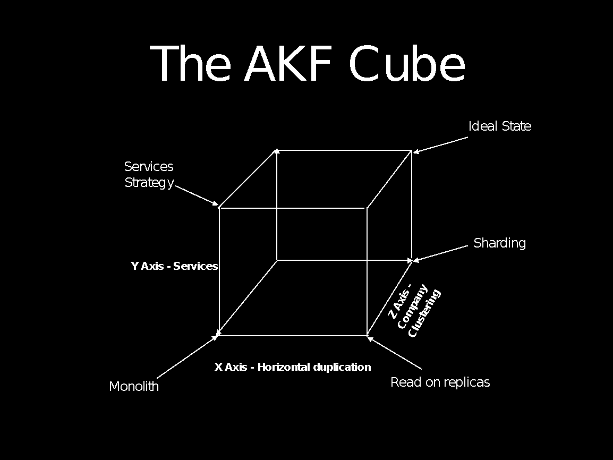

# QuickBooks 平台

> 原文： [http://highscalability.com/blog/2016/11/7/the-quickbooks-platform.html](http://highscalability.com/blog/2016/11/7/the-quickbooks-platform.html)

*这是 Siddharth Ram –小型企业首席架构师的特邀帖子。 [[受电子邮件保护]](/cdn-cgi/l/email-protection#c497ada0a0aca5b6b0ac9bb6a5a984adaab0b1adb0eaa7aba9) 。*

QuickBooks 生态系统是最大的小型企业 SaaS 产品。 QuickBooks 平台支持面向全球范围内的小型企业，其客户和会计师的簿​​记，薪资和付款解决方案。 由于 QuickBooks 还是合规&纳税申报平台，因此报告的一致性非常重要。财务报告需要灵活的查询-给定的报告可能具有数十种可以调整的不同维度。 协作需要员工，会计师和企业所有者同时进行多次编辑，从而导致潜在的冲突。 所有这些都导致在 Intuit 解决有趣的缩放问题。

解决可伸缩性需要考虑多个时间范围和轴。 扩展不仅涉及扩展软件，还涉及人员可扩展性，流程可扩展性和文化可扩展性。 所有这些轴都在 Intuit 进行了积极的研究。 我们与员工的目标是营造一种氛围，使他们能够尽其所能。

# 背景

QuickBooks Online 产品已有十年半的历史了。 它是作为整体构建的，没有明确的关注点分离。 整体服务良好地服务于 Intuit –每天有数百万的客户使用它进行数亿笔交易。 这部分是可能的，因为产品内置了泳道。 这样就可以按公式拆分（客户在特定分片中“归位”）进行缩放。 如今，我们正在努力将整体拆分为多种服务，并迁移到 AWS 作为主要托管解决方案。

## 数字

*   全球小型企业最大的 SaaS 产品

*   超过 500 万的台式机和网络客户

*   每天处理 250M +请求

*   年增长率超过 40％

*   通过 AWS 进行全球扩展

*   全球约有 2,000 名工程师在产品上工作。

*   2000+ 3 个基于 Intuit 平台构建的 和 参与者应用程序

## 技术

*   Java / JVM 是主要服务/后端

*   多语言持久性–不同的用例需要使用不同的存储技术，QuickBooks 平台将 RDBMS（Oracle / MySQL），Neo4J 和 Cassandra 用于 OLTP 和 Hadoop & Vertica 进行分析

*   前端已使用 ReactJS 进行了重建，我们了解到扩展不仅适用于后端-前端扩展是我们开发的一项新技能。

*   监控是使用多个内部和现成的工具完成的，现成的主要工具是 Splunk 和 New Relic

*   通过企业 github 进行代码管理

*   ActiveMQ 和 Kafka 处理异步消息

*   Ansible 和 Chef 用于配置管理

*   大量使用边缘缓存和 Akamai WAA

## 文化

*   每个服务都有定义了 RTO 和 RPO 的 HA / DR。 我们每周执行 HA / DR 计划，以确保在发生常规事件时对客户的影响很小甚至没有。 这是所有 SaaS 产品都需要计划和执行的最佳实践。

*   高度重视弹性。 服务不可用通常并不意味着客户知道它。

*   服务在内部服务门户中发布。 这使工程师可以重用其他团队构建的服务，并减少服务克隆。

*   性能是根据 TP99，TP90 和 TP50（通常更高）来衡量的。 TP50 代表第 50 个 第 个百分位客户体验的体验。 我们的目标是 1 秒的 TP50 和 2 秒的 TP90。 （即少于 10％的客户在任何给定页面上的页面加载时间超过 2 秒）。

*   客户互动失败（FCI）是我们跟踪的另一个关键指标。 与客户的每次失败交互（HTTP 4xx / 5xx）都被视为失败的交互。 我们的目标是使每项服务的 FCI 都低于 0.025％。

*   服务团队拥有端到端的服务。 他们负责与 devops 模型一致的服务维护和正常运行时间。 PagerDuty 用于提醒呼叫人员出现问题和参与恢复。

*   您无法改善无法测量的内容。 通过近乎实时的仪表板，可以在公司的可用性，性能，可扩展性和质量指标方面广泛了解公司。 这是驱动组织行为的关键。

*   我们正在过渡到反应性，松散耦合的系统 ，该系统可增强扩展能力。 但是，这需要仔细考虑如何处理系统中最终的一致性。

*   工程师对系统中的每个故障执行 RCA（根本原因分析）。 RCA 已由工程领导审核。 我们将 5 个“为什么”和“鱼骨”应用于每个 RCA。 失败是一位出色的老师 。

*   强烈的代码意识和域所有权。

*   任务驱动。 当人们看到自己对客户的影响时，便会尽自己最大的努力。

*   在质量，性能，可用性和安全性上丝毫不妥协。

*   持续部署和功能切换使我们能够快速交付

## 可伸缩性中的有趣挑战

# 缩放比例特性

QuickBooks Online 之类的产品具有与其他 SaaS 产品不同的缩放特性。 报表查询可能已应用了许多其他过滤器。 这些查询在公司之间通常是不同的。 报告会产生税收后果，因此必须始终与账簿保持一致。 会计和小型企业所有者可能同时进行多次编辑，才能进行协作。 该软件需要确定如何处理冲突。 所有这些导致在 Intuit 的 QuickBooks 平台上进行扩展的有趣方式。

# 变量

QuickBooks 平台为全球数百万家小型企业，其客户和会计师提供服务。 为客户提供各种用例：产品需要解决的可变性包括：

*   设备多样性–我们根据需要为客户提供服务-台式机，移动设备，在线

*   地理多样性–在全球范围内使用，伴随着法规的复杂性，要​​解决的税收往往非常本地化和专业化

*   合规性多样性–不同的政府机构（例如工资税）对合规性有不同的规定

*   产品多样性–根据员工人数，他们要解决的市场性质（例如，基于产品的业务与基于服务的业务），不同的客户群具有不同的需求

*   工作流的多样性–公司可能拥有执行（并被授予）产品子集的工人。 例如，应收账款业务员将仅看到应收帐款流量。 员工通常不执行业务报告。

这是我们处理的多样性的子集。 尽管解决了很多多样性问题，但平台始终需要解决一些基本问题。 安全性，隐私性，可伸缩性和质量是软件基本构建模块的一部分。

# 缩放哲学

QuickBooks 平台通常在以下三个方面进行扩展，从而遵循“可扩展性多维数据集” 模型：

## X 轴–只读副本

X 轴主要用于只读副本。 与许多 SaaS 产品一样，与写入次数相比，读取次数很多。 常见的且相对昂贵的读取操作是报告。 小型企业和会计师需要了解他们的业务状况。 我们通过 QuickBooks Money Bar 提供见解，并通过大量报告（例如资产负债表，损益报告）提供更详细的见解。 只读副本使我们既可以减少访问的热点，又可以提供预先计算的报告

## Y 轴-服务

扩展的第二个方面是在不同的服务中破坏产品。 QuickBooks 平台建模为 14 个不同的域，这些域组成了产品。 服务 API 现在是第四个修订版– V3 QuickBooks API 可以在 [http://developer.intuit.com](http://developer.intuit.com) 中找到。

### Z 轴-公式拆分

Z 轴指的是“分片”（sharding）-允许大范围缩放的非规范化数据。 QuickBooks 根据公司的属性来拆分客户。 然后，每个分片将与具有类似属性的其他公司共享。

### C 轴

除了这些方面，我们经常谈论“ C”轴-文化轴，这是我们扩展规模的关键方法。 在 C 轴上对我们的主要增强是（a）度量文化–您无法解决无法观察到的问题（b）通过 devops 模型拥有所有权的文化，以及（c）我们做任何事情的客户支持的思想。

### 缩放前端

在 200KLOC 以上，QuickBooks onlike 具有非常大的 Javascript 占用空间。 扩展前端的一部分意味着要理解如何确保更改被隔离并且组件可重复使用–到 3 rd 参与者可以直接插入前端的地步，并且 任何遵循规则的人都可以贡献力量。 缩放还意味着在样式上具有统一性，易于坚持。

## 公有云之旅

Intuit 的一项关键策略是将所有软件资产移至 AWS。 在公共云中，给定共享的基础架构，还需要考虑安全性和隐私性。 在将软件迁移到 AWS 时，我们使用以下一般原则：

*   必须保护每个端点。 在公共云中，我们不能假设服务之间的链接是安全的端点。

*   每个 Intuit 和 AWS 平台服务都必须是可观察的。 这种可观察性是能够分析欺诈和安全性访问的关键。

*   提升并移动+分解。 在适当的情况下，我们将分解为服务并迁移到公共云。 对于较大的系统，我们进入 AWS 基础架构并就地分解。

*   多区域 DR。 区域中断发生。 我们希望即使在单个地区受到影响时也能够提供服务。

*   在本地服务客户。 安全港 和性能都决定了靠近客户的数据存储。 这就要求客户必须在本地区域“居住”（例如，在欧洲的 AWS 数据中心之外服务的欧盟客户）。

*   爆炸半径遏制。 “无共享”方法可确保我们限制爆炸半径。 系统中断应该导致本地事件，而不是全局事件。

## 主要课程

*   3 轴缩放是关键。 知道哪些轴适用于正确缩放有助于缩放。

*   确保可以控制影响。 必须充分理解和测试系统的爆炸半径。

*   RCA –失败是一位了不起的老师。 浪费失败的教训是可耻的。 架构师负责分析故障并找出根本原因。

*   不要低估了对在公共云中保护软件的重新思考的程度。

*   Dogfood。 公司工程师使用的服务应与为 3 个 和 参与方开发人员提供的服务相同。

*   了解您的 KPI 并能够预测性能曲线的样子–这有助于快速识别出问题所在。

*   也可以缩放前端，而不仅仅是后端。

嗨，感谢您的帖子，它非常有用。 我想知道为什么您同时使用 ansible 和 Chef，因为我希望一家公司同时使用其中一种？

嗨，查理，

并没有 Ansible 和 Chef 的强烈技术理由。 不同的团队使用了不同的技术。 随着时间的流逝，我们将逐步淘汰其中之一。

悉达思

您好 Siddharth，

感谢您花时间描述系统。 由于您将整体拆分为服务，因此如何管理服务之间的安全性和身份验证？

嗨，knguyen，

好问。 在整体中，通信相对容易-只需进行另一个函数调用即可。 在分布式系统中，难度会增加一些-但技术仍然非常相似。

身份验证和安全协议是非常标准的。 Intuit 管理自己的身份系统。 每个请求必须具有身份验证上下文-包括服务器-服务器调用。 这些将很快到期，并分配新的票证。 SSL / TLS 是用于有线加密，客户端-服务器以及服务器-服务器通信的标准问题。 分析/监视查找访问模式中的异常。

您如何管理服务之间的安全性和身份验证？

据我所知，Intuit 使用 google oauth1.0 进行身份验证，这基本上是基于令牌的身份验证系统。 例如，您有一个使用者密钥和一个使用者密钥，您将获得一个请求密钥和请求令牌，然后吐出一个访问令牌和访问密钥。 令牌有效期为 6 个月，不确定令牌何时到期才能访问那些基于 JAVA 的 REST API 和安全标准 SHA2 算法。 我写了一篇关于 SSL 握手的文章。 它应该有助于提供见解。

参考：
https://blogs.msdn.microsoft.com/kaushal/2013/08/02/ssl-handshake-and-https-bindings-on-iis/

嗨，
很棒的文章，感谢您的分享，您可以解释一下是否有建立另一个 QuickBooks 或 Zoho Books 的余地？
谢谢
Divya，
[Quickbook Developer](http://www.catchexperts.com/quickbook-online-training)