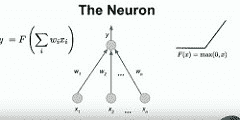
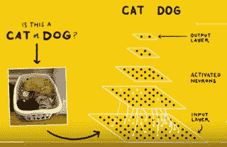
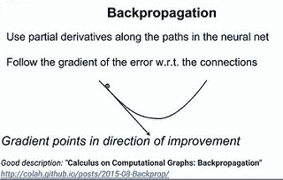
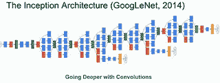
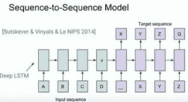
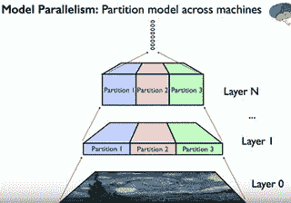
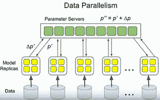

# Jeff Dean 在 Google 进行大规模深度学习

> 原文： [http://highscalability.com/blog/2016/3/16/jeff-dean-on-large-scale-deep-learning-at-google.html](http://highscalability.com/blog/2016/3/16/jeff-dean-on-large-scale-deep-learning-at-google.html)

<iframe allowfullscreen="" frameborder="0" height="225" src="https://www.youtube.com/embed/QSaZGT4-6EY?rel=0" width="400"></iframe>
*If you can’t understand what’s in information then it’s going to be very difficult to organize it.*

此引用来自 [Jeff Dean](http://research.google.com/pubs/jeff.html) ，目前是 Google 系统基础架构小组的向导，研究员，研究员。 摘自他最近的演讲： [智能计算机系统的大规模深度学习](https://www.youtube.com/watch?v=QSaZGT4-6EY) 。

自 [AlphaGo 诉 Lee Se-dol](https://gogameguru.com/tag/deepmind-alphago-lee-sedol/) 以来， [John Henry](https://en.wikipedia.org/wiki/John_Henry_(folklore)) 的现代版本 与 的致命一击 [像蒸汽锤一样，吸引了全世界，对 AI 的普遍恐惧](https://www.youtube.com/watch?v=j3LVFdWBHVM) [[ 启示录](http://thenextweb.com/insider/2014/03/08/ai-could-kill-all-meet-man-takes-risk-seriously/) ，这似乎是掩盖 Jeff 演讲的绝佳时机。 而且，如果您认为 AlphaGo 现在很好，请等到 beta 达到。

Jeff 当然是指 Google 臭名昭著的 [座右铭](https://www.google.com/about/company/) ： *整理世界各地的信息并使其广泛传播 可访问且有用的* 。

从历史上看，我们可能会将“组织”与收集，清理，存储，建立索引，报告和搜索数据相关联。 早期 Google 掌握的所有东西。 完成这项任务后，Google 便迎接了下一个挑战。

现在 **的组织意味着对** 的理解。

我的演讲重点：

*   **实际的神经网络由数亿个参数**组成。 Google 的技能在于如何在大型有趣的数据集上构建并快速训练这些巨大的模型，将其应用于实际问题，*和*然后在各种不同平台（电话）上将模型快速部署到生产环境中 ，传感器，云等）。

*   神经网络在 90 年代没有兴起的原因是**缺乏计算能力，也缺少大型有趣的数据集**。 您可以在 Google 上看到 Google 对算法的天生喜爱，再加上庞大的基础架构和不断扩大的数据集，如何为 AI 掀起一场**完美的 AI 风暴。**

*   Google 与其他公司之间的关键区别在于，当他们在 2011 年启动 Google Brain 项目时， **并未将他们的研究留在象牙塔** 。 项目团队与 Android，Gmail 和照片等其他团队密切合作，以实际改善这些属性并解决难题。 对于每个公司来说，这都是难得的，也是一个很好的教训。 **通过与您的员工合作进行研究** 。

*   这个想法很有效：他们了解到他们可以采用一整套子系统，其中一些子系统可能是机器学习的， **则将其替换为更通用的端到端 终端机器学习资料** 。 通常，当您有很多复杂的子系统时，通常会有很多复杂的代码将它们缝合在一起。 如果您可以用数据和非常简单的算法替换所有内容，那就太好了。

*   **机器学习只会变得更好，更快。** 。 杰夫的一句话：机器学习社区的发展确实非常快。 人们发表了一篇论文，并且在一周之内，全世界许多研究小组下载了该论文，阅读，进行了剖析，对其进行了理解，对其进行了一些扩展，并在 [上发布了自己的扩展。 arXiv.org](http://arxiv.org/) 。 它与计算机科学的许多其他部分不同，在其他方面，人们将提交论文，六个月后，一个会议将决定是否接受该论文，然后在三个月后的会议中发表。 到那时已经一年了。 将时间从一年缩短到一周，真是太神奇了。

*   **可以魔术方式组合技术** 。 翻译团队使用计算机视觉编写了可识别取景器中文本的应用程序。 它翻译文本，然后将翻译后的文本叠加在图像本身上。 另一个示例是编写图像标题。 它将图像识别与序列到序列神经网络相结合。 您只能想象将来所有这些模块化组件将如何组合在一起。

*   **具有令人印象深刻的功能的模型在智能手机** 上足够小。 为了使技术消失，情报必须走到最前沿。 它不能依赖于连接到远程云大脑的网络脐带。 由于 TensorFlow 模型可以在手机上运行，​​因此这可能是可能的。

*   如果您不考虑如何使用深度神经网络解决您的数据理解问题， **几乎可以肯定是** 。 这条线直接来自谈话，但是在您使用深层神经网络解决了棘手的问题之后，观察到棘手的问题后，事实就很清楚了。

Jeff 总是进行精彩的演讲，这一演讲也不例外。 它简单，有趣，深入并且相对容易理解。 如果您想了解深度学习知识，或者只是想了解 Google 在做什么，那么必须要看的是 。

谈话内容不多。 它已经包装好了。 因此，我不确定本文将为您带来多少价值。 因此，如果您只想观看视频，我会理解的。

与 Google 对话一样，您会感到我们只被邀请到 Willy Wonka 的巧克力工厂的大厅里。 我们面前是一扇锁着的门，我们没有被邀请进来。那扇门之外的东西一定充满了奇迹。 但是，就连威利旺卡（Willy Wonka）的大厅也很有趣。

因此，让我们了解杰夫对未来的看法……这很有趣...

## 理解意味着什么？

*   当向人们展示街道场景时，他们可以毫无疑问地从场景中挑选文字，了解到一家商店出售纪念品，一家商店的价格确实很低，依此类推。 直到最近，计算机还无法从图像中提取此信息。

*   如果您真的想从图像中了解物理世界，则计算机需要能够挑选出有趣的信息，阅读并理解它们。

*   小型移动设备在当今和将来都主导着计算机交互。 这些设备需要不同类型的接口。 您需要真正能够理解并产生语音。

*   进行查询：[待售汽车零件]。 旧版 Google 会匹配第一个结果，因为关键字匹配，但是比较匹配的是第二个文档。 真正了解查询的含义是深层次而不是肤浅的单词层次，这是您构建良好的搜索和语言理解产品所需要的。

## Google 的深度神经网络简史

*   [Google Brain 项目](https://en.wikipedia.org/wiki/Google_Brain) 于 2011 年启动，致力于真正推动神经网络技术的发展。

*   神经网络已经存在很长时间了。 它们在 60 年代和 70 年代发明，并在 80 年代末和 90 年代初流行，但它们逐渐消失了。 两个问题：1）缺乏训练大型模型所需的计算能力，这意味着无法将神经网络应用于较大的有趣数据集上的较大问题。 2）缺少大量有趣的数据集。

*   仅与 Google 的几个产品组合作。 随着时间的推移，随着小组发布的好消息或解决了以前无法解决的问题的消息，周围的消息传开了，越来越多的团队会去帮助他们解决问题。

*   一些使用深度学习技术的产品/领域：Android，Apps，药物发现，Gmail，图像理解，地图，自然语言，照片，机器人技术，语音翻译等。

*   **深度学习可以应用在如此多样化的项目**中的原因是，它们**涉及到适用于不同领域的同一组构建模块**：语音，文本，搜索查询，图像， 视频，标签，实体，单词，音频功能。 您可以输入一种信息，确定要使用的信息，一起收集表示要计算的功能的训练数据集，然后就可以使用了。

*   这些模型运行良好，因为 **您以非常原始的数据形式输入** ，您无需手工设计许多有趣的功能， 该模型的强大功能在于它能够通过观察大量示例来自动确定对数据集感兴趣的部分。

*   您可以学习通用表示法，可能跨域学习。 例如，“汽车”可能与汽车的图像具有相同的含义。

*   他们已经知道他们可以采用一整套子系统，其中一些子系统可能是机器学习的，因此**替换为更通用的端到端机器学习文章**。 通常，当您有很多复杂的子系统时，通常会有很多复杂的代码将它们缝合在一起。 如果您可以用数据和非常简单的算法替换所有内容，那就太好了。

## 什么是深度神经网络？

*   [神经网络](https://en.wikipedia.org/wiki/Artificial_neural_network) 从数据中学到了一个非常复杂的功能。 来自一个空间的输入将转换为另一个空间的输出。

*   此功能与 x 2 不同，它是一个非常复杂的功能。 当您输入原始像素（例如猫）时，输出将是对象类别。

*   深度学习中的“ **深度**”是指神经网络中的**层数。**

*   深度的一个不错的特性是该系统由简单且可训练的数学函数 的 **集合组成。**

*   深度神经网络与许多机器学习风格兼容。

    *   例如，您有一个输入，即猫的图片，而输出中有人将该图像标记为猫，则称为 [监督学习](https://en.wikipedia.org/wiki/Supervised_learning) 。 您可以给系统提供许多受监管的示例，并且您将学习近似于在受监管的示例中观察到的功能。

    *   您也可以进行 [无监督训练](https://en.wikipedia.org/wiki/Unsupervised_learning) ，其中仅显示图像，而您不知道其中包含什么。 然后，系统可以学习拾取大量图像中出现的图案。 因此，即使您不知道该怎么称呼图像，它也可以识别出其中所有带有猫的图像都具有共同点。

    *   还与 [强化学习](https://en.wikipedia.org/wiki/Reinforcement_learning) 等更奇特的技术兼容，这是一种非常重要的技术，已被用作一种 AlphaGo。

## 什么是深度学习？

*   神经网络模型**宽松地基于我们认为大脑的行为**。 这不是神经元真正工作原理的详细模拟。 这是神经元的简单抽象版本。 

*   神经元有很多输入。 真实的神经元可以将不同的强度与不同的输入相关联。 人工神经网络试图在所有这些边上学习权重，这些权重是与不同输入相关的优势。

*   真实的神经元将其输入和强度进行某种组合，并决定触发或不触发（峰值）。

    *   人工神经元不仅发出尖峰，还发出实数值。 这些神经元计算的功能是其输入的加权总和乘以通过某些非线性函数施加的权重。

    *   通常，当今使用的非线性函数是 [整流线性单元](https://en.wikipedia.org/wiki/Rectifier_(neural_networks)) （最大值（0，x））。 在 90 年代，许多非线性函数是 [更平滑的](https://www.quora.com/What-is-special-about-rectifier-neural-units-used-in-NN-learning) S 型或正弦函数。 它具有不错的特性，即当神经元不触发时给出真实的零，而接近于零的值可以为您优化系统提供帮助。

    *   例如，如果神经元作为权重为-0.21、0.3 和 0.7 的三个输入 X1，X1，X3，则计算将为：y = max（0，-.0.21 * x1 + 0.3 * x2 + 0.7 * x3）。

*   在确定图像是猫还是狗时，图像将经过一系列图层放置。 一些神经元会根据其输入而激发或不激发。
    

    *   最低层的神经元将看着小块像素。 较高级别的神经元将查看下面的神经元的输出，并决定是否触发。

    *   该模型将逐步向上移动，例如说它是一只猫。 在这种情况下哪一个是错的，那是一条狗（尽管我也以为是猫，所以是狗吗？）。

    *   这是一个错误决策的信号会反馈到系统中，然后该信号将对模型的其余部分进行调整，以使下一次查看图像时输出看起来像狗一样。

    *   这就是神经网络的**目标，** **对模型中所有边缘**的权重进行很小的调整 **，以使您更有可能正确理解示例 。 您可以在所有示例中进行汇总，以便正确地使用大多数示例。**

*   学习算法非常简单。 未完成时：

    *   选择一个随机训练示例“（输入，标签）”。 例如，带有所需输出“ cat”的猫图片。

    *   在“输入”上运行神经网络，并查看其产生的结果。

    *   调整边缘的权重以使输出更接近“标签”

*   如何调整边缘的权重以使输出更接近标签？

    *   [反向传播](http://mattmazur.com/2015/03/17/a-step-by-step-backpropagation-example/) 。 以下是推荐的解释： [计算图上的演算：反向传播](http://colah.github.io/posts/2015-08-Backprop/) 。

    *   微积分的 [链规则](https://www.khanacademy.org/math/differential-calculus/taking-derivatives/chain-rule/v/chain-rule-introduction) 用于确定当选择的是猫而不是狗时，在神经网络的顶部，您知道如何调整 最顶层的权重使其更可能说狗。

*   您需要使用权重朝箭头方向前进，以使其更有可能说狗。 不要迈出大步，因为它是复杂的不平坦表面。 采取非常小的步骤，使其更有可能在下一次遇到狗。 通过多次迭代并查看示例，结果更有可能成为狗。

*   通过链式规则，您可以了解较低层的参数更改将如何影响输出。 这意味着网络中的 **变化可以通过** 一直回荡到输入，从而使整个模型适应并更有可能说狗。

*   真正的神经网络是 **，它由数亿个参数组成** ，因此您要在亿维空间中进行调整，并尝试了解其影响 网络的输出。

## 神经网络的一些不错的特性

*   **神经网络可以应用于很多不同类型的问题** （只要您有很多有趣的数据需要理解）。

    *   文字：英语和其他语言的单词数以万亿计。 有很多对齐的文本，其中逐句级别的一种语言和另一种语言的翻译版本。

    *   视觉数据：数十亿个图像和视频。

    *   音频：每天数万小时的语音。

    *   用户活动：有许多不同的应用程序在生成数据。 例如来自搜索引擎的查询或在电子邮件中标记垃圾邮件的人。 您可以学习许多活动并构建智能系统。

    *   知识图：数十亿个标记关系三倍。

*   **如果向它们投入更多数据，并使模型更大，则结果往往会更好** 。

    *   如果您在问题上投入了更多数据而又没有使模型更大，则可以通过学习有关数据集的更明显事实来饱和模型的容量。

    *   **通过增加模型的大小，它不仅可以记住明显的事物**，而且可以记住可能仅在数据集中的一小部分示例中出现的细微模式。

    *   通过在更多数据上构建更大的模型 **，需要进行更多的计算** 。 Google 一直在努力研究如何扩展计算量以解决这些问题，从而训练更大的模型。

## 深度学习对 Google 有何重大影响？

### 语音识别

*   这是 Google Brain 团队与之合作部署神经网络的第一批团队之一。 他们帮助他们部署了基于神经网络的新声学模型，而不是他们所使用的 [隐藏马尔可夫模型](https://en.wikipedia.org/wiki/Hidden_Markov_model) 。

*   声学模型的问题是要从语音的 150 毫秒变为预测在 10 毫秒的中间发出什么声音。 例如，是 ba 还是 ka 声音？ 然后，您将获得这些预测的完整序列，然后将它们与语言模型结合在一起，以了解用户的意见。

*   他们的初始模型 **减少了 30％的单词识别错误** ，这确实很重要。 从那时起，语音团队一直在研究更复杂的模型和高级网络，以进一步降低错误率。 现在，当您在电话里讲话时，语音识别比三五年前要好得多。

### ImageNet 挑战

*   大约 6 年前，发布了 [ImageNet](http://image-net.org/) 数据集。 当时大约有 100 万张图像，是计算机视觉的最大数据集之一。 这个庞大的数据集的发布推动了计算机视觉领域的发展。

    *   将图像放置在大约 1000 个不同类别中，每个类别大约放置 1000 张图像。

    *   有上千种不同的豹子，小型摩托车等图片。

    *   一个复杂的因素是并非所有标签都正确。

*   目标是推广到新型图像。 您可以说是豹子还是樱桃，换个新图片？

*   在使用神经网络进行挑战之前，错误率约为 26％。 2014 年，Google 以 6.66％ 的 错误率赢得了挑战。 2015 年，错误率降至 3.46％。

*   这是一个庞大而深入的模型。 每个盒子都像整个神经元层一样在进行卷积运算。 这是本文： [随着卷积的发展而深入](http://www.cs.unc.edu/~wliu/papers/GoogLeNet.pdf) 。

*   人类 Andrej Karpathy 接受了挑战，错误率为 5.1％。 您可以在以下位置了解他的经验： [我在 ImageNet 上与 ConvNet 竞争所学到的东西。](http://karpathy.github.io/2014/09/02/what-i-learned-from-competing-against-a-convnet-on-imagenet/)

#### 神经网络模型擅长什么？

*   这些模型在 **方面表现出色，在**方面有很好的区分。 例如，计算机擅长区分狗的品种，而人类则不如。 当人们看到一朵花并说是一朵花时，计算机可以分辨出它是“芙蓉”还是“大丽花”。
*   这些模型**擅长于概括**。 例如，看起来不相似的不同种类的餐点仍将正确地标记为“餐点”。
*   当计算机出错时，错误对于原因是明智的。 例如，sl 看起来很像蛇。

### Google 相册搜索

*   能够查看像素并了解图像中的内容是一种强大的功能。

*   Google 相册团队实现了无需标记即可搜索照片的功能。 您可以找到雕像，yoda，图纸，水等的图片，而无需为图片加标签。

### 街景图像

*   在街景图像中，您希望能够阅读所有文字。 这是更精细的视觉任务。

*   您需要首先能够找到图像中的文本。 经过训练的模型可以从本质上预测像素的热图，其中像素包含文本，而像素不包含文本。 训练数据是围绕文本片段绘制的多边形。

*   因为训练数据包含不同的字符集，所以以多种语言查找文本没有问题。 它适用于大字体和小字体； 靠近摄像机的单词和远离摄像机的单词； 用不同的颜色。

*   这是一种相对容易训练的模型。 这是一个卷积网络，它会尝试预测每个像素是否包含文本。

### 在 Google 搜索排名中的 RankBrain

*   [RankBrain](http://searchengineland.com/faq-all-about-the-new-google-rankbrain-algorithm-234440) 于 2015 年推出。它是排名第三的最重要搜索排名信号（100 秒）。 有关更多信息，请访问： [Google 将其获利的 Web 搜索移交给 AI 机器](http://www.bloomberg.com/news/articles/2015-10-26/google-turning-its-lucrative-web-search-over-to-ai-machines) 。

*   搜索排名有所不同，因为您希望能够理解该模型，并且希望了解其为何做出某些决定。

    *   这是搜索排名小组在使用神经网络进行搜索排名时的不安。 当系统出错时，他们想了解为什么这样做。

    *   创建了调试工具，并在模型中建立了足够的可理解性，以克服该反对意见。

    *   通常，您不想手动调整参数。 您试图了解模型为什么要进行这种预测，并弄清楚该模型是否与训练数据有关，是否与问题不匹配？ 您可以训练一种数据分布，然后应用到另一种数据分布。 通过搜索查询的分布，您每天的变化都会有所变化。 由于事件的发生，变化总是在发生。 您必须了解自己的分布是否稳定，例如语音识别，人们发出的声音变化不大。 查询和文档内容经常更改，因此您必须确保模型是最新的。 一般而言，我们需要做一个更好的工作构建工具，以了解这些神经网络内部发生的事情，找出导致预测的原因。

### 序列到序列模型

*   可以将世界上的许多问题构想为将一个序列映射到另一个序列。 Google 的 Sutskever，Vinyals 和 Le 撰写了有关该主题的突破性论文： [序列到神经网络的序列学习](http://papers.nips.cc/paper/5346-sequence-to-sequence-learning-with-neural-networks.pdf) 。

*   他们特别关注语言翻译，以及将英语翻译成法语的问题。 翻译实际上只是将英语单词序列映射到法语单词序列。

*   神经网络非常擅长学习非常复杂的功能，因此该模型将学习将英语映射到法语句子的功能。

*   用 EOS（句子结尾）信号一次输入一种语言的句子。 当看到一个 EOS 以另一种语言开始产生相应的句子时，模型被训练。 训练数据是指意义相同的语言句子对。 它只是试图对该功能建模。

*   在每一步中，它都会散发您词汇表中所有词汇表项上的概率分布。 在推论时，您需要做一点搜索而不是训练。 如果您必须最大化每个单词的概率，则不一定要获得最可能的句子。 对联合概率进行搜索，直到找到最大可能的句子。

*   该系统在公共翻译任务上达到了最新水平。 大多数其他翻译系统都是针对问题子部分的一堆手工编码或机器学习模型，而不是完整的端到端学习系统。

*   该模型引起了人们的广泛关注，因为很多问题都可以映射到这种逐序列方法。

#### 智能回复

*   [智能回复](http://googleresearch.blogspot.com/2015/11/computer-respond-to-this-email.html) 是在产品中如何使用逐序列的示例。 在电话上，您希望能够快速响应电子邮件，并且打字很麻烦。

    *   他们与 Gmail 团队合作开发了一个系统来预测邮件的可能回复。

    *   第一步是训练一个小模型，以预测消息是否是可以简短回复的消息。 如果是这样，则会激活一个更大，计算量更大的模型，该模型将消息作为顺序输入，并尝试预测响应字的顺序。

    *   例如，在一封询问感恩节邀请的电子邮件中，三种预计的回复是： 我们会去的; 抱歉，我们无法做到。

    *   使用智能回复可以在收件箱应用中生成令人惊讶的回复数量。

#### 图片字幕

*   生成图像标题时，您要尝试在给定图像像素的情况下使人们可能写出的有关图像的标题最大化。

*   取得已开发的图像模型和已开发的序列到序列模型，并将它们插入在一起。 图像模型用作输入。 不用一次查看一个英语单词，而是查看图像的像素。

*   经过训练可以产生字幕。 训练数据集具有由五个不同的人书写的带有五个不同标题的图像。 共写了大约 700,000 个句子，大约 100,000 至 200,000 张图像。

*   关于计算机上婴儿抱着泰迪熊的照片，照片是：一个抱着毛绒玩具的孩子的特写镜头； 一个婴儿在玩具熊旁边睡着了。

*   它没有人的理解水平。 错误的结果可能很有趣。

### 组合视觉+翻译

*   可以组合技术。 翻译团队使用计算机视觉编写了可识别取景器中文本的应用程序。 它翻译文本，然后将翻译后的文本叠加在图像本身上（看起来非常令人印象深刻，大约为 37:29）。

*   这些模型足够小，可以**，**，**，全部在设备 上运行！**

## 周转时间及其对研究的影响

*   每天训练一张 GPU 卡需要 6 个星期。

*   Google 真的很希望能够快速完成研究。 这样做的想法是快速训练模型，了解哪些方法行之有效，哪些行之有效，并找出下一组要运行的实验。

*   模型应在数小时之内（而不是数天或数周）可训练。 它使每个进行此类研究的人都更有效率。

## 如何快速训练大型模型

### 模型并行

*   神经网络具有许多固有的并行性。

*   计算它们时，所有不同的单个神经元大多彼此独立，尤其是当您具有局部接受场时，其中一个神经元仅接受来自其下方的少数神经元的输入。

*   可以在不同的 GPU 卡上的不同计算机上划分工作。 只有跨越边界的数据才需要通信。

### 数据并行

*   您要优化的模型的参数集不应位于集中服务中的一台计算机中，因此您可以拥有许多不同的模型副本，这些副本将协作以优化参数。

*   在训练过程中读取不同的随机数据（示例）。 每个副本都将获取模型中的当前参数集，读取一些有关梯度应为多少的数据，找出要对参数进行哪些调整，然后将调整发送回集中的参数服务器集 。 参数服务器将对参数进行调整。 并重复此过程。

*   这可以跨许多副本完成。 有时他们会在 500 台不同的机器上使用 500 个模型的副本，以便快速优化参数并处理大量数据。

*   该过程可以是 **异步** ，其中每个料仓都在其自己的循环中，获取参数，计算梯度并将其发送回去，而无需任何控制或同步 其他的。 不利的一面是，当梯度返回时，参数可能已从计算时移开。 事实证明，对于许多模型（实际上最多 50 至 100 个副本）来说，这是可以的。

*   该进程可以 **同步** 。 一个控制器控制所有副本。 两者似乎都起作用并且具有不同的优点和缺点（未列出）。

演讲的下一部分是关于 TensorFlow 的，我不会在这里讨论。 这篇文章已经太长了。

## Q & A

*   **如果您不是 Google 这样的大公司，并且无法访问大数据集，该怎么办？** 从运作良好的模型开始，该模型在公共数据集上经过训练。 公共数据集通常可用。 然后对更适合您的问题的数据进行培训。 从相似且可公开获得的数据集开始时，您可能只需要为特定问题加上标签的 1,000 或 10,000 个示例。 ImageNet 是此过程工作的一个很好的例子。

*   **作为工程师，您最大的错误是什么？** 不在 BigTable 中放置分布式事务。 如果要更新多个行，则必须滚动自己的事务协议。 不会输入它是因为它会使系统设计变得复杂。 回想起来，许多团队都希望拥有这种能力，并以不同程度的成功建立自己的团队。 我们应该在核心系统中实现事务。 它在内部也将是有用的。 Spanner 通过添加事务来解决此问题。

## 相关文章

*   [关于 HackerNews](https://news.ycombinator.com/item?id=11298308)
*   Ryan Adams 的 [AlphaGo](http://deepmind.com/alpha-go.html) 的真棒麻瓜可获得的技术解释 [机器学习音乐视频](http://www.thetalkingmachines.com/blog/) [Talking Machines](http://www.thetalkingmachines.com/) 播客的 集。
*   [TensorFlow](https://www.tensorflow.org/)
*   [为什么机器学习课程的注册人数激增](http://blogs.nvidia.com/blog/2016/02/24/enrollment-in-machine-learning/)
*   [使用深度卷积神经网络](http://arxiv.org/abs/1412.6564) 进行移动评估
*   [捍卫强大的 AI：语法](http://disagreeableme.blogspot.com/2012/11/in-defence-of-strong-ai-semantics-from.html) 的语义
*   [中文会议室参数](http://plato.stanford.edu/entries/chinese-room/)
*   [Google：将计算机上的多个工作负荷相乘，以提高机器利用率并节省资金](http://highscalability.com/blog/2013/11/13/google-multiplex-multiple-works-loads-on-computers-to-increa.html)
*   [Google 延迟容忍系统：将不可预测的部分做成可预测的整体](http://highscalability.com/blog/2012/6/18/google-on-latency-tolerant-systems-making-a-predictable-whol.html)
*   [Google DeepMind：它是什么，它如何工作，您应该被吓到吗？](http://www.techworld.com/personal-tech/google-deepmind-what-is-it-how-it-works-should-you-be-scared-3615354/)
*   [重塑 Google 帝国的人工大脑内部](http://www.wired.com/2014/07/google_brain/)
*   [神经网络揭秘](http://lumiverse.io/series/neural-networks-demystified)
*   [神经网络黑客指南](http://karpathy.github.io/neuralnets/)
*   [神经网络和深度学习](http://neuralnetworksanddeeplearning.com/)
*   [神经网络（常规）](http://colah.github.io/)
*   [stephencwelch /神经网络解密](https://github.com/stephencwelch/Neural-Networks-Demystified)
*   [加州大学伯克利分校深度学习主题课程](https://github.com/joanbruna/stat212b)
*   [机器学习：2014-2015](https://www.cs.ox.ac.uk/people/nando.defreitas/machinelearning/)
*   [通过深度强化学习玩 Atari](https://www.cs.toronto.edu/~vmnih/docs/dqn.pdf)
*   [通过深度强化学习](https://storage.googleapis.com/deepmind-data/assets/papers/DeepMindNature14236Paper.pdf) 进行人为控制

您提到了 arxiv.org，但却错过了 [gitxiv.com](http://gitxiv.com) ，这是机器学习中“真正非常快的”开发周期的下一个演变。 在 Gitxiv 上，您可以在 arxiv.org 上找到某些论文的实现。 这是您希望随论文提供的源代码。 大多数实现是由第三方完成的，但越来越多的是高质量的。

人类如何更好地以最适合 AI 消费和理解的形式构造文本，例如 Br​​ainRank 或其他一些深度神经网络？

“从历史上看，我们可能会将'组织'与收集，清理，存储，建立索引，报告和搜索数据联系在一起。所有 Google 早期掌握的东西。完成这一任务后，Google 便迈入了下一个挑战。

现在组织意味着理解。”

我还没有看过杰夫·迪恩（Jeff Dean）的演讲-但有趣的是，几天前我在 Twitter 上发布了完全相同的内容：

“ IMO Google 的长期目标不仅是“组织世界的信息”，还在于使用#AI“理解”它：

https://twitter.com/arunshroff/status/709072187773349889

要点：约翰·亨利的故事是我小时候最喜欢的故事之一。
尽管这场比赛对他来说是致命的，但他还是在蒸汽锤上获胜。 因此，我不确定您想以此类推论来说明什么。

总体而言，自工业革命以来，我们就发生了人机冲突，这表明发生了棘轮事件。 永远无法退回的齿轮转动。 约翰·亨利（John Henry）是其中一员。 AlphaGo 不是，但是它即将到来。

约翰·亨利死了。 那不是赢。 充其量是物理上的胜利。 他悲惨的胜利并没有阻止接下来发生的一切。 机器置换人的肌肉。

好文章。 小重点。 Alpha Go 没有使用强化学习，这很重要。 强化学习是为单人问题设计的，它在诸如游戏等两人模型中的使用远非直截了当。 最大的问题是，如果自己一个人去，您将探索哪个领域。 因此，Alpha Go 使用（深度）学习来确定要探索的动作，如何评估情况以及何时停止评估，但是总体算法是一种博弈。 重要的是，学习不能解决所有问题，并且有明显的盲点。 其中之一就是结构很多的问题，例如是否有对手试图击败您。 还有其他情况。