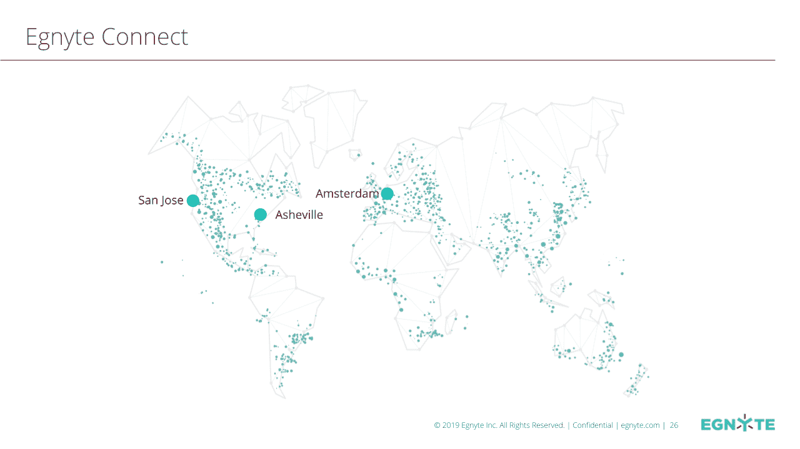
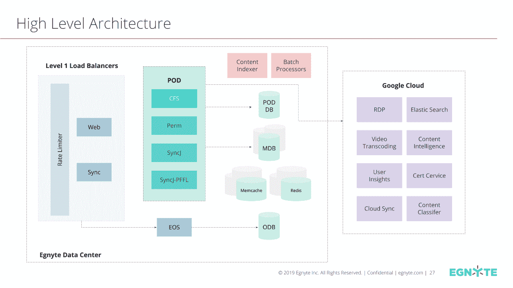
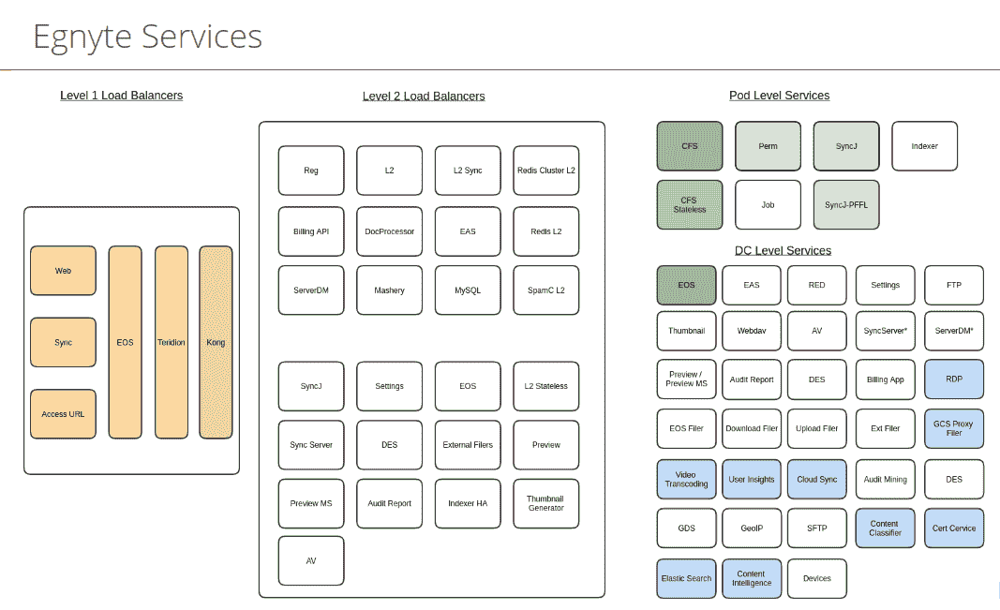
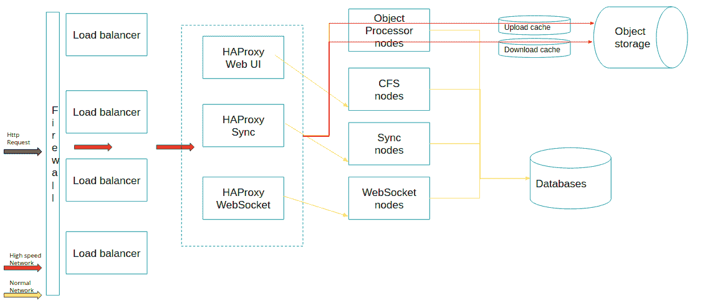
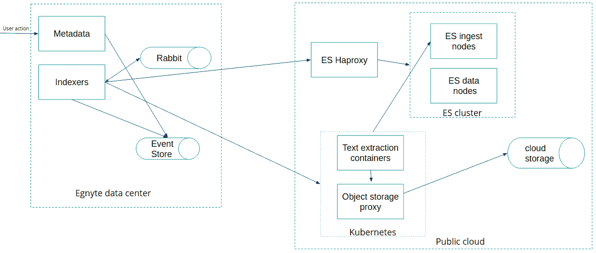
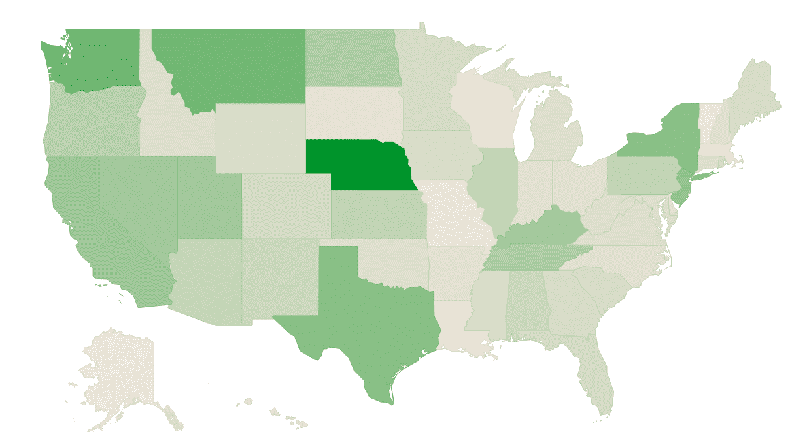
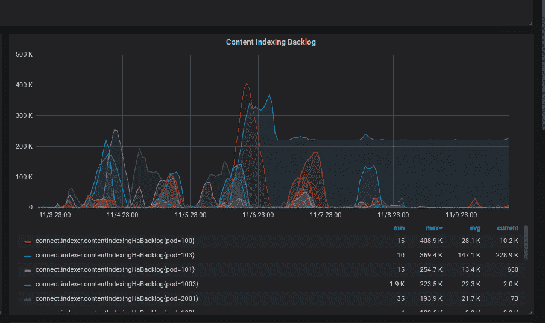
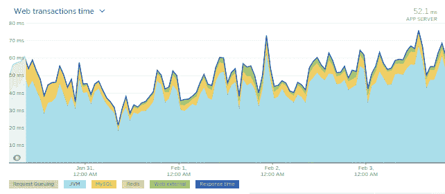
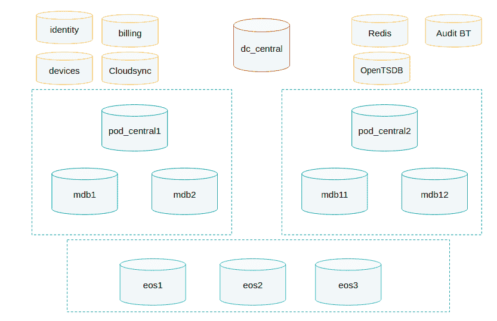

# Egnyte Architecture：构建和扩展多 PB 内容平台的经验教训

> 原文： [http://highscalability.com/blog/2019/11/25/egnyte-architecture-lessons-learned-in-building-and-scaling.html](http://highscalability.com/blog/2019/11/25/egnyte-architecture-lessons-learned-in-building-and-scaling.html)

这是 [Kalpesh Patel](https://www.linkedin.com/in/kpatelatwork) 的来宾帖子，工程师是为 [Egnyte](https://www.egnyte.com/) 在家工作的。 Egnyte 是专门为企业构建的安全内容平台。 他和他的同事们花费大量的时间来扩展大型分布式文件系统。 您可以通过 [@kpatelwork](https://twitter.com/kpatelwork) 与他联系。

## 简介

您的笔记本电脑有一个文件系统，该文件系统被数百个进程使用。 但是，如果您希望使用它来支持数以万计的用户在处理同时包含 PB 级数据的数亿个文件时有一些缺点。 它受磁盘空间的限制； 它无法弹性扩展存储空间； 如果您运行一些 I / O 密集型进程或尝试与 100 个其他用户进行协作，就会感到窒息。 让我们来解决这个问题，并将其转换为遍布全球的数百万付费用户使用的云原生文件系统，您将了解我们过山车的规模，可以扩展该系统以满足每月的增长和 SLA 要求，同时提供严格的一致性和 我们都期望笔记本电脑具有出色的耐用性。

Egnyte 是一个安全的内容协作和数据治理平台，成立于 2007 年，当时 Google 硬盘还没有诞生，而 AWS S3 却禁止了成本。 我们唯一的选择是袖手旁观，自己构建基本的云文件系统组件，例如对象存储。 随着时间的推移，S3 和 GCS 的成本变得合理，并且借助 Egnyte 的存储插件架构，我们的客户现在可以引入他们选择的任何存储后端。 为了帮助我们的客户管理持续的数据爆炸，我们在过去几年中设计了许多核心组件。 在本文中，我将分享当前的体系结构以及我们所学到的扩展它的一些经验教训，以及我们希望在不久的将来进行改进的一些内容。

## Egnyte Connect 平台

Egnyte Connect 平台使用 3 个数据中心来满足来自全球数百万用户的请求。 为了增加弹性，可靠性和耐用性，这些数据中心使用高速，安全的 Google 互连网络连接到 Google Cloud 平台。

 

Egnyte Connect 运行一个服务网格，该网格从我们自己的数据中心延伸到提供多种服务类别的 Google 云：

### 合作

*   文档存储区

*   预览版

*   视频转码

*   分享

    *   链接

    *   权限

*   标签

*   评论

*   任务

*   建议

### 混合同步

*   处理 Prem 数据时

*   大文件或低带宽

*   离线访问

*   边缘缓存

### 基础架构优化

*   迁移到云

*   优化保鲜库的成本

*   合并存储库

通常，Egnyte 连接架构分片并基于以下条件在不同级别缓存数据：

*   数据量

*   数据相互依存

*   并发读取的级别

*   并发写入级别

 

，

## Egnyte Connect 技术堆栈

### 云平台

1.  Google 云端

2.  Azure

3.  托管数据中心

### 语言：

1.  Java

2.  Python

3.  转到

4.  C

### 对象存储区

*   Egnyte 对象存储区

*   GCS

*   S3

*   Azure

### 应用服务器

*   Tomcat

### 数据库

*   MySQL

*   Redis

*   BigTable

*   数据存储

*   Elasticsearch

### 缓存

*   Memcached

*   Redis

*   Nginx 用于基于磁盘的缓存

### 负载平衡器/反向代理

*   HAProxy

*   Nginx

### 消息队列

*   Google Pub / Sub

*   兔子

*   抄写员

*   Redis

### 部署管理

*   人偶

*   Docker

*   Ansible

*   詹金斯

*   Gitlab

*   调速器

### 分析

*   新遗物

*   OpenTSDB / bosun

*   Grafana

*   MixPanel

*   表格

*   BigQuery

### 其他

*   ZooKeeper

*   Nagios

*   Apache FTP 服务器

*   孔

*   ReactJS / Backbone / Marionette / JQuery / npm / Nightwatch

*   Rsync

*   PowerDNS

*   服装

*   基于 REST API 的 SOA 体系结构。

*   Java 用于驱动核心文件系统代码

*   用于支持客户端代码，某些微服务，迁移脚本，内部脚本的 Python

*   原生 Android 和 iOS 应用

*   本机桌面和服务器托管的客户端，允许对整个名称空间进行交互以及混合同步访问

## 统计信息

*   3 个主要地区（其中一个在欧洲）使用 Google 互连连接到相应的 GCP 地区

*   500 多个 Tomcat 服务 实例

*   由 Tomcat / Nginx 提供支持的 500 多个存储节点

*   100 多个 MySQL 节点

*   100 多个 Elasticsearch 节点

*   50 多个文本提取 实例 （自动缩放）

*   100 多个 HAProxy 实例

*   许多其他类型的服务 实例

*   存储在我们服务器和其他对象存储区（例如 GCS，S3 和 Azure Blobstore）中的数十 PB 数据

*   在 Elasticsearch 中建立索引的多个 TB 提取内容

*   数百万个桌面客户端与云同步文件以进行脱机访问

*   数百万台式客户端以交互方式访问文件

## 认识您

### 您的系统名称是什么，我们在哪里可以找到更多信息？

Egnyte Connect 是内容协作和数据管理平台。 CFS（云文件系统），EOS（Egnyte 对象存储），内容安全性，事件同步，搜索服务，基于用户行为的推荐服务构成了系统的主要部分。 您可以在我们博客的 [对于技术人员](https://www.egnyte.com/blog/category/for-the-techies/) 部分中找到更多相关信息。

### 您的系统使用什么功能？

作为内容协作和数据管理平台的 Egnyte Connect 被成千上万的客户用作唯一的 安全内容平台来满足他们的所有文档管理需求。 它是为承载各种文件服务 并为它们的现有文件存储库启用云而构建的。 可以从各种端点（例如 FTP，WebDAV，移动，公共 API 和浏览器）访问它，并具有强大的审核和安全组件。

### 您为什么决定构建此系统？

在 2007 年，企业开始变得更加分散。 客户正在使用多种设备来访问他们的文件，因此需要使这种体验尽可能地顺畅。 我们构建了 Egnyte Connect-一种安全的分布式文件系统，该系统将 Hybrid Sync 与 Cloud File System 相结合，可以满足各种业务需求中企业的内容协作需求。 随着本地和云存储库中数据的分散，以及由于 GDPR 等举措而增加的合规性需求，我们构建了 Egnyte Protect 来帮助客户满足其合规性和治理需求。

### 您的项目经费如何？

Egnyte 最初是一家自举公司。 后来，我们继续从高盛，Google Ventures，KPCB，Polaris Partners 和 Seagate 的多轮融资中筹集了 1.375 亿美元的 。

### 您的收入模式是什么？

Egnyte 不提供免费帐户。 客户从 15 天的免费评估试用期开始，之后，他们将根据席位数量，存储空间和其他企业功能转换为带有收入模型的付费帐户。

### 您如何销售产品？

我们从 SEM / SEO 开始，但随着时间的增长，我们使用了许多渠道来为社会客户，社交媒体，商务开发，贸易展览，SEM，SEO，入站营销和企业级客户进行高接触销售。

### 您从事这项工作多久了？

Egnyte 成立于 2007 年。它已有 12 年的历史，现金流量为正。

### 您的系统多大？ 尝试感受一下系统的工作量。

我们存储数十亿个文件和数十 PB 的数据。 在“ Egnyte connect”中，根据 New Relic，我们平均观察到平均每秒超过 10K API 请求，平均响应时间为< 60ms。 由于安全港规定和位置相近，我们允许从 3 个主要地区访问。 有关更多信息，请参见统计信息部分。 我们的“ Egnyte Protect”解决方案还持续监控内容和对许多客户的合规性，治理和安全漏洞的访问。

### 您提供多少份文件？ 多少张图片？ 多少数据？

我们存储数十亿个文件和数十 PB 的数据。 我们存储各种文件。 Egnyte 存储的前 5 个文件扩展名是 pdf，doc / docx，xl​​s / xlsx，jpeg 和 png。

### 免费用户与付费用户的比例是多少？

我们所有的用户均为付费用户。 我们提供 15 天的免费试用期，然后将其转换为付费帐户。

### 在过去一个月中有多少个帐户处于活动状态？

我们所有的客户都是付费帐户，并且每个月几乎所有人都活跃。 我们满足他们安全的内容平台需求，谁在家不用电？

## 您的系统如何设计？

### 您的系统的体系结构是什么？

我们使用基于 REST 的面向服务的体系结构，它使我们能够独立扩展每个服务。 这也使我们能够将某些后端服务移至公共云中托管。 所有服务都是无状态的，并使用数据库或我们自己的对象存储进行存储。

10000 英尺的 Egnyte Connect 服务概述如下所示。

 

[典型请求流](https://www.egnyte.com/blog/2015/02/handling-millions-of-requests-at-egnyte/) 的 10000 英尺总览如下

 

约 10000 英尺的 [搜索架构](https://www.egnyte.com/blog/2015/06/scaling-elasticsearch-at-egnyte/) 如下

 

### 您的系统面临哪些特定的设计/架构/实施挑战？

最大的 架构 挑战包括：

1.  节俭地扩展文件存储

2.  扩展元数据访问

3.  文件与桌面客户端的实时同步

4.  带宽优化

5.  冲击隔离

6.  缓存（分布式和内存中）

7.  功能首次展示

### 您是如何应对这些挑战的？

1.  对于存储，我们编写了自己的存储，现在我们使用可插拔的存储体系结构来存储到任何公共云，例如 S3，GCS，Azure ...

2.  为了扩展元数据，我们移至 Mysql 并开始使用分片。 在某个时候，我们暂时投入了更多的硬件来腾出空间，以便一层一层地剥去“鳞屑洋葱”。

3.  对于实时同步，我们必须更改同步算法，使其更像 Git，客户端接收增量事件并尝试与云状态进行最终的一致同步。

4.  为了推出功能，我们构建了一个自定义设置服务，允许工程师在功能标志后面编写代码。 这样，即使在睡眠者模式下，您也可以释放代码并收集数据，然后按客户，用户或主机组或 POD 或数据中心启用功能。 有了这种控制水平，即使是新工程师也可以放心地在功能标记后面编写代码并将其发布到生产环境中，而不必担心停机时间。

5.  监视，监视和监视。 您无法优化无法衡量的内容。 不利的一面是，在某些时候，我们监控得太多了，以致于我们无法专注于所有指标。 我们必须转移注意力，并依靠诸如 New Relic，bosun，ELK，OpenTSDB 和自定义报告之类的异常检测工具，使我们能够专注于从绿色->黄色->红色趋势发展的问题。 目的是在客户通知 之前，将它们捕获为黄色并且 [时捕获它们。](https://www.egnyte.com/blog/2013/06/improving-service-reliability/)

### 您的系统如何发展以应对新的扩展挑战？

我们已经多次重新构造了许多层。 我将尝试列出过去 7 年中核心元数据，存储，搜索层的一些迭代。

1.  版本 1：在 Lucene 中搜索 Lucene 中的文件元数据，通过 NFS 安装在 DRBD Filer 中存储的文件。 关键点： Lucene 更新不是实时的，必须替换。

2.  版本 2：Berkeley DB 中的文件元数据，通过 NFS 挂载的 DRBD Filers 中存储的文件，在 Lucene 中搜索。 关键点： 我们打破了 NFS 的限制，它左右 and 住，必须用 HTTP 代替。

3.  版本 3：Berkeley DB 中的文件元数据，通过 HTTP 服务的 EOS Filers 中存储的文件，在 Lucene 中搜索。 关键点 ：即使分片的 Berkeley DB 在压力下也令人窒息，并且由于恢复需要数小时而导致数据库崩溃，因此必须更换它。

4.  版本 4：MySQL 中的文件元数据，通过 HTTP 服务的 EOS Filers 中存储的文件，在 Lucene 中搜索。 关键点： 公共云开始变得便宜。

5.  版本 5：MySQL 中的文件元数据，存储在 EOS / GCS / S3 / Azure 中并通过 HTTP 提供的文件，在 Lucene 中搜索。 阻塞点： 搜索开始阻塞，必须替换。

6.  版本 6：MySQL 中的文件元数据，通过 HTTP 服务的 EOS / GCS / S3 / Azure 中存储的文件，在 Elasticsearch 中搜索。 这是当前的体系结构。

7.  版本 7（未来）：将所有计算移至公共云，提供更多服务以实现影响隔离，动态资源池以有效管理宠物和牛。

### 您是否使用任何特别酷的技术或算法？

*   我们在核心服务和服务之间进行呼叫时使用指数补偿，以使用断路器来避免打雷。

*   我们使用核心服务节点资源上的公平份额分配来处理传入请求。 核心服务节点上的每个传入请求都被标记并分为各种组。 每个组都有专用的容量，如果一个客户每秒发出 1000 个请求，而另一个客户每秒发出 10 个请求，则此系统将确保其他客户不会因为邻居吵闹而挨饿。 诀窍是，如果您是目前使用该系统的唯一客户，则可以全力以赴，但是随着更多客户同时出现，您可以在其中共享容量。 对于某些大型客户，我们会分配专用池以确保一致的响应时间。

*   带有 SLA 的某些核心服务被隔离在 POD 中，这确保了一个不好的客户不会阻塞整个数据中心，但是这可能很快就需要轮回。

*   我们在桌面同步客户端代码中使用基于事件的同步，因为发生服务器事件时，它们会从服务器推送到客户端，并且客户端会在本地重播它们。

*   我们采用大规模数据过滤算法，以使大型客户端集群与 Cloud File System 同步。

*   我们根据问题陈述使用不同类型的缓存技术。 很少有以下口味：

    *   传统

    *   内存中的-简单的

        *   不可变的对象

        *   内存中的大型数据集

            *   用于在各个进程之间实现高度一致性的锁

            *   已实施部分更新，以避免出现 GC

    *   内存中-高容量变异数据集

        *   粗粒度无效

        *   细粒度无效

    *   基于磁盘的缓存

### 您做什么工作是与众不同的，人们可以从中学到什么？

专注于启动的核心功能，如果您遇到技术难题，就必须为其构建自定义内容，然后卷起袖子继续前进。 有很多独特的东西，但是基于事件的同步存储层绝对值得学习，这里有更多详细信息。 [Egnyte 对象存储库](https://www.egnyte.com/blog/2013/07/how-egnyte-implements-hybrid-object-stores-using-public-clouds-to-enhance-customer-experience/) 和 Egnyte [规范文件系统](https://www.egnyte.com/blog/2015/04/egnyte-canonical-file-system/) 。

### 您学到了什么？

*   您无法优化您无法测量的内容：测量所有可能且相关的内容，然后首先优化 80％处于使用状态的系统部分。

*   当您身材矮小的时候，请慢慢介绍技术，不要试图从中找到解决当前问题的理想工具。 编码是生命周期中最简单的部分，但是如果您拥有太多的技术，则其维护（如部署/操作/学习曲线）将非常困难。 随着您变得更大，您的部署中将有足够的脂肪来逐步进行服务划分。 学习保留一个或两个服务模板来实现微服务，不要为每个服务使用不同的技术堆栈。

*   作为初创企业，有时您必须快速行动。 介绍您现在可以做的最好的解决方案，如果发现有牵引力，请随着时间的推移重新设计该解决方案。 您可以尝试 10 种不同的方法，而只有 1 种方法可以看到牵引力，因此请快速进行一些操作，然后在看到牵引力的方法上重新架构，以适应业务规模。

*   寻找单点故障，并不懈地追查它们。 付出额外的努力来解决使您彻夜难眠的问题，并尽快从防御性转变为进攻性模式。

*   在 SOA 中，构建断路器以尽早减轻负载，如果服务受阻，则开始发送 503s。 与其惩罚所有人，不如看看您是否可以公平分配资源并仅惩罚滥用请求。

*   在服务使用者中添加了自动修复功能，服务可能会停止运行，并且像台式机客户端或其他服务这样的使用者可以进行指数补偿以释放服务器上的压力，并在服务再次起作用时自动修复。

*   始终可用：请客户提供服务级别的断路器和断路器。 例如，如果通过 WebDAV 或 FTP 访问文件系统存在性能问题，并且需要 4 个小时来修复，那么在这 4 个小时内，您可以在 kong / firewall 杀死 FTP / WebDAV 并要求客户使用 Web UI 或其他 工作机制。 同样，如果一个客户造成了导致系统阻塞的异常，则可以暂时为该客户禁用该客户或服务，并在解决问题后重新启用它。 为此，我们使用功能标志和断路器。

*   对于高度可扩展的服务，离开 Java 进程的成本很高，即使去了 Memcache 或 Redis 也是如此，因此我们对某些高度使用的数据结构（如访问控制计算，功能标志，路由元数据等）进行了具有不同 TTL 的内存中缓存。 。

*   我们看到一种有关处理大数据集的模式。 优化代码并挤走柠檬中的每一滴都是徒劳的，我们最终可能会使代码变得复杂且柠檬水苦涩。 通常，最简单的解决方案来自返回到绘图板，看看我们是否可以：

    *   通过使用启发式方法来减少我们需要处理的数据集大小

    *   重组了我们在内存或磁盘中存储数据的方式。

    *   在写时对数据进行规范化，并避免联接。

    *   基于时间的过滤，例如存档较早的数据。

    *   在多租户数据结构中创建较小的碎片。

    *   使用事件更新缓存数据集，而不是完全重新加载。

*   保持简单：每个月都有新工程师加入，因此目标是从第一周开始就提高他们的工作效率-简单的架构可确保轻松上岗。

### 您为什么成功？

牵引力胜过一切。 当 EFSS 市场刚刚爆发时，我们达到了产品/市场契合度。 良好的执行力，以客户为中心，管理团队遵守财务纪律的时机可以成功。 许多竞争者采用了免费增值模式并筹集了一大笔资金，但是从第一天开始我们就开始收费，这使我们能够专注于随着市场需求的扩大而发展解决方案/团队。 专注于付费客户使我们能够提供企业级解决方案，而无需支付免费增值罚金。

### 您希望自己做些什么？

我希望当我们开始时，公共云不会像成本那样高。 我也希望我们从第一天开始就使用 SOA，花了一些时间才到达那里，但是现在我们就在那里。

### 您不会更改什么？

体系结构应具有延展性。 四年前，对于给定的问题，我有不同的答案，但是目前，我不确定。 我的意思是，随着您规模的扩大，过去 2 年前有效的设计模式和策略可能使您从防御性定位转向进攻性定位可能会在压力下屈服或变得成本过高。 只要更改将使系统变得有弹性或带来 10 倍的更改并为我们再购买 3-4 年的规模，我便会继续尝试更改它。 我不能在两年后发表评论，我会有同样的想法，他们可能会改变。 当您遇到下一个增长突增时，架构会发生变化。

### 您应该做多少前期设计？

很好的问题。 答案是“取决于”，

*   如果您要设计核心存储层或核心元数据层之类的东西，那么再多花 2 周的时间就不会有多大伤害。 当我们在核心元数据层上从 Berkeley DB 迁移到 MySQL 时，我承受着很大的压力，我想到了一条捷径，当我通过我们的 CTO 运行它时，他建议花一些时间，“做正确的事情”。 ”作为回顾，这是一个极好的决定。

*   对于公共 API，最好做一个不错的前端设计，因为您没有第二次机会对其进行更改，并且必须在未来 4-5 年内进行维护。

*   如果要处理其 PB 级数据并带来巨大麻烦，那么我将再给它一个月的时间并进行更多的 POC。

*   但是，如果您要为内部服务设计一些东西并将其迁移到新的体系结构不会花费一年的时间，那么我建议您进行非常少的前端设计，并且只需快速构建版本并随着使用量的增长对其进行迭代 。

### 您如何考虑将来更改架构？

*   从静态 POD 转移到动态 POD，并无缝处理宠物和牛。

*   提供更具弹性的服务并隔离影响。

*   将我们的整个计算移至公共云，同时保留数据中心用于提供文件。 这将使我们能够在负载到来时自动放大/缩小。 我们已经使用公共云来自动扩展一些异步处理，例如视频转码，文本提取，数据迁移，搜索等。

*   一旦进入云，请使用更多自动缩放服务，例如 BigTable，PubSub，Spanner 等。

*   将我们的部署从 VM 迁移到 Kubernetes 中的容器，以提供挂起的服务。

*   自动化剩余数据库的架构管理

*   通过重新构建从某些增长最快的表中删除联接。

*   重写元数据的缓存层，并使用 Redis 数据结构代替 Memcache。

*   将频繁使用的流从强一致性转换为最终一致性。

## 您的团队如何设置？

### 您的团队中有多少人？

大约 700 名员工和承包商。 有 200 名工程师（DevOps / OPS / QA / Developers /…），其余为销售，市场营销，支持，产品管理，人力资源等。

### 他们在哪里？

最初是一支分布相当分散的工程团队，但现在主要吸引了印度波兰山景城的人。 一些像我这样的远程员工 和其他一些员工在家工作。

### 谁扮演什么角色？

这是一个很大的团队，我们有产品经理，UX 团队，DevOps，Scrum 团队，架构师，工程师扮演各种角色。 最初，工程团队很平坦，每个人都会向工程副总裁报告，但现在我们在两者之间增加了一层管理。

### 您是否有特定的管理理念？

如果您开发某些产品，那么您便拥有该产品的生命周期，这意味着您将与质量保证和 DevOps 一起使用，以确保产品经过测试/部署。 投入生产时，您可以使用各种内部工具（例如 New Relic / Grafana，Kibana）对其进行监视，如果存在回归，则可以对其进行修复。 我也是 1 人 1 任务理念的忠实拥护者，通过这种方式，如果工程师碰壁，他将找到某种最终克服它的方法，而不是太早放弃。

### 如果您有分散的团队，该如何工作？

自治，1-1 交流给他们带来挑战性的问题，亲自照顾和直接挑战，他们会受到激励。

### 您的开发环境是什么？

*   适用于服务器团队的 Ubuntu

*   UI 团队使用 Windows / mac 并连接到用于 REST API 服务器的本地 Ubuntu VM 或连接到共享的 QA 实例

*   Eclipse /想法

*   适用于构建的

*   Maven

*   码头工人

*   Gitlab

*   Jenkins

*   汇合

*   JIRA

*   Google 办公套件

*   松弛

### 您的开发过程是什么？

我们使用 Scrum，并为云文件系统团队提供每周发布。 我们使用 git-flow 的变体，对于每个票证，我们克隆存储库，并对每个合并请求运行自动化测试。 合并请求必须经过 2 位工程师的批准，然后才能解决 JIRA 故障单。 解决后，我们的管道将接管工作，而票务将接下去的下一班火车。 下一版本的培训已通过自动化 REST API 测试和一些手动烟雾测试进行了验证。

我们吃了自己的狗粮，代码在发布前 2-3 天送达了 UAT（供所有员工使用），我们发现了自动测试未发现的任何意外情况。 我们每个星期三进行生产部署， [每天监视新文物，并报告任何异常](https://www.egnyte.com/blog/2013/06/improving-service-reliability/) 的异常报告。 我们在一周中更改了部署，以实现工作与生活之间的平衡，并且通过这种方式，我们将让所有工程师可用，以防发布出现问题。

如果这是一项长期运行的功能，则工程师通常会在功能标志后面进行工作，并在各个阶段以 sleeper 模式提交代码，因此，每周（而不是大爆炸）都要测试他的代码。 我们也以一次迁移 1 个客户并仅为该客户打开功能的方式处理大型迁移，我们的一些大型迁移已运行 3-4 个月。

### 您有什么可以做的不同还是感到惊讶？

许多工程师在家工作，令人惊讶的是，有了自主权，许多远程员工像总部员工一样富有生产力和积极性。

## 您使用什么基础架构？

### 您使用哪种语言来开发系统？

主要是 Java / Python，以及 Go / C 中的一些小服务

### 您有多少台服务器？

我们有约 3000 多个由人偶管理的实例。

*   500+ Tomcat service instances

*   500+ Storage nodes powered by Tomcat/Nginx

*   100+ MySQL nodes

*   100+ Elasticsearch nodes

*   50+ Text extraction instances(autoscaled)

*   100+ HAProxy instances

*   和许多其他类型的服务 实例

### 如何将功能分配给服务器？

我们使用面向服务的体系结构，并根据服务类型分配服务器。 一些顶级服务是：

*   元数据

*   储存空间

*   对象服务

*   Web UI

*   索引

*   同步

*   搜索

*   审核

*   内容智能

*   实时事件传递

*   文本提取

*   集成

*   缩略图生成

*   防病毒软件

*   垃圾邮件

*   预览/缩略图

*   Rsync

*   API 网关

*   结算

*   FTP / SFTP

*   等等。

### 如何配置服务器？

大多数服务都是伪造的，并且可以在 VM 上运行，我们仅针对 MySQL，Memcached 和存储节点等少数设备运行物理服务。 我们使用第三方根据模板来配置服务器，并将其放置在数据中心中，以供使用。 但是我们已经开始将一切迁移到公共云的工作，因此最终，一切都将在 Kubernetes 中运行。 但是，挑战在于如何在不停机的情况下如何在比赛中更换赛车发动机。

### 您使用什么操作系统？

CentOS7

### 您使用哪个 Web 服务器？

Nginx，HAproxy。 在一些旧的流程中使用了 Apache，但随着时间的流逝，它将被弃用。

### 您使用哪个数据库？

MySQL 和 Redis。 过去我们曾使用过其他数据库，例如 Berkeley DB，Lucene，Cassandra，但由于其对工程师/操作人员的熟悉程度和可扩展性，我们逐渐将所有数据库迁移到 MySQL。 有关更多信息，请参见 Egnyte 的 [MySQL](https://www.egnyte.com/blog/2012/10/mysql-at-egnyte/) 。

对于某些流，我们还使用 OpenTSDB，BigTable，Elasticsearch。

### 您是否使用反向代理？

是 Nginx 和 HAProxy

### 您是否并置，使用网格服务，使用托管服务等？

我们并置，我们还使用公共云。

### 您的存储策略是什么？

我们首先创建自己的服务器，然后在机器中打包尽可能多的硬盘驱动器，我们过去将它们称为 DRBD Filers。 我们这样做是因为 AWS 成本过高。 我们已经评估了 [GlusterFS](https://www.gluster.org/) ，但当时它无法扩展以满足我们的需求，因此我们构建了自己的。 加班 S3 变得便宜了，GCS / Azure 诞生了，我们将存储层设计为可插入的，因此现在客户可以决定要使用哪个存储引擎（例如，Egnyte，S3，GCS，Azure 等）。 此时，我们在公共云中存储了 1 个 DR 副本，并与我们一起存储了 1 个副本，但是最终我们将使用我们的数据中心作为直通缓存，因为云中的计算便宜，但是带宽昂贵。

### 您如何增加产能？

我们已基于 Newrelic，Grafana 和其他统计数据提供了半自动化的容量规划工具，并根据观察监控报告中的关键指标并预定一些额外的容量，进行了定期的容量规划会议。 现在，某些服务已启用云服务，我们只是根据队列大小自动缩放它们。

### 您是否使用存储服务？

是 Egnyte，S3，GCS，Azure，

### 您如何处理会话管理？

我们多次重写了体系结构，目前，有 99％的服务是无状态的。 仅服务 Web UI 的服务使用会话，我们在 [memcached-session-manager](https://code.google.com/archive/p/memcached-session-manager/) 支持的 tomcat 中使用粘性会话，但最终，我的计划是也 使用 JWT 或类似方法实现无状态。

### 您的数据库是如何设计的？ 主从？ 碎片？ 其他？

我们几乎对所有具有自动故障转移功能的数据库都使用了 Master-Master 复制，但是在一些突变程度很大的数据库上的切换是手动完成的，我们遇到了一些问题，其中由于复制滞后，自动切换会导致应用程序数据不一致，我们 需要重新架构一些核心文件系统逻辑来解决此问题，我们最终将完成此工作。 下面是有关处理数据库升级的问题，详细回答了有关数据库体系结构的更多详细信息。

### 您如何处理负载平衡？

我们根据客户使用 DNS 访问系统的 IP 进行地理平衡，并在数据中心内使用 HAProxy 将其路由到相应的 POD，并在内部 POD 中再次使用 HAProxy 路由

### 您使用哪个 Web 框架/ AJAX 库？

我们已经多次更改了 UI，这是一直在变化的一件事。 过去，我们不得不使用 ExtJS，YUI，JQuery，而不能使用其他东西。 最新的迭代基于 ReactJS / Redux 以及 Backbone / Marionette 上的一些旧代码。

### 您使用哪些实时消息传递框架？

我们使用 [大气](https://github.com/Atmosphere/atmosphere) ，但最终，我们将其替换为 NodeJS

### 您使用哪个分布式作业管理系统？

为此，我们使用 Google Pubsub，RabbitMQ 和基于 Java / Python 的消费者服务。

### 您的网站是否有标准 API？ 如果是这样，您将如何实施？

我们的 API 分为 3 种类型：-

1.  公共 API： 这是我们向第三方应用程序工程师和集成团队以及我们的移动应用程序公开的 API。 我们会按照适当的弃用工作流程来弃用/升级 API 签名，并且更改始终向后兼容。 我们使用 Mashery 作为网关，API 记录在 [https://developers.egnyte.com/docs](https://developers.egnyte.com/docs)

2.  适用于我们客户的 API： 此 API 对我们客户而言是内部的，如果我们以外的人使用此 API，我们不保证向后兼容。

3.  服务之间的内部受保护的 API： 这是服务在我们的数据中心内部用于相互通信的 API，无法从外部防火墙调用。

### 您的对象和内容缓存策略是什么？

我们存储了 PB 级的数据，但无法缓存所有数据，但是如果客户在给定的 15 天时间内拥有 5000 万个文件，则他可能只使用其中的 100 万个。 我们有基于 tomcat / Nginx /本地文件系统的缓存文件管理器节点，它以 LRU 方式运行。 我们可以弹性地增加减少缓存文件服务器的数量。 我们最大的问题之一是上传速度，如何从世界任何地方尽可能快地将数据上传到 Egnyte，为此，我们构建了特殊的 Network pops，如果您好奇的话可以在阅读更多内容 [为 Egnyte 客户加速数据访问](https://www.egnyte.com/blog/2014/03/speeding-up-data-access-for-our-customers/)

Memcached / Redis 用于缓存元数据，我们使用单独的 Memcached 池来缓存长期存在的静态数据和文件系统元数据。 核心文件系统元数据非常庞大，不适合当前的 Memcached 节点，并且会逐出最近使用的其他类型的数据。 为了防止这种情况，我们使用 3 种类型的池，应用程序代码决定在哪里查找哪种数据。 我们允许在文件系统 Memcached 缓存中逐出，并在其他种类的 Memcached 池中争取零逐出。 对于不同种类的数据，我们也使用不同的对象到期时间。 对于我们一些频繁使用的数据（例如客户信息或分片映射），即使每个请求都转到 Memcache，也会因某些请求（例如文件夹列表）而减慢速度，因此我们在每个 JVM 上对该数据进行内存内缓存，并刷新数据 基于自定义 TTL 或我们使用某种 pub-sub 机制刷新它。

缓存中的两个最大难题是权限和事件。 对于权限数据，我们已经多次重选了该层，最近我们编写了一个 TRIE 来有效地缓存该层。

对于事件，我们将其缓存在 Memcache 中，但是有可能在夜间为客户发布了约 10 万个事件，而在早上 9:00 AM 突然有 3 万个人打开了笔记本电脑，现在每个人都希望这些 10 万个事件可以 使他们的系统一致。 这是一个有趣的规模问题，因为这将需要您在短时间内（例如 15 分钟）处理 30B 事件，并且仅发送用户有权访问的事件。 由于事件是不可变的，我们将它们在 Memcache 中缓存了 12 个小时，但是即使它们从 Memcache 下载相同的事件那么多次也会导致网络问题。 最终，我们在短时间内将事件缓存在内存中，并且随着我们进行许多年轻一代的收集工作，还调整了这些节点上的 GC 设置。 与其他节点相比，我们还将这些节点放置在速度更快的网络上，但仍然没有解决这个问题:)。

### 您的客户端缓存策略是什么？

对于我们的 Web UI，我们使用 requireJS 和其他各种方式来仅下载所需的模块。 我们的 Mobile 和 Desktop 客户端丰富使用本地文件系统作为缓存。

### 您使用哪些第三方服务来帮助您构建系统？

我们使用了一些 Google 服务，Azure，New Relic，Authy，MixPanel，Flurry，Tableau，但大多数核心组件都是由我们构建的。

## 您如何管理系统？

### 您如何检查全局可用性并模拟最终用户性能？

我们使用不同 AWS 区域中的节点来一致地测试带宽性能。 我们还使用内部 haproxy 报告来绘制客户观察到的上载/下载速度，并主动寻找它们，并使用网络弹出消息和其他策略来加速数据包。

 

### 您如何健康检查服务器和网络？

Nagios，Grafana 和 New Relic 以及一些内部主动异常分析被使用。 有关更多详细信息，请参见此 [博客文章](https://www.egnyte.com/blog/2013/06/improving-service-reliability/)

### 如何绘制网络和服务器统计数据以及趋势图？

我们使用 Grafana，Kibana，Nagios 和 New Relic。

 

 

### 您如何测试系统？

硒，Junit，鼻子，Nightwatch 和手动测试。 单元，功能，集成和性能测试的组合。

### 您如何分析效果？

New Relic 用于监视应用程序性能。 我们还使用本地框架生成了大量内部应用程序指标。 我们使用 Grafana / Nagios / Kibana，内部工具和其他工具来监视系统其他部分的性能。 有关更多详细信息，请参见此博客文章 [分布式系统中的调试性能问题](https://www.egnyte.com/blog/2014/10/debugging-performance-issues-in-distributed-systems/)

### 您如何处理安全性？

专门的安全团队在每个版本之前都会运行自动化的安全基准测试。 连续自动笔测试正在生产中运行。 我们还使用漏洞赏金计划，并与 whitehat 测试公司合作。 一些客户使用第三方进行自己的安全性测试。

## 您如何处理客户支持？

我们有专门的 24X7 分布式客户成功团队，我们使用 Zendesk 和 JIRA

## 您如何确定要添加/保留的功能？

### 您是否实施网络分析？

我们使用 Google Analytics（分析），Mixpanel，Flurry 来衡量功能使用情况

### 您是否进行 A / B 测试？

是的，我们使用功能标记进行 A / B 测试。 有关更多信息，请参见 [在 Egnyte 使用功能标志](https://www.egnyte.com/blog/2014/01/how-we-migrated-millions-of-users-from-ldap-to-mysql-using-feature-flags/)

### 您要运行多少个数据中心？

3 个主要数据中心，包括欧洲的一个（由于安全港规则） 和遍布世界的网络流行音乐。

### 您的系统如何部署在数据中心中？

Puppet / Ansible 用于部署大多数新代码。

### 您使用哪种防火墙产品？

帕洛阿尔托网络

### 您使用哪个 DNS 服务？

NS1

### 您使用哪些路由器？

思科

### 您使用哪些开关？

Arista

### 您使用哪个电子邮件系统？

我们结合使用 SendGrid 和我们自己的 SMTP 服务器。

### 如何备份和还原系统？

对于 MySQL，我们使用 [Percona XTraBackup](https://www.percona.com/doc/percona-xtrabackup/2.3/index.html) ，对于 Elasticsearch，该数据被复制 3 次。 对于客户文件，我们将其复制 3 次，并将 1 个副本存储在 DR 公共云中。 如果存储 Filer 无法恢复，我们将丢弃它，添加一个新 Filer 并再次复制副本。 对于某些客户，我们还会将其数据复制到他们选择的提供商。 对于使用 S3，Azure 或 GCS 作为可插拔存储层的客户，它将确保复制以防止数据丢失。

### 如何进行软件和硬件升级？

大多数节点是无状态的，并且有状态组件具有主动-主动故障转移。 通过将节点从池中取出并进行升级并将其放回池中来处理升级。 我们使用 jenkins + Ansible + puppet 和自定义自动化。

### 您如何处理升级时数据库架构的重大更改？

不同的服务使用不同类型的数据库，并且它们以不同的方式升级。 在 10000 英尺处，它们如下图所示：

 

1.  EOS DB 存储对象元数据并且增长非常快，它经过分片，并且我们将继续添加更多此类数据。

2.  MDB 的增长速度更快，经过了分片，并且我们会继续增加更多。

3.  DC_central 是一个 DNS 数据库，并且保持相当静态。 我们运行了许多此副本以实现可伸缩性。

4.  Pod_central 具有快速变异的数据，但每个表的增长量不超过 2000 万行。 我们运行了许多此副本以实现可伸缩性。

*   每个数据库模式始终是向前和向后兼容的，即我们绝不会在同一发行版中删除列和代码，我们首先在停止使用该列的发行版 1 中部署代码，而在发行版 2 中我们删除该列。

*   非分片数据库每周更新一次。 它们是存储各种功能驱动表的表。 我们目前在生产环境中使用脚本对其进行升级，但是我们在质量检查中使用 Liquibase，并且正在逐步将其应用于生产环境

*   使用自动脚本进行分片的数据库新列更改

*   分片数据库迁移是一件痛苦的事情，因为我们有 12000 多个分片并且还在不断增长，您无法在 1 小时的升级窗口中完成。 方法是：

    *   实时代码根据需要迁移行。 这意味着迁移可能需要几个月的时间。

    *   使用功能标记进行迁移，您同时拥有新旧代码，并且在后台迁移客户，然后翻转标记以将其切换到新代码路径而无需停机，更多的是 [此处](https://www.egnyte.com/blog/2014/01/how-we-migrated-millions-of-users-from-ldap-to-mysql-using-feature-flags/) 和 [此处](https://www.egnyte.com/blog/2015/06/scaling-elasticsearch-at-egnyte/)

    *   当我们从 Lucene 迁移到 ElasticSearch 时，除了重新索引所有内容外，我们别无选择，我们使用了 [功能标记](https://www.egnyte.com/blog/2015/06/scaling-elasticsearch-at-egnyte/) ， -4 个月完成。

*   模式一致性检查器报告可确保升级后所有数据中心中的所有模式均相同。

### 您是否有单独的运营团队来管理您的网站？

是的，我们有一个专门的生产工程师，SRE 和一个 IT / Ops 团队，负责监视和管理生产。 但是正如我之前所说，构建此功能的工程师负责制定决策，因此他们将深入参与监视指标并解决生产问题。

## 其他

### 您欣赏谁？

AWS ：他们的创新步伐令人赞叹。

Google ：它们的工具如 BigQuery，Kubernetes 很棒。

Elasticsearch： 其余的 API 简单性和架构很棒。 我们用一个 TB 的数据和一个工程师来管理一个 100 多个节点的集群。

MySQL / Memcache： 它们简单，快速且很棒。

Eclipse / Jenkins ：插件架构很好。

### 您是否模仿了其他人的公司/方法？

我们是 [http://highscalability.com/](http://highscalability.com/) 的常规读者，许多设计都受到它的启发。

*   POD 架构的灵感来自 Tumblr 的 Cell 架构。 这不是精确匹配，但是隔离故障的概念是相同的。

*   受 Facebook 启发的架构在 12 个小时后会在 Memcached 和刷新键中产生抖动。

*   受 [http://highscalability.com/上一些文章的启发，将](http://highscalability.com/) [指纹添加到每个数据库查询](https://www.egnyte.com/blog/2014/10/debugging-performance-issues-in-distributed-systems/)

我们正在招聘，请在 [职位页面](https://www.egnyte.com/jobs/) 中查看我们，并在 [与我们联系 [受电子邮件保护]](/cdn-cgi/l/email-protection) 。如果您有兴趣成为 [Egnyte](https://www.egnyte.com) 令人惊叹的团队的一员。