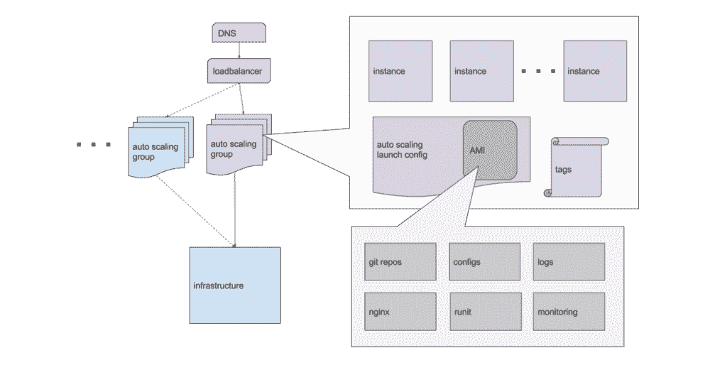

# AdStage 从 Heroku 迁移到 AWS

> 原文： [http://highscalability.com/blog/2017/5/1/the-adstage-migration-from-heroku-to-aws.html](http://highscalability.com/blog/2017/5/1/the-adstage-migration-from-heroku-to-aws.html)

*这是 AdStage 网站可靠性工程负责人 [G Gordon Worley III](https://www.linkedin.com/in/gworley3/) 的来宾[重新发布](https://medium.com/adstage-engineering/migrating-from-heroku-to-aws-our-story-80084d31025e)。*

我在 2013 年秋季加入 [AdStage](https://medium.com/@adstage) 时，我们已经在 Heroku 上运行了。 这是显而易见的选择：超级容易上手，比全尺寸虚拟服务器便宜，并且足够灵活以随着我们的业务发展。 成长，我们做到了。 Heroku 让我们仅专注于构建引人注目的产品，而不会分散管理基础结构，因此，到 2015 年末，我们同时运行了数千个 dynos（容器）以跟上客户的发展。

我们需要所有这些功能，因为在后端，我们看起来很像[细分](https://medium.com/@segment)，并且像它们一样，我们的许多成本[与用户数量](https://segment.com/blog/the-million-dollar-eng-problem/)成线性比例。 以 25 美元/ dyno /月的价格计算，加上其他技术成本，到 2016 年中期，我们的年度基础设施支出将突破 100 万美元，而这占了 COGS 的很大比例，因此需要数年才能实现盈利。 坦率地说，这种情况是不可持续的。 工程团队开会讨论了我们的选择，一些快速计算表明我们为 Heroku 的便利每月要支付超过 10,000 美元，而类似资源将直接在 AWS 上花费。 如果我们从 Heroku 迁移，这足以证明工程师全职从事基础架构工作，因此我的任务是成为第一位运营负责人，并带头进行向 AWS 的迁移。

这也是一个很好的时机，因为 Heroku 已成为我们最大的限制。 我们的工程团队采用了[看板](https://en.wikipedia.org/wiki/Kanban_%28development%29)方法，因此理想情况下，我们会不断产生从构思到完成的故事。 不过，当时我们正在生成大量正在进行的工作，这些工作通常会阻塞我们的发布渠道。 进行质量检查的工作很缓慢，并且经常被送回以进行错误修复。 “ [在我的计算机](https://jcooney.net/archive/2007/02/01/42999.aspx)上正常工作”的情况经常出现，但是当暴露在我们的暂存环境中时会失败。 由于 AdStage 是写在不同技术堆栈上的相互依赖的服务的复杂组合，因此每个开发人员都很难使其工作站与生产保持最新状态，这也使部署到生产和生产过程很缓慢，需要大量的人工干预 。 但是，我们在此问题上别无选择，因为我们不得不将每个服务都部署为自己的 Heroku 应用程序，从而限制了自动化的机会。 我们迫切需要找到一种替代方法，使我们能够自动化部署并为开发人员提供更早的访问可靠测试环境的机会。

因此，除了通过迁移 Heroku 削减成本外，我们还需要清除质量检查约束。 否则，我可以自由地设计我们的 AWS 部署，只要它以最少的代码更改即可运行我们所有的现有服务，但我添加了一些需求：

*   **简单的系统管理** ：我以前使用过 Chef 等工具，并希望避免从头开始频繁重建系统的容易出错的过程。 我想通过登录机器并运行命令来更新机器。
*   **无聊** ：我想使用已知有效的“无聊”技术，而不是尝试一些新技术来解决其问题。 我想将风险集中在业务逻辑而不是基础架构中。
*   **零停机时间** ：在 Heroku 上进行部署往往会导致我们的用户遇到“漏洞”，原因是某些用户请求花费的运行时间比 Heroku 允许的连接耗用时间更长。 我希望能够消除这些斑点。
*   **回滚** ：如果部署出现问题，我希望能够退出部署并使用最新的已知工作版本恢复服务。
*   **有限的复杂度** ：我将是唯一一个专职构建和维护我们的基础架构的人，所以我需要确定项目的范围以适应需求。

知道 [Netflix](https://medium.com/@NetflixTechBlog) [设法通过](http://highscalability.com/blog/2015/11/9/a-360-degree-view-of-the-entire-netflix-stack.html)[在 AWS 上运行](http://techblog.netflix.com/2013/03/ami-creation-with-aminator.html)数十亿美元的业务，没有比亚马逊的机器映像和自动缩放组更完美，我决定遵循他们的可靠方法，但绝对没有 意味着“性感”的方法：构建机器映像，使用它在自动伸缩组中创建实例，将其放在弹性负载均衡器之后，并将负载均衡器连接到 DNS 记录，以使我们的客户以及彼此可以访问它们。

因此，我着手构建我们的 AWS 部署策略。

### 成为 AWS Sumo

在对系统进行工程设计时，我喜欢花很多时间在进行设计之前先仔细考虑并测试假设。 Rich Hickey 将此称为[吊床驱动开发](https://www.youtube.com/watch?v=f84n5oFoZBc)。

我们的办公室没有吊床，所以我使用了[相扑躺椅](https://www.sumolounge.com/)。

在 2016 年春季的几个月中，我思考并思考并整理了 AWS 部署系统的基础。 它的架构看起来像这样：

它的核心是我们所谓的 AdStage 统一图片。 此机器映像用于为所有环境（从开发和测试到过渡和生产）中的所有服务创建实例。 它上面是我们所有存储库的副本以及运行它们所需的依赖项。 根据一些实例标签的值，实例可以以不同的方式出现以反映其用法。

例如，当一个实例以“审阅”模式出现时，所有服务及其从属数据库在该实例上一起运行并相互通信。 这样，进行开发和质量检查的工程师就可以访问运行任意代码版本的完整堆栈的隔离版本。 他们在这些评论框上所做的任何操作均不会影响登台或制作，也不会与其他评论框进行交互，从而完全消除了我们以前的质量检查/登台限制。 另外，只要审核框通过质量检查，就可以对它进行成像，然后将该图像部署到生产中。

之所以可行，是因为当实例以“登台”或“生产”模式启动时，它还会告知其应运行的服务。 这是由实例从其自动伸缩组继承的标签确定的，这使我们可以启动运行相同代码的实例队列，以分散客户的负载。 对于服务于 Web 请求的自动伸缩组，它们连接到弹性负载均衡器，该均衡器在我们的服务器之间平均分配请求。 负载平衡器为我们提供了一个固定点，我们可以在该固定点上平稳地交换实例，从而实现零停机时间部署，并使回滚就像将旧版本的统一映像保留在备用数据库中一样容易交换。

但是，我们使用的 AWS 资源无法完全协调自身，因此我们编写了一个使用 AWS API 做到的 Ruby [Thor](https://github.com/erikhuda/thor) 应用程序。 它负责启动审阅框，构建映像，然后将这些映像部署到暂存和生产环境中。 它会在将负载均衡器切换到新版本之前自动验证部署是否正常运行，如果部署完成后检测到问题，则会建议回滚。 它还使用一些巧妙的技巧来协调多个部署并锁定关键资源，以防止多个工程师破坏彼此的部署，因此任何人都可以启动部署，尽管如果这会引起冲突，它们将被停止。

这涵盖了我们的所有需求：成像实例使系统管理变得容易，设置无聊且被广泛使用，部署过程固有的停机时间为零，支持回滚的部署是自动化的，并且在小于 1500 的情况下并不是很复杂 而且，由于它解决了质量保证约束，并且据我们估计将节省 10,000 美元的运营支出，因此剩下的只是计划从 Heroku 到 AWS 的实时迁移。

### 实时迁移

2016 年 7 月是旧金山的典型节日。 大部分时间，雾气和寒冷的空气使我一直在里面工作，而在我们办公室对面的街道上，准备不足的游客在 [Dragon's Gate](https://www.lonelyplanet.com/usa/san-francisco/attractions/dragons-gate/a/poi-sig/383985/361858) 上拍了自拍照时发抖。 同样，因为一切都准备从 Heroku 迁移到 AWS，所以我们要做很多工作。

我们的客户依靠我们来管理他们的广告活动，自动化他们的广告支出并报告他们的广告效果。 当我们陷入困境时，它们又陷入了直接通过网络界面手动创建和更新广告的黑暗时代。 当我们切换到 AWS 时，他们负担不起我们离线的费用，因此我们将不得不进行实时迁移。 或至少与合理生活一样。

我们实施了 1 周的代码冻结，并在星期六的早晨找到了 1 小时的窗口，那时我切换了数据库和其他在运行时不易移动的服务，而 AdStage 进入维护模式。 在准备过程中，我们已经进行了登台系统的迁移，并编写了一部剧本，可用于停产。 我使用代码冻结花了一周的时间来调整 AWS 部署，以匹配 Heroku 部署。 周六上午一切似乎都很好。 我们失败了，我切断了数据库，然后重新启动了 AdStage。 我花了整整一天的时间看监视器，并靠近键盘，以防万一发生任何问题，但是什么也没做。 那天晚上我睡着了，以为一切都很好。

在一个 la 懒的星期天早晨之后，我开始在下午收到一些警报，提示我们的进口商正在备份。 当我们研究这个问题时，问题很快就变得显而易见：尽管名义上拥有更多的计算资源，但在某种程度上，我们在 AWS 上的 CPU 数量要少于 Heroku。 结果，我们无法跟上，并且每小时我们都越来越落后。 为了避免队列溢出，我们不得不降低导入的频率，最终我们不得不重新打开 Heroku 应用程序以与 AWS 一起运行以跟上工作量。 这与省钱相反。

我们发现，Heroku 一直在告诉我们一个幸福的谎言。 官方每个 dyno 仅获得 2 个 [ECU](https://aws.amazon.com/ec2/faqs/#What_is_an_EC2_Compute_Unit_and_why_did_you_introduce_it) ，但实际情况是，由于我们 Heroku 上的邻居没有充分利用它们的全部份额，我们接近了 6 个。 这意味着我们的 AWS 实例数量太少了 3 倍，尽管 Heroku 确实便宜很多！ 如果只有一种方法可以为更多实例支付更少的费用……

那就是我们开始使用竞价型实例的时候。 我们曾考虑过使用它们，因为它们的价格约为按需价格的 1/10，但它们存在一定的风险，因为如果您的底价低于拍卖价，它们可以随时终止。 幸运的是，这种情况很少发生，否则，自动伸缩组会为您管理点实例的复杂性。 另外，如果备份临时扩展组使用按需部署的按需实例，则很容易，如果我们暂时无法获得足够的竞价型实例来满足我们的需求，则可以通过单个命令进行扩展。 我们最终能够将约 80％的机队转换为现场实例，尽管使用的资源比原始预期多了 3 倍，但我们的成本却降低到了预期目标之内。

### 结论

除了我们对容量的意外低估外，从 Heroku 切换到 AWS 的过程也很顺利。 不过，请不要误会我的意思：这是值得做的，因为我们已经达到了将我们的一些基础设施运营纳入内部的经济规模才有意义。 如果我们不花费至少一名工程师的薪水来购买运营成本，而可以通过改用 AWS 来节省运营成本，并且如果基础架构没有成为核心能力，那么我们将坚持使用 Heroku 并让那个人（我！）来工​​作 在对我们的业务更重要的事情上。 只是由于经济和流程的变化，从 Heroku 迁移到 AWS 成为了我们的故事的一部分。

Heroku 在 AWS 上运行，因此您不必进行过多的迁移就可以减少中间商。

...或者您雇用知道如何正确运行数据中心的人员。

感谢您的帖子。 非常有趣，只是有几个问题：图像如何获得其初始配置？ 您提到要避免使用 Chef / Puppet 之类的东西，但是大概您仍然需要一些可重复的过程来使用初始配置来构建 AMI。 那是雷神应用程序的功能吗？

您应该尝试进行性能调整，例如 JVM 调整，线程池调整等，以降低基础架构成本。

似乎没有这么多麻烦就节省了很多。 您节省了全职人员成本，但是在 AWS 上通常需要 DevOps 成本，在 Heroku 中，Dev 团队可以解决。 放大/缩小测功机与 EC2 相比，哪一个更容易？