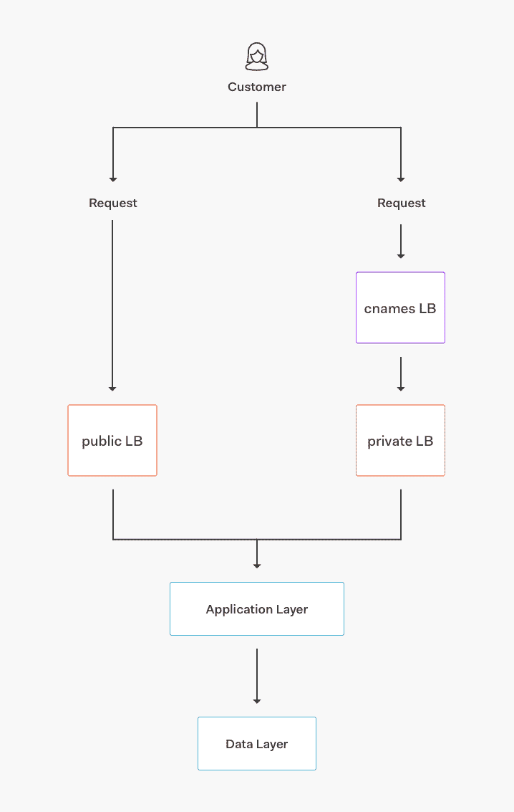
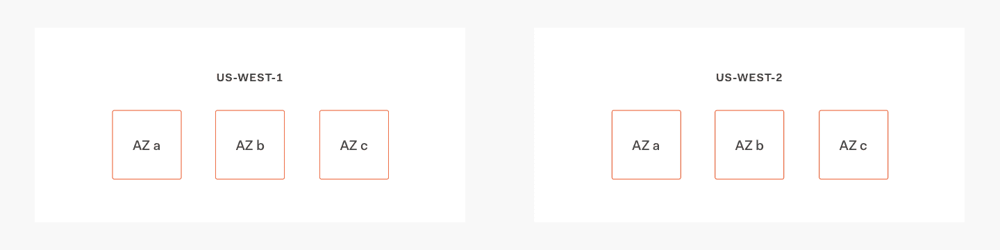
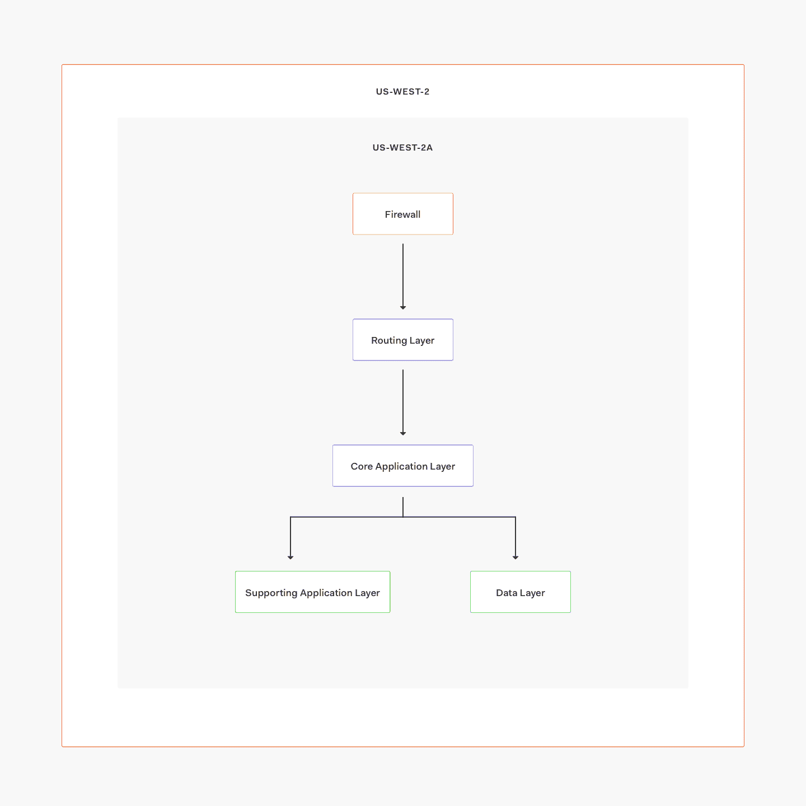

# Auth0 体系结构：在多个云提供商和地区中运行

> 原文： [http://highscalability.com/blog/2018/8/27/auth0-architecture-running-in-multiple-cloud-providers-and-r.html](http://highscalability.com/blog/2018/8/27/auth0-architecture-running-in-multiple-cloud-providers-and-r.html)

*此文章由 Auth0 的站点可靠性工程师 Dirceu Pereira Tiegs 撰写，最初发表于 [Auth0](https://auth0.com/blog/auth0-architecture-running-in-multiple-cloud-providers-and-regions/) 中。*

Auth0 为任何堆栈上的任何类型（移动，Web，本机）的应用程序提供身份验证，授权和单点登录服务。 身份验证对于绝大多数应用程序至关重要。 我们从一开始就设计 Auth0，以便它可以在任何地方运行：在我们的云，您的云甚至您自己的私有基础结构上。

在这篇文章中，我们将更多地讨论我们的公共 SaaS 部署，并简要介绍 [auth0.com](https://auth0.com/) 背后的基础架构以及我们用来使其保持高可用性和正常运行的策略。

从那时起，Auth0 发生了很多变化。 这些是一些亮点：

*   我们从每月处理几百万个登录到每月处理 1.5+十亿个登录，为成千上万的客户提供服务，包括 [FuboTV](https://auth0.com/learn/sports-centric-streaming-service-fubotv-sees-50-roi-just-auth0s-security/) ， [Mozilla](https://auth0.com/blog/auth0-mozilla-partnership/) ， [JetPrivilege](https://auth0.com/learn/jetprivilege-case-study/) 和 更多。

*   我们实现了新功能，例如[自定义域](https://auth0.com/docs/custom-domains)，[扩展的 bcrypt 操作](https://auth0.engineering/bcrypt-as-a-service-9e71707bda47)，极大地[改进的用户搜索](https://auth0.com/docs/users/search/v3)等。

*   组成我们的产品以扩展我们的组织并处理流量增长的服务数量从不到 10 种增加到 30 多种。

*   云资源的数量也大大增加。 我们曾经在一个环境（美国）中有几十个节点，现在在四个环境（美国，US-2，欧盟，非盟）中有超过一千个节点。

*   我们加倍决定在每个环境中使用一个云提供商，并将所有公共云基础架构移至 AWS。

## 核心服务架构

核心服务由不同的层组成：

*   核心应用程序：自动扩展运行我们堆栈中不同服务（身份验证，管理 API，多因素身份验证 API 等）的服务器组。

*   数据存储：MongoDB，Elasticsearch，Redis 和 PostgreSQL 的集群，存储用于不同应用程序和功能的各种数据集。

*   传输/队列：Kinesis 流和 RabbitMQ，SNS 和 SQS 队列。

*   基本服务：限速，bcrypt 群集，功能标记等服务。

*   路由：AWS 负载均衡器（AWS 的 ALB，NLB 和 ELB）和一些运行 NGINX 作为代理的节点。

## 高可用性

2014 年，我们使用了多云架构（使用 Azure 和 AWS，并在 Google Cloud 上提供了一些额外的资源），多年来一直为我们服务。 随着使用量（和负载）的迅速增加，我们发现自己越来越依赖 AWS 资源。

首先，我们将环境中的主要区域切换到 AWS 中，并将 Azure 保留为故障转移。 随着我们开始使用更多的 AWS 资源（例如 Kinesis 和 SQS），我们开始难以在两个提供商中保持相同的功能集。 随着我们对移动（和扩展）速度的需求增长，我们选择继续以有限的功能奇偶校验来支持 Azure：如果 AWS 上的所有事情都失败了，我们仍然可以使用 Azure 群集来支持核心身份验证功能，但是没有太多新功能 我们一直在发展。

在 2016 年发生严重故障后，我们决定最终在 AWS 上融合。 我们停止了与保持服务和自动化平台无关的所有工作，而是专注于：

*   使用多个区域以及每个区域至少 3 个可用区，从而在 AWS 内部提供更好的故障转移故事。

*   越来越多地使用 AWS 特定资源，例如自动扩展组（而不是使用固定的节点集群），应用程序负载平衡器（ALB）等。

*   编写更好的自动化程序：我们改进了自动化程序，完全使用 TerraForm 和 SaltStack 来将基础架构作为代码包含在内，以提供新的 Auth0 环境（并替换现有环境）。 这使我们从每秒约 300 次登录的部分自动化环境发展到每秒约 3.4 千次登录的完全自动化环境。 使用新工具可以更轻松地按比例放大和缩小。 我们实现的自动化水平不是完美的，但是它使我们能够以更便捷的方式发展到新地区并创建新环境。

*   编写更好的剧本：我们花了更多的时间和精力，除了自动化之外，还需要更好的剧本，以了解，管理和响应与我们不断增长的服务网格有关的事件。 这极大地提高了可扩展性和可靠性，同时还使我们能够更快地招聘新员工。

> 编写更好的自动化软件，使我们从每秒进行 300 次登录的部分自动化环境发展到每秒进行 3.4 千多次登录的全自动化环境

让我们看一下我们的美国环境架构。 我们具有以下一般结构：

这是单个可用区内部的结构：

在这种情况下，我们使用两个 AWS 区域：us-west-2（我们的主要区域）和 us-west-1（我们的故障转移）。 在正常情况下，所有请求都会发送到 us-west-2，由三个单独的可用区提供服务。

这就是我们实现高可用性的方式：所有服务（包括数据库）在每个可用性区域（AZ）上都具有正在运行的实例。 如果由于数据中心故障而使一个可用区关闭，我们仍然有两个可用区来处理来自其的请求。 如果整个区域宕机或有错误，我们可以更新 Route53 以故障转移到 us-west-1 并恢复操作。

> We achieve high availability by running all services instances on every AWS availability zone

对于服务故障转移，我们有不同的成熟度级别：某些服务（例如用户搜索 v2（在 Elasticsearch 上构建缓存））可能会起作用，但是数据有些陈旧； 尽管如此，核心功能仍能按预期运行。

在数据层中，我们使用：

*   MongoDB 的跨区域集群。

*   PostgreSQL 的 RDS 复制。

*   具有自动快照和恢复功能的 Elasticsearch 每个区域的群集定期运行，以解决缺乏跨区域群集的问题。

我们每年至少执行一次故障转移，并且我们有剧本和自动化工具可以帮助新的基础架构工程师迅速掌握如何进行故障转移以及所带来的影响。

我们的部署通常由 Jenkins 节点触发； 根据服务的不同，我们可以使用 Puppet，SaltStack 和/或 Ansible 来更新单个或一组节点，也可以更新 AMI 并为不可变的部署创建新的自动伸缩组。 对于新旧服务，我们有不同类型的部署，并且由于我们需要维护自动化，文档和监视应统一的内容，因此这种方法在很大程度上无效。

我们目前正在为某些核心服务推出蓝色/绿色部署，并且我们打算为每个核心和支持服务实施相同的部署。

## 自动化测试

除了每个项目的单元测试范围外，我们还有在每个环境中运行的多个功能测试套件； 我们在部署到生产之前在临时环境上运行它，并在完成部署后在生产中再次运行它们以确保一切正常。

亮点：

*   我们在不同的项目中有成千上万的单元测试。

*   我们使用每分钟运行一次的 Pingdom 探针来检查核心功能。

*   在每次部署之前和之后，我们混合使用基于 Selenium 和 CodeceptJS 的功能测试。 功能测试套件可测试不同的 API 端点，身份验证流程，身份提供者等。

> 除了涵盖每个项目的单元测试外，我们还有在每个环境中运行的多个功能测试套件：在部署到生产之前进行过渡，在完成部署之后再次进行生产。

## CDN

直到 2017 年，我们在多个区域中使用 NGINX，Varnish 和 EC2 节点运行了自己的定制 CDN。 从那时起，我们过渡到 CloudFront，这给了我们很多好处，包括：

*   更多的边缘位置，这意味着对我们的客户的延迟减少。

*   降低维护成本。

*   易于配置。

有一些缺点，例如我们需要运行 Lambda 来执行一些配置（例如向 PDF 文件添加自定义标头之类的事实）。 尽管如此，上行空间肯定可以弥补这一点。

## 延伸

我们提供的功能之一是能够通过 [*身份验证规则*](https://auth0.com/docs/rules/current) 或 [*定制数据库连接*  。 这些功能由 [*Extend*](https://goextend.io/) 提供支持，这是一种基于 Auth0 的可扩展性平台，现在也被其他公司使用。 借助 Extend，我们的客户可以在这些脚本和规则中编写他们想要的任何内容，从而允许他们扩展配置文件，规范化属性，发送通知等等。

我们有专门针对 Auth0 的扩展集群； 他们结合使用 EC2 自动扩展组，Docker 容器和自定义代理来处理来自我们租户的请求，每秒处理数千个请求，并快速响应负载变化。 有关如何构建和运行它的更多详细信息，请查看有关[如何构建自己的无服务器平台](https://tomasz.janczuk.org/2018/03/how-to-build-your-own-serverless-platform.html)的文章。

## 监控方式

我们使用不同工具的组合来监视和调试问题：

*   CloudWatch

*   数据狗

*   平度

*   森丁

我们的绝大多数警报来自 CloudWatch 和 DataDog。

我们倾向于通过 TerraForm 配置 CloudWatch 警报，而我们在 CloudWatch 上保留的主要监视器为：

*   来自主要负载均衡器的 HTTP 错误。

*   目标组中的不正常实例。

*   SQS 处理延迟。

CloudWatch 是基于 AWS 生成的指标（如来自负载平衡器或自动伸缩组的指标）的警报的最佳工具。 CloudWatch 警报通常转到 PagerDuty，从 PagerDuty 转到 Slack / phone。

DataDog 是我们用来存储时间序列指标并对其采取行动的一项服务。 我们从 Linux 盒子，AWS 资源，现成的服务（例如 NGINX 或 MongoDB）以及我们已经构建的自定义服务（例如我们的 Management API）发送指标。

我们有许多 DataDog 监视器。 一些例子：

*   `$service`中`$environment`中的响应时间增加。

*   `$instance`（`$ip_address`）中`$volume`上的空间不足。

*   `$environment` / `$host`（`$ip_address`）上的`$process`问题。

*   增加`$environment`上`$service`的处理时间。

*   NTP 漂移/ `$host`（`$ip_address`）上的时钟问题。

*   `$environment`上的 MongoDB 副本集更改。

从上面的示例中可以看到，我们具有针对低级指标（如磁盘空间）和高级指标（如 MongoDB 副本集更改）的监视器，它们会在主节点定义发生更改时向我们发出警报， 例）。 我们要做的更多，并且围绕某些服务有一些非常复杂的监视器。

DataDog 警报的输出非常灵活，我们通常将它们全部发送到 Slack，仅将那些应该“唤醒人们”的人发送给 PagerDuty（例如错误尖峰，或者我们确信会对客户产生影响的大多数事情） 。

对于日志记录，我们使用 Kibana 和 SumoLogic。 我们正在使用 SumoLogic 来记录审计跟踪和许多 AWS 生成的日志，并且我们使用 Kibana 来存储来自我们自己的服务以及 NGINX 和 MongoDB 等其他“现成”服务的应用程序日志。

## 未来

我们的平台进行了相当多的改进，以处理对客户而言很重要的额外负载和各种用例，但我们仍有更多的优化空间。

不仅我们的平台在增长，而且我们的工程组织也在扩大规模：我们有许多新团队在构建自己的服务，并且需要有关可伸缩性的自动化，工具和指南。 考虑到这一点，这些举措使我们不仅可以扩展我们的平台，还可以扩展我们的工程实践：

*   建立一个 PaaS 风格的平台：如前所述，今天我们有不同的自动化和部署流程。 这会引起混乱，并给工程师带来了进入的障碍，因为如果不接触太多的存储库就很难进行试验和扩展。 我们正在为一个平台（当前在 ECS 之上运行）开发 PoC，工程师可以在其中配置 YAML 文件并进行部署，以获取计算资源，监视，日志记录，备份等等。 所有这些都无需显式配置。 这项工作尚处于初期阶段，可能还会改变很多（EKS？）。 但是，鉴于我们不断增长的规模和可伸缩性限制，我们认为我们正在朝着正确的方向发展。

*   为每个新的请求请求实施冒烟测试：除了单元测试（已在每个新 PR 上运行）之外，我们还希望在临时环境中运行集成测试。

*   将我们的日志记录解决方案集中到一个提供商中。 这可能意味着离开 Kibana 并仅使用 SumoLogic，但是我们仍然需要评估功能集，数据量等。

*   自动化指标：我们太多的指标故事现在是手动的：在部署时将与指标相关的调用添加到代码中，以及使用 DataDog 界面构建仪表板和监视器。 如果使用标准格式和命名，则可以执行以下操作：自动构建仪表板/监视器，从日志中提取指标，而不是显式地添加对代码的调用等。

*   确保我们在每个核心服务上都有自动扩展和蓝色/绿色部署。 这应该从我们的新平台中直接获得，但是在构建和测试该平台时，我们需要针对仍缺乏这方面的核心服务来改进可伸缩性/部署/回滚的过程。