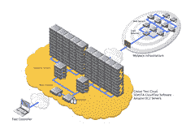
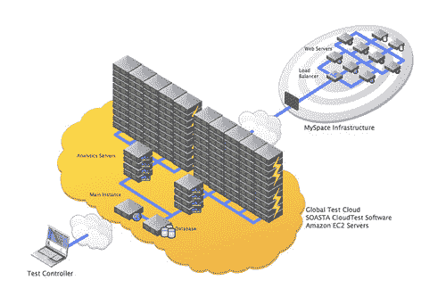

# MySpace 如何与 100 万个并发用户一起测试其实时站点

> 原文： [http://highscalability.com/blog/2010/3/4/how-myspace-tested-their-live-site-with-1-million-concurrent.html](http://highscalability.com/blog/2010/3/4/how-myspace-tested-their-live-site-with-1-million-concurrent.html)

这是 [SOASTA](http://www.soasta.com/) 副总裁 Dan Bartow 的嘉宾帖子，内容是他们如何使用 800 个 EC2 实例与 100 万并发用户共享 MySpace。 我认为这是一个有趣的故事，因为：用户很多，需要花费大量的精力来测试您的实时站点，而并非所有工作都能按预期进行。 我要感谢 Dan 抽出宝贵的时间写和分享这篇文章。

在 MySpace 音乐先前取得成功的基础上，MySpace 在 2009 年 12 月在新西兰掀起了新的流音乐视频产品浪潮。 这些新功能包括观看音乐视频，搜索艺术家的视频，创建收藏夹列表等等的功能。 在 MySpace 等热门网站上，此类功能的预期负载增加是巨大的，他们希望在启用这些功能之前先进行测试。

如果您管理高流量应用程序背后的基础架构，则不会感到意外。 您想了解自己的断裂点，定义容量阈值，并知道在超过这些阈值时如何应对。 用实际的预期负载水平测试生产基础架构是了解高峰流量到达时事物将如何运行的唯一方法。

对于 MySpace，目标是在其实时站点上测试另外的 100 万并发用户，以强调新的视频功能。 这里的关键词是“并发”。 不到一个小时或一天的时间……网站上同时有 100 万用户同时活动。 应当指出，一百万个虚拟用户只是 MySpace 在高峰期通常在站点上拥有的虚拟用户的一部分。 他们想用测试流量来补充实时流量，以了解新产品对整个基础架构的总体性能影响。 这需要大量的负载生成功能，而这正是云计算发挥作用的地方。 为了进行此测试，MySpace 与 SOASTA 一起使用了云作为负载生成平台。

以下是测试过程中生成的负载的详细信息。 所有数字均与虚拟用户的测试流量有关，不包括实时用户的指标：

*   100 万个并发虚拟用户
*   测试用例分为搜索和观看音乐视频，对视频进行评级，将视频添加到收藏夹以及查看艺术家的频道页面。
*   每秒 16 吉比特的传输速率
*   每小时传输 6 TB 的数据
*   每秒点击次数超过 77,000，不包括实时流量
*   800 个用于生成负载的 Amazon EC2 大型实例（3200 个云计算核心）

**测试环境体系结构**

SOASTA CloudTest™管理对云提供商（在本例中为 Amazon）的调出，并配置服务器以进行测试。 捕获 800 个 EC2 实例的过程用了不到 20 分钟的时间。 我们对 Amazon EC2 API 进行了调用，并以 25 个为一组请求服务器。在这种情况下，团队正在请求具有以下规范的 EC2 Large 实例充当负载生成器和结果收集器：

*   7.5 GB 内存
*   4 个 EC2 计算单元（2 个虚拟 CPU 内核，每个虚拟 CPU 内核具有 2 个 EC2 计算单元）
*   850 GB 实例存储（2×420 GB 加上 10 GB 根分区）
*   64 位平台
*   Fedora Core 8
*   另外，有 2 个 EC2 Extra-Large 实例充当测试控制器实例和结果数据库，其规格如下：
*   15 GB 内存
*   8 个 EC2 计算单元（4 个虚拟内核，每个虚拟内核具有 2 个 EC2 计算单元）
*   1,690 GB 实例存储（4×420 GB 加上 10 GB 根分区）
*   64 位平台
*   Fedora Core 8
*   PostgreSQL 数据库

一旦拥有测试所需的所有服务器，便开始对它们进行运行状况检查，以确保它们响应并稳定。 当发现死服务器时，它将丢弃它们，并请求其他服务器来填补空白。 设置基础结构相对容易。 下图（图 1）显示了如何在 EC2 上设置测试云以将大量负载推入 MySpace 的数据中心。

 

**图 1\.**

测试运行时，成批的负载生成器将其性能测试指标报告回单个分析服务。 每个分析服务都连接

到 PostgreSQL 数据库，以将性能数据存储在聚合存储库中。 这是这种规模的测试可以扩展以生成和存储大量数据的方式的一部分-通过将对数据库的访问限制为仅度量指标聚合器并水平扩展。

**挑战**

由于规模往往会破坏一切，因此在整个测试过程中会遇到许多挑战。

**该测试仅限于使用 800 个 EC2 实例**

SOASTA 是云计算资源的最大消费者之一，通常在多个云提供商之间一次使用数百台服务器来进行这些大规模负载测试。 在测试时，团队要求提供的 EC2 实例数量上限。 可用硬件的限制意味着每个服务器都需要模拟相对大量的用户。 每个负载生成器模拟了 1,300 至 1,500 个用户。 此负载水平约为典型 CloudTest™负载生成器将驱动的负载的 3 倍，这给产品带来了新的压力，工程团队需要一些创造性的工作来解决。 用于减轻负载生成器压力的一些策略包括：

*   错开了每个虚拟用户的请求，以免每个负载生成器的点击都一次触发
*   缩减收集的数据，仅包括性能分析所需的内容

## **MySpace 资产的很大一部分由 Akamai 提供，并且该测试反复使 Akamai 基础架构** 的部分服务能力最大化。

CDN 通常会根据访问者的地理位置从最接近访问者的位置向他们提供内容。 例如，如果您从亚马逊的东海岸可用区生成所有测试流量，那么您很可能只会遇到一个 Akamai 服务点。

在负载下，该测试正在向少量 Akamai 数据中心生成大量数据传输和连接流量。 这意味着这些数据中心的负载将超过典型高峰期间可能产生的负载，但是鉴于此功能启动仅针对新西兰流量，因此这不一定是不现实的。 这种压力导致新连接在某些负载水平下被 Akamai 破坏或拒绝，并在测试中产生许多错误。

这是在生产现场产生负载时需要克服的常见障碍。 需要设计大规模生产测试，以考虑到这一点并准确地对整个生产生态系统施加压力。 这意味着从多个地理位置生成负载，以便将流量分散到多个数据中心。 最终，了解地理 POPs 的能力是该测试的重要收获。

## **由于额外负载的影响，MySpace 必须即时调整其某些服务器的位置，以支持正在测试的功能**

在测试过程中，额外的虚拟用户流量使 MySpace 基础架构中的一些负担沉重。 MySpace 的运营团队能够在几分钟内从其他功能集群中获取未充分利用的服务器，并使用它们为视频站点集群增加容量。

也许最令人惊奇的是 MySpace 能够做到这一点。 他们能够实时监控整个基础架构的容量，并在需要时灵活地收缩和扩展。 人们一直在谈论弹性可伸缩性，这在实践中是一件很美的事情。

**经验教训**

1.  对于高流量网站，在生产中进行测试是准确了解容量和性能的唯一方法。 对于大型应用程序基础结构，如果您仅在实验室中进行测试然后尝试进行推断，那么就会出现太多“看不见的墙”。
2.  弹性可伸缩性正成为应用程序体系结构中越来越重要的部分。 应该构建应用程序，以便可以独立监视和扩展关键业务流程。 能够相对快速地增加容量将成为来年的关键体系结构主题，而大型企业早就知道了这一点。 Facebook，Ebay，Intuit 和许多其他大型网站都宣扬了这种设计原则。 使事物保持松散耦合具有以前宣传过的许多好处，但是容量和性能正在迅速移到该列表的前面。
3.  实时监控至关重要。 为了对容量或性能问题做出反应，您需要进行实时监控。 此监视应与您的关键业务流程和功能区域相关联，并且需要尽可能实时。

## 相关文章

*   [MySpace 体系结构](/blog/2009/2/12/myspace-architecture.html)
*   [如何在不进行实际尝试的情况下成功完成容量规划：Flickr 的 John Allspaw 专访他的新书](/blog/2009/6/29/how-to-succeed-at-capacity-planning-without-really-trying-an.html)

另一篇令人失望的简短文章：/
这篇文章对于学习和观察真实的云一样有用。
这本来真是令人赞叹的文章，但事实证明，更多的是 soasta 广告：(

嗯 我也希望有更多细节。 里面没有什么新东西，只是一则广告。

您想要保罗什么细节？

我想知道这项测试的亚马逊账单是多少？

虽然可能有点像广告，但我不认为这太过分了。 SOASTA 仅被特别提及了三遍，考虑到它们都执行了测试并撰写了有关测试的文章，这似乎是合理的。

总体而言，我认为这是一篇相当不错的文章，并为我提供了许多以前所没有的见识。 也许是因为我没有参与需要进行云部署测试的大型站点。 如果是的话，我可能会有所不同。

根据读者的不同，一篇文章几乎总是细节太少或太多，我认为这篇文章取得了很好的平衡。

感谢您的撰写。

这听起来像是广告，它实际上是一项糟糕的服务。
强调 Akamai 在美国的基础设施将如何帮助应对来自新西兰的流量猛增？ 这些新西兰人最终将身处 Akamai 的新西兰基础设施中。

另外，如果要在 MySpace 上对后端进行负载测试，而不是 Akamai 提供内容，则根本不需要测试 Akamai 部分。 只需在 MySpace 网络中内部运行测试即可。

最后，哪种产品需要 16 GB 的 RAM 才能同时下载一些 http 请求？ 你在开玩笑吧。 Java 用什么写的？

这篇文章让人印象深刻。 鉴于单核奔腾 M 笔记本电脑可以轻松使千兆位以太网连接（尤其是传入）饱和，因此没有理由使用 16 台以上的服务器。 从亚马逊那里购买它们特别愚蠢，因为与新西兰的 DSL 客户相比，它们往往连接良好。 如果启动该服务确实产生了如此大的影响，那么您将受到新西兰微薄的互联网连接的自然限制，并且必须与所有其他新西兰人共享。

关于先前的投诉，我认为您至少让读者停滞了一点：

（1）对于仅命中一个 Akamai 数据中心的问题有什么解决方案？ 您是否能够克服该瓶颈并测试其他潜在瓶颈？

我也想知道：

（2）是否遇到任何挑战

-传输速率为每秒 16 吉比特
-每小时传输 6 TB 数据

进入 Amazon AWS？ 还是仅仅是产生足够多的实例来获得这种传输速率？

您能否说明一下为什么选择 PostgreSQL 来存储日志数据？

我很确定某些键值存储系统会比常规 SQL 系统更快地占用资源，同时存储日志数据。

尽管它没有描述所有细节，但了解/听到使用 EC2 进行这种负载测试的方法仍然非常有趣。

谢谢

费利克斯（Felix），即使您的行为像孩子一样在 YouTube 上匿名发动，我还是决定，我会尽力为您解答问题。 他们来了：

>强调 Akamai 在美国的基础设施将如何帮助应对来自新西兰的流量猛增？ 这些新西兰人最终将身处 Akamai 的新西兰基础设施中。

来自 Akamai 的内容只是正在测试的整个基础架构的一部分。 这是在测试设计期间提出的，并被团队接受，因为：

1）没有其他选择-尚无主要的云播放器在新西兰（但是）拥有与某些较大的播放器一样强大的 API，并且具有一定数量的服务器
2）大多数 Akamai 的存在都相对 在性能方面具有可重复性，因此，由于我们主要测试的不是 Akamai，因此我们假定来自新西兰其他数据中心的性能也与众不同，因为每个人都愿意接受这种风险。

有了 SLA，并且对数据中心进行的压力测试比预期的要高得多，这在逻辑上是可以接受的风险。

>
>如果要在 MySpace 上对后端进行负载测试，而不是 Akamai 提供的内容，则根本不需要测试 Akamai 部分。 只需在 MySpace 网络中内部运行测试即可。

如果您希望基础架构的所有部分都能承受预计的负载的 100％的信心，则每个组件都需要进行测试。 我们经常根据客户的要求测试 CDN。 在这种情况下，没有人想到 CDN 会遇到麻烦，但我们遇到了很多麻烦。 即使我们可能一直在强调一种持久性有机污染物，其强度比预期的要高，但我们观察到一个以前没有人知道的能力点。

要记住的一件事是，它不仅仅是从容量角度测试 Akamai。 当本应由 Akamai 提供服务但没有提供服务时，会发生不好的事情，最终回到原始服务器并破坏 MySpace 基础结构。 团队需要首先确保内容全部来自 Akamai。 其次，我们需要确保在 Akamai 缓存刷新等过程中没有负载传递到 MySpace。

同样，在内部运行测试不能像在防火墙外部进行测试那样准确地提供性能信息。

>
>哪种产品需要 16 gigs RAM 才能同时下载一些 http 请求？ 你在开玩笑吧。 Java 用什么写的？

不值得花时间回答这个问题。 如果听起来读者理解这里发生的一切，就很乐意做出回应；）

>
>本文颇为令人印象深刻。 鉴于单核奔腾 M 笔记本电脑可以轻松使千兆位以太网连接（尤其是传入）饱和，因此没有理由使用 16 台以上的服务器。 从亚马逊那里购买它们特别愚蠢，因为与新西兰的 DSL 客户相比，它们往往连接良好。 如果启动该服务确实产生了如此大的影响，那么您将受到新西兰微薄的互联网连接的自然限制，并且必须与所有其他新西兰人共享。

在线应用程序的性能测试远不止于饱和。 在下载或流式传输内容时，实际上保持打开状态的打开线程和套接字是您逐个服务器消耗所有容量的地方。 下载内容需要时间，并且在下载或流式传输内容时，您失去了生成负载的能力。

除此之外，对于性能测试，您还不会发出请求以生成负载并将其释放。 您正在记录有关每个用户的大量性能数据。 每次命中所花费的时间，传输的带宽，错误以及类似性质的事情。

在 DSL 点上，带宽限制很少在性能测试中完成，因为如果最终用户连接不受应用程序公司的控制，则不会进行限制。

>
>（1）仅命中一个 Akamai 数据中心的问题的解决方案是什么？ 您是否能够克服该瓶颈并测试其他潜在瓶颈？
>

我们接受了这样的风险，即我们实际上要测试一个 Akamai 的存在点，其强度要高于此次发布的程度。 但是，识别瓶颈是一项关键的学习，并且随着流量的增长，运营团队和他们的头脑现在已经知道了解其阈值，这可能是需要逐步解决的问题。

>我也想知道：
>
>（2）在获得
>
>方面是否存在任何挑战-每 16 吉比特的传输速率 第二
>-每小时传输 6 TB 的数据
>
>到 Amazon AWS？ 还是仅仅是产生足够多的实例来获得这种传输速率？
>

我很想告诉您是否有，但完全没有挑战。 只是产生 EC2 实例就给我们带来了其他一切，包括看似开放的数据传输管道和磁盘访问，以及 I / O 都可以正常工作。 实际上，在与亚马逊合作进行了 3 年这些测试之后，我们从未遇到任何带宽或 I / O 问题。

我喜欢这篇文章，感谢您撰写。

托德（Todd）-如果您要花时间反驳某项陈述，最好花点时间进行拼写检查以提高信誉

除了 MySpace 本身之外，其他各方（Akamai 和/或沿途的其他运营商）是否也了解这种“受控 DoS”？ 是否不增加容量来处理流量的突然增加，但至少要知道这是请求的合法流量，而不是某些 DoS 攻击？

您可以从 Amazon 获得如此多的实例和资源，这没有问题，因为 Amazon 知道您是谁以及这是一家什么样的公司，因此他们消除了对您帐户的任何限制？ 还是亚马逊真的有这么多的产能供任何支付者使用？

该测试花了多长时间？ 您准备了多长时间了？
您是否想念一些后来才意识到有用的数据？
您是在看到 MySpace 正在处理负载还是在从头到尾从 0 到 1 磨时增加点击量吗？

对于我的一项工作，我们进行了类似的测试； 一切顺利，直到我们开始生产为止。 即将发布的消息是，我们的某些后端日志记录和报告系统正在执行 DNS 反向查找。 由于我们的测试来自有限的 IP 空间，因此查找并不是全部可见-但是由于数千名用户使用不同的 IP 位置，我们发现这造成了巨大的瓶颈。 值得牢记。

哇，我无法想象必须处理所有的流量以及在“开放”期间可能出现的任何问题。 我已经处理了高流量的网站，但没有像 Myspace 这样的网站。

我从事表演业务，并使用云模拟了 40,000 个虚拟用户。 这篇文章强调了我面临的一些问题-大型数据集，将负载分散到可用区域等。还有一个我还没有解决的问题，那就是 jmeter 无法像浏览器一样进行并行下载。 当下载页面命中的所有资源时，这反映在较大的事务响应时间中。 在澳大利亚和美国西部之间的每次请求中，RTT 为 250 毫秒也会使情况变得更糟。 到目前为止，我不得不在报告中说明这一点，尽管结果表明事务 x 花费了 12 到 15 秒之间的时间，但这实际上相当于 0.5 到 3.5 秒的响应时间，并且总吞吐量并不是瓶颈。

SOASTA 加载工具是否可以执行并行下载，您是否考虑了 250 毫秒的 RTT？

另一件事-如果同时有 100 万新西兰人同时使用 Myspace，那么那里的街道将空无一人。

哦，还有一件事。 当然，您可以从一台笔记本电脑运行 1,000 个用户。 您不会达到 1GB /秒的速度。 您的响应时间度量将反映测试硬件（而不是被测系统）中的延迟。 关键在于您的负载生成器是否可以及时处理网卡生成的中断。

SeaPerf，为什么您不阅读他的讲话而不是寻找拼写错误？ 获得生活。 没有人需要互联网上的另一位抱怨拼写的笨蛋。

你好

感谢您的文章，这很有趣。 我正在研究这个主题，并且有一些问题。 也许你可以帮忙。

您如何定义我们需要强调的计算机数量。
例如，如果我在瓶颈所在的位置使用 apache bench，那么我可以同时运行 1000 个用户吗？
网络，CPU 和 RAM 有一些瓶颈，如何定义它们？

对于较小的压力测试，您建议使用哪种软件？ （Apache Bench，JMeter，Siege 等），以及如何定义场景？ （使用 Jmeter 代理，处理 apache 访问日志吗？）

西里尔