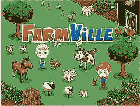

# FarmVille 如何扩展-后续

> 原文： [http://highscalability.com/blog/2010/3/10/how-farmville-scales-the-follow-up.html](http://highscalability.com/blog/2010/3/10/how-farmville-scales-the-follow-up.html)

针对[，FarmVille 如何扩展以每月收获 7500 万玩家的问题](/blog/2010/2/8/how-farmville-scales-to-harvest-75-million-players-a-month.html)，一些读者提出了后续问题。 这是卢克对这些问题（以及我的一些问题）的回答。

### 社交网络如何使事情变得容易或困难？ 

社交游戏的主要有趣方面是，如何获得需要经常访问彼此数据的已连接用户的图表。 这使得整个数据集很难甚至不是很难分区。

### 您尝试避免使用 Facebook 通话的哪些例子，以及它们如何影响游戏玩法？

我们可以致电 Facebook 朋友数据，以检索有关您玩游戏的朋友的信息。 通常，我们在游戏底部显示一个朋友梯子，该梯子显示朋友信息，包括姓名和 Facebook 照片。

### 您能否说说缓存在哪里，缓存采用什么形式，缓存有多少？ 您是否与 Facebook 建立了对等关系，就像您在该带宽上所期望的那样？

我们使用内存缓存作为我们的缓存技术。 无法评论对等关系。 

### 禁用功能以响应负载时，对游戏的影响是什么？

用户将看到的是应用程序的某些部分无法正常运行。 我们有效地排序了对游戏而言不太重要的事物，并先将其关闭。 例如，在我们的邻居页面和 Flash 应用程序底部的朋友阶梯中，您可以看到朋友在玩游戏及其游戏统计信息的列表。 在某些情况下，当我们有高负载时，我们会关闭它。 它为我们节省了一些后端工作，并且对用户体验的影响相对较小。

### 您如何与 Facebook 集成？ 您是否尝试尽可能远离后端？ 还有与 Facebook 合作的建议？

我们通过 REST API 与 Facebook 集成。 由于我们是 Facebook 上的大型应用程序构建者，因此我们就技术问题进行了大量的来回交流。

### 您的可降解方法非常有趣。 听起来您可以在客户端中玩大部分游戏，而无需长时间与后端对话。 我从农场彼此相对隔离的应用程序的性质出发？ 是否有尝试像其他多人游戏一样将农场聚集在一起？

是的，拥有交互式客户端的好处之一是我们在服务器延迟和观察到的客户端延迟之间有些隔离。 我们会验证游戏中执行的每个动作； 但是，我们异步执行此操作，并在客户端上将事务排队。

### 您使用 MySQL 吗？ 如果使用 SQL，它将如何使用？

我们使用 MySql。

### 您在 LAMP 中使用什么“ P”？ Python 等。

Â我们使用 PHP。

### 您如何与后端对话？ 是请求响应，XHR，长轮询，Flash XML 套接字还是“ COMET”？

我们使用称为 AMF 的标准 HTTP 请求/响应协议。 AMF 事务是从客户端异步发生的，如果服务器看到它认为客户端不应该发送的内容，则会向客户端返回“不同步”消息，告知客户端处于无效状态，并且客户端 重新加载自身。

### 您是否运行 200 个（或其他数量的）节点 Vertica 集群？

我们不对 FarmVille 执行此操作

### 您是在云中运行还是拥有专用服务器？ 您使用 EC2 吗？

我们确实在云中运行。 这里的主要特征是我们使用商品化的虚拟化硬件。 因此，从我们决定要增加容量到硬件可用的时间，我们大大减少了时间。

### 请提供服务降级示例吗？

FarmVille 内部的一个示例是，页面底部的 Flash 内有一个朋友梯子。 通常，我们向 facebook 查询姓名和个人资料图片，并向我们自己的后端查询游戏统计信息和头像数据。

这是应用程序中参与度很高的部分，但优先级低于进行农业活动的用户。 因此，如果我们的后端出现性能问题，我们可以将其关闭，并且朋友阶梯将仅显示 facebook 名称和个人资料图片。 同样，如果 facebook 出现性能问题，我们可以将其关闭，并且朋友梯子不会显示。

结局 

我错过了昨天 Amitt Mahajan 在 GDC 上的演讲，我很想知道他说过关于懒惰地写入/发自 Farmfield 的内存缓存池及其网络层请求批处理的内容。 有没有人在谈论这个话题或对此有更多了解？

卢克（Luke）在回答云问题时非常有政治性。 根据 Rightscale 上的这篇文章，Farmville 完全在亚马逊的 EC2 上运行：[前三名社交游戏公司管理云上的急剧增长](http://www.rightscale.com/news_events/press_releases/2010/Top-Three-Social-Gaming-Companies-Manage-Steep-Growth-on-the-Cloud-with-RightScale.php)

我真的不喜欢采访。 我认为面试官提出了很好的问题，做得很好。 可悲的是，面试官没有付出太多。

哇，那真是令人痛苦的采访。 我同意面试官提出了正确的问题，但是答案是可悲的。

“您使用 MySQL 吗？如果您使用 SQL，它将如何使用？”

“我们使用 MySql。”

哇，感谢您的惊人见解！！！

所有的答案都好像受访者放弃了尽可能少的信息。

是的，阅读本访谈内容不多。 一点都没有。